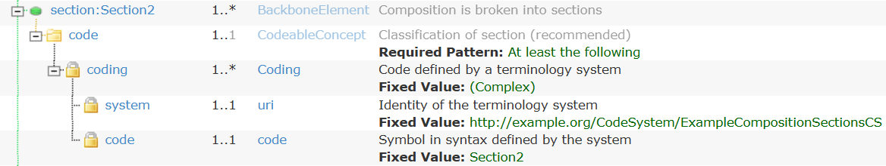
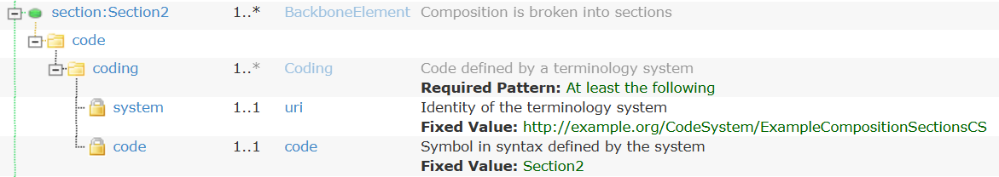
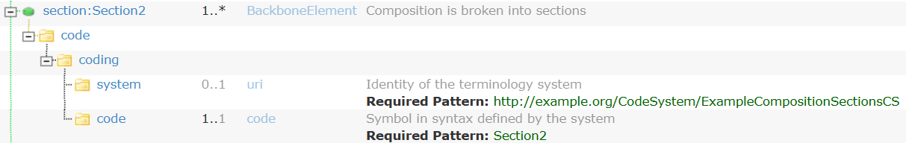
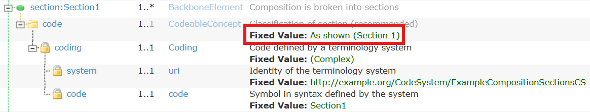
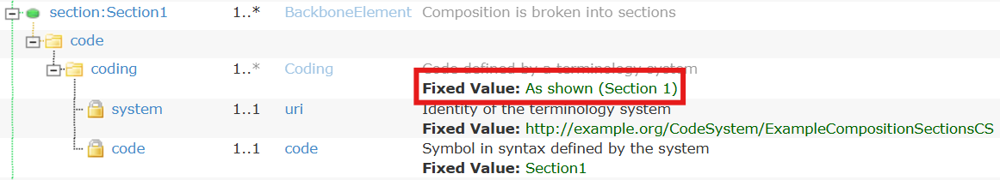
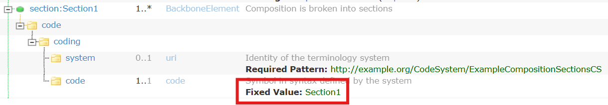

# HL7.AT.FHIR.REFERENCE-IG\Slicing - FHIR® v5.0.0

* [**Table of Contents**](toc.md)
* [**Developer's Handbook**](developers-handbook.md)
* **Slicing**

## Slicing

The following applies to elements other than `code` (in this case we focused on `Composition.section.code`) as long as they are of type CodeableConcept e.g. `Composition.type`

### tl;dr - IF YOU DO NOT WANT TO READ THE WHOLE PAGE

**Do not use `exactly` in general!** `exactly` leads to considerable restrictions (see below).

If **at least 1 Coding** with the specified values should occur in the slice:

* `discriminator.path = "code"` (=CodeableConcept level)

If **exactly 1 Coding** with the specified values should occur in the slice and no other Coding:

* `discriminator.path = "code.coding"` or `discriminator.path = "code.coding.code"` (=Coding or Code level)
* There is no difference between the two if `exactly` is not used.

### Basic rules

#### Relationship between discriminator.path and slice level

**`discriminator.path` and the level at which the individual slices are specified must match!** See the following example.

* Correct: Use of`code`in`discriminator.path`and setting the code on`section.code`.
  * Wrong: Use of`code.coding.code`in`discriminator.path`and setting the code on`section.code`.
* Correct: ``` * section.code from ExampleCompositionSectionsVS * section ^slicing.discriminator[+].type = #value * section ^slicing.discriminator[=].path = "code" * section ^slicing.rules = #open * section contains Section1 1.. * section[Section1].code = ExampleCompositionSectionsCS#Section1 * section contains Section2 1.. * section[Section2].code = ExampleCompositionSectionsCS#Section2 * section contains Section3 1.. * section[Section3].code = ExampleCompositionSectionsCS#Section3 ```
  * Wrong: ``` * section.code from ExampleCompositionSectionsVS * section ^slicing.discriminator[+].type = #value * section ^slicing.discriminator[=].path = "code.coding.code" * section ^slicing.rules = #open * section contains Section1 1.. * section[Section1].code = ExampleCompositionSectionsCS#Section1 * section contains Section2 1.. * section[Section2].code = ExampleCompositionSectionsCS#Section2 * section contains Section3 1.. * section[Section3].code = ExampleCompositionSectionsCS#Section3 ```

#### Consistent slice level

**All slices must use the same slice level!** See the following example:

* Correct: Use of`code`in`discriminator.path`and setting the code on`section.code`.
  * Wrong: Use of`code`in`discriminator.path`and setting the code on`section.code.coding`for`Section2`
* Correct: ``` * section.code from ExampleCompositionSectionsVS * section ^slicing.discriminator[+].type = #value * section ^slicing.discriminator[=].path = "code" * section ^slicing.rules = #open * section contains Section1 1.. * section[Section1].code = ExampleCompositionSectionsCS#Section1 * section contains Section2 1.. * section[Section2].code = ExampleCompositionSectionsCS#Section2 * section contains Section3 1.. * section[Section3].code = ExampleCompositionSectionsCS#Section3 ```
  * Wrong: ``` * section.code from ExampleCompositionSectionsVS * section ^slicing.discriminator[+].type = #value * section ^slicing.discriminator[=].path = "code" * section ^slicing.rules = #open * section contains Section1 1.. * section[Section1].code = ExampleCompositionSectionsCS#Section1 * section contains Section2 1.. * section[Section2].code.coding = ExampleCompositionSectionsCS#Section2 ```

### Effects of different discriminator.path settings (WITHOUT exactly)

#### discriminator.path = "code" (CodeableConcept level) (WITHOUT exactly)

* FSH: [ExampleComposition4](StructureDefinition-ExampleComposition4.md)
* FSH: ``` * section.code from ExampleCompositionSectionsVS * section ^slicing.discriminator[+].type = #value * section ^slicing.discriminator[=].path = "code" * section ^slicing.rules = #open * section contains Section2 1.. * section[Section2].code = ExampleCompositionSectionsCS#Section2 ```
  * IG: 

#### discriminator.path = "code.coding" (Coding level) (WITHOUT exactly)

* FSH: [ExampleComposition5](StructureDefinition-ExampleComposition5.md)
* FSH: ``` * section.code from ExampleCompositionSectionsVS * section ^slicing.discriminator[+].type = #value * section ^slicing.discriminator[=].path = "code.coding" * section ^slicing.rules = #open * section contains Section2 1.. * section[Section2].code.coding = ExampleCompositionSectionsCS#Section2 ```
  * IG: 

#### discriminator.path = "code.coding.code" (Code level) (WITHOUT exactly)

* FSH: [ExampleComposition6](StructureDefinition-ExampleComposition6.md)
* FSH: ``` * section.code from ExampleCompositionSectionsVS * section ^slicing.discriminator[+].type = #value * section ^slicing.discriminator[=].path = "code.coding.code" * section ^slicing.rules = #open * section contains Section2 1.. * section[Section2].code.coding.system = Canonical(ExampleCompositionSectionsCS) * section[Section2].code.coding.code = #Section2 ```
  * IG: 

### Effects of different discriminator.path settings (WITH exactly)

#### discriminator.path = "code" (CodeableConcept level) (WITH exactly)

* FSH: [ExampleComposition4](StructureDefinition-ExampleComposition4.md)
* FSH: ``` * section.code from ExampleCompositionSectionsVS * section ^slicing.discriminator[+].type = #value * section ^slicing.discriminator[=].path = "code" * section ^slicing.rules = #open * section contains Section1 1.. * section[Section1].code = ExampleCompositionSectionsCS#Section1 (exactly) ```
  * IG: 

#### discriminator.path = "code.coding" (Coding level) (WITH exactly)

* FSH: [ExampleComposition5](StructureDefinition-ExampleComposition5.md)
* FSH: ``` * section.code from ExampleCompositionSectionsVS * section ^slicing.discriminator[+].type = #value * section ^slicing.discriminator[=].path = "code.coding" * section ^slicing.rules = #open * section contains Section1 1.. * section[Section1].code.coding = ExampleCompositionSectionsCS#Section1 (exactly) ```
  * IG: 

#### discriminator.path = "code.coding.code" (Code level) (WITH exactly)

* FSH: [ExampleComposition6](StructureDefinition-ExampleComposition6.md)
* FSH: ``` * section.code from ExampleCompositionSectionsVS * section ^slicing.discriminator[+].type = #value * section ^slicing.discriminator[=].path = "code.coding.code" * section ^slicing.rules = #open * section contains Section1 1.. * section[Section1].code.coding.system = Canonical(ExampleCompositionSectionsCS) * section[Section1].code.coding.code = #Section1 (exactly) ```
  * IG: 

### Required Pattern vs. Fixed Value

#### Rendering in the IG vs. StructureDefinition

The IG Publisher adapts the rendering to the hierarchy (see [Effects of different discriminator.path settings (WITHOUT exactly)](#effects-of-different-discriminatorpath-settings-without-exactly)). The highest hierarchy level is always decisive for the assessment of a slice. This means that if `discriminator.path = "code"` is specified, the relevant information as to whether it is a pattern ([ElementDefinition pattern[x]](https://build.fhir.org/elementdefinition-definitions.html#ElementDefinition.pattern_x_)) or a fixed value ([ElementDefinition fixed[x]](https://build.fhir.org/elementdefinition-definitions.html#ElementDefinition.fixed_x_)) is found at the CodeableConcept level. In the hierarchies below, the IG Publisher still states "Fixed value", even if it may only be a pattern in terms of the StructureDefinition.

#### Setting fixed values in FSH

Only specifying `exactly` in FSH results in a fixed value in the StructureDefinition. Everything else results in a pattern in the StructureDefinition.

* : **CodeableConcept level**
  * WITHOUT`exactly`: If a pattern is set at the CodeableConcept level, additional codings are allowed.
  * WITH`exactly`: If a fixed value is set at the CodeableConcept level, no additional codings are allowed. Furthermore, populating elements other than those defined by the slice is forbidden.
* : **Coding level**
  * WITHOUT`exactly`: If a pattern is set at the Coding level, in addition to the specified code, displays, extensions, etc. can also be used.
  * WITH`exactly`: If a fixed value is set at the Coding level, only the specified elements with the fixed values may occur underneath, and no other elements, e.g. if system, code and display are fixed, then these must be present and match the specified values, and e.g. a version or extension is not allowed.
* : **Code level**
  * WITHOUT`exactly`: Pattern and fixed value mean the same thing for primitive data types (system -> uri, code -> code) - i.e. an exact match is required.

### Recommendations

#### Allowing additional codings

If additional code+system combinations should be allowed, then `discriminator.path = "code"` (CodeableConcept level) must be used. Whether additional fields are allowed in the coding defined by the slice (display, extension, …) depends on whether `exactly` is used on `code` (CodeableConcept level) or not. When using `exactly` on `code` (CodeableConcept level), no other elements are allowed.

#### Only one code + system combination allowed and no other

If no additional code+system combinations should be allowed, then `discriminator.path = "code.coding"` or `discriminator.path = "code.coding.code"` must be used. Whether additional fields are allowed in the coding defined by the slice (display, extension, …) depends on whether `exactly` is used on `code.coding` or not. When using `exactly` on `code.coding` (Coding level), no other elements are allowed.

