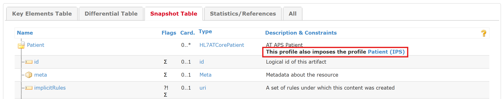

# Herausforderungen - Austrian Patient Summary (R4) v1.1.0

* [**Table of Contents**](toc.md)
* **Herausforderungen**

## Herausforderungen

### Lesen des IGs mit imposeProfile

Wie im [Aufbau der APS](design_choices.md#aufbau-der-aps) beschrieben, wird in diesem IG die [`imposeProfile`-Extension](http://hl7.org/fhir/StructureDefinition/structuredefinition-imposeProfile) verwendet.

Beim Lesen der APS-Profile müssen insofern auch immer die mit der `imposeProfile`-Extension eingebundenen Profile berücksichtigt werden, um ein umfassendes Bild eines APS-Profils zu erhalten.

So ist das `subject` in der [AT APS Composition](StructureDefinition-at-aps-composition.md) mit `0..1` modelliert. In der [Composition (IPS)](https://hl7.org/fhir/uv/ips/STU2/StructureDefinition-Composition-uv-ips.html) ist das `subject` allerdings mit `1..1` modelliert. Durch die `imposeProfile`-Extension muss insofern bei einer Instanz der AT APS Composition jedenfalls ein `subject` angegeben werden.

Die strengere Regel wird also bei der Validierung einer Instanz schlagend (siehe auch [Validierung von APS-Instanzen](design_choices.md#validierung-von-aps-instanzen)).

### FHIR® R4

Aktuell liegt die IPS nur auf Basis von FHIR® R4 vor. Ob und wann die IPS auch in R5 bzw. R6 zur Verfügung steht, ist noch nicht klar. Deshalb wird die APS zurzeit auch nur in FHIR® R4 spezifiziert.

#### Aufwärtskompatibilität

Um auf Entwicklungen in FHIR® R5 bzw. R6 vorbereitet zu sein, wurden im [AT APS CarePlan](StructureDefinition-at-aps-careplan.md) die Elemente `instantiatesCanonical` und `instantiatesUri` durch die beiden Extensions [`shallComplyWith`](http://hl7.org/fhir/StructureDefinition/workflow-shallComplyWith) und [`adheresTo`](http://hl7.org/fhir/StructureDefinition/workflow-adheresTo) ersetzt.

### Deutsche Übersetzung

Wo es einfach möglich ist (narrative Texte, Erklärungen in Profilen), wird die deutsche Sprache verwendet. Dort, wo auf die FHIR-Spezifikation aufgebaut wird (z.B. Elemente in Profilen) oder wo die Texte vom IG Publisher vorgegeben werden, sind die Texte in Englisch.

