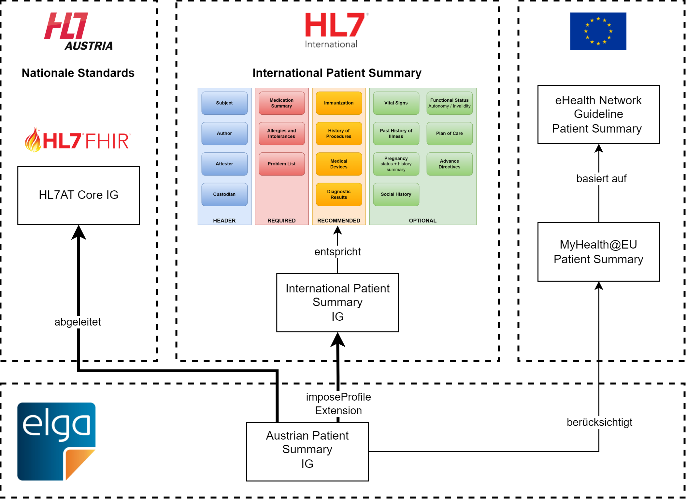

# Designentscheidungen - Austrian Patient Summary (R4) v1.1.0

* [**Table of Contents**](toc.md)
* **Designentscheidungen**

## Designentscheidungen

Die Austrian Patient Summary (APS) baut auf der International Patient Summary (IPS) auf. In diesem Sinne sind grundsätzlich auch die folgenden Abschnitte der IPS zu beachten:

* [General Principles](https://hl7.org/fhir/uv/ips/STU2/General-Principles.html)
* [Design Conventions](https://hl7.org/fhir/uv/ips/STU2/Design-Conventions.html)
* [Must Support and Obligations](https://hl7.org/fhir/uv/ips/STU2/Must-Support-and-Obligations.html)
* [Empty Sections and Missing Data](https://hl7.org/fhir/uv/ips/STU2/Empty-Sections-and-Missing-Data.html)
* [Generation and Data Inclusion](https://hl7.org/fhir/uv/ips/STU2/Generation-and-Data-Inclusion.html)
* [Privacy and Security Considerations](https://hl7.org/fhir/uv/ips/STU2/Privacy-and-Security-Considerations.html)
* [Known Issues and Future Development](https://hl7.org/fhir/uv/ips/STU2/Known-Issues-and-Future-Development.html)

Für die APS besonders wichtige Aspekte werden hier hervorgehoben, insbesondere dann, wenn von der IPS abgewichen wird.

### Aufbau der APS

Die APS baut auf dem [HL7® Austria FHIR® Core Implementation Guide (HL7AT Core IG), Version 2.0.0](https://fhir.hl7.at/HL7-AT-FHIR-Core-R5/2.0.0/) und dem HL7® Leitfaden für die [International Patient Summary (IPS), Version 2.0.0](https://hl7.org/fhir/uv/ips/STU2/) auf.

Nachdem es in FHIR® nicht möglich ist, mehr als eine Basisdefinition für eine StructureDefinition-Ressource anzugeben, wird nach Möglichkeit immer das entsprechende Profil aus dem HL7AT Core IG als Basisdefinition angegeben und das entsprechende Profil aus der IPS mit Hilfe der [`imposeProfile`-Extension](http://hl7.org/fhir/StructureDefinition/structuredefinition-imposeProfile) eingebunden.

Wenngleich die `imposeProfile`-Extension dazu führt, dass die APS dem HL7AT Core IG und der IPS entspricht, ist das Lesen des IGs schwieriger - siehe dazu [Lesen des IGs mit imposeProfile](challenges.md#lesen-des-igs-mit-imposeprofile).

Zusätzlich wurden bei der Erstellung der APS die Vorgaben aus dem Requirements Catalogue im Rahmen von [MyHealth@EU](https://health.ec.europa.eu/ehealth-digital-health-and-care/digital-health-and-care/electronic-cross-border-health-services_en) berücksichtigt, insbesondere im Hinblick auf die Erweiterung der verpflichtend zu befüllenden Sektionen. Weitere Erläuterungen finden sich im Kapitel [Hintergrund](background.md).

#### Validierung von APS-Instanzen

Durch den Einsatz der `imposeProfile`-Extension werden bei der Validierung automatisch die Spezifikationen des HL7AT Core IG und der IPS berücksichtigt.

### Profilierung

Wie bei der IPS wurde bei der APS folgender Profilierungsansatz gewählt: Anstatt die Ressourcen streng zu beschränken, wurden hauptsächlich die Pflichtelemente des Minimaldatensatzes festgelegt, während anderen offen bleiben. Dieser Ansatz erleichtert die Wiederverwendung der Profile und erlaubt den schrittweisen Zugriff auf zusätzliche relevante Informationen, um zukünftige Anforderungen und spezifische klinische Anwendungsfälle abzubilden.

Wo möglich wurden die Profile der APS auf jene Aufgebaut, die der HL7® Austria FHIR® Core zur Verfügung stellt. In der Folge wurden alle Profile der APS dahingehend angepasst, dass für alle Referenzen nach Möglichkeit die Profile der APS selbst verwendet werden.

### Must Support und Obligations

Durch die Einbindung der IPS-Profile mit der [`imposeProfile`-Extension](http://hl7.org/fhir/StructureDefinition/structuredefinition-imposeProfile) wurden die "Must Support"-Markierungen und Obligations nicht in die APS übernommen.

Einen ähnlichen Zugang verfolgt die in Aufbau befindliche [European Patient Summary (EPS) von HL7EU](https://build.fhir.org/ig/hl7-eu/eps/). Diese Entwicklungen werden beobachtet und zu gegebener Zeit berücksichtigt.

### Leere Sektionen und fehlende Daten

Wenn eine verpflichtende Sektion der APS leer bleibt, weile keine relevanten Informationen vorliegen oder verfügbar sind, muss „Composition.section.emptyReason“ befüllt werden, sodass der Grund dafür ersichtlich ist (z.B. "nicht verfügbar" oder "nicht abgefragt"). Nicht verpflichtende Sektionen dürfen bei der Erstellung der Patient Summary weggelassen werden. Auch mittels Ressourcen können fehlende Informationen dokumentiert werden, z.B. mittels SNOMED Codes, dass keine bekannte Allergie vorliegt. Das Ziel ist, die Vollständigkeit und Nachvollziehbarkeit der Patient Summary sicherzustellen – auch bei fehlenden Informationen.

### Datenherkunft

Die Herkunft der Daten in den erstellten FHIR® Ressourcen soll jeweils in `meta.source` dokumentiert werden.

> 
* Die konkrete Formatvorgabe für `meta.source` befindet sich noch in Ausarbeitung.
* Zurzeit ist noch nicht geklärt, aus welchen Quellen (z.B. e-Befunde, e-Impfpass, e-Medikation, etc.) bzw. über welche Mechanismen die Informationen in die APS übernommen werden und in welchen Sektionen dieses Informationen abgebildet werden.
* Um zukünftige Anwendungsfälle abdecken zu können, besteht die Möglichkeit, zu einem späteren Zeitpunkt zusätzlich Provenance zu verwenden.

### Terminologien

Die primären Terminologien der IPS (SNOMED CT, LOINC, UCUM, etc.) werden in der APS dort, wo es notwendig ist, um nationale Terminologien ergänzt.

Die nationalen Terminologien sind über den [österreichischen e-Health Terminologieserver](https://termgit.elga.gv.at/) abrufbar.

