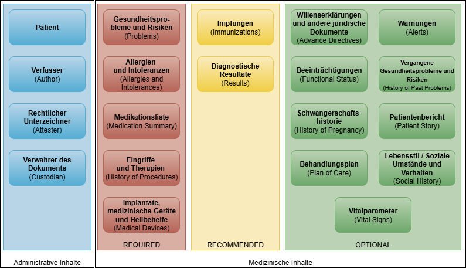

# Umfang und Inhalt - Austrian Patient Summary (R4) v1.1.0

* [**Table of Contents**](toc.md)
* **Umfang und Inhalt**

## Umfang und Inhalt

Die Austrian Patient Summary (APS) enthält neben administrativen Inhalten Strukturen, um verschiedene medizinische Inhalte zu dokumentieren.

Die medizinischen Inhalte werden weiters in drei Kategorien gegliedert, die die einzelnen Sektionen der APS enthalten.

* **Required**: Sektionen in dieser Kategorie müssen jedenfalls in der APS enthalten sein. Enthalten diese Sektionen keine Referenz auf eine Ressource in `Composition.section.entry`, `Composition.section.emptyReason` muss befüllt werden.
* **Recommended**: Die Angabe von Sektionen dieser Kategorie ist empfohlen. Sollte keine Information für die jeweilige Sektion vorhanden sein, können diese Sektionen entfallen.
* **Optional**: Sektionen dieser Kategorie können in der APS angegeben werden. Sollte keine Information für die jeweilige Sektion vorhanden sein, können diese Sektionen entfallen.

Die englischen Bezeichnungen in den Klammern entsprechen jenen, wie sie auch in der [International Patient Summary (IPS)](https://hl7.org/fhir/uv/ips/STU2/Structure-of-the-International-Patient-Summary.html) verwendet werden.

### Administrative Inhalte

#### Patient

Die Angabe von Patientendaten im Rahmen der APS ist verpflichtend. Zusätzlich können Kontaktpersonen, Hausarzt bzw. primäre Ansprechpartner angegeben werden. Details zum Patienten können [hier](StructureDefinition-at-aps-patient.md) abgerufen werden.

#### Verfasser (Author)

Autor der Austrian Patient Summary (siehe auch [`Composition.author`](StructureDefinition-at-aps-composition.md)). Ggf. Angabe eines Devices z.B. bei automatischer Erstellung der Patient Summary durch die zentrale Anwendung.

#### Rechtlicher Unterzeichner (Attester)

Person, die die Richtigkeit der Zusammenstellung bestätigt (siehe auch [`Composition.attester`](StructureDefinition-at-aps-composition.md)). Darf bei automatischer Erstellung durch ein Device nicht angegeben werden.

#### Verwahrer des Dokuments (Custodian)

Organisation, die die Patient Summary verwaltet (z.B. zentrale Anwendung) (siehe auch [`Composition.custodian`](StructureDefinition-at-aps-composition.md)).

Im Gegensatz zur IPS muss der Verwahrer des Dokuments in der APS angegeben werden, um den Anforderungen von MyHealth@EU gerecht zu werden.

### Medizinischen Inhalte

Die medizinischen Inhalte werden in der APS in den `section`-Elementen der [AT APS Composition](StructureDefinition-at-aps-composition.md) abgebildet.

Im Unterschied zur [International Patient Summary (IPS)](https://hl7.org/fhir/uv/ips/STU2/Structure-of-the-International-Patient-Summary.html) sind in der APS auch die Sektionen "Eingriffe und Therapien (History of Procedures)" und "Implantate, medizinische Geräte und Heilbehelfe (Medical Devices)" in der Kategorie "Required" zu finden, um den Anforderungen von MyHealth@EU gerecht zu werden.

#### Gesundheitsprobleme und Risiken (Problems)

Diese Sektion listet und beschreibt klinische Probleme oder Erkrankungen (kodierte Diagnosen), die derzeit für den Patienten relevant sind bzw. liefert Information über das Nichtvorhandensein.

#### Allergien und Intoleranzen (Allergies and Intolerances)

In dieser Sektion werden die relevanten Allergien oder Unverträglichkeiten des Patienten dokumentiert, wobei die Art der Reaktion (z.B. Ausschlag, Anaphylaxie usw.), vorzugsweise die auslösenden Stoffe, sowie optional die Kritikalität und die Bestimmtheit der Allergie beschrieben werden. Zumindest sollten die derzeit aktiven und alle relevanten früheren Allergien und Nebenwirkungen aufgeführt werden. Liegen keine Informationen über Allergien vor oder sind keine Allergien bekannt, sollte dies ebenfalls dokumentiert werden.

#### Medikationsliste (Medication Summary)

Diese Sektion enthält eine Beschreibung der aktuell relevanten Medikamente des Patienten bzw. liefert Information über das Nichtvorhandensein. Dabei werden nur rezeptpflichtige Medikamente und wechselwirkungsrelevante OTCs berücksichtigt.

#### Eingriffe und Therapien (History of Procedures)

Diese Sektion enthält eine Beschreibung früherer Eingriffe und Therapien. Darunter fallen zum Beispiel invasive diagnostische Verfahren (z.B. Herzkatheteruntersuchung), therapeutische Verfahren (z.B. Dialyse) und chirurgische Eingriffe (z.B. Appendektomie). Befunde und Dokumentation von z.B. im Rahmen von Disease-Management-Programmen durchgeführten Schulungen und Beratungen werden ebenfalls in dieser Sektion aufgenommen. Die Dokumentation der Information kann am Beispiel der Integrierten Versorgung z.B. der Fallkoordinator übernehmen.

#### Implantate, medizinische Geräte (Medical Devices)

Diese Sektion enthält Informationen und kodierte Einträge, die den Gebrauch von Medizinprodukten in der Krankengeschichte beschreiben, z.B. Insulinpumpen oder Herzschrittmacher.

#### Impfungen (Immunizations)

Die Sektion beschreibt den aktuellen Impfstatus des Patienten und die dazugehörige Impfhistorie.

#### Diagnostische Resultate (Results)

Die Sektion fasst Untersuchungsergebnisse zusammen, die am Patienten erhoben oder anhand von biologischen In-vitro-Proben erstellt wurden. Dabei kann es sich um Laborergebnisse, Ergebnisse der anatomischen Pathologie oder um radiologische Ergebnisse handeln.

#### Willenserklärungen und andere juridische Dokumente (Advance Directives)

Die Sektion kann aktuelle Willenserklärungen und andere juridische Dokumente von Patienten beinhalten.

#### Warnungen (Alerts)

Die Sektion ermöglicht Warnmeldungen, wenn bestimmte Umstände eintreten (z.B. wenn Grenzwerte für Blutdruck, Gewicht oder subjektives Befinden einen gewissen Zeitraum überschritten werden).

#### Beeinträchtigungen (Functional Status)

Diese Sektion enthält eine Beschreibung der Mobilität bzw. Fähigkeit des Patienten, Handlungen des täglichen Lebens auszuführen, einschließlich möglicher Bedürfnisse. Hier könnte auch die Pflegestufe dokumentiert werden.

#### Vergangene Gesundheitsprobleme und Risiken (History of Past Problems)

Die Sektion enthält eine Beschreibung der historischen klinischen Probleme oder Erkrankungen, die für den Patienten in der Vergangenheit diagnostiziert wurden.

#### Schwangerschaftshistorie (History of Pregnancy)

Die Sektion ermöglicht die Dokumentation eines Schwangerschaftsstatus inkl. geplantem Entbindungstermin und eine kurze Zusammenfassung von vergangenen Schwangerschaften.

#### Patientenbericht (Patient Story)

Die Sektion enthält narrativen Text sowie optionale Ressourcen, die zum Ausdruck bringen, was für den Patienten wichtig ist. Dazu können Bedürfnisse, Stärken, Werte, Bedenken und Präferenzen gehören, die für Personen relevant sind, die Unterstützung und Pflege anbieten.

#### Behandlungsplan (Plan of Care)

Die Sektion enthält den Behandlungsplan inkl. Vorschlägen, Zielen und Anordnungen zur Kontrolle oder Verbesserung des Zustands des Patienten, zur Planung der nächsten empfohlenen oder vereinbarten Untersuchungen, Kontrolltermine und Schulungen. Durchgeführte Maßnahmen wie Untersuchungen oder Schulungen können in der Sektion "History of Procedures" dokumentiert werden.

#### Lebensstil / Soziale Umstände und Verhalten (Social History)

Diese Sektion erfasst den aktuellen Lebensstil des Patienten. Angaben zum Rauchverhalten sowie zum Alkoholkonsum werden in den hierfür vorgesehenen spezifischen Ressourcen abgebildet. Weitere relevante Aspekte, wie z.B. körperliche Aktivität, Ernährungsgewohnheiten oder sonstige Verhaltensweisen, werden mithilfe der AtApsObservation-Ressource dokumentiert.

#### Vitalparameter (Vital Signs)

Die Sektion umfasst Informationen wie Blutdruck, Körpertemperatur, Herzfrequenz, Atemfrequenz, Größe, Gewicht, Body-Mass-Index, Kopfumfang oder Pulsoximetrie. Insbesondere können auffällige Vitalparameter oder körperliche Befunde wie der letzte, maximale und/oder minimale Wert, der Ausgangswert oder relevante Trends angegeben werden.

