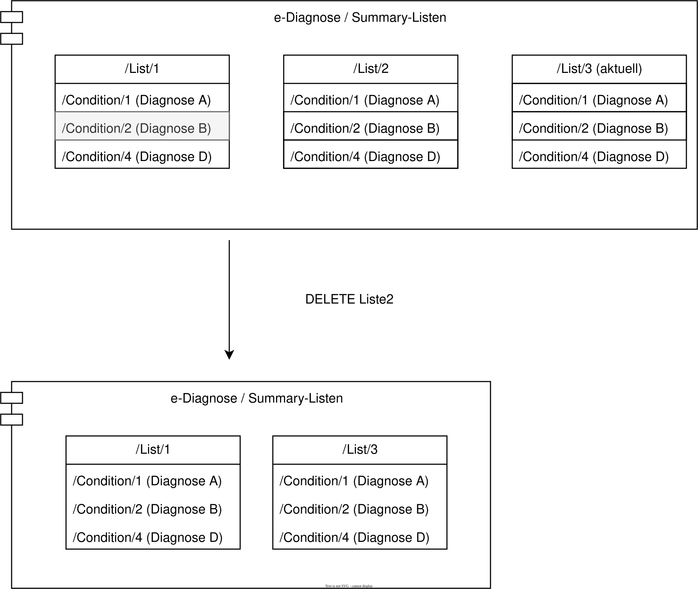

# HL7.AT.FHIR.ELGA.EDIAG.R4\Teilnehmerrechte ausüben - FHIR® v4.0.1

* [**Table of Contents**](toc.md)
* **Teilnehmerrechte ausüben**

## Teilnehmerrechte ausüben

### Interaktionen auf Einzelressourcen

#### Eintrag löschen

> Sub:UC_03_01

Ein ELGA-Teilnehmer kann via ELGA-Portal einzelne oder alle Einträge unwiderruflich löschen. Dabei ist es irrelevant, ob ein zu löschender Eintrag Teil der jeweiligen Summary-Liste ist oder nicht. Sollte der Eintrag in der aktuellen Summary-Liste referenziert sein, erstellt die Fachanwendung eine neue Version der Summary-Liste ohne den gelöschten Eintrag.

##### Ablauf

* Um einen Eintrag zu löschen, führt der ELGA-Teilnehmer über das Portal die [`$delete`-Operation](OperationDefinition-at-ediag-operation-diagnose-delete.md) auf den zu löschenden Eintrag aus.
* Die Fachanwendung löscht den entsprechenden Eintrag.
* Die Fachanwendung erstellt eine neue Version der Summary-Liste ohne den gelöschten Eintrag, sollte der zu löschende Eintrag Teil der aktuellen Summary-Liste gewesen sein.

### Interaktionen auf Listenressourcen

#### Eine Summary-Listenversion löschen

> Sub:UC_03_02 

Ein ELGA-Teilnehmer kann einzelne historische Versionen einer Summary-Liste unwiderruflich löschen. Gelöschte Summary-Listenversionen werden nicht mehr in der Historie angezeigt. Sind keine Summary-Listenversionen mehr vorhanden, liefert ein nachfolgender Abruf eine leere Summary-Liste mit List.emptyReason = nilknown zurück.

##### Ablauf

1. Ein ELGA-Teilnehmer führt ein**GET**auf den List-Typ gemäß[List-History-Read](uc_ediag_01_lesen.md#vergangene-versionen-einer-summary-liste-abrufen-list-history-read)aus.
1. Die Fachanwendung liefert die vorhandenen Summary-Listenversionen als Search-Bundle zurück.
1. ELGA-Teilnehmer wählt die zu löschende Summary-Listversion aus.
1. Durch Bestätigung wird das**DELETE**für die ausgewählte Summary-Listversion ausgeführt.
1. Die Fachanwendung entfernt die ausgewählte Summary-Listversion aus der Historie.
1. Sind keine Summary-Listenversionen mehr vorhanden, liefert ein nachfolgender Abruf eine leere Summary-Liste mit**List.emptyReason = nilknown**.

