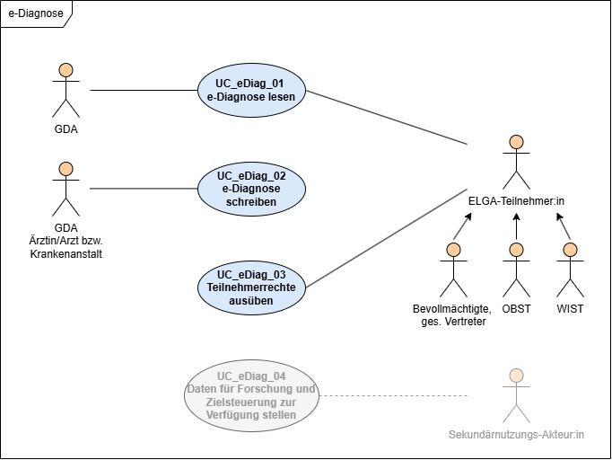
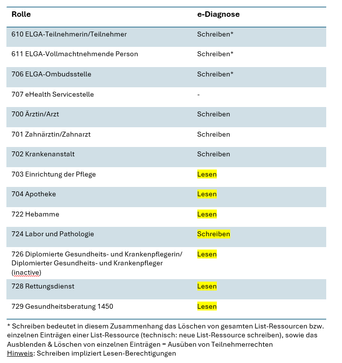

# HL7.AT.FHIR.ELGA.EDIAG.R4\Akteure - FHIR® v4.0.1

* [**Table of Contents**](toc.md)
* **Akteure**

## Akteure

Das Kapitel gibt einen Überblick über die zentralen Anwendungsfälle der e-Diagnose und zeigt, wie die verschiedenen Akteure mit den Funktionen interagieren.

Weiters werden in einer Tabelle alle ELGA Rollen angeführt, die Zugriff auf die Summary-Liste(n) und die Einträge erhalten sollen.

### Use Case Diagramm

### Rollen und Berechtigungen

