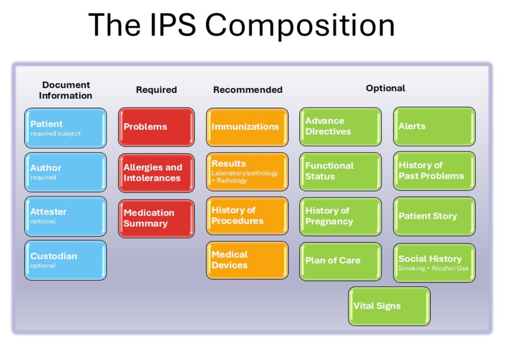

# HL7.AT.FHIR.ELGA.EDIAG.R4\Hintergrund - FHIR® v4.0.1

* [**Table of Contents**](toc.md)
* **Hintergrund**

## Hintergrund

Die strukturierte Dokumentation und der Austausch von Conditions, Procedures und AllergiesIntolerances sind eine wesentliche Grundlage für die medizinische Versorgung. Die e-Diagnose soll diese Informationen übergreifend in ELGA verfügbar machen und damit eine gesamthafte Übersicht über den Gesundheitszustand sowie die weitere Behandlung unterstützen. Zudem soll sie die Grundlage für die Austrian Patient Summary (APS) schaffen.

### Fachliches Umfeld & Datenkategorien

Die IPS unterscheidet mehrere Datenkategorien. Diese werden im Rahmen der Konzeption der e-Diagnose berücksichtigt, insbesondere im Hinblick auf die spätere Verwendung der Daten für die APS.

| | | |
| :--- | :--- | :--- |
| **Problem List** | Conditions | Condition-Summary-Liste |
| **History of Past Problems** | Conditions | Condition-Summary-Einträge |
| **History of Procedures** | Procedures | Procedure-Summary-Einträge |
| **Allergies and Intolerances** | AllergiesIntolerances | AllergyIntolerance-Summary-Einträge |

