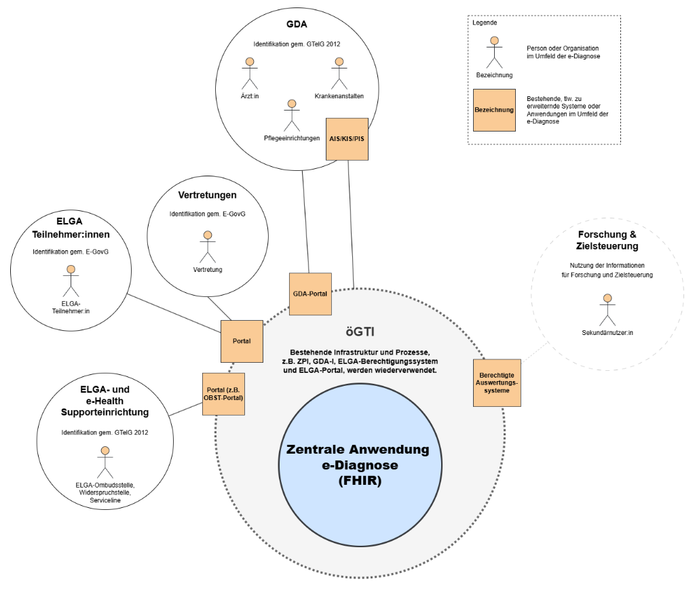

# HL7.AT.FHIR.ELGA.EDIAG.R4\Hintergrund - FHIR® v4.0.1

* [**Table of Contents**](toc.md)
* **Hintergrund**

## Hintergrund

### Begriffsdefinitionen

Im Rahmen der Anwendung eDiagnose werden unter dem Begriff „Einträge“ die FHIR-Ressourcen Condition (Diagnosen), Procedure (Prozeduren) sowie AllergyIntolerance (Allergien und Intoleranzen) zusammengefasst.

ToDo: Definition der Begriffe Einträge, Gesamtliste, Summary-Einträge, Summary-Liste

### Systemumfeld

Das Systemumfeld der e-Diagnose umfasst alle Akteur:innen, Systeme und organisatorischen Einheiten, die im Rahmen der Dokumentation, Einsichtnahme oder Nutzung der gespeicherten Conditions, Procedures und AllergiesIntolerances eingebunden sind.

Im Fokus der e-Diagnose steht der:die ELGA-Teilnehmer:in und dessen:deren Gesamtheit der dokumentierten Conditions, Procedures und AllergiesIntolerances, welche von GDA festgestellt werden und die interdisziplinäre Zusammenarbeit des Behandlungsteams unterstützen soll, um so einen bestmöglichen Outcome für den:die ELGA-Teilnehmer:in zu ermöglichen.

Der Zugriff von ELGA-Teilnehmer:innen und deren Vertretungen auf die e-Diagnose erfolgt über das Gesundheitsportal unter Nutzung der bestehenden Identifikationsmechanismen. ELGA-Teilnehmer:innen können Einsicht in ihre gespeicherten Daten nehmen sowie Teilnehmer:innenrechte wahrnehmen. Eine direkte medizinische Dokumentation durch ELGA-Teilnehmer:innen und deren Vertretungen ist nicht vorgesehen.

Die Einsichtnahme in die e-Diagnose sowie die Wahrnehmung von Teilnehmer:innenrechten kann auch durch gesetzlich oder rechtswirksam bevollmächtigte Vertretungsbefugte (Vertretung) im Rahmen der jeweils geltenden rechtlichen Bestimmungen erfolgen. Der Zugriff erfolgt dabei – analog zu ELGA-Teilnehmer:innen – über das Gesundheitsportal unter Nutzung der bestehenden Identifikationsmechanismen.

GDA dokumentieren und nutzen die Inhalte der e-Diagnose im Rahmen eines aktiven Behandlungsverhältnisses. Die Conditions, Procedures, Alerts/Flags und AllergiesIntolerances werden von GDA dokumentiert und stehen auch allen weiteren behandelnden/berechtigten GDA zur Verfügung.

Der Zugriff erfolgt primär über angebundene Primärsysteme (z.B.: AIS/KIS, etc.) oder alternativ über das GDA-Portal. Die Authentifizierung und Autorisierung erfolgen gemäß GTelG 2012 unter Nutzung des bestehenden ELGA-Berechtigungssystems. Der Zugriff ist ausschließlich im Rahmen eines aktiven Behandlungsverhältnisses zulässig. Perspektivisch ist sicherzustellen, dass die e-Diagnose allen Berufsgruppen zugänglich gemacht wird, für welche dies nach berufsrechtlichen und datenschutzrechtlichen Vorgaben zulässig und geboten ist.

Zur organisatorischen Unterstützung bestehen als Teile der ELGA und e-Health Supporteinrichtung die ELGA-Ombudsstelle (OBST), die Widerspruchstelle (WIST) sowie die Serviceline (SEL).:

* OBST: Zur Wahrung der Teilnehmerrechte für ELGA-Teilnehmer:innen und deren Vertretungen.
* WIST: Zum Einbringen von Opt-Out bzw. GDA-Sperren für ELGA-Teilnehmer:innen und deren Vertretungen (ohne Verwendung des ELGA-Portals).
* SEL: Für Fragen und Auskünfte von ELGA-Teilnehmer:innen und deren Vertretungen (Nutzung) und GDA (Nutzung und Anbindung an ELGA). Die SEL hat keinen Zugriff auf Gesundheitsdaten der ELGA-Teilnehmer:innen, unterstützt allerdings in Verwendung der Systeme – beispielsweise indem die Verfügbarkeit von Systemen überprüft wird.

