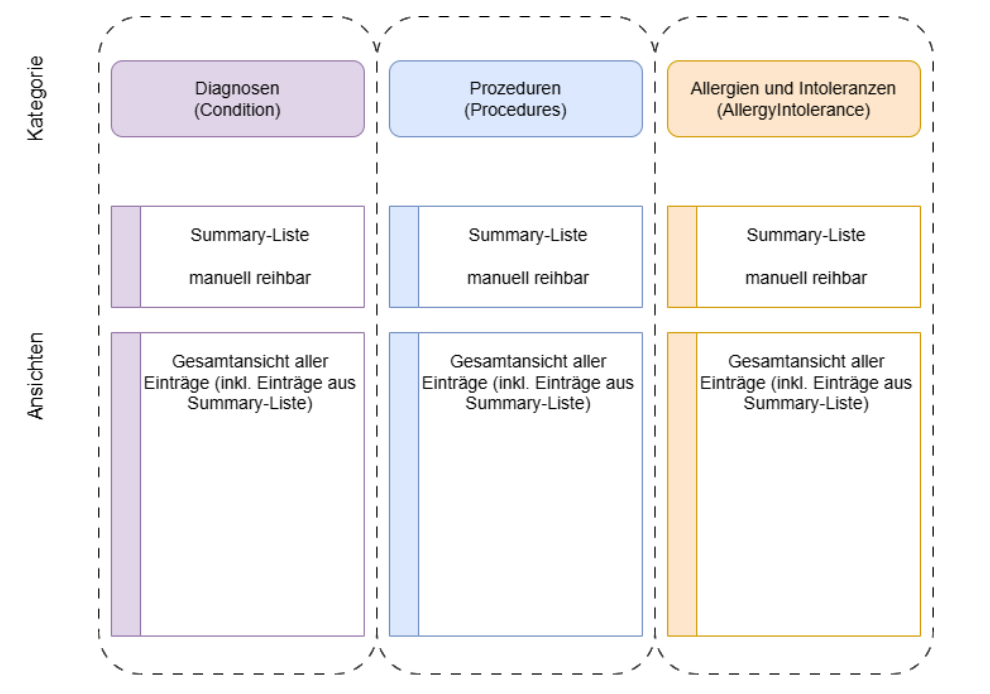

# HL7.AT.FHIR.ELGA.EDIAG.R4\Technische Use Cases - FHIR® v4.0.1

* [**Table of Contents**](toc.md)
* **Technische Use Cases**

## Technische Use Cases

Die nachfolgenden Kapitel beschreiben die fachlichen Anwendungsfälle der e-Diagnose in Form technischer Use Cases. Die zugehörigen Sequenzdiagramme stellen die beteiligten Akteure, Schnittstellen und Prozessabläufe dar.

Die e-Diagnose dient der Verwaltung von Diagnosen, Prozeduren, Allergien und Intoleranzen für ELGA-Teilnehmer. Die Fachanwendung ermöglicht das Laden, Erfassen, Bearbeiten, Stornieren und Löschen der entsprechenden Daten. Darüber hinaus unterstützt sie die Verwaltung dieser Informationen in einer Gesamtansicht.

Vor der Durchführung von Änderungen werden die aktuellen Datenbestände geladen. Anschließend können Listen bearbeitet sowie fachliche Einzelressourcen (z. B. Condition, Procedure, AllergyIntolerance) erfasst, geändert, storniert oder gelöscht werden. Die folgende Darstellung gibt einen Überblick über die in der e-Diagnose verwalteten Kategorien sowie deren Zuordnung auf den jeweiligen Listen- und Einzelressourcenebene.

Die nachfolgend beschriebenen Sub-Use-Cases definieren die erforderlichen Interaktionen und Transaktionen zur Umsetzung dieser fachlichen Funktionen. Sie basieren auf den folgenden Interaktionsarten:

* [Lesen](uc_ediag_01_lesen.md)
* [Schreiben](uc_ediag_02_schreiben.md)

