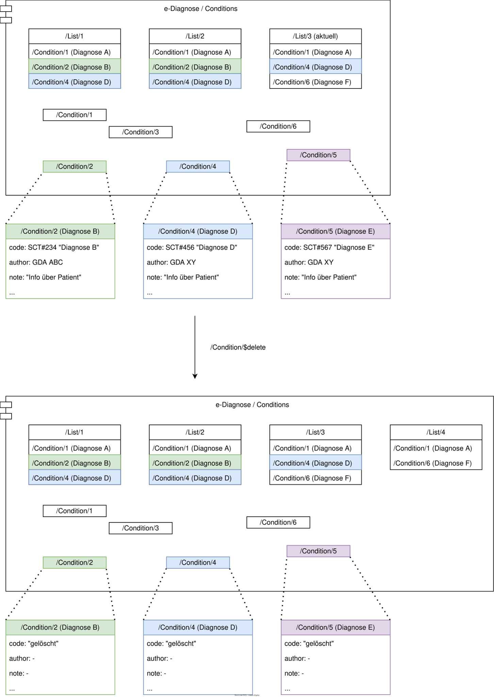

# HL7.AT.FHIR.ELGA.EDIAG.R4\Teilnehmerrechte ausüben - FHIR® v4.0.1

* [**Table of Contents**](toc.md)
* **Teilnehmerrechte ausüben**

## Teilnehmerrechte ausüben

# Teilnehmerrechte ausüben

## Interaktionen auf Listenressourcen

### Eine Summary-Listenversion löschen

> Sub:UC_03_01 

Eine ELGA-Teilnehmerin bzw. ein ELGA-Teilnehmer kann einzelne historische Versionen einer Summary-Liste unwiderruflich löschen. Gelöschte Summary-Listversionen werden nicht mehr in der Historie angezeigt. Sind keine Summary-Listversionen mehr vorhanden, liefert ein nachfolgender Abruf eine leere Summary-Liste mit List.emptyReason = nilknown zurück.

#### Ablauf

1. Ein:e ELGA-Teilnehmer:in führt ein**GET**auf den List-Typ gemäß[List-History-Read](uc_ediag_01_lesen.md#vergangene-versionen-einer-summary-liste-abrufen)aus.
1. Die Fachanwendung liefert die vorhandenen Summary-Listversionen als Search-Bundle zurück.
1. ELGA-Teilnehmer:in wählt die zu löschende Summary-Listversion aus.
1. Durch Bestätigung wird das**DELETE**für die ausgewählte Summary-Listversion ausgeführt.
1. Die Fachanwendung entfernt die ausgewählte Summary-Listversion aus der Historie.
1. Sind keine Summary-Listversionen mehr vorhanden, liefert ein nachfolgender Abruf eine leere Summary-Liste mit**List.emptyReason = nilknown**.

## Interaktionen auf Einzelressourcen

### Eintrag löschen

> Sub:UC_03_02 

Ein:e ELGA-Teilnehmer:in kann via ELGA-Portal einzelne oder alle Einträge unwiderruflich löschen. Dabei ist es irrelevant, ob ein zu löschender Eintrag Teil der Summary-Liste ist oder nicht. Die Inhalte des zu löschenden Eintrags werden durch die Fachanwendung entfernt und der Eintrag als "gelöscht" markiert. Sollte der Eintrag in der aktuellen Summary-Liste referenziert sein, erstellt die Fachanwendung eine neue Version der Summary-Liste ohne den gelöschten Eintrag.

#### Ablauf

* Um einen Eintrag zu löschen, führt die ELGA:Teilnehmerin oder der ELGA-Teilnehmer über das Portal ein `$list-read` oder ein `GET` auf die Gesamtmenge der Diagnosen aus (siehe [Einträge als Einzelressource abrufen](uc_ediag_01_lesen.md#einträge-als-einzelressource-abrufen)) und markiert die zu löschenden Einträge.
* Durch Bestätigung wird die `$delete`-Operation ausgeführt.
* Die Fachanwendung bearbeitet den zu löschenden Eintrag folgendermaßen: 
* Alle optionalen Felder `0..` werden geleert.
* Alle verpflichtenden Felder `1..` werden 
* mit der [data-absent-reason-Extension](http://hl7.org/fhir/StructureDefinition/data-absent-reason) und dem Wert `unknown` versehen
* im Fall von den folgenden codierten Elementen mit `required` Bindings auf folgende Werte gesetzt 
* `AllergyIntolerance.clinicalStatus = inactive`
* `AllergyIntolerance.verificationStatus = unconfirmed`
* `Condition.clinicalStatus = inactive`
* `Condition.verificationStatus = unconfirmed`
* `Procedure.status = completed`
 
 
 
* Die Fachanwendung erstellt eine neue Version der Summary-Liste, sollte der zu löschende Eintrag Teil der aktuellen Summary-Liste gewesen sein.

