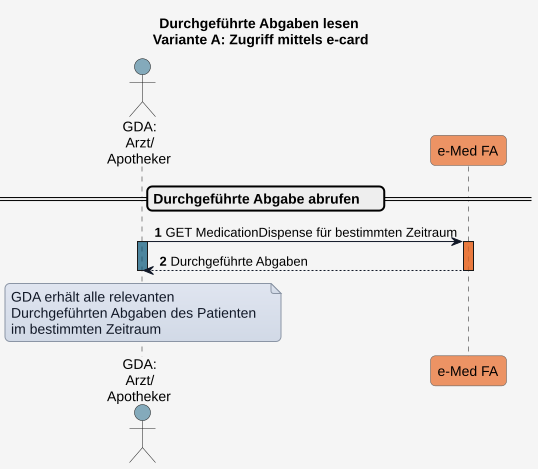
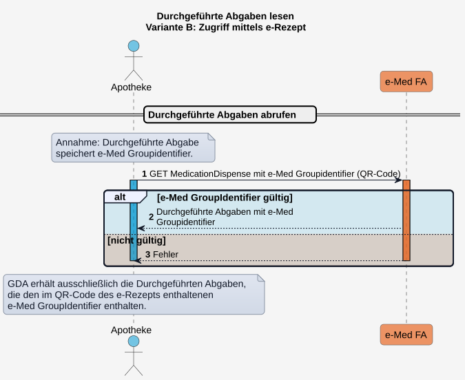

# HL7.AT.FHIR.ELGA.EMED.R4\​Technische Use Cases für Durchgeführte Abgaben lesen (UC_eMed_07) - FHIR® v4.0.1

* [**Table of Contents**](toc.md)
* [**Overview Use Case**](overview_use_case.md)
* **​Technische Use Cases für Durchgeführte Abgaben lesen (UC_eMed_07)**

## ​Technische Use Cases für Durchgeführte Abgaben lesen (UC_eMed_07)

### Sub_UC_eMed_07_02 - Durchgeführte Abgaben lesen

Ein berechtigter GDA (siehe [Rollen und Berechtigungen](actors.md#rollen-und-berechtigungen)) kann **Durchgeführte Abgaben** eines ELGA-Teilnehmers abrufen, um bereits abgegebene Arzneimittel bzw. den Status der **Durchgeführten Abgaben** einzusehen. Sofern ein zugehöriges e-Rezept vorliegt, spielgeln **Durchgeführten Abgaben** den Status der Abgaben in der e-Rezept Anwendung wider.

Der Zugriff auf **Durchgeführte Abgaben** erfolgt abhängig davon, ob eine Kontaktbestätigung des ELGA-Teilnehmers (z.B. mittels e-card) vorliegt oder ob der Zugriff mittels QR-Code des e-Rezepts erfolgt. ELGA-Teilnehmer können **Durchgeführte Abgaben** über das ELGA-Portal abrufen.

#### Dispense-Search

Im Folgenden wird exemplarisch der lesende Zugriff auf **Durchgeführte Abgaben** mittels e-card bzw. e-Rezept in der Apotheke dargestellt.

##### Variante A: Zugriff mit Kontaktbestätigung am Beispiel der e-card

Erfolgt der Zugriff in der Apotheke nach Identifikation des ELGA-Teilnehmers mittels e-card, erhält der GDA Zugriff auf alle **Durchgeführten Abgaben**. 

##### Variante B: Zugriff mittels e-Rezept

Erfolgt die Arzneimittelabgabe in der Apotheke auf Basis eines vorgelegten e-Rezepts (papiergebunden oder digital), erhält der GDA ausschließlich lesenden Zugriff auf die zugehörigen **Durchgeführten Abgaben**.

Diese werden über den im QR‑Code enthaltenen gemeinsamen **e‑Med GroupIdentifier** in der e‑Medikation identifiziert und abgerufen, sofern sie:

* einen relevanten Status aufweisen, 
* der **e‑Med GroupIdentifier** noch gültig ist (d.h. noch zugehörige offene **Geplante Abgaben** vorliegen). 

