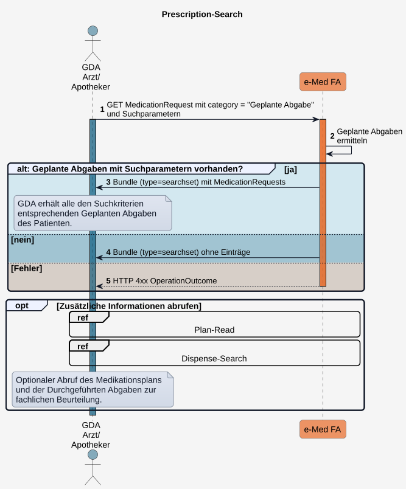

# HL7.AT.FHIR.ELGA.EMED.R4\​Technische Use Cases für Geplante Abgaben lesen (UC_eMed_07) - FHIR® v4.0.1

* [**Table of Contents**](toc.md)
* [**Overview Use Case**](overview_use_case.md)
* **​Technische Use Cases für Geplante Abgaben lesen (UC_eMed_07)**

## ​Technische Use Cases für Geplante Abgaben lesen (UC_eMed_07)

### Sub_UC_eMed_07_01 - Geplante Abgaben lesen (Prescription-Search)

Ein [berechtigter GDA](actors.md#rollen-und-berechtigungen) kann **Geplante Abgaben** eines ELGA-Teilnehmers abrufen, um verordnete (rezeptierte) Arzneimittel einzusehen.

ELGA-Teilnehmer können **Geplante Abgaben** über das ELGA-Portal einsehen.

Sofern ein zugehöriges e-Rezept vorliegt, spiegeln die **Geplanten Abgaben** den aktuellen Status der Verordnungen des e-Rezepts wider.

Der Standardzugriff erfolgt nach Kontaktbestätigung des ELGA-Teilnehmers (z.B. mittels e-card). Der GDA erhält dadurch lesenden Zugriff auf alle **Geplanten Abgaben** und kann entsprechende Arzneimittelabgaben durchführen und dokumentieren (siehe [Sub_UC_eMed_09_01 - Durchgeführte Abgabe schreiben](Sub_UC_eMed_09.md#sub_uc_emed_09_01---durchgeführte-abgabe-schreiben)). Zusätzlich kann der GDA lesend auf **Durchgeführte Abgaben** und den **Medikationsplan** zugreifen, um die **Geplanten Abgaben** im Kontext der gesamten Medikation zu beurteilen. 

Der Zugriff mittels **e-Med GroupIdentifier** (z.B. mittels DataMatrix-Code eines e-Rezepts) ermöglicht ausschließlich einen eingeschränkten ELGA-Zugriff und wird in [Sub_UC_eMed_07_03 - Geplante und Durchgeführte Abgaben mit e-Med GroupIdentifier lesen](Sub_UC_eMed_07_03.md) beschrieben.

Bei der **Prescription-Search** stellt die Fachanwendung alle **MedicationRequest**-Ressourcen mit der Kategorie **Geplante Abgabe** des ELGA-Teilnehmers bereit, die den angegebenen Suchkriterien entsprechen. Die Suche kann insbesondere nach Status und Zeitraum eingeschränkt werden. 

##### Ablauf

1. Der GDA führt ein**GET**auf**MedicationRequest**mit der Kategorie**Geplante Abgabe**aus. Optional können weitere Suchparameter, z.B. Status oder Zeitraum, angegeben werden.
1. Die Fachanwendung ermittelt alle den Suchkriterien entsprechenden**Geplanten Abgaben**des ELGA-Teilnehmers.
1. Die Fachanwendung liefert das Suchergebnis als**Bundle (type = searchset)**mit sämtlichen den Suchkriterien entsprechenden**MedicationRequest**-Ressourcen.
1. Werden keine passenden Ressourcen gefunden, wird ein**leeres Searchset-Bundle**zurückgegeben.
1. Kann die Anfrage nicht verarbeitet werden, antwortet die Fachanwendung mit einer geeigneten**HTTP-4xx**-Antwort und einem**OperationOutcome**.
1. Optional kann der GDA zusätzlich den**Medikationsplan**oder**Durchgeführte Abgaben**abrufen.

##### Sequenzdiagramm

###### Suchparameter

Mögliche Suchparamter: (in Arbeit)

* category
* status
* validityPeriod
* groupIdentifier

