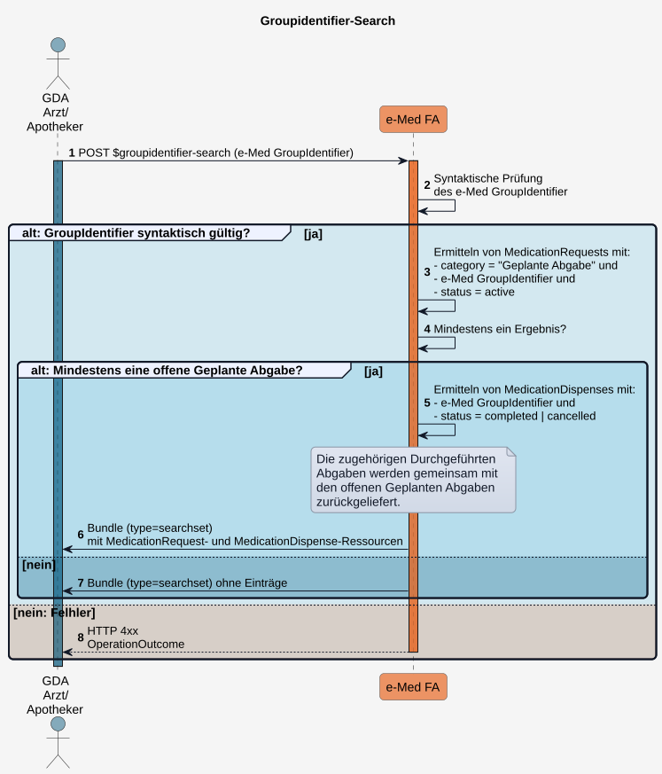

# HL7.AT.FHIR.ELGA.EMED.R4\​Technische Use Cases für Geplante und Durchgeführte Abgaben mit e-Med GroupIdentifier lesen (UC_eMed_07) - FHIR® v4.0.1

* [**Table of Contents**](toc.md)
* [**Overview Use Case**](overview_use_case.md)
* **​Technische Use Cases für Geplante und Durchgeführte Abgaben mit e-Med GroupIdentifier lesen (UC_eMed_07)**

## ​Technische Use Cases für Geplante und Durchgeführte Abgaben mit e-Med GroupIdentifier lesen (UC_eMed_07)

### Sub_UC_eMed_07_03 - Geplante und Durchgeführte Abgaben mit e-Med GroupIdentifier lesen (Groupidentifier-Search)

Erfolgt die Arzneimittelabgabe basierend auf einem **e-Med GroupIdentifier** (z.B. mit DataMatrix-Code eines e-Rezepts), erhält ein [berechtigter GDA](actors.md#rollen-und-berechtigungen) ausschließlich lesenden Zugriff auf die zugehörigen **Geplanten** und **Durchgeführten Abgaben**. Diese werden über den im DataMatrix-Code enthaltenen gemeinsamen **e‑Med GroupIdentifier** in der e‑Medikation Fachanwendung identifiziert und abgerufen.

Der Zugriff mit **e-Med GroupIdentifier** ermöglicht ausschließlich einen eingeschränkten ELGA-Zugriff. Der GDA erhält in diesem Fall keinen Zugriff auf weitere offene **Geplante** oder **Durchgeführte Abgaben**, kann den **Medikationsplan** des ELGA-Teilnehmers nicht einsehen und kann auch keine zusätzlichen **Durchgeführten Abgaben** (z.B. OTC oder Notabgaben) in der e-Medikation des ELGA-Teilnehmers dokumentieren.

##### Ablauf

1. Der GDA führt die Custom Operation**POST**[$groupidentifier-search](OperationDefinition-AtElgaEmed.GroupIdentifier.Search.md)aus und übermittelt einen**e-Med GroupIdentifier**.
1. Die Fachanwendung führt eine**syntaktische Prüfung**des übermittelten**e-Med GroupIdentifier**durch.
1. Ist der**e-Med GroupIdentifier**syntaktisch gültig, ermittelt die Fachanwendung alle**MedicationRequest**-Ressourcen mit:
* **category = Geplante Abgabe**
* dem übermittelten **e-Med GroupIdentifier**
* **status = active**

1. Ergibt die Suche mindestens eine offene**Geplante Abgabe**, ermittelt die Fachanwendung zusätzlich alle zugehörigen**MedicationDispense**-Ressourcen mit:
* dem übermittelten **e-Med GroupIdentifier**
*  

| | |
| :--- | :--- |
| *status = completed | cancelled* |

 

1. Die Fachanwendung liefert ein**Bundle**vom Typ**searchset**mit den ermittelten**MedicationRequest**- und**MedicationDispense**-Ressourcen zurück.
1. Ergibt die Suche**keine offene Geplante Abgabe**, liefert die Fachanwendung ein**leeres Bundle**vom Typ**searchset**zurück.
1. Ist der**e-Med GroupIdentifier**syntaktisch ungültig, lehnt die Fachanwendung die Operation ab und liefert ein entsprechendes**OperationOutcome**zurück.

##### Sequenzdiagramm

##### Custom Operations

$groupidentifier-search: in Arbeit.

