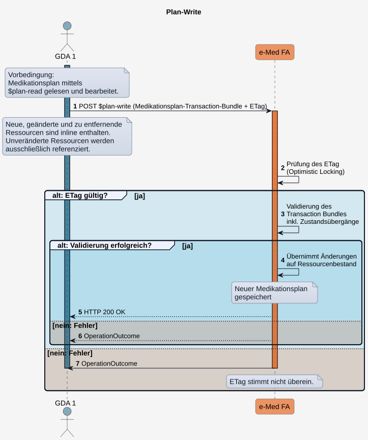

# HL7.AT.FHIR.ELGA.EMED.R4\​Technische Use Cases für Medikationsplan schreiben (UC_eMed_02) - FHIR® v4.0.1

* [**Table of Contents**](toc.md)
* [**Overview Use Case**](overview_use_case.md)
* **​Technische Use Cases für Medikationsplan schreiben (UC_eMed_02)**

## ​Technische Use Cases für Medikationsplan schreiben (UC_eMed_02)

Ein [berechtigter GDA](actors.md#rollen-und-berechtigungen) kann den Medikationsplan eines ELGA-Teilnehmers bearbeiten.

Ein ELGA-Teilnehmer kann einzelne Planeinträge und gesamte Medikationspläne über das Zugangsportal unwiderruflich löschen.

Alle Schreibvorgänge auf einem Medikationsplan folgen demselben technischen Grundablauf:

1. Der aktuelle Medikationsplan**MUSS**mittels[$plan-read](OperationDefinition-AtElgaEmed.List.PlanRead.md)abgerufen werden (siehe[Sub_UC_eMed_01_01 - Aktuellen Medikationsplan lesen (Plan-Read)](Sub_UC_eMed_01.md#Sub_UC_eMed_01_01---aktuellen-medikationsplan-lesen-plan-read)).
1. Die durch $plan-read bereitgestellten Ressourcen werden entsprechend des gewünschten Schreibszenarios bearbeitet.
1. Der aktualisierte Medikationsplan**MUSS**mittels[$plan-write](OperationDefinition-AtElgaEmed.List.PlanWrite.md)als Transaction Bundle ([Medikationsplan-Transaction-Bundle](StructureDefinition-at-elga-emed-bundle-medikationsplantx.md)) an die Fachanwendung übermittelt.

Die nachfolgenden technischen Use Cases beschreiben die jeweils erforderlichen Änderungen an den Ressourcen sowie die Inhalte des Medikationsplan-Transaction-Bundles. Der technische Ablauf von **$plan-write** einschließlich der Integritätsprüfung mittels **ETag** ist für alle Schreiboperationen identisch und wird im folgenden Abschnitt beschrieben.

#### Sub_UC_eMed_02_01 - Medikationsplan schreiben (Plan-Write)

Alle Schreiboperationen erfolgen über die Custom Operation [$plan-write](OperationDefinition-AtElgaEmed.List.PlanWrite.md). Die Fachanwendung verwendet den im Request übermittelten **ETag** zur Integritätsprüfung ([Optimistic Locking](https://hl7.org/fhir/http.html#concurrency)), um konkurrierende Änderungen am Medikationsplan zu erkennen. 

##### Ablauf

1. Das GDA-System übermittelt den aktualisierten Medikationsplan mittels**POST**[$plan-write](OperationDefinition-AtElgaEmed.List.PlanWrite.md)als[Medikationsplan-Transaction-Bundle](design_choices.md#medikationsplan-transaction-bundle-atemedbundlemedikationsplantx-transaction-bundle). Der Request enthält:
* alle **neuen**, **geänderten** und **zu entfernenden** Ressourcen **inline** im Transaction Bundle
* den von der Fachanwendung nach dem **$plan-read** übermittelten **ETag** (zur Durchführung des [Optimistic Locking](https://hl7.org/fhir/http.html#concurrency))
* unveränderte Ressourcen werden ausschließlich referenziert.

1. Die Fachanwendung prüft den übermittelten**ETag**gegen den**ETag**der aktuell persistierten Medikationsplan-Version.
1. Ist der**ETag**gültig, validiert die Fachanwendung das Medikationsplan-Transaction-Bundle einschließlich der zulässigen Zustandsübergänge.
1. Die Fachanwendung erstellt neue Versionen der geänderten Ressourcen und persistiert diese. Die neue Version der List-Ressource definiert dabei die neue Version des Medikationsplans.
1. Schlägt die Validierung fehl, wird der Schreibvorgang miteinem**OperationOutcome**abgelehnt.
1. Stimmt der übermittelte**ETag**nicht mit dem der Fachanwendung überein, wird der Schreibvorgang miteinem**OperationOutcome**abgelehnt. Vor einem erneuten Schreibversuch muss der Medikationsplan mittels[$plan-read](OperationDefinition-AtElgaEmed.List.PlanRead.md)erneut abgerufen und auf Basis der aktuellen Version bearbeitet werden.

##### Custom Operations

* [$plan-write](OperationDefinition-AtEmed.List.PlanWrite.md)
* [$plan-read](OperationDefinition-AtEmed.List.PlanRead.md)

##### Sequenzdiagramm

  

#### Sub_UC_eMed_02_02 - Leeren Medikationsplan dokumentieren

Ein Medikationsplan mit **List.emptyReason = nilknown** dokumentiert, dass für den Patienten derzeit **keine Medikation vorgesehen** ist.

Der Wert **nilknown** dient der Unterscheidung zwischen einem **noch nie befüllten Medikationsplan** (**notstarted**) und einem Medikationsplan, für den **bewusst keine Medikation dokumentiert** ist (**nilknown**).

Der Medikationsplan erhält den Status **List.emptyReason = nilknown** in folgenden Fällen:

* Ein GDA hat **alle Planeinträge abgesetzt, beendet oder storniert** oder ein ELGA-Teilnehmer hat **alle Planeinträge unwiderruflich gelöscht**, sodass sämtliche Einträge der **List** das **List.entry.flag = removed** besitzen. Beim nächsten [$plan-read](OperationDefinition-AtElgaEmed.List.PlanRead.md) erkennt die Fachanwendung diesen Zustand und liefert den Medikationsplan mit **List.emptyReason = nilknown** aus.

* Ein GDA möchte explizit dokumentieren, dass derzeit keine Medikation vorgesehen ist, der Medikationsplan befindet sich aber noch im Initialzustand (**List.emptyReason = notstarted**). In diesem Fall kann der GDA **List.emptyReason** zu **nilknown** ändern und im Anschluss ein **Plan-Write** ausführen.

##### Relevante Elemente (List)

Der GDA übermittelt ein Medikationsplan-Transaction-Bundle mit:

```
AtElgaEmedListMedikationsplan
    identifier: von der Fachanwendung übermittelt (Integritätsprüfung) 
    status: current
    mode: working
    date: Datum der Bearbeitung
    source: veranwortlicher GDA 
    emptyReason: nilknown   // Patient nimmt derzeit kein Medikation ein

```

##### Custom Operations

* [$plan-write](OperationDefinition-AtEmed.List.PlanWrite.md)
* [$plan-read](OperationDefinition-AtEmed.List.PlanRead.md)

#### Sequenzdiagramm - Allgemeiner Ablauf von Planeinträge bearbeiten

Im Weiteren wird beschrieben, wie Planeinträge bearbeitet werden können. Das Sequenzdiagramm zeigt den allgemeinen Ablauf.

  

#### Sub_UC_eMed_02_03 - Planeintrag in Medikationsplan hinzufügen

Der GDA kann dem Medikationsplan ein oder mehrere Planeinträge hinzufügen. Dabei muss er dokumentieren, ob dieser von ihm selbst stammt oder er Fremdmedikation (durch einen anderen GDA) bzw. Eigenmedikation des Patienten dokumentiert.

Hierfür führt der GDA ein **$plan-read** aus und bearbeitet die von der Fachanwendung bereitgestellten Ressourcen:

* Das Element **List.source** wird mit dem aktuellen GDA aktualisiert.
* Entsprechende Planeinträge (**MedicationRequests**) werden neu erstellt und in der **List**-Ressouce referenziert:

Im Anschluss übermittelt der GDA mit **POST $plan-write** den aktualisierten Medikationsplan in einem **Transaction Bundle**:

* alle neuen **MedicationRequests** sind inline im Bundle enthalten
* die unveränderten Ressourcen sind nicht im Bundle enthalten, sondern werden in der Liste nur referenziert.

##### Relevante Elemente (List)

```
AtElgaEmedListMedikationsplan
    identifier: von der Fachanwendung übermittelt (Integritätsprüfung) 
    status: current
    mode: working
    date: Datum der aktuellen Bearbeitung des Medikationsplans
    source: für die Bearbeitung veranwortlicher GDA 
    entry[0]:  // 1. Planeintrag wird hinzufgefügt
        flag: new
        item: Referenz auf den Planeintrag 1  // siehe "Relevante Elemente (MedicationRequest) Planeintrag 1"
    entry[1]:  // 2. Planeintrag wird hinzufgefügt
        flag: new
        item: Referenz auf den Planeintrag 2  // analog zu "Relevante Elemente (MedicationRequest) Planeintrag 1"

```

##### Relevante Elemente (MedicationRequest - Planeintrag 1)

```
AtElgaEmedMedicationRequestPlaneintrag
    identifier: neue Planeintrag-ID
    status: active | on-hold
    intent: order                       // fester Wert
    category: "Planeintrag"  // fester Wert
    reportedBoolean: true | false       // true, wenn Fremdmedikation
    medicationReference.reference: Medikation mit PZN oder Magistrale Anwendung // Contained Medication 
    authoredOn: Datum der Erstellung des Planeintrags    
    requester: veranwortlicher GDA      // wird auf Übereinstimmung mit List.source geprüft
    courseOfTherapyType: continuous | acute
    dosageInstruction: Dosierung + Einnahmezeitraum (ab sofort | in der Zukunft)

```

##### Custom Operations

* [$plan-write](OperationDefinition-AtEmed.List.PlanWrite.md)
* [$plan-read](OperationDefinition-AtEmed.List.PlanRead.md)

##### Sequenzdiagramm

Siehe [Allgemeiner Ablauf - Planeinträge bearbeiten](Sub_UC_eMed_02.md#allgemeiner-ablauf---planeinträge-bearbeiten).

#### Sub_UC_eMed_02_04 - Planeintrag im Medikationsplan beibehalten

Der GDA kann ein oder mehrere Planeinträge im Medikationsplan beibehalten und unverändert zur Kennntis nehmen.

Hierfür führt der GDA ein **$plan-read** aus und bearbeitet die von der Fachanwendung bereitgestellten Ressourcen:

* Das Element **List.source** wird mit dem aktuellen GDA aktualisiert.
* Die zu behaltenden Planeinträge (**MedicationRequests**) bleiben **unverändert** im Status **active** oder **on-hold** (Planeinträge mit anderem Status werden von der Fachanwendung nicht ausgeliefert).
* Planeinträge mit abgelaufenem Einnahmezeitraum sind im durch $plan-read bereitgestellten Medikationsplan weiterhin enthalten, werden in der List aber mit **List.entry.flag = removed** markiert. 
* Nimmt der GDA keine Änderung an diesen Planeinträgen vor und führt ein Plan-Write durch, werden diese beim nächsten Plan-Read automatisch aus dem Medikationsplan entfernt.
* Möchte der GDA einen abgelaufenen Planeintrag beibehalten, muss er entsprechende Anpassungen vornehmen: **List.entry.flag** auf **changed** und zumindest den Einnahmezeitraum im Planeintrag anpassen (siehe **Sub_UC_eMed_02_05 - Planeintrag im Medikationsplan ändern**), da die Fachanwendung das Speichern sonst ablehenen würde.
 

Der GDA übermittelt mit **POST $plan-write** den aktualisierten Medikationsplan in einem **Transaction Bundle**:

* die unveränderten Ressourcen sind nicht im Bundle enthalten, sondern werden in der Liste nur referenziert.

##### Relevante Elemente (List)

```
AtElgaEmedListMedikationsplan
    date: Datum der aktuellen Bearbeitung des Medikationsplans
    source: für die Bearbeitung veranwortlicher GDA 
    entry[0]:  // 1. Planeintrag bleibt unverändert
        flag: unchanged 
        item: Referenz auf den Planeintrag 1  

```

##### Relevante Elemente (MedicationRequest - Planeintrag 1)

```
AtElgaEmedMedicationRequestPlaneintrag
    // unverändert (verantwortlicher GDA, Datum, Status bleiben bestehen)

```

##### Custom Operations

* [$plan-write](OperationDefinition-AtEmed.List.PlanWrite.md)
* [$plan-read](OperationDefinition-AtEmed.List.PlanRead.md)

##### Sequenzdiagramm

Siehe [Allgemeiner Ablauf - Planeinträge bearbeiten](Sub_UC_eMed_02.md#allgemeiner-ablauf---planeinträge-bearbeiten).

#### Sub_UC_eMed_02_05 - Planeintrag pausieren

Ein GDA kann die Therapie eines Patienten vorübergehend unterbrechen (die Wiederaufnahme ist vorgesehen). Eine Freitext-Begründung kann dokumentiert werden.

Hierfür führt der GDA ein **$plan-read** aus und bearbeitet das von der Fachanwendung übermittelte Bundle. Die zu pausierenden Planeinträge (**MedicationRequests**) und das entsprechende Entry der **List**-Ressouce werden angepasst:

* Das Element **List.source** wird mit dem aktuellen GDA aktualisiert.
* Das **List.entry.flag** des referenzierten MedicationRequests erhält den Wert **changed**,
* der MedicationRequest erhält den Status **on-hold** (siehe [Konsistenzregeln zwischen List.entry.flags und MedicationRequest-Status](workflowmanagement.md#konsistenzregeln-zwischen-listentryflags-und-medicationrequest-status))
* In **statusReason.text** kann ein Grund für die Pausierung als Freitext dokumentiert werden.
* **reportedBoolean** wird auf **true** gesetzt, wenn die Information über die Pausierung vom Patienten berichtet wurde und auf **false**, wenn die Pausierung vom GDA angeordnet wurde – unabhängig davon, welcher Status zuvor dokumentiert war.
* der Einnahmezeitraum im MedicationRequest kann sich auf das aktuelle Datum beziehen oder in der Zukunft liegen.

Im Anschluss übermittelt der GDA mit **POST $plan-write** den aktualisierten Medikationsplan in einem **Transaction Bundle**:

* alle geänderten Ressourcen sind inline im Bundle enthalten
* die unveränderten Ressourcen sind nicht im Bundle enthalten, sondern werden in der Liste nur referenziert.

Anmerkung: Beim nächsten **Plan-Read** ändert die Fachanwendung im zur Auslieferung bereitgestellten Bundle den Status der Einträge mit **changed** automatisch auf **unchanged**.

##### Relevante Elemente (List)

```
AtElgaEmedListMedikationsplan
    date: Datum der aktuellen Bearbeitung des Medikationsplans
    source: für die Bearbeitung veranwortlicher GDA 
    entry[0]:  // 1. Planeintrag wird pausiert
        flag: changed 
        item: Referenz auf den Planeintrag 1  
    entry[1]:  // 2. Planeintrag bleibt unverändert
        flag: unchanged 
        item: Referenz auf den Planeintrag 2  

```

##### Relevante Elemente (MedicationRequest - Planeintrag 1)

```
AtElgaEmedMedicationRequestPlaneintrag
    identifier: Planeintrag-ID bleibt bestehen
    status: on-hold
    statusReason.text: Freitextbegrüdung  // optional
    reportedBoolean: true | false       // true, wenn Fremdmedikation
    authoredOn: Datum der Pausierung des Planeintrags    
    requester: für die Pausierung verantwortlicher GDA 
    priorPrescription: Referenz auf ersetzten Planeintrag

```

##### Custom Operations

* [$plan-write](OperationDefinition-AtEmed.List.PlanWrite.md)
* [$plan-read](OperationDefinition-AtEmed.List.PlanRead.md)

##### Sequenzdiagramm

Siehe [Allgemeiner Ablauf - Planeinträge bearbeiten](Sub_UC_eMed_02.md#allgemeiner-ablauf---planeinträge-bearbeiten).

#### Sub_UC_eMed_02_06 - Planeintrag im Medikationsplan ändern

Der GDA kann im Medikationsplan ein oder mehrere Planeinträge ändern.

Die Änderung des Planeintrag kann alle Inhalte umfassen, z.B.: Änderung des Status (pausieren/aktivieren), Änderung des Einnahmezeitraums, der Dosierung oder der Medikation. Wird die Planeintrag-ID (**identifier**) geändert, kann über diese kein Bezug mehr zu vorherehenden Planeinträgen hergestellt werden.  Bei fehlender fachlicher Kontinuität der Bearbeitung eines Planeintrages (z.B. Änderung PZN; Blutdruckmittel auf Antibiotikum) **SOLL** ein neuer Planeintrag erfasst und kein bestehender Eintrag weiterverwendet werden.

Um Planeinträge zu ändern, führt der GDA ein $plan-read aus und bearbeitet die von der Fachanwendung bereitgestellten Ressourcen:

* Das Element **List.source** wird mit dem aktuellen GDA, das Datum in **List.date** aktualisiert.
* Entsprechende Planeinträge (**MedicationRequests**) werden geändert und das entsprechende Entry der **List**-Ressouce angepasst: 
* Das List.entry.flag erhält den Wert **changed**,
* der MedicationRequest selbst kann den Status **active** oder **on-hold** erhalten (siehe [Konsistenzregeln zwischen List.entry.flags und MedicationRequest-Status](workflowmanagement.md#konsistenzregeln-zwischen-listentryflags-und-medicationrequest-status))
* der Einnahmezeitraum im MedicationRequest kann sich auf das aktuelle Datum beziehen oder in der Zukunft liegen
 

Der GDA übermittelt (via POST $plan-write) den aktualisierten Medikationsplan in einem Transaction Bundle:

* alle geänderten Ressourcen sind inline im Bundle enthalten
* die unveränderten Ressourcen sind nicht im Bundle enthalten, sondern werden in der Liste nur referenziert.

##### Relevante Elemente (List)

```
AtElgaEmedListMedikationsplan
    identifier: von der Fachanwendung übermittelt (Integritätsprüfung) 
    status: current
    mode: working
    date: Datum der Bearbeitung des Medikationsplans
    source: Veranwortlicher GDA 
    entry[0]:  // 1. Planeintrag wird geändert
        flag: changed 
        date: Datum der Änderung des Planeintrags  // in diesem Fall gleich mit dem Datum der Bearbeitung des Medikationsplans
        item: Referenz auf den Planeintrag 1  
    entry[1]:  // 2. Planeintrag bleibt unverändert
        flag: unchanged 
        date: Datum der Aufnahme des Planeintrags // in diesem Fall unterschiedlich mit dem Datum der Bearbeitung des Medikationsplans
        item: Referenz auf den Planeintrag 2  

```

##### Relevante Elemente (MedicationRequest - Planeintrag 1)

```
AtElgaEmedMedicationRequestPlaneintrag
    identifier: Planeintrag-ID bleibt bestehen  // sofern der Bezug erhalten bleiben soll
    status: active | on-hold
    statusReason.text: Freitextbegrüdung für die Änderung 
    reportedBoolean: false  // Fremdmedikation
    medicationReference.reference: Änderungen betreffend der Medikation // Contained Medication 
    authoredOn: Datum der Änderung des Planeintrags    
    requester: für die Änderung verantwortlicher GDA 
    dosageInstruction: Änderung betreffend Dosierung + Einnahmezeitraum (ab sofort | in der Zukunft)
    priorPrescription: Referenz auf ersetzten Planeintrag

```

##### Custom Operations

* [$plan-write](OperationDefinition-AtEmed.List.PlanWrite.md)
* [$plan-read](OperationDefinition-AtEmed.List.PlanRead.md)

##### Sequenzdiagramm

Siehe [Allgemeiner Ablauf - Planeinträge bearbeiten](Sub_UC_eMed_02.md#allgemeiner-ablauf---planeinträge-bearbeiten).

#### Sub_UC_eMed_02_07 - Planeintrag im Medikationsplan stornieren

Der GDA kann einen oder mehrere Planeinträge aufgrund einer falschen Eingabe stornieren. Diese sind beim nächsten [Plan-Read](interactions.md#plan-read) nicht mehr im Medikationsplan enthalten.

Hierfür führt der GDA ein $plan-read aus und bearbeitet das von der Fachanwendung übermittelte Collection Bundle:

* Das Element **List.source** wird mit dem aktuellen GDA, das Datum in **List.date** aktualisiert.
* Entsprechende Planeinträge (**MedicationRequests**) und das entsprechende Entry der **List**-Ressouce werden angepasst: 
* Das List.entry.flag des referenzierten MedicationRequests erhält den Wert **removed**,
* der MedicationRequest erhält den Status **entered-in-error** (siehe [Konsistenzregeln zwischen List.entry.flags und MedicationRequest-Status](workflowmanagement.md#konsistenzregeln-zwischen-listentryflags-und-medicationrequest-status)) 
 

Der GDA übermittelt (via POST $plan-write) den aktualisierten Medikationsplan in einem Transaction Bundle:

* alle geänderten Ressourcen (inkl. der stornierten) sind inline im Bundle enthalten
* die unveränderten Ressourcen sind nicht im Bundle enthalten, sondern werden in der Liste nur referenziert.

##### Relevante Elemente (List)

Relevante Elemente (List)

```
AtElgaEmedListMedikationsplan
    identifier: von der Fachanwendung übermittelt (Integritätsprüfung) 
    status: current
    mode: working
    date: Datum der Bearbeitung des Medikationsplans
    source: Veranwortlicher GDA 
    entry[0]:  // 1. Planeintrag wird storniert
        flag: removed 
        item: Referenz auf den Planeintrag 1  
    entry[1]:  // 2. Planeintrag bleibt unverändert
        flag: unchanged 
        item: Referenz auf den Planeintrag 2  

```

##### Relevante Elemente (MedicationRequest - Planeintrag 1)

```
AtElgaEmedMedicationRequestPlaneintrag
    identifier: Planeintrag-ID bleibt bestehen
    status: entered-in-error
    reportedBoolean: false  // Fremdmedikation
    authoredOn: Datum der Stornierung des Planeintrags    
    requester: für die Stornierung verantwortlicher GDA 
    priorPrescription: Referenz auf ersetzten Planeintrag

```

##### Custom Operations

* [$plan-write](OperationDefinition-AtEmed.List.PlanWrite.md)
* [$plan-read](OperationDefinition-AtEmed.List.PlanRead.md)

##### Sequenzdiagramm

Siehe [Allgemeiner Ablauf - Planeinträge bearbeiten](Sub_UC_eMed_02.md#allgemeiner-ablauf---planeinträge-bearbeiten).

#### Sub_UC_eMed_02_08 - Planeintrag im Medikationsplan beenden

Der GDA kann ein Medikament, welches in einen Planeintrag dokumentiert ist, absetzen. Der betreffende Planeintrag ist beim nächsten [Plan-Read](interactions.md#plan-read) nicht mehr im Medikationsplan enthalten.

Hierfür führt der GDA ein $plan-read aus und bearbeitet die von der Fachanwendung bereitgestellten Ressourcen:

* Das Element **List.source** wird mit dem aktuellen GDA, das Datum in **List.date** aktualisiert.
* Entsprechende Planeinträge (**MedicationRequests**) und das entsprechende Entry der **List**-Ressouce werden angepasst: 
* Das List.entry.flag des referenzierten MedicationRequests erhält den Wert **removed**,
* der MedicationRequest erhält den Status **stopped** (siehe [Konsistenzregeln zwischen List.entry.flags und MedicationRequest-Status](workflowmanagement.md#konsistenzregeln-zwischen-listentryflags-und-medicationrequest-status))
* Im Element **statusReason.text** muss der Beendigungsgrund (Freitext) dokumentiert werden.
* Ein bestehendes Enddatum des Einnahmezeitraums muss nicht geändert werden (auch wenn dieses in der Zukunft liegt).
 

Der GDA übermittelt (via POST $plan-write) den aktualisierten Medikationsplan in einem Transaction Bundle:

* alle geänderten Ressourcen (inkl. der abgesetzten) sind inline im Bundle enthalten
* die unveränderten Ressourcen sind nicht im Bundle enthalten, sondern werden in der Liste nur referenziert.

##### Relevante Elemente (List)

```
AtElgaEmedListMedikationsplan
    identifier: von der Fachanwendung übermittelt (Integritätsprüfung) 
    status: current
    mode: working
    date: Datum der Bearbeitung des Medikationsplans
    source: Veranwortlicher GDA 
    entry[0]:  // 1. Planeintrag wird abgesetzt
        flag: removed 
        item: Referenz auf den Planeintrag 1  // siehe "Planeintrag ändern"
    entry[1]:  // 2. Planeintrag bleibt unverändert
        flag: unchanged 
        item: Referenz auf den Planeintrag 2  

```

##### Relevante Elemente (MedicationRequest - Planeintrag 1)

```
AtElgaEmedMedicationRequestPlaneintrag
    identifier: Planeintrag-ID bleibt bestehen
    status: stopped
    statusReason.text: Freitextbegrüdung für das Absetzen des Medikaments
    reportedBoolean: false  // Fremdmedikation
    authoredOn: Datum des Absetzens des Planeintrags    
    requester: für das Absetzen verantwortlicher GDA 
    priorPrescription: Referenz auf ersetzten Planeintrag

```

##### Custom Operations

* [$plan-write](OperationDefinition-AtEmed.List.PlanWrite.md)
* [$plan-read](OperationDefinition-AtEmed.List.PlanRead.md)

##### Sequenzdiagramm

Siehe [Allgemeiner Ablauf - Planeinträge bearbeiten](Sub_UC_eMed_02.md#allgemeiner-ablauf---planeinträge-bearbeiten).

#### Sub_UC_eMed_02_10 - Reihenfolge der Planeinträge ändern

Der GDA kann die Reihenfolge der Planeinträge ändern. Die Einträge selbst bleiben dabei unverändert.

Hierfür führt der GDA ein $plan-read aus und bearbeitet die von der Fachanwendung bereitgestellten Ressourcen:

* Das Element **List.source** wird mit dem aktuellen GDA, das Datum in **List.date** aktualisiert.
* Die Reihenfolge der Planeinträge wird in der **List**-Ressouce angepasst, indem die Entries entsprechend gereiht werden.
* Der Einnahmezeitraum der Planeinträge darf noch nicht abgelaufen sein (ansonsten müssen diese bearbeitet werden - siehe [Sub_UC_eMed_02_06 - Planeintrag im Medikationsplan ändern](Sub_UC_eMed_02.md#Sub_UC_eMed_02_06---Planeintrag-im-medikationsplan-ändern)).

Der GDA übermittelt (via POST $plan-write) den aktualisierten Medikationsplan in einem Transaction Bundle:

* die unveränderten Ressourcen sind nicht im Bundle enthalten, sondern werden in der Liste nur referenziert.

##### Relevante Elemente (List)

In folgendem Beispiel wird der ursprünglich 2. Eintrag als 1. gereiht.

```
AtElgaEmedListMedikationsplan
    identifier: von der Fachanwendung übermittelt (Integritätsprüfung) 
    status: current
    mode: working
    date: Datum der Änderung der Reihenfolge
    source: Veranwortlicher GDA 
    entry[0]: // 2. Planeintrag 
        flag: Unchanged 
        item: Referenz auf den Planeintrag 2 
    entry[1]: // 1. Planeintrag
        flag: Unchanged 
        item: Referenz auf den Planeintrag 1 

```

##### Relevante Elemente (MedicationRequest - Planeintrag 1 und 2)

```
AtElgaEmedMedicationRequestPlaneintrag
    // unverändert (verantwortlicher GDA, Datum, Status bleiben bestehen)

```

##### Custom Operations

* [$plan-write](OperationDefinition-AtEmed.List.PlanWrite.md)
* [$plan-read](OperationDefinition-AtEmed.List.PlanRead.md)

##### Sequenzdiagramm

Siehe [Allgemeiner Ablauf - Planeinträge bearbeiten](Sub_UC_eMed_02.md#allgemeiner-ablauf---planeinträge-bearbeiten).

#### Sub_UC_eMed_02_11 - Planeintrag durch ELGA-Teilnehmer löschen

Der ELGA-Teilnehmer kann via ELGA-Portal einzelne oder alle Planeinträge unwiderruflich löschen, wodurch eine neue Medikationsplanversion entsteht. Wurden durch den ELGA-Teilnehmer alle Planeinträge gelöscht, erhält der von der Fachanwendung erstellte, neue Medikationsplan das emptyReason **nilknown** (siehe [Sub_UC_eMed_02_02 - Leerer Medikationsplan (keine Medikation einnehmen)](Sub_UC_eMed_02.md#Sub_UC_eMed_02_02---leerer-medikationsplan-keine-medikation-einnehmen)).

Im Unterschied zu einem Entfernen von Einträgen mittels stornieren und beenden durch den GDA, wird beim Löschen durch den ELGA-Teilnehmer der betreffende Planeintrag aus dem List.Entry entfernt und der betroffene Planeintrag (**MedicationRequest**) gelöscht (und nicht nur als **removed** gekennzeichnet).

Hierfür führt der Patient über das Portal ein $plan-read aus und markiert die zu löschenden Planeinträge. Das Portal führt folgende Änderungen durch:

* Im Element **List.source** wird der Patient dokumentiert, das Datum in **List.date** aktualisiert.
* Zu entfernende Planeinträge (**MedicationRequests**) werden aus der **List**-Ressouce entfernt

Im Anschluss übermittelt das Portal (via POST $patient-write) den aktualisierten Medikationsplan in einem Transaction Bundle:

* alle zu löschenden MedicationRequests werden im Medikationsplan-Transaction-Bundle übermittelt
* die unveränderten Ressourcen sind nicht enthalten, sondern werden in der Liste nur referenziert.

Anmerkung: Die gelöschten Planeinträge sind nach erfolgreichem Schreibvorgang nicht mehr Bestandteil der aktuellen Medikationsplan-Version.

##### Relevante Elemente (List)

Zustand **vor dem Löschen** des 2. Planeintrags (Ergebnis von $plan-read):

```
AtElgaEmedListMedikationsplan
    identifier: von der Fachanwendung übermittelt (Integritätsprüfung) 
    status: current
    mode: working
    date: Datum der vorhergehenden Bearbeitung des Medikationsplans
    source: veranwortlicher GDA, der vorhergehenden Bearbeitung
    entry[0]:  
        flag: unchanged
        item: Referenz auf den Planeintrag 1  
    entry[1]:  
        flag: unchanged
        item: Referenz auf den Planeintrag 2  

```

Zustand **nach dem Löschen** des 2. Planeintrags (List-Ressource im Transaction Bundle von $patient-write):

```
AtElgaEmedListMedikationsplan
    identifier: von der Fachanwendung übermittelt (Integritätsprüfung) 
    status: current
    mode: working
    date: Datum des Löschens des Medikationsplans durch den Patienten
    source: Patient
    entry[0]:  // 1. Planeintrag bleibt gleich
        flag: unchanged
        item: Referenz auf den Planeintrag 1  

```

##### Custom Operations

* [$plan-write](OperationDefinition-AtEmed.List.PlanWrite.md)
* [$plan-read](OperationDefinition-AtEmed.List.PlanRead.md)

##### Sequenzdiagramm

Siehe [Allgemeiner Ablauf - Planeinträge bearbeiten](Sub_UC_eMed_02.md#allgemeiner-ablauf---planeinträge-bearbeiten).

#### Sub_UC_eMed_02_12 - Medikationsplan durch ELGA-Teilnehmer löschen

Der ELGA-Teilnehmer kann via ELGA-Portal den aktuellen, einzelne oder alle historischen Medikationsplanversionen unwiderruflich löschen.

Hierfür markiert der Patient die zu löschenden Medikationspläne und führt über das Portal ein $plan-delete aus, mit dem Resultat, dass die betreffende Medikationsplan-Version einschließlich der zugehörigen versionierten Ressourcen durch die Fachanwendung gelöscht wird.

##### Custom Operations

* [$plan-write](OperationDefinition-AtEmed.List.PlanWrite.md)
* [$plan-read](OperationDefinition-AtEmed.List.PlanRead.md)

##### Sequenzdiagramm

Siehe [Allgemeiner Ablauf - Planeinträge bearbeiten](Sub_UC_eMed_02.md#allgemeiner-ablauf---planeinträge-bearbeiten).

