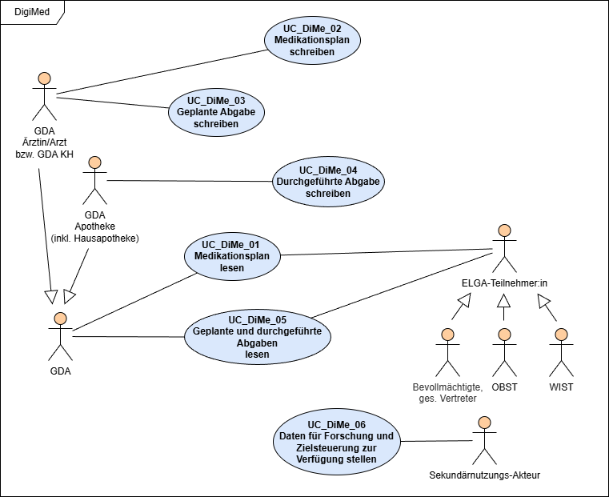

# HL7.AT.FHIR.ELGA.EMED.R4\Akteure - FHIR® v4.0.1

* [**Table of Contents**](toc.md)
* **Akteure**

## Akteure

Das Kapitel gibt einen Überblick über die zentralen Anwendungsfälle der e-Medikation und zeigt, wie die verschiedenen Akteure mit den Funktionen interagieren.

Weiters werden in einer Tabelle alle ELGA Rollen angeführt, die Zugriff auf den Medikationsplan und Geplante und Durchgeführte Abgaben erhalten sollen.

### Use Case Diagramm

### Rollen und Berechtigungen

**Hinweis**: Schreiben impliziert lesenden Zugriff

