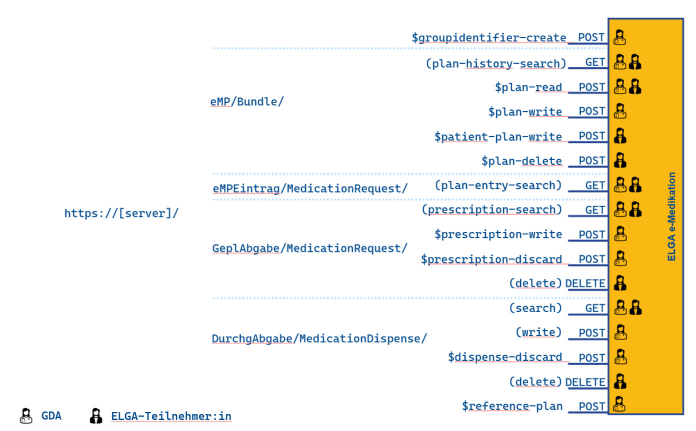

# HL7.AT.FHIR.ELGA.EMED.R4\Transaktionen - FHIR® v4.0.1

* [**Table of Contents**](toc.md)
* **Transaktionen**

## Transaktionen

Im Folgenden werden standardisierte Interaktionen für den lesenden und schreibenden Zugriff auf die e-Medikation eines Patienten bzw. einer Patientin erläutert, die für alle technischen Use Cases relevant sind.

  

### Medikationsplan

#### Plan-History-Read

Beim Plan-History-Read stellt die Fachanwendung **die aktuelle oder historische Version(en)** des Medikationsplans ([persistiertes Medikationsplan-Collection-Bundle](design_choices.md#persistiertes-medikationsplan-collection-bundle) inkl. aller referenzierten Ressourcen) **unverändert** bereit.

##### Ablauf

1. Der GDA führt ein**GET**auf das[persistierte Medikationsplan-Collection-Bundle](design_choices.md#persistiertes-medikationsplan-collection-bundle)aus, das den Medikationsplan mit allen zugehörigen relevanten Ressourcen enthält.
1. Die Fachanwendung prüft, ob ein Medikationsplan für den/die Patient:in existiert.
1. Ist**kein Medikationsplan vorhanden**, wird ein**leeres Ergebnis**zurückgegeben.
1. Ist ein Medikationsplan vorhanden, wird das zuletzt[persistierte Medikationsplan-Collection-Bundle](design_choices.md#persistiertes-medikationsplan-collection-bundle)zurückgeliefert.
Das**Collection Bundle**enthält:

* die List-Ressource des Medikationsplans 

* alle referenzierten Ressourcen (z. B. MedicationRequest, Patient, Practitioner) vollständig (inline)

Beim Plan-History-Read erfolgt **keine Veränderung** von Flags, Status oder Inhalten durch die Fachanwendung.
 Der Zugriff dient ausschließlich der Anzeige bzw. Informationsabfrage von aktuellen bzw. historischen Planversionen.

##### Sequenzdiagramm Plan-History-Read

**Beispiele für Zugriffe mittels Suchparameter:**

* **Aktuelle Planversion** mit dem Suchparameter Patient abrufen: GET [base]/Bundle?type=collection&_count=1&_sort=-timestamp&list.subject={bPK-GH}
* **Alle Planversionen** mit dem Suchparameter Patient abrufen: GET [base]/Bundle?type=collection&_sort=-timestamp&list.subject={bPK-GH}
* Abfrage aller **historischen Medikationsplan-Versionen** eines Patienten, die nach dem angegebenen Datum gespeichert wurden und Plan-Einträge enthalten, die als **storniert, beendet oder abgesetzt** gekennzeichnet sind: GET [base]/Bundle?type=collection&_sort=-timestamp&timestamp=ge2025-01-01&list.subject={bPK-GH}&list.entry.flag=removed

#### Plan-Read

Plan-Read dient dem **Abruf des Medikationsplans und der Vorbereitung einer nachfolgenden Änderung**.

##### Ablauf

1. Der GDA führt ein POST[$plan-read](OperationDefinition-AtEmed.List.Planread.md)auf das Collection Bundle aus, das den Medikationsplan mit allen zugehörigen relevanten Ressourcen enthält.
1. Die Fachanwendung prüft, ob ein Medikationsplan für den/die Patient:in existiert.
1. Ist**kein Medikationsplan vorhanden**, wird dieser erstellt (siehe[Sub_UC_06_01 - Initial erstellter Medikationsplan](Sub_UC_eMed_06.md#sub_uc_06_01---initial-erstellter-medikationsplan)) und
1. ein leerer Medikationsplan mit dem emptyReason**notstarted**wird zurückgeliefert.
1. Existiert bereits ein Medikationsplan (d.h. es wurde bereits ein[Medikationsplan-Collection-Bundle persistiert](design_choices.md#persistiertes-medikationsplan-collection-bundle)), wird von der Fachanwendung aus diesem ein[Collection Bundle zur Auslieferung](design_choices.md#auslieferungs-medikationsplan-collection-bundle)bereitgestellt. Die Inhalte werden von der Fachanwendung wie folgt aufbereitet:

* Falls der vorherige GDA neue Medikationsplaneinträge hinzugefügt oder bestehende geändert hat (List.entry.flag haben den Wert **new** oder **changed**), werden diese auf **unchanged** gesetzt.

* Falls der vorherige GDA Medikationsplaneinträge beendet hat (deren List.entry.flag haben den Wert **removed**), werden diese Einträge aus der Liste **entfernt**.

* Falls der vorherige GDA **alle vorhandenen Einträge** mit removed gekennzeichnet hat, wird List.emptyReason mit **nilknown** zurückgeliefert, um nachfolgenden GDA zu signalisieren, dass der Patient zum Zeitpunkt des letzten Schreibens keine Medikamente eingenommen hat bzw. einnehmen sollte.

* Einträge mit abgelaufenem Behandlungszeitraum bleiben erhalten.
 

1. Die Fachanwendung liefert das[Auslieferungs-Medikationsplan-Collection-Bundle](design_choices.md#auslieferungs-medikationsplan-collection-bundle)an den GDA:

* inkl. ETag für [Optimistic Locking](https://hl7.org/fhir/http.html#concurrency)
* inkl. List und aller referenzierten Ressourcen (inline)

* Ziel ist ein neutraler, weiterbearbeitbarer Zustand für den abrufenden GDA

1. Der GDA bearbeitet den Medikationsplan (er fügt Einträge hinzu, ändert bestehende oder entfernt diese).

##### Custom Operations

[$plan-read](OperationDefinition-AtEmed.List.Planread.md)

##### Sequenzdiagramm Plan-Read

#### Plan-Write

Plan-Write ist eine eigenständige Operation, die ausschließlich im Kontext eines **zuvor ausgeführten** [Plan-Read](interactions.md#plan-read) erfolgen darf.

##### Ablauf

1. Der GDA übermittelt via POST[$plan-write](OperationDefinition-AtEmed.List.Write.md)den aktualisierten Medikationsplan als[Medikationsplan-Transaction-Bundle](design_choices.md#medikationsplan-transaction-bundle-atemedbundlemedikationsplantx-transaction-bundle)inkl. ETag für[Optimistic Locking](https://hl7.org/fhir/http.html#concurrency):
* alle **neuen und geänderten und zu entfernenden Ressourcen** sind **inline** im Bundle enthalten,
* alle unveränderten Ressourcen werden nur referenziert.

1. Die Fachanwendung prüft, ob der im Header übermittelte**ETag**mit dem ETag der Fachanwendung**übereinstimmt**(d.h. es wurde zwischenzeitlich kein Medikationsplan gespeichert).
1. Stimmt der ETag nicht überein, lehnt die Fachanwendung das Speichern des Medikationsplans ab. Es muss erneut ein[Plan-Read](interactions.md#plan-read)ausgeführt werden und die Aktualisierungen übernommen werden bzw. Fehler behoben werden, bevor ein neuerlicher Speicherversuch vorgenommen werden kann.
1. Wenn kein Fehler auftritt, validiert die Fachanwendung den neuen Plan und stellt sicher, dass keine unzulässigen Zustandsübergänge vorgenommen wurden.
1. Bei erfolgreicher Prüfung:
* werden die übermittelten Änderungen in die Ressourcen übernommen.
* Auf Basis der aktualisierten Ressourcen erstellt die Fachanwendung ein neues [Medikationsplan-Collection-Bundle](design_choices.md#persistiertes-medikationsplan-collection-bundle), das als **neuer Medikationsplan persistiert** wird.

1. Der GDA erhält eine Meldung, dass der Medikationsplan erfolgreich aktualisiert wurde.

##### Custom Operations

[$plan-write](OperationDefinition-AtEmed.List.Write.md)

##### Sequenzdiagramm Plan-Write

##### Diagramm Plan-Read- und Write-Logik

 

##### Abgelehntes Plan-Write

##### Ablauf

1. **GDA 1**möchte den Medikationsplan seiner Patientin bearbeiten und führt ein POST[$plan-read](OperationDefinition-AtEmed.List.Planread.md)auf das Collection Bundle des Medikationsplans aus.
1. Die Fachanwendung erstellt ein**Auslieferungs-Medikationsplan-Collection-Bundle**(siehe[Plan-Read](interactions.md#plan-read)) inkl. ETag "123" und liefert es an den GDA 1. GDA 1 bearbeitet den Medikationsplan.
1. **GDA 2**führt ein POST[$plan-read](OperationDefinition-AtEmed.List.Planread.md)auf den Medikationsplan aus, während GDA 1 das von der Fachanwendung übermittelte Collection Bundle bearbeitet.
1. Die Fachanwendung erstellt ein**Auslieferungs-Medikationsplan-Collection-Bundle**(siehe[Plan-Read](interactions.md#plan-read)) inkl. ETag "123" und liefert es an den GDA 2. GDA 2**bearbeitet zeitgleich**mit GDA 1 den Medikationsplan.
1. **GDA 2 sendet zuerst**mittels POST[$plan-write](OperationDefinition-AtEmed.List.Write.md)ein[Medikationsplan-Transaction-Bundle](design_choices.md#medikationsplan-transaction-bundle-atemedbundlemedikationsplantx-transaction-bundle)mit dem aktualisierten Medikationsplan und übermittelt den ETag "123".
1. Die Fachanwendung prüft, ob der im Header übermittelte**ETag**mit dem ETag der Fachanwendung**übereinstimmt**. Beide haben den Wert "123", der**neue Medikationsplan**wird**persistiert**.
1. GDA 2 erhält eine Meldung, dass der Medikationsplan erfolgreich aktualisiert wurde.
1. GDA 1 sendet mittels POST[$plan-write](OperationDefinition-AtEmed.List.Write.md)ein[Medikationsplan-Transaction-Bundle](design_choices.md#medikationsplan-transaction-bundle-atemedbundlemedikationsplantx-transaction-bundle)mit dem aktualisierten Medikationsplan und übermittelt den ETag "123".
1. Die Prüfung auf Übereinstimmung der ETags von GDA 1 mit dem der Fachanwendung schlägt fehl, da dieser ETag bereits zum Schreiben verwendet wurde. Die Fachanwendung**lehnt das Speichern ab**.
1. GDA 1 erhält eine**Fehlermeldung**und muss ein erneutes Plan-Read ausführen, welches das Generieren eines neuen**Auslieferungs-Medikationsplan-Collection-Bundle**auslöst und mit dem aktuellen ETag übermittelt wird.

##### Sequenzdiagramm Abgelehntes Plan-Write

#### Groupidentifier-Create

siehe "Ablauf - Bezug e-Med GroupIdentifier".

#### Prescription-Search

In Arbeit.

