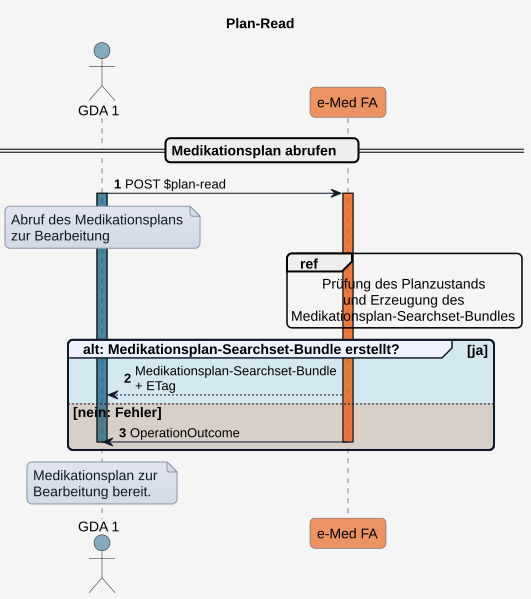
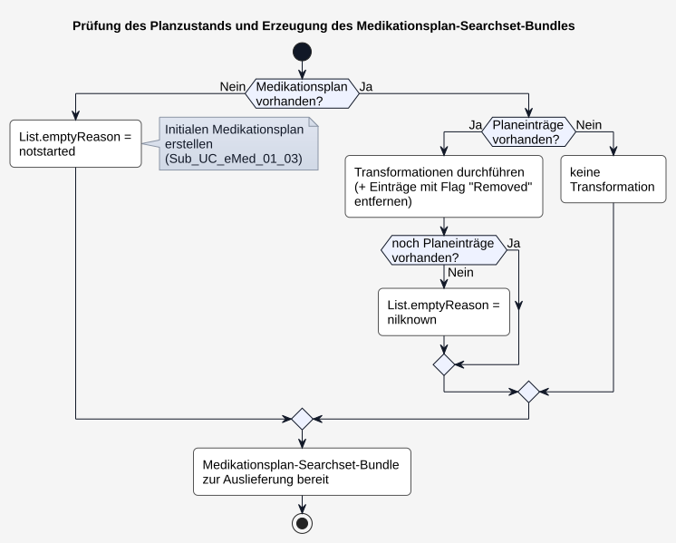
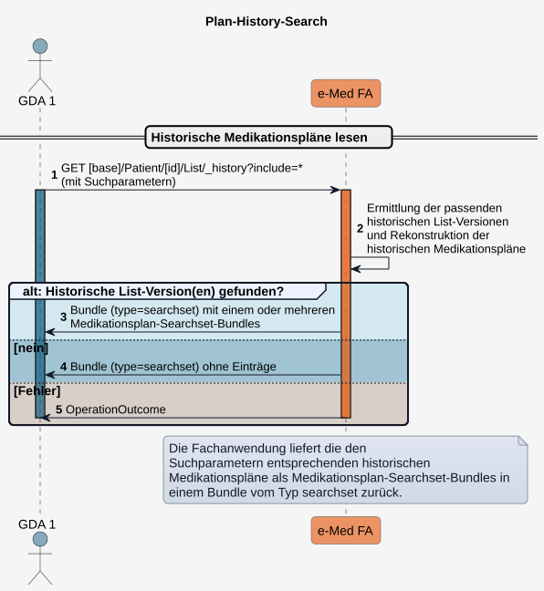
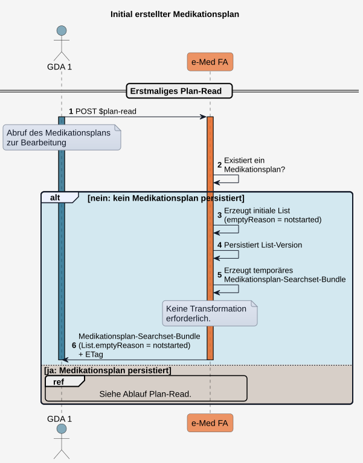
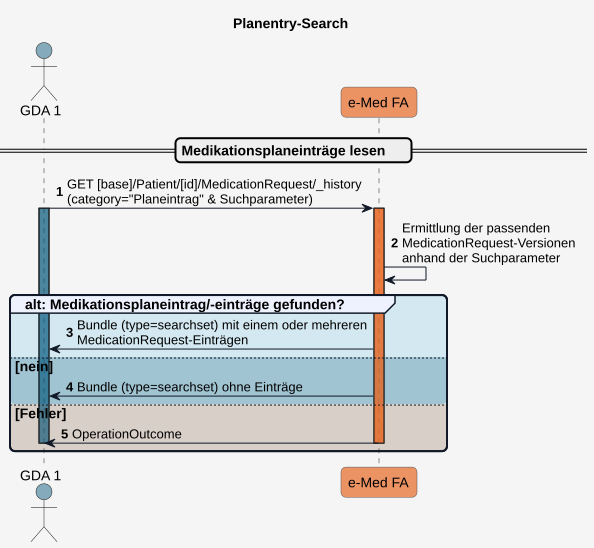

# HL7.AT.FHIR.ELGA.EMED.R4\​Technische Use Cases für Medikationsplan lesen (UC_eMed_01) - FHIR® v4.0.1

* [**Table of Contents**](toc.md)
* [**Overview Use Case**](overview_use_case.md)
* **​Technische Use Cases für Medikationsplan lesen (UC_eMed_01)**

## ​Technische Use Cases für Medikationsplan lesen (UC_eMed_01)

Ein [berechtigter GDA](actors.md#rollen-und-berechtigungen) kann den Medikationsplan von ELGA-Teilnehmer:innen lesen.

Ein ELGA-Teilnehmer kann seinen Medikationsplan über das Zugangsportal einsehen.

Die fachlichen Anforderungen werden im [UC_eMed_01 Medikationsplan lesen](Sub_UC_eMed_01.hml) beschrieben.

Für den lesenden Zugriff auf Medikationspläne werden zwei Zugriffsarten unterschieden:

* [Plan-Read](Sub_UC_eMed_01.md#sub_uc_emed_01_01---aktuellen-medikationsplan-lesen-plan-read) zum Abruf des aktuellen Medikationsplans, der für eine mögliche Bearbeitung aufbereitet ist.
* [Plan-History-Search](Sub_UC_eMed_01.md#sub_uc_emed_01_02---historische-medikationsplanversion-lesen-plan-history-search) zum Abruf historischer Versionen des Medikationsplans.

Sowohl berechtigte GDA als auch ELGA-Teilnehmer können auf einzelne Planeinträge lesend zugreifen und diese durchsuchen ([Planentry-Search](Sub_UC_eMed_01.md#sub_uc_emed_01_04---medikationsplaneinträge-lesen-planentry-search)).

#### Sub_UC_eMed_01_01 - Aktuellen Medikationsplan lesen (Plan-Read)

Plan-Read dient dem **Abruf des Medikationsplans** in einem für die Bearbeitung durch den GDA **aufbereiteten Zustand**.

Hierfür erzeugt die Fachanwendung aus der aktuellen Version der [List](StructureDefinition-at-elga-emed-list-medikationsplan.md)-Ressource sowie den von ihr referenzierten Ressourcen ein temporäres [Medikationsplan-Searchset-Bundle](StructureDefinition-at-elga-emed-bundle-medikationsplan.md) zur Auslieferung. Der Abruf erfolgt über die Custom Operation [$plan-read](OperationDefinition-AtElgaEmed.List.Planread.md).

##### Custom Operation

POST [$plan-read](OperationDefinition-AtElgaEmed.List.Planread.md)

##### Ablauf

1. Der Client führt ein**POST**[$plan-read](OperationDefinition-AtElgaEmed.List.Planread.md)aus.
1. Die Fachanwendung prüft den Zustand des Medikationsplans und erzeugt daraus ein Medikationsplan-Searchset-Bundle zur Auslieferung (siehe[Prüfung des Planzustands und Erzeugung des Medikationsplan-Searchset-Bundles](Sub_UC_eMed_01.md#prüfung-des-planzustands-und-erzeugung-des-Medikationsplan-Searchset-Bundles)).
1. Die Fachanwendung liefert das Medikationsplan-Searchset-Bundle zurück. Dieses enthält:
* die [List](StructureDefinition-at-elga-emed-list-medikationsplan.md)-Ressource,
* sämtliche von der **List** referenzierten Ressourcen sowie
* im HTTP-Header den **ETag** der aktuellen Version der **List**-Ressource für das [Optimistic Locking](https://hl7.org/fhir/http.html#concurrency).

Nachfolgend kann der Medikationsplan vom GDA bearbeitet und mittels [Plan-Write](Sub_UC_eMed_02.md#sub_uc_emed_02_01---medikationsplan-schreiben-plan-write) gespeichert werden.

##### Sequenzdiagramm

  

 Offene Punkte:
 Fehlercodes sind noch zu definieren. 

##### Prüfung des Planzustands und Erzeugung des Medikationsplan-Searchset-Bundles

Nach Eingang eines **$plan-read** prüft die Fachanwendung den Zustand des Medikationsplans.

Abschließend erzeugt die Fachanwendung aus der aktuellen Version der **List**-Ressource und den referenzierten Ressourcenversionen das Medikationsplan-Searchset-Bundle zur Auslieferung. Die persistierten Ressourcen am Server werden durch die Anpassungen im Auslieferungs-Bundle nicht verändert.

Dabei werden folgende Fälle unterschieden:

1. **Es existiert kein Medikationsplan.**
* Es wird gemäß [Sub_UC_eMed_01_03 - Initial erstellter Medikationsplan](Sub_UC_eMed_01.md#Sub_UC_eMed_01_03---initial-erstellter-medikationsplan) ein initialer Medikationsplan erstellt (**List.emptyReason = notstarted**).

1. **Es existiert ein Medikationsplan mit Planeinträgen.**
* Neue oder geänderte Planeinträge (**List.entry.flag = new** oder **changed**) werden auf **unchanged** gesetzt (siehe [Status des List.entry.flags im Medikationsplan](workflowmanagement.md#status-des-listentryflags-im-medikationsplan)).
* Planeinträge mit **List.entry.flag = removed** werden aus dem Medikationsplan entfernt.
* Planeinträge mit abgelaufenem Behandlungszeitraum werden mit **List.entry.flag = removed** gekennzeichnet und werden mit ausgeliefert, um dem GDA die Möglichkeit zu geben, das Medikament weiterzuverodnen. Anderenfalls nimmt der GDA zur Kenntnis, dass der Planeintrag mit seinem nächsten Schreibvorgang entfernt wird.
* Sind nach der Transformation keine Planeinträge mehr vorhanden, wird **List.emptyReason = nilknown** gesetzt.

1. **Es existiert ein leerer Medikationsplan**(**List.emptyReason = notstarted**oder**nilknown**).
* Es erfolgt keine Transformation.

##### Aktivitätsdiagramm

  

#### Sub_UC_eMed_01_02 - Historische Medikationsplanversion lesen (Plan-History-Search)

Beim Plan-History-Search rekonstruiert die Fachanwendung historische Versionen des Medikationsplans aus Versionen der List-Ressource sowie den von diesen referenzierten Ressourcenversionen und liefert diese unverändert aus.

Alle diese Ressourcen sind Teil des resultierenden Searchset-Bundles.

Der Abruf erfolgt mittels **GET** auf den **List**-Ressourcen-Endpunkt unter Angabe geeigneter Suchparameter:

* **Erstellungszeitraum** von Medikationsplanversionen
* **Medikation** im Medikationsplan (PZN, Arzneimittelname oder Wirkstoff)
* **Einnahmezeitraum** einer Medikation im Medikationsplan
* **Planeintragsid ohne Version**: Abrufen aller Planversionen, die diesen Planeintrag enthalten
* **Planeintragsid mit Version**: Abrufen der Planversionen, die genau diese Planeintragsversion enthalten.
* **StatusReason eines im Plan einthaltenen Planeintrags**: Abrufen aller Planversionen, die einen Planeintrag mit statusReason = z.B. "Medikament nicht vertragen" enthalten.

Die erzeugten Medikationsplan-Searchset-Bundles dienen ausschließlich der Auslieferung und werden nicht persistiert.

 Offene Frage:
 - Ist Plan-History-Search ein GET mit _include=* oder eine Custom Operation?
 - Können bei einem GET _history beliebige Suchparameter definiert werden?
 

##### Ablauf

1. Der Client führt ein GET auf**[base]/Patient/[id]/List/_history**mit den gewünschten Suchparametern aus.
1. Die Fachanwendung ermittelt anhand der Suchparameter die passenden historischen Versionen der List-Ressource. Für jede gefundene List-Version rekonstruiert die Fachanwendung den historischen Medikationsplan, indem sie die zugehörigen historischen Versionen der referenzierten Ressourcen ermittelt, und ergänzt sie im Medikationsplan-Searchset-Bundle.
1. Die Fachanwendung liefert das Medikationsplan-Searchset-Bundle zurück.
1. Werden keine passenden historischen Medikationsplanversionen gefunden, enthält das zurückgelieferte**searchset**keine Einträge.
1. Im Fehlerfall wird ein entsprechender**OperationOutcome**zurückgegeben.

Beim Plan-History-Search erfolgt **keine Änderung** der Medikationspläne durch die Fachanwendung. Insbesondere werden keine Inhalte, Statusinformationen oder Kennzeichnungen (Flags) verändert.

Der Zugriff dient ausschließlich der Anzeige bzw. Informationsabfrage persistierter Medikationsplanversionen.

##### Sequenzdiagramm

  

###### Beispiele für Suchanfragen

In Arbeit.    

#### Sub_UC_eMed_01_03 - Initial erstellter Medikationsplan

Die initiale Erstellung eines Medikationsplans erfolgt ausschließlich durch die e-Medikation-Fachanwendung. Sie wird ausgelöst, wenn im Rahmen eines erstmaligen Aufrufs von [$plan-read](OperationDefinition-AtElgaEmed.List.PlanRead.md) noch kein Medikationsplan für den ELGA-Teilnehmer existiert.

Der dabei erzeugte initiale Medikationsplan besitzt den Wert **List.emptyReason = notstarted**. Dieser kennzeichnet ausschließlich den **Initialzustand** des Medikationsplans und bedeutet, dass bisher noch keine Medikationsplaneinträge erfasst wurden. Er trifft jedoch keine Aussage darüber, ob der Patient Medikamente einnimmt.

Die Initialisierung kann sowohl durch ein GDA-System als auch durch den ELGA-Teilnehmer über das Portal ausgelöst werden, indem erstmals ein **Plan-Read** durchgeführt wird.

 Offene Punkte:
 Soll die Erstellung durch das Berechtigungssystem beim ersten Aufruf eines Patienten getriggert werden (nicht mehr Teil von $plan-read)? 

##### Ablauf

1. Ein Client führt für einen ELGA-Teilnehmer erstmalig ein**POST**[$plan-read](OperationDefinition-AtElgaEmed.List.Planread.md)aus.
1. Die Fachanwendung prüft, ob bereits ein Medikationsplan für den Patienten existiert.
1. Existiert noch kein Medikationsplan, erstellt die Fachanwendung initial eine List-Ressource mit**emptyReason = notstarted**.
1. Die List-Ressource wird als erste Version persistiert.
1. Für das Plan-Read erzeugt die Fachanwendung daraus ein temporäres Medikationsplan-Searchset-Bundle zur Auslieferung.
1. Dieses wird mit**List.emptyReason = notstarted**sowie dem zugehörigen ETag zurückgeliefert.

##### Sequenzdiagramm

  

#### Sub_UC_eMed_01_04 - Medikationsplaneinträge lesen (Planentry-Search)

**Planentry-Search** dient der gezielten Suche nach Medikationsplaneintragsversionen eines ELGA-Teilnehmer. Als Medikationsplaneintrag gilt eine im Medikationsplan referenzierte Version einer **MedicationRequest**-Ressource mit **category = "Planeintrag"**.

Die Suche ermöglicht berechtigten GDA sowie ELGA-Teilnehmern den Zugriff auf aktuelle und historische Medikationsplaneinträge unabhängig von einer bestimmten Medikationsplanversion.

Die Historie ermöglicht die Nachverfolgung von Änderungen an Medikationsplaneinträgen, beispielsweise hinsichtlich Präparat, Dosierung oder Einnahmeanweisung.

Der Abruf erfolgt mittels **GET** unter Angabe geeigneter Suchparameter:
 

* **Medikation** (PZN, Arzneimittelname oder Wirkstoff)
* **Einnahmezeitraum**
* **Erstellungszeitpunkt**
* **Status** des Medikationsplaneintrags (z.B. **active** oder **on-hold**)
* **StatusReason**: statusReason = z.B. "Medikament nicht vertragen"
* **Historisch oder aktuell** (_history)

 Offene Frage:
 - Können bei einem GET _history beliebige Suchparameter definiert werden?
 

 Die gefundenen Medikationsplaneinträge können anschließend als Ausgangspunkt für weitere Abfragen verwendet werden, um jene Ressourcen zu ermittelnt, die genau auf diese Planeintragsversion referenzieren:

* die zugehörigen Medikationsplanversionen mittels [Plan-History-Search](Sub_UC_eMed_01.md#sub_uc_emed_01_02---historische-medikationsplanversion-lesen-plan-history-search)
* **Geplante Abgaben** (**Prescription-Search**) 
* **Durchgeführte Abgaben** (**Dispense-Search**) 

 Offene Punkte:
 - Sind die Referenzen in Geplanten und Durchgeführten Abgaben versioniert?
 

##### Ablauf

1. Der Client führt ein**GET**auf den Planentry-Search-Endpunkt mit den gewünschten Suchparametern aus (**MedicationRequest**mit**category = "Planeintrag"**).
1. Die Fachanwendung ermittelt anhand der Suchparameter die passenden Medikationsplaneinträge.
1. Die Fachanwendung liefert die Suchergebnisse als Bundle vom Typ**searchset**zurück.
1. Werden keine passenden Medikationsplaneinträge gefunden, enthält das zurückgelieferte Searchset Bundle keine Einträge.
1. Im Fehlerfall wird ein entsprechender**OperationOutcome**zurückgegeben.

##### Sequenzdiagramm

  

##### Beispiele für Suchanfragen

In Arbeit. 

#### Sub_UC_eMed_01_05 - Verzeichnis historischer Medikationspläne lesen (Plan-History-Directory-Search)

 Offene Punkte: 
$plan-history-directory-search: in Arbeit. 

