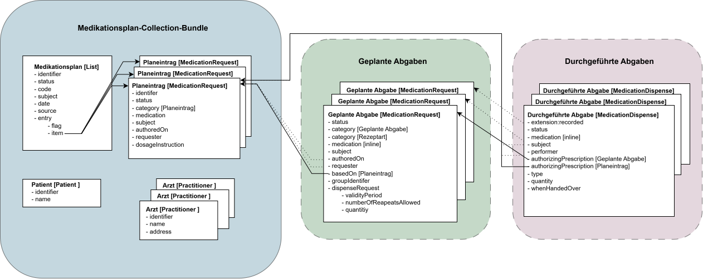

# HL7.AT.FHIR.ELGA.EMED.R4\Designentscheidungen - FHIR® v4.0.1

* [**Table of Contents**](toc.md)
* **Designentscheidungen**

## Designentscheidungen

### Übersicht

Die folgende Abbildung zeigt den Aufbau des Medikationsplans sowie das Zusammenwirken der dabei verwendeten FHIR-Ressourcen.

Zentrale Ressource ist der Medikationsplan (**List**), der die einzelnen Medikationsplaneinträge (**MedicationRequest**) referenziert. Basierend auf diesen Planeinträgen werden **Geplante Abgaben** (**MedicationRequest**) erstellt, auf deren Grundlage **Durchgeführte Abgaben** (**MedicationDispense**) dokumentiert werden können.

Die Fachanwendung persistiert ausschließlich die einzelnen FHIR-Ressourcen. Historische Zustände werden durch versionierte Ressourcen und versionierte Referenzen abgebildet. Medikationsplan-Searchset-Bundles dienen ausschließlich der Auslieferung eines Medikationsplans und werden bei Bedarf aus den entsprechenden Ressourcenversionen erzeugt.

 

### Relevante Profile

#### Medikationsplan: AtElgaEmedListMedikationsplan (List)

Der Medikationsplan eines ELGA-Teilnehmers wird durch eine **List**-Ressource abgebildet. Diese enthält 0..* Einträge (**List.entry**), wobei jeder Entry genau eine Referenz (**Reference**) auf einen Planeintrag (**MedicationRequest**) in **List.entry.item** beinhaltet.

Die Reihenfolge der Einträge kann durch den GDA festgelegt werden. Jeder Listeneintrag enthält im Element **List.entry.flag** den Änderungsstatus des jeweiligen Planeintrags (siehe [Status der List.entry.flag (Medikationsplan)](workflowmanagement.md#status-der-list-entry-flag-medikationsplan)).

Die List-Ressource bildet gemeinsam mit den referenzierten Ressourcenversionen die Grundlage für den Aufbau des aktuellen bzw. eines historischen Medikationsplans.

#### Medikationsplaneintrag bzw. Planeintrag: AtElgaEmedMedicationRequestPlaneintrag (MedicationRequest)

Ein Planeintrag im Medikationsplan wird durch eine **MedicationRequest**-Ressource der Kategorie "Planeintrag" abgebildet. Die Ressource enthält genau ein Medikament mit der zugehörigen Dosierung, wobei das Medikament verpflichtend in einer contained **Medication**-Ressource innerhalb des MedicationRequests dokumentiert wird. Der Planeintrag kann in weiterer Folge als Grundlage für die Erstellung einer **Geplanten Abgabe** dienen.

Der aktuelle Status eines Planeintrags wird im **status**-Element dokumentiert (siehe [Status des MedicationRequests im Planeintrag](workflowmanagement.md#status-des-medicationrequests-im-medikationsplaneintrag)).

Abhängig vom List.entry.flag kann der Planeintrag nur bestimmte Statuswerte annehmen (siehe [Konsistenzregeln zwischen List.entry.flags und MedicationRequest-Status](workflowmanagement.md#konsistenzregeln-zwischen-listentryflags-und-medicationrequest-status)).

#### Medikationsplan-Searchset-Bundle: AtElgaEmedBundleMedikationsplan (Medikationsplan-Searchset-Bundle)

Das Medikationsplan-Searchset-Bundle dient ausschließlich der Auslieferung eines Medikationsplans. Es wird von der Fachanwendung bei Bedarf aus einer List-Ressource sowie den von dieser referenzierten Ressourcenversionen erzeugt und **nicht persistiert**.

