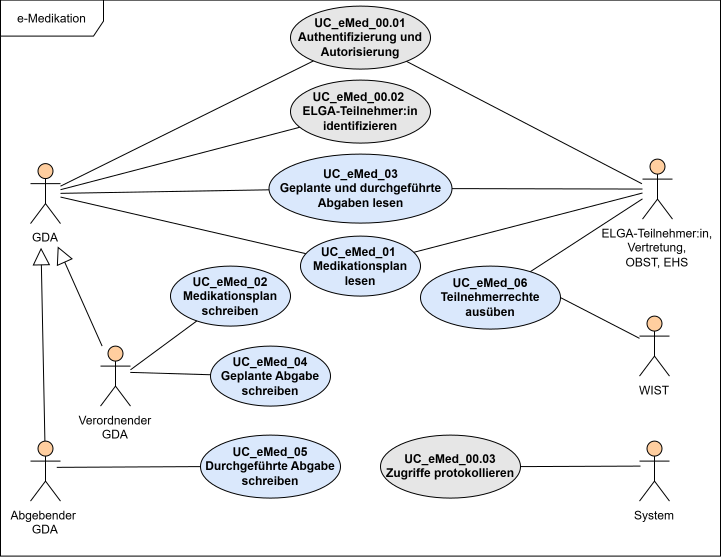

# HL7.AT.FHIR.ELGA.EMED.R4\Use Cases - FHIR® v4.0.1

* [**Table of Contents**](toc.md)
* [**Overview Use Case**](overview_use_case.md)
* **Use Cases**

## Use Cases

### Fachliche Use Cases

Die fachlichen Use Cases sind hier nachzulesen: Link zu ergänzen. 

#### Use Case Diagramm

Das foglende Use Case Diagramm zeigt die zentralen Anwendungsfälle der e-Medikation und die Interaktion der verschiedenen Akteure. 

### Technische Use Cases

In den folgenden Kapiteln werden die fachlichen Anwendungsfälle der e-Medikation als technische Use Cases beschrieben. Die zugehörigen Sequenzdiagramme veranschaulichen die Interaktionen und Abläufe zwischen den beteiligten Akteuren.

Die Kapitel **Relevante Elemente** geben einen Überblick über die für den betreffenden Use Case wesentlichen Elemente der verwendeten FHIR-Profile. Sie dienen als kompakte Orientierung und beschreiben die erforderlichen Anpassungen und Befüllungen der Ressourcen im jeweiligen Anwendungskontext.

#### Übersicht

* [Technische Usecases zu Medikationsplan lesen (UC_eMed_01)](Sub_UC_eMed_01.md)
* [Technische Usecases zu Medikationsplan schreiben (UC_eMed_02)](Sub_UC_eMed_02.md)
* [Technische Usecases zu Geplante und Durchgeführte Abgaben lesen (UC_eMed_03)](Sub_UC_eMed_03.md)
* [Technische Usecases zu Geplante Abgabe schreiben (UC_eMed_04)](Sub_UC_eMed_04.md)
* [Technische Usecases zu Durchgeführte Abgabe schreiben (UC_eMed_05)](Sub_UC_eMed_05.md)

