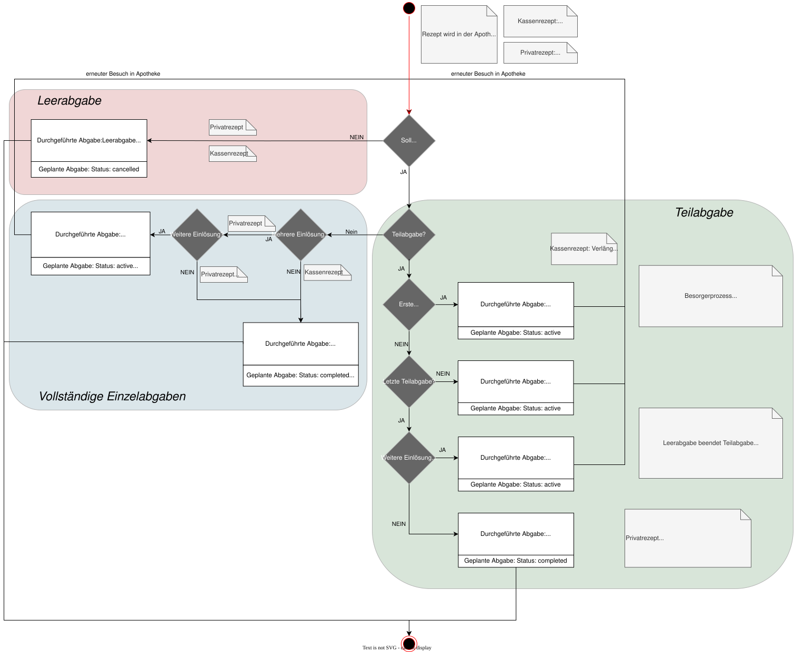

# HL7.AT.FHIR.ELGA.EMED.R4\Workflowmanagement - FHIR® v4.0.1

* [**Table of Contents**](toc.md)
* **Workflowmanagement**

## Workflowmanagement

### Überblick der Statusänderungen der e-Medikation Ressourcen

#### Status des List.entry.flags im Medikationsplan

Ein **Medikationsplaneintrag** kann, abhängig vom jeweiligen ([Use Case für Medikationsplan schreiben](Sub_UC_eMed_06.md#%E2%80%8Btechnische-use-cases-für-medikationsplan-schreiben-uc_emed_06)), unterschiedliche Status einnehmen. Dieser Status wird sowohl in der MedicationRequest-Ressource selbst als auch auf List-Ebene im Element List.entry.flag dokumentiert.

Das **flag**-Element eines Entries der List-Ressource beschreibt die **Art der Änderung eines Mediaktionsplaneintrags auf Listenebene** und kann folgende Status einnehmen: 

| | |
| :--- | :--- |
| **New** | Neuer Planeintrag wird der Liste hinzugefügt |
| **Unchanged** | Bestehender Planeintrag wird beibehalten/zur Kenntnis genommen |
| **Changed** | Bestehender Planeintrag wird geändert |
| **Removed** | Bestehender Planeintrag wird entfernt |

#### Auswirkung der Zugriffsart auf List.entry.flags und Bundle-Inhalte

Je nach Zugriffsart (Plan-History-Read, Plan-Read oder Write) ergeben sich unterschiedliche Auswirkungen auf die Verarbeitung dieser Status sowie auf die enthaltenen Ressourcen in den jeweiligen Bundles (siehe [Transaktionen](interactions.md)). 
 

| | | | |
| :--- | :--- | :--- | :--- |
| **new** | - List-Entries, die vom Vorgänger-GDA mit**new**geflaggt wurden, bleiben beim Plan-History-Read**unverändert**.- Die neuen MedicationRequests sind im Collection Bundle enthalten. | - List-Entries, die vom Vorgänger-GDA mit**new**geflaggt wurden, werden beim Plan-Read von der**Fachanwendung**als**unchanged**geflaggt.- Die betreffenden MedicationRequests sind im Collection Bundle enthalten. | - List-Entries, die beim schreibenden Zugriff vom aktuellen GDA mit**new**geflaggt wurden, werden dem Medikationsplan neu hinzugefügt.- Die betreffenden MedicationRequests müssen im Transaction Bundle**enthalten**sein. |
| **unchanged** | - List-Entries, die vom Vorgänger-GDA mit**unchanged**geflaggt wurden, bleiben beim Plan-History-Read**unverändert**.- Die unveränderten MedicationRequests sind im Collection Bundle enthalten. | - List-Entries, die vom Vorgänger-GDA als**unchanged**geflaggt wurden, bleiben beim Plan-Read von der Fachanwendung unverändert.- Die betreffenden MedicationRequests sind im Collection Bundle enthalten. | - List-Entries, die vom aktuellen GDA nicht verändert wurden, bleiben beim schreibenden Zugriff mit**unchanged**geflaggt. Sie gelten somit als zur Kenntnis genommen.- Die betreffenden MedicationRequests sind nicht im Transaction Bundle enthalten, sondern werden in der Liste**nur referenziert**. |
| **changed** | - List-Entries, die vom Vorgänger-GDA mit**changed**geflaggt wurden, bleiben beim Plan-History-Read**unverändert**.- Die geänderten MedicationRequests sind im Collection Bundle enthalten. | - List-Entries, die vom Vorgänger-GDA mit**changed**geflaggt wurden, werden beim Plan-Read von der**Fachanwendung**als**unchanged**geflaggt.- Die betreffenden MedicationRequests sind im Collection Bundle enthalten. | - List-Entries, die vom aktuellen GDA mit**changed**geflaggt werden, wurden geändert.- Die betreffenden MedicationRequests müssen im Transaction Bundle**enthalten**sein. |
| **removed** | - List-Entries, die vom Vorgänger-GDA mit**removed**geflaggt wurden, bleiben beim Plan-History-Read**unverändert**.- Die zum Entfernen markierten MedicationRequests sind im Collection Bundle enthalten. | - List-Entries, die vom Vorgänger-GDA mit**removed**geflaggt wurden, werden beim Plan-Read von der**Fachanwendung entfernt**.- Die betreffenden MedicationRequests sind im Collection Bundle**nicht enthalten**. | - List-Entries, die beim schreibenden Zugriff vom aktuellen GDA mit**removed**geflaggt wurden, sollen aus dem Medikationsplan entfernt werden.- Die betreffenden MedicationRequests werden u.a. mit dem entsprechenden Status geflaggt und müssen im Transaction Bundle**enthalten**sein. |

#### Status des MedicationRequests im Medikationsplaneintrag

Das **status**-Element der MedicationRequest-Ressource beschreibt den **aktuellen Zustand eines Medikationsplaneintrags**.

Im Kontext des Medikationsplans kann dieses Element folgende Statuswerte annehmen: 

| | |
| :--- | :--- |
| **active** | Planeintrag dokumentiert aktive Therapie: Medikation soll aktuell vom Patienten eingenommen werden |
| **on-hold** | Planeintrag ist pausiert: Therapie wurde vorübergehend unterbrochen, Wiederaufnahme ist vorgesehen |
| **completed** | Die im Planeintrag beschriebenen Maßnahmen wurden wie geplant durchgeführt. Der Planeintrag wird damit abgeschlossen. |
| **stopped** | Die im Planeintrag beschriebenen Maßnahmen werden dauerhaft gestoppt, bevor alle geplanten Einnahmen oder Verabreichungen durchgeführt wurden. Der Planeintrag wird damit abgeschlossen. |
| **entered-in-error** | Planeintrag ist storniert: Kennzeichnung eines fehlerhaften Planeintrages. Der Planeintrag wird damit abgeschlossen. |

##### Konsistenzregeln zwischen List.entry.flags und MedicationRequest-Status

Da der Status eines Medikationsplaneintrags im Medikationsplan auf **zwei Ebenen** geführt wird (List.entry.flag und MedicationRequest.status), müssen diese beiden Ebenen zur Sicherstellung einer konsistenten Verarbeitung inhaltlich aufeinander abgestimmt sein. Die folgende Tabelle beschreibt die geltenden Konsistenzregeln zwischen List.entry.flag und MedicationRequest.status in Abhängigkeit vom jeweiligen Use Case: 

| | | | |
| :--- | :--- | :--- | :--- |
| Neuen Planeintrag zum Medikationsplan hinzufügen | new | active | Neuer Planeintrag wird erstellt und ist aktiv- der Behandlungszeitraum kann in der Zukunft liegen |
| new | on-hold | Neuer Planeintrag wird erstellt, wird aber pausiert | |
| Bestehenden Planeintrag im Medikationsplan beibehalten/zur Kenntnis nehmen | unchanged | active | Bestehender Planeintrag bleibt unverändert- der Behandlungszeitraum darf noch nicht abgelaufen sein |
| unchanged | on-hold | Bestehender Planeintrag bleibt unverändert pausiert- der Behandlungszeitraum darf noch nicht abgelaufen sein | |
| Bestehenden Planeintrag im Medikationsplan ändern | changed | active | Bestehender Planeintrag wird geändert |
| changed | on-hold | Bestehender Planeintrag wird geändert und pausiert | |
| Bestehenden Planeintrag aus Medikationsplan entfernen | removed | completed | Bestehender Planeintrag wird beendet. Die Therapie wurde wie geplant durchgeführt und ist abgeschlossen. |
| removed | stopped | Bestehender Planeintrag wird vor Ablauf des Behandlungszeitraums dauerhaft gestoppt. Die Medikation wurde, bevor alle geplanten Einnahmen oder Verabreichungen durchgeführt wurden, abgesetzt. | |
| removed | entered-in-error | Bestehender Planeintrag wird aufgrund eines Fehlers storniert | |

#### Status des MedicationRequests in der geplanten Abgabe

Eine [Geplante Abgabe](design_choices.md#geplante-abgabe-atelgaemedmedicationrequestgeplanteabgabe-medicationrequest) kann, abhängig vom jeweiligen ([Use Case für Geplante Abgabe schreiben](Sub_UC_eMed_08.md#%E2%80%8Btechnische-use-cases-für-geplante-abgabe-schreiben-uc_emed_08)), unterschiedliche Status einnehmen (Element **status**):

| | |
| :--- | :--- |
| **active** | **Geplante Abgabe****offen**: Status beim Erstellen einer Geplanten Abgabe, solange noch (Teil-)Abgaben offen sind (dh. Rezept kann noch eingelöst werden) |
| **completed** | **Geplante Abgabe****eingelöst**: Der Status wird durch die Fachwendung**automatisch**gesetzt, wenn alle möglichen Einlösungen durchgeführt wurden. Sonderfall: Sollte im Anschluss eine**Durchgeführte Abgabe**den Status**entered-in-error**erhalten, setzt die Fachanwendung gegebenfalls die**Geplante Abgabe**automatisch wieder auf**active**. |
| **stopped** | **Geplante Abgabe**ist**abgelaufen**, d.h. der Einlösezeitraum für die ausgewählte Rezeptart (**category:recipetype**) ist überschritten; der Status wird**automatisch durch die Fachanwendung**gesetzt. Die**Geplante Abgabe**ist damit abgeschlossen. |
| **entered-in-error** | **Geplante Abgabe**wird aufgrund eines Fehlers verworfen. Es wurden noch**keine Abgaben durchgeführt**. Die**Geplante Abgabe**wird damit abgeschlossen. |
| **cancelled** | **Geplante Abgabe**erhält automatisch den Status**cancelled**("nicht abgegeben"), wenn alle Durchgeführten Abgaben (jede Einlösung) den Status**cancelled**erhalten haben ("Leerabgabe"). Wird eine gecancelte Abgabe verworfen, wird die**Geplante Abgabe**automatisch wieder aktiviert. |

#### Gültigkeit von Geplanten Abgaben basierend auf der Rezeptart

| | | | | |
| :--- | :--- | :--- | :--- | :--- |
| Kassenrezept | 1 Monat ab Datum der Verordnung: Beginn des Gültigkeitszeitraums + 1 Monat + 1 Tag | 1× (kann nur in 1 Apotheke eingelöst werden) | Im Zuge des "Besorgerprozesses" (Medikament muss erst bestellt werden) wird bei einer gespeicherten Teilabgabe die gesamte Gültigkeitsdauer auf 3 Monate verlängert. | Ein Kassenrezept muss innerhalb von 1 Monat eingelöst werden, sonst erhält das Rezept den Status "abgelaufen" (**stopped**). |
| Privatrezept | 1 Monat ab Datum der Verordnung für die erste Einlösung; mindestens: Beginn des Gültigkeitszeitraums + 1 Monat + 1 Tag; maximal: Beginn des Gültigkeitszeitraums + 1 Jahr (+ 1 Tag?) | Bis zu 6× (durch den Verordner festgelegt); kann in mehreren Apotheken eingelöst werden (je nach Anzahl der Einlösemöglichkeiten) | Keine Verlängerung möglich. | Ein Privatrezept muss innerhalb von 1 Monat eingelöst werden, sonst erhält es den Status (**stopped**). |
| Substitutionsrezept | Angabe eines beliebigen Gültigkeitszeitraums durch den Verordner; Datum frei wählbar, aber später als das Beginndatum | 1× | Keine Verlängerung möglich. | Ein Substitutionsrezept erhält den Status (**stopped**), wenn das "Bis-Datum" erreicht ist. |

[^1] Die Anzahl der Einlösungen gibt an, wie viele Einlösungen auf ein Rezept durchgeführt werden dürfen bis die Verordnung auf dem Rezept und das Rezept den Status eingelöst(**completed**) erhält.
 [^2] Das Einlösen eines Rezepts nach Ablauf der Gültigkeit wird durch e-Medikation nicht verhindert. Die Abgabe wird in diesem Fall ohne Verordnungsbezug in e-Medikation gespeichert. Wird die Gültigkeitsdauer nicht angegeben, kann die Gültigkeitsdauer vom empfangenden System nur mit 1 Monat angenommen werden, gerechnet vom Erstellungsdatum an. 

#### Status des MedicationDispense in der Durchgeführten Abgabe

Eine [Durchgeführte Abgabe](design_choices.md#durchgeführte-abgabe-AtElgaEmedMedicationDispenseDurchgefuehrteAbgabe-medicationdispense) kann, abhängig vom jeweiligen [Use Case für Durchgeführte Abgabe schreiben](Sub_UC_eMed_09.md), unterschiedliche Status einnehmen (Element **status**).

| | |
| :--- | :--- |
| **completed** | Einzel- oder Teilabgabe wurde durchgeführt |
| **cancelled** | **Durchgeführte Abgabe**gecancelt: Der Patient benötigt die Medikation einer geplanten Abgabe nicht (z.B. Medikation "abgesetzt" oder Medikation noch ausreichend vorhanden) |
| **entered-in-error** | Vorhandene**Durchgeführte Abgabe**(im Status**completed**oder**cancelled**) wird aufgrund eines Fehlers verworfen (eine mögliche beendete**Geplante Abgabe**, wird dadurch wieder**aktiv**) |

#### Abhängigkeiten der Geplanten Abgabe und der Durchgeführten Abgaben

| | | | | | | | | | |
| :--- | :--- | :--- | :--- | :--- | :--- | :--- | :--- | :--- | :--- |
| **Geplante Abgabe**basierend auf Planeintrag erfassen | active | Planeintrag bleibt active, unabhängig von Status der gepanten Abgabe (*) | active | OFFEN | z.B. 6 Einlösungen bei Privatrezept |   |   | noch keine bzw. noch nicht alle mögl. Einlösungen erfolgt (mit Status completed) |   |
| **Geplante Abgabe**beenden (durch Fachanwendung) | active | Planeintrag bleibt active, unabhängig von Status der gepanten Abgabe (*) | completed | EINGELÖST | auf Basis der Durchgeführten Abgaben automatisch gesetzt durch Fachanwendung; dh. Alle möglichen Einlösungen sind abgechlossen (entweder completed oder cancelled) | completed | ABGEGEBEN | alle möglichen Einlösungen erfolgt | **Durchgeführte Abgabe**erfassen |
| **Geplante Abgabe**verwerfen | active | Planeintrag bleibt active, unabhängig von Status der gepanten Abgabe (*) | entered-in-error | STORNIERT | bei fehlerhafter Eingabe, wenn noch keine Abgabe durchgeführt |   |   | keine Durchgeführten Abgaben vorhanden |   |
| **Geplante Abgabe**abgelaufen (durch Fachanwendung) | active | Planeintrag bleibt active, unabhängig von Status der gepanten Abgabe (*) | stopped | ABGELAUFEN | automatisch erkannt durch Fachanwendung | kein relevanter Status | kein relevanter Status | noch keine bzw. noch nicht alle mögl. Einlösungen erfolgtZu abgelaufenen geplanten Abgaben können keine Abgaben mehr gespeichert werden. Die (nachträgliche) Speicherung von Abgaben zu einem abgelaufenen Rezept kann im Anlassfall allerdings ohne Verordnungsbezug erfolgen. |   |
| **Geplante Abgabe**nicht abgegeben (durch Fachanwendung) | active | Planeintrag bleibt active, unabhängig von Status der gepanten Abgabe (*) | cancelled | NICHT_ABGEGEBEN | automatisch, wenn alle Einlösungen im MedicationDispense den Status "cancelled" erhalten haben | cancelled | ABGESETZT | Apotheker dokumentiert in der Durchgeführten Abgabe, dass der Patient das Medikament in der geplanten Abgabe nicht einnimmt (mit Packungen 0) (entspricht der Leerabgabe).Kann wieder rückgängig gemacht werden (durch Storno) | **Durchgeführten Abgabe**abgesetzt |
|   |   |   |   |   |   | entered-in-error | STORNIERT | bei fehlerhafter Eingabe | **Durchgeführte Abgabe**verwerfen |

(*) solange ein evtl. Behandlungszeitraum nicht überschritten

#### Varianten der (Teil-)Abgabe

Im Element **MedicationDispense.type** einer Durchgeführten Abgabe wird die Art der Abgabe dokumentiert, welche von der [Rezeptart](workflowmanagement.md#gültigkeit-von-geplanten-abgaben-basierend-auf-der-rezeptart) (Anzahl Einlösungen) und vom Use Case abhängt.

 

| | | | | |
| :--- | :--- | :--- | :--- | :--- |
| Einzelabgabe (einmalige Einlösemöglichkeit) | completed | Sofern**Geplante Abgabe**vorhanden, wird diese nach erfolgter Abgabe automatisch auf**completed**gesetzt. | type: FFC (First Fill - Complete)quantity:  x Packungenstatus: „completed“ | Abgabe abgeschlossen |
| Vollständige Einzelabgabe (bei mehrmaliger Einlösemöglichkeit) | activewenn letzte Einlösung abgeschlossen: completed | **Geplante Abgabe**bleibt nach erfolgter Abgabe**active**und wird erst nach der letzten möglichen Einlösung von der Fachanwendung automatisch auf**completed**gesetzt. | type: FFC (First Fill - Complete)quantity: x Packungenstatus: „completed“ | je Einlösung wird eine**Durchgeführte Abgabe**erstellt |
| 1. Teilabgabe | active | **Geplante Abgabe**bleibt**active** | type: FFP (First Fill - Part Fill)quantity: x Packungenstatus: „completed“ | Je Teilabgabe wird eine**Durchgeführte Abgabe**erstellt.**Geplante Abgabe**kann nicht mehr in einer anderen Apotheke abgegeben werden |
| Weitere Teilabgabe | active | **Geplante Abgabe**bleibt**active** | type: RFP (Refill - Part Fill)quantity: x Packungenstatus: „completed“ |   |
| Letzte Teilabgabe | completed | **Geplante Abgabe**bleibt**active**, solange weitere Einlösungen möglich. Danach setzt die Fachanwendung den Status der**Geplanten Abgabe**auf**completed**. | type:  RFC (Refill - Complete)quantity:  x Packungenstatus: „completed“ |   |
| "Besorgerprozess": Arzneimittel von Apotheke bestellt / zubereitet (ohne Abgabe) | active | **Geplante Abgabe**bleibt**active** | type: FFP (First Fill - Part Fill)quantity: 0 Packungen (wurden ausgegeben)status: „completed“ | Arzneimittel bestellt oder Magistrale Zubereitung in Vorbereitung. Geplante Abgabe kann nicht mehr in einer anderen Apotheke abgegeben werden |
| "Besorgerprozess": Arzneimittel nach Teilabgaben von Apotheke bestellt (ohne Abgabe) | active | **Geplante Abgabe**bleibt**active** | type: FFP (Refill – Part Fill)quantity: 0 Packungen (wurden  ausgegeben)status: „completed“ | Arzneimittel nach bereits erfolgter Teilabgabe bestellt oder Magistrale Zubereitung in Vorbereitung. |
| Leerabgabe beendet Einzelabgabe | cancelled | wenn alle möglichen Einlösungen mit**cancelled**gespeichert wurden, wird die zugehörige**Geplante Abgabe**automatisch auf**cancelled**gesetzt, sonst auf**completed**. | type: FFC (First Fill - Complete)quantity:  0 Packungenstatus: „cancelled“ | Das Arzneimittel einer geplanten Abgabe wird vom Patienten nicht benötigt und daher als Leerabgabe vermerkt. |
| Leerabgabe beendet Teilabgabe | completed oder cancelled | wenn alle möglichen Einlösungen mit**cancelled**gespeichert wurden, wird die zugehörige**Geplante Abgabe**automatisch auf**cancelled**gesetzt, sonst auf**completed**. | type: RFC (Refill - Complete)quantity: 0 Packungenstatus: „cancelled“ | Teilabgabe wird vom Patienten nicht benötigt und daher als Leerabgabe vermerkt. Dieser Einlösevorgang ist damit beendet. |
| Notabgabe |  - | keine**Geplante Abgabe**vorhanden | type: FFC (First Fill - Complete)quantity: x Packungenstatus: „completed“ | Das Medikament wurde ohne zugrundeliegende**Geplante Abgabe**abgegeben.Es wird kein Rezept nachgereicht |
| Rezept wird nachgebracht |  - | keine**Geplante Abgabe**vorhanden | type: FFC (First Fill - Complete)quantity: x Packungenstatus: „completed“ | Medikament wurde abgegeben, das formale Rezept wird später nachgereicht. Planeintrag kann nacherfasst werden. |
| OTC Abgabe (rezeptfrei) |  - | keine**Geplante Abgabe**vorhanden | type: FFC (First Fill - Complete)quantity: x Packungenstatus: „completed“ | Rezeptfreies MedA52:E57ikament wurde abgegeben. Ein Planeintrag für Wechselwirkungsrelevante Medikatmente soll nacherfasst werden. |

