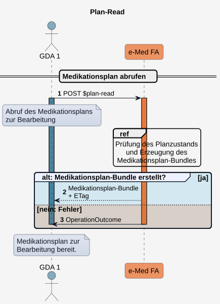
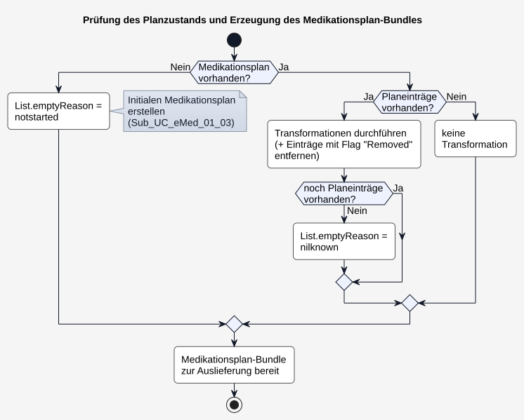
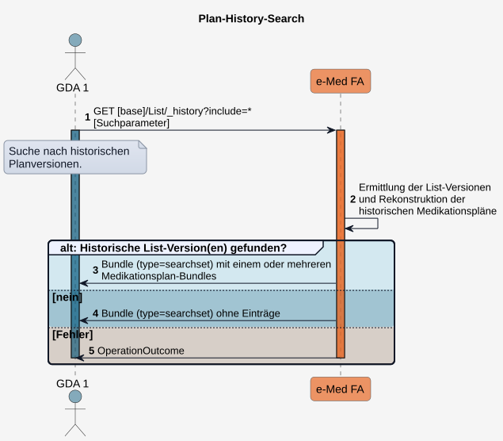
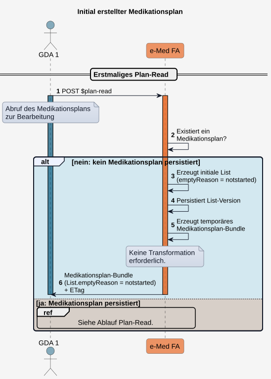
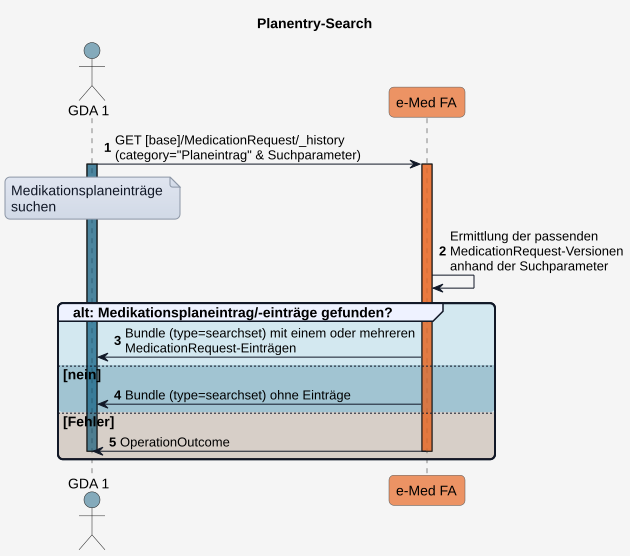

# HL7.AT.FHIR.ELGA.EMED.R4\​Technische Use Cases für Medikationsplan lesen (UC_eMed_01) - FHIR® v4.0.1

* [**Table of Contents**](toc.md)
* [**Overview Use Case**](overview_use_case.md)
* **​Technische Use Cases für Medikationsplan lesen (UC_eMed_01)**

## ​Technische Use Cases für Medikationsplan lesen (UC_eMed_01)

Dieser technische Use Case beschreibt den lesenden Zugriff [berechtigter Akteure](actors.md#rollen-und-berechtigungen) auf den Medikationsplan eines ELGA-Teilnehmers.

Für ELGA-Teilnehmer und deren Vertretungen erfolgt der Zugriff über das ELGA-Zugangsportal. Für die übrigen Akteure erfolgt der Zugriff über die e-Medikations-Schnittstelle des jeweiligen GDA-Systems.

Der lesende Zugriff umfasst:

* den Abruf des **aktuellen Medikationsplans**, der für eine mögliche Bearbeitung aufbereitet ist ([Plan-Read](Sub_UC_eMed_01.md#sub_uc_emed_01_01---aktuellen-medikationsplan-lesen-plan-read)),
* die Suche und den Abruf **historischer Versionen des Medikationsplans** ([Plan-History-Search](Sub_UC_eMed_01.md#sub_uc_emed_01_02---historische-medikationsplanversion-lesen-plan-history-search)),
* die Suche und den Abruf **einzelner Medikationsplaneinträge** bzw. historischer Versionen ([Planentry-Search](Sub_UC_eMed_01.md#sub_uc_emed_01_04---medikationsplaneinträge-lesen-planentry-search))sowie
* Abruf eines **Verzeichnisses historischer Medikationspläne** ([Plan-History-Directory-Search](Sub_UC_eMed_01.md#sub_uc_emed_01_05---verzeichnis-historischer-medikationspläne-lesen-plan-history-directory-search)) 

Die fachlichen Anforderungen dieses Use Cases werden im
[UC_eMed_01 Medikationsplan lesen](Sub_UC_eMed_01.md)beschrieben.

Für sämtliche im Folgenden beschriebenen Zugriffsarten gelten zusätzlich die dort festgelegten Vorbedingungen. Alle Zugriffe werden protokolliert.

### Sub_UC_eMed_01_01 - Aktuellen Medikationsplan lesen (Plan-Read)

Plan-Read dient dem Abruf des aktuellen Medikationsplans in einem für die Bearbeitung durch den GDA **aufbereiteten Zustand**.

Hierfür erzeugt die Fachanwendung aus der aktuellen Version der [List](StructureDefinition-at-elga-emed-list-medikationsplan.md)-Ressource sowie den von ihr referenzierten Ressourcen ein **temporäres** [Medikationsplan-Bundle](StructureDefinition-at-elga-emed-bundle-medikationsplan.md) zur Auslieferung. Der Abruf erfolgt über die Custom Operation [$plan-read](OperationDefinition-AtElgaEmed.List.Planread.md).

#### Ablauf

1. Der Client führt ein**POST**[$plan-read](OperationDefinition-AtElgaEmed.List.Planread.md)aus.
1. Die Fachanwendung prüft den Zustand des Medikationsplans und erzeugt ein Medikationsplan-Bundle zur Auslieferung (siehe[Prüfung des Planzustands und Erzeugung des Medikationsplan-Bundles](Sub_UC_eMed_01.md#prüfung-des-planzustands-und-erzeugung-des-medikationsplan-bundles)).
1. Die Fachanwendung liefert das Medikationsplan-Bundle zurück. Dieses enthält im HTTP-Header den****ETag****der aktuellen Version der**List**-Ressource für das[**Optimistic Locking**](https://hl7.org/fhir/http.html#concurrency).

Nachfolgend kann der Medikationsplan vom GDA bearbeitet und mittels [Plan-Write](Sub_UC_eMed_02.md#sub_uc_emed_02_01---medikationsplan-schreiben-plan-write) gespeichert werden.

  

 Offene Punkte:
 Fehlercodes sind noch zu definieren. 

#### Custom Operations

POST [$plan-read](OperationDefinition-AtElgaEmed.List.Planread.md)

#### Prüfung des Planzustands und Erzeugung des Medikationsplan-Bundles

Nach Eingang eines **$plan-read** prüft die Fachanwendung den Zustand des Medikationsplans und führt entsprechende Schritte durch, bevor ein **Medikationsplan-Bundles zur Auslieferung** erstellt wird (siehe [Ablauf](Sub_UC_eMed_01.md#ablauf)).

Die **persistierten Ressourcen am Server** werden durch die Transformationen für das Auslieferungs-Bundle **nicht verändert**.

#### Ablauf

1. **Es existiert kein Medikationsplan.**
* Es wird gemäß [Sub_UC_eMed_01_03 - Initial erstellter Medikationsplan](Sub_UC_eMed_01.md#sub_uc_emed_01_03---initial-erstellter-medikationsplan) ein initialer Medikationsplan erstellt ([List](StructureDefinition-at-elga-emed-list-medikationsplan.md)-Ressource mit **List.emptyReason = notstarted**).
* Es erfolgt keine Transformation.

1. **Es existiert ein Medikationsplan mit Planeinträgen.**
* Transformationen durchführen (siehe auch [Status des List.entry.flags im Medikationsplan](workflowmanagement.md#status-des-listentryflags-im-medikationsplan)): 
* Neue oder geänderte Planeinträge (**List.entry.flag = new** oder **changed**) werden auf ****unchanged**** gesetzt (siehe [Status des List.entry.flags im Medikationsplan](workflowmanagement.md#status-des-listentryflags-im-medikationsplan)).
* Stornierte und beendete Planeinträge mit **List.entry.flag = **removed**** werden aus dem Medikationsplan **entfernt**.
* Planeinträge mit **abgelaufenem Behandlungszeitraum** werden mit **List.entry.flag = removed** gekennzeichnet und werden mit **ausgeliefert**, um dem GDA die Möglichkeit zu geben, das Medikament weiterzuverodnen. Anderenfalls nimmt der GDA zur Kenntnis, dass der Planeintrag mit seinem nächsten Schreibvorgang entfernt wird.
 
* Sind nach der Transformation keine Planeinträge mehr vorhanden, wird **List.emptyReason = nilknown** gesetzt. 

1. **Es existiert ein leerer Medikationsplan**(mit einem[List.emptyReason](https://fhir.hl7.at/r4-ELGA-e-Medikation-main/ValueSet-ElgaListEmptyReasonVS.html)).
* Es erfolgt keine Transformation.

1. Das**Medikationsplan-Bundle**ist zur Auslieferung bereit. Es enthält:
* die (ggf. transformierte) [List](StructureDefinition-at-elga-emed-list-medikationsplan.md)-Ressource,
* sämtliche von der **List** referenzierten Ressourcen

  

### Sub_UC_eMed_01_02 - Historische Medikationsplanversion suchen (Plan-History-Search)

Bei der Plan-History-Search rekonstruiert die Fachanwendung historische Versionen des Medikationsplans aus Versionen der List-Ressource sowie den von diesen referenzierten Ressourcenversionen und liefert diese unverändert aus. Alle diese Ressourcen sind Teil des resultierenden Searchset-Bundles.

Beim Plan-History-Search erfolgt **keine Änderung** der Medikationspläne durch die Fachanwendung. Insbesondere werden keine Inhalte, Statusinformationen oder Kennzeichnungen (Flags) verändert. Der Zugriff dient ausschließlich der Anzeige bzw. Informationsabfrage persistierter Medikationsplanversionen.

#### Suchparameter

Der Abruf erfolgt mittels **GET** auf den **List**-Ressourcen-Endpunkt unter Angabe geeigneter **Suchparameter**:

* **Zeitraum der Erfassung** von Medikationsplanversionen
* **Medikation** (PZN, Arzneimittelname oder Wirkstoff)
* **Einnahmezeitraum** einer Medikation
* **Planeintragsid ohne Version**: Abrufen aller Medikationsplanversionen, die diesen Planeintrag enthalten
* **Planeintragsid mit Version**: Abrufen der Medikationsplanversionen, die genau diese Planeintragsversion enthalten.
* **StatusReason eines im Plan einthaltenen Planeintrags**: Abrufen aller Planversionen, mit Planeinträgen mit bestimmtem [statusReason](ValueSet-AtElgaEmedValueSetPlaneintragStatusReasonVS.md).

#### Ablauf

1. Der Client führt ein GET auf**[base]/List/_history**mit den passenden Suchparametern aus.
1. Die Fachanwendung ermittelt anhand dieser die historischen Versionen der**List**-Ressource. Für jede gefundene**List**-Version rekonstruiert die Fachanwendung den historischen Medikationsplan, indem sie die zugehörigen historischen Versionen der referenzierten Ressourcen ermittelt und diese im Medikationsplan-Bundle ergänzt.
1. Die Fachanwendung liefert die den Suchparametern entsprechenden historischen Medikationspläne als Medikationsplan-Bundles in einem Bundle vom Typ searchset zurück.
1. Werden keine passenden historischen Medikationsplanversionen gefunden, enthält das zurückgelieferte**searchset**keine Einträge.
1. Im Fehlerfall wird ein entsprechender**OperationOutcome**zurückgegeben.

  

#### Beispiele für Suchanfragen

 Offene Punkte: 
in Arbeit. 

### Sub_UC_eMed_01_03 - Initial erstellter Medikationsplan

Die initiale Erstellung eines Medikationsplans erfolgt ausschließlich durch die e-Medikation-Fachanwendung. Sie wird ausgelöst, wenn im Rahmen eines erstmaligen Aufrufs von [$plan-read](OperationDefinition-AtElgaEmed.List.PlanRead.md) noch kein Medikationsplan für den ELGA-Teilnehmer existiert.

Der dabei erzeugte initiale Medikationsplan besitzt den Wert **List.emptyReason = notstarted**. Dieser kennzeichnet ausschließlich den **Initialzustand** des Medikationsplans und bedeutet, dass bisher noch keine Medikationsplaneinträge erfasst wurden. Er trifft jedoch keine Aussage darüber, ob der Patient Medikamente einnimmt.

Die Initialisierung kann sowohl durch ein GDA-System als auch durch den ELGA-Teilnehmer über das Zugangsportal ausgelöst werden.

 Offene Punkte:
 Soll die Erstellung durch das Berechtigungssystem beim ersten Aufruf eines Patienten getriggert werden (nicht mehr Teil von $plan-read)? 

#### Ablauf

1. Ein Client führt ein**POST**[$plan-read](OperationDefinition-AtElgaEmed.List.Planread.md)aus.
1. Die Fachanwendung prüft, ob bereits ein Medikationsplan xistiert.
1. Existiert noch kein Medikationsplan, erstellt die Fachanwendung initial eine List-Ressource mit**emptyReason = notstarted**.
1. Die List-Ressource wird als erste Version persistiert.
1. Für das**Plan-Read**erzeugt die Fachanwendung daraus ein temporäres Medikationsplan-Bundle zur Auslieferung.
1. Dieses wird mit**List.emptyReason = notstarted**sowie dem zugehörigen ETag zurückgeliefert.

  

### Sub_UC_eMed_01_04 - Medikationsplaneinträge suchen (Planentry-Search)

**Planentry-Search** dient der gezielten Suche nach Medikationsplaneintragsversionen. Als Medikationsplaneintrag gilt eine im Medikationsplan referenzierte Version einer **MedicationRequest**-Ressource mit **category = "Planeintrag"**.

Die Suche ermöglicht berechtigten Akteuren den Zugriff auf aktuelle und historische Medikationsplaneinträge unabhängig von einer bestimmten Medikationsplanversion.

Die Historie ermöglicht die Nachverfolgung von Änderungen an Medikationsplaneinträgen, beispielsweise hinsichtlich Präparat, Dosierung oder Einnahmeanweisung.

 Die gefundenen Medikationsplaneinträge können anschließend als Ausgangspunkt für weitere Abfragen verwendet werden, um jene Ressourcen zu ermittelnt, die genau auf diese Planeintragsversion referenzieren:

* die zugehörigen Medikationsplanversionen ([Plan-History-Search](Sub_UC_eMed_01.md#sub_uc_emed_01_02---historische-medikationsplanversion-suchen-plan-history-search))
* **Geplante Abgaben** ([Prescription-Search](Sub_UC_eMed_03.md#sub_uc_emed_03_01---geplante-abgaben-lesen-prescription-search))
* **Durchgeführte Abgaben** ([Dispense-Search](Sub_UC_eMed_03.md#sub_uc_emed_03_02---durchgeführte-abgaben-lesen-dispense-search))

 Offene Punkte:
 - Sind die Referenzen in Geplanten Abgaben und Durchgeführten Abgaben versioniert?
 

#### Suchparameter

Die Suche nach Medikationsplaneinträgen erfolgt mittels **GET** unter Angabe geeigneter Suchparameter:

* **Medikation** (PZN, Arzneimittelname oder Wirkstoff)
* **Einnahmezeitraum**
* **Erstellungszeitpunkt**
* **Status**: [Value Set](ValueSet-PlaneintragStatusVS.md)
* **StatusReason**: [Value Set](ValueSet-AtElgaEmedValueSetPlaneintragStatusReasonVS.md)
* **Historisch oder aktuell** (_history)

#### Ablauf

1. Der Client führt ein**GET**auf den Planentry-Search-Endpunkt mit den gewünschten Suchparametern aus (**MedicationRequest**mit**category = "Planeintrag"**).
1. Die Fachanwendung ermittelt anhand der Suchparameter die passenden Medikationsplaneinträge.
1. Die Fachanwendung liefert die Suchergebnisse als Bundle vom Typ**searchset**zurück.
1. Werden keine passenden Medikationsplaneinträge gefunden, enthält das zurückgelieferte Searchset Bundle keine Einträge.
1. Im Fehlerfall wird ein entsprechender**OperationOutcome**zurückgegeben.

  

#### Beispiele für Suchanfragen

 Offene Punkte: 
in Arbeit. 

### Sub_UC_eMed_01_05 - Verzeichnis historischer Medikationspläne lesen (Plan-History-Directory-Search)

 Offene Punkte: 
$plan-history-directory-search: in Arbeit. 

