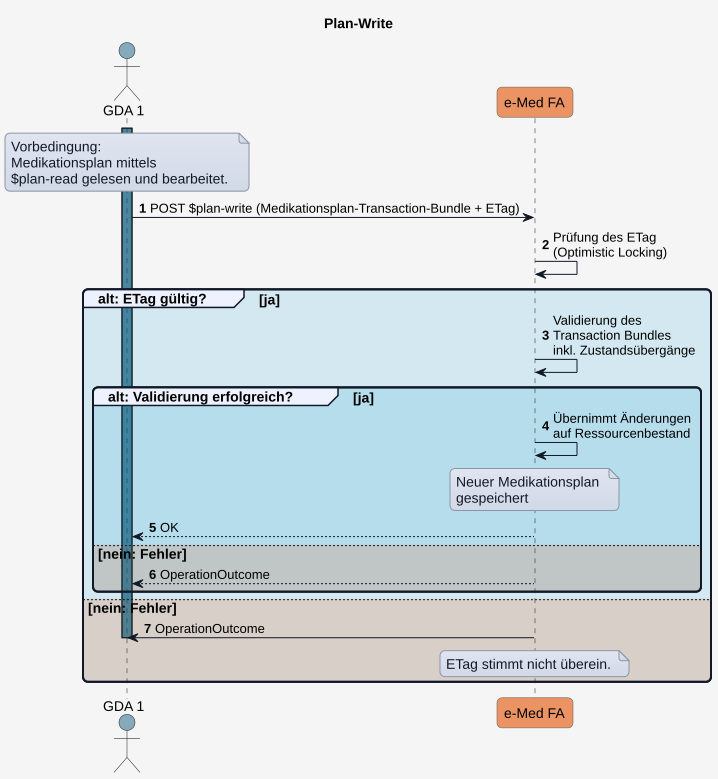

# HL7.AT.FHIR.ELGA.EMED.R4\​Technische Use Cases für Medikationsplan schreiben (UC_eMed_02) - FHIR® v4.0.1

* [**Table of Contents**](toc.md)
* [**Overview Use Case**](overview_use_case.md)
* **​Technische Use Cases für Medikationsplan schreiben (UC_eMed_02)**

## ​Technische Use Cases für Medikationsplan schreiben (UC_eMed_02)

Dieser technische Use Case beschreibt den schreibenden Zugriff [berechtigter Akteure](actors.md#rollen-und-berechtigungen) auf den Medikationsplan eines ELGA-Teilnehmers.

Für ELGA-Teilnehmer (bzw. deren Vertretungen) erfolgt der schreibende Zugriff im Rahmen der Ausübung von Teilnehmerrechten ausschließlich über das ELGA-Zugangsportal. Für GDA erfolgt der schreibende Zugriff über die e-Medikation-Schnittstelle des jeweiligen GDA-Systems.

Der schreibende Zugriff umfasst folgende Bearbeitungen der **aktuellen Version des Medikationsplans**:

* **GDA** können einzelne **Medikationsplaneinträge** 
* [hinzufügen](Sub_UC_eMed_02.md#sub_uc_emed_02_02---planeintrag-in-medikationsplan-hinzufügen),
* [ändern](Sub_UC_eMed_02.md#sub_uc_emed_02_03---planeintrag-im-medikationsplan-ändern),
* [unverändert zur Kenntis nehmen](Sub_UC_eMed_02.md#sub_uc_emed_02_04---planeintrag-unverändert-zur-kenntnis-nehmen),
* [pausieren bzw. reaktivieren](Sub_UC_eMed_02.md#sub_uc_emed_02_05---planeintrag-pausieren-oder-reaktivieren),
* [beenden](Sub_UC_eMed_02.md#sub_uc_emed_02_08---planeintrag-im-medikationsplan-beenden),
* [stornieren](Sub_UC_eMed_02.md#sub_uc_emed_02_07---planeintrag-im-medikationsplan-stornieren),
 
* die [Reihenfolge der Planeinträge ändern](Sub_UC_eMed_02.md#sub_uc_emed_02_10---reihenfolge-der-planeinträge-ändern)
* einen [Leeren Medikationsplan dokumentieren](Sub_UC_eMed_02.md#sub_uc_emed_02_06---leeren-medikationsplan-dokumentieren).
* **ELGA-Teilnehmer** können 
* einzelne aktuelle oder historische [Planeinträge löschen](Sub_UC_eMed_02.md#sub_uc_emed_02_11---planeintrag-durch-elga-teilnehmer-löschen) oder
* den aktuellen oder historische Versionen des gesamten [Medikationsplans löschen](Sub_UC_eMed_02.md#sub_uc_emed_02_12---medikationsplan-durch-elga-teilnehmer-löschen).
 

Jede Änderung am Medikationsplan führt zur Erstellung einer **neuen Medikationsplanversion**. Für GDA gilt zusätzich:

* Historische Medikationspläne bzw. Planeinträge können **nicht** bearbeitet werden.
* Die Verträglichkeit der neu hinzugefügten/geänderten Medikation mit dem bestehenden Medikationsplan gilt mit der Erstellung einer neuen Medikationsplanversion als bestätigt. 

ℹ️ Die fachlichen Anforderungen dieses Use Cases werden beschrieben in:
*  [UC_eMed_02 Medikationsplan schreiben](Sub_UC_eMed_02.md) 
*  [UC_eMed_06 Teilnehmerrechte ausüben](Sub_UC_eMed_06.md) 
Es gelten die dort festgelegten Vorbedingungen. Alle Zugriffe werden protokolliert.

### Allgemeiner Ablauf Medikationsplan bearbeiten und schreiben

Für jeden Schreibvorgang auf dem **aktuellen Medikationsplan MUSS** der folgende technische Ablauf eingehalten werden:

1. **Aktuellen Medikationsplan abrufen**: mittels[$plan-read](OperationDefinition-AtElgaEmed.List.PlanRead.md)(siehe[Sub_UC_eMed_01_01 - Aktuellen Medikationsplan lesen (Plan-Read)](Sub_UC_eMed_01.md#sub_uc_emed_01_01---aktuellen-medikationsplan-lesen-plan-read)).
1. **Medikationsplan-Bundle bearbeiten**: Die im zurückgegebenen Medikationsplan-Bundle enthaltenen Ressourcen entsprechend dem jeweiligen fachlichen Anwendungsfall bearbeiten.
1. **Aktualisierten Medikationsplan speichern**: mittels[$plan-write](OperationDefinition-AtElgaEmed.List.PlanWrite.md)als[Medikationsplan-Transaction-Bundle](StructureDefinition-at-elga-emed-bundle-medikationsplantx.md)an die Fachanwendung übermitteln. Der technische Ablauf, einschließlich der Integritätsprüfung mittels**ETag**, wird im[Sub_UC_eMed_02_01 - Medikationsplan schreiben (Plan-Write)](Sub_UC_eMed_02.md#sub_uc_emed_02_01---medikationsplan-schreiben-plan-write)beschrieben.

  

Die nachfolgenden technischen Use Cases beschreiben die für den jeweiligen Anwendungsfall erforderlichen Änderungen an den Ressourcen sowie die Struktur und Inhalte des **Medikationsplan-Transaction-Bundles**.

### Sub_UC_eMed_02_01 - Medikationsplan schreiben (Plan-Write)

Alle vom GDA ausgeführten, schreibenden Zugriffe auf den Medikationsplan erfolgen über die Custom Operation [$plan-write](OperationDefinition-AtElgaEmed.List.PlanWrite.md). Die Fachanwendung verwendet den im Request übermittelten **ETag** zur Integritätsprüfung ([Optimistic Locking](https://hl7.org/fhir/http.html#concurrency)), um konkurrierende Änderungen am Medikationsplan zu erkennen. 

#### Ablauf

1. Das GDA-System übermittelt den aktualisierten Medikationsplan mittels**POST**[$plan-write](OperationDefinition-AtElgaEmed.List.PlanWrite.md)als[Medikationsplan-Transaction-Bundle](StructureDefinition-at-elga-emed-bundle-medikationsplantx).
Der Request enthält:
* alle **neuen**, **geänderten** und **zu entfernenden** Ressourcen im Transaction Bundle
* den von der Fachanwendung nach dem **$plan-read** übermittelten **ETag** (zur Durchführung des [Optimistic Locking](https://hl7.org/fhir/http.html#concurrency))
* unveränderte Ressourcen werden ausschließlich referenziert.

1. Die Fachanwendung prüft den übermittelten**ETag**gegen den**ETag**der aktuell persistierten Medikationsplan-Version.
1. Ist der**ETag**gültig, validiert die Fachanwendung das**Medikationsplan-Transaction-Bundle**einschließlich der zulässigen[Zustandsübergänge](workflowmanagement.md#überblick-der-statusänderungen-der-e-medikation-ressourcen)der**List.Entry.Flags**und**MedicationReqeuest.Status**.
1. Die Fachanwendung erstellt neue Versionen der geänderten Ressourcen und**persistiert**diese.
1. Die Fachanwendung bestätigt die erfolgreiche Aktualisierung des Medikationsplans.
1. Schlägt die Validierung fehl, wird der Schreibvorgang mit einem**OperationOutcome**abgelehnt.
1. Stimmt der übermittelte**ETag**nicht mit dem der Fachanwendung überein, wird der Schreibvorgang mit einem**OperationOutcome****abgelehnt**. Vor einem erneuten Schreibversuch muss der Medikationsplan mittels[$plan-read](OperationDefinition-AtElgaEmed.List.PlanRead.md)erneut abgerufen und auf Basis der aktuellen Version bearbeitet werden.

  

 Offene Frage:
 - Liefert die Fachanwendung mit der HTTP 200 OK Response im Body auch die Ressourcen, so wie sie persistiert wurden, wieder zurück? Bei neu angelegten Ressourcen ist erst dadurch für den Client die id ersichtlich (wird vom Server vergeben). 

 Offener Punkt:
 - OperationOutcome defnieren 

#### Custom Operations

* [$plan-write](OperationDefinition-AtEmed.List.PlanWrite.md)

### Sub_UC_eMed_02_02 - Planeintrag in Medikationsplan hinzufügen

Der GDA kann dem Medikationsplan ein oder mehrere Planeinträge hinzufügen (neu einzunehmende, verordnete Medikation). Dabei muss er dokumentieren, ob dieser von ihm selbst stammt oder nicht (Fremdmedikation durch einen anderen GDA bzw. Eigenmedikation des Patienten).

#### Ablauf

Der GDA führt ein **POST** [$plan-read](OperationDefinition-AtElgaEmed.List.Planread.md) aus und bearbeitet die von der Fachanwendung im [Medikationsplan-Bundle](StructureDefinition-at-elga-emed-bundle-medikationsplan.md) bereitgestellten Ressourcen:

* [List-Ressource](StructureDefinition-at-elga-emed-list-medikationsplan.md): 
* **List.source**: wird auf den aktuellen GDA (Ersteller) geändert
* **List.date**: wird mit dem Zeitpunkt der Änderung aktualisiert
* **List.entry**: Für jede neu einzunehmende Medikation wird ein Planeintrag ([MedicationRequests](StructureDefinition-at-elga-emed-medicationrequest-planeintrag.md)) **referenziert**
* **List.entry.flag** des neuen Planeintrags erhält den Wert **new** (siehe [Statusdiagramm](workflowmanagement.md#status-des-listentryflags-im-medikationsplan))
 
* [MedicationRequests](StructureDefinition-at-elga-emed-medicationrequest-planeintrag.md): 
* **status** muss mit **active** oder **on-hold** dokumentiert werden (siehe [Konsistenzregeln zwischen List.entry.flags und MedicationRequest-Status](workflowmanagement.md#konsistenzregeln-zwischen-listentryflags-und-medicationrequest-status))
* **intent = order** und **category = "Planeintrag"** sind für alle Planeinträge verpflichtend mit festen Wert zu dokumentieren
* **reported** erhält den Wert **false**, wenn die Medikation vom Ersteller des Planeintrags selbst stammt, sonst **true**
* für die Dokumentation des Arzneimittels ist die **Medication**-Ressource zu verwenden, diese muss immer im MedicationRequest enthalten sein (contained) 
* **courseOfTherapyType** dokumentiert verpflichtend die Art der Medikation. Mögliche Ausprägungen sind **continuous** für Dauermedikation und **acute** für Akutmedikation. Bei Aktumedikation ist in **extension:effectiveDosePeriod** verpflichtend ein Enddatum für den Einnahmezeitraum zu dokumentieren. Bei Dauermedikation darf an dieser Stelle kein Enddatum dokumentiert werden.
* dosageInstruction: in Arbeit. 
 

 Offener Punkt:
 - dosageInstruction: Dosierungen in Arbeit. 

Im Anschluss übermittelt der GDA mit **POST $plan-write** den aktualisierten Medikationsplan in einem **Transaction Bundle**:

* alle neuen **MedicationRequests** sind im Bundle enthalten
* die unveränderten Ressourcen sind nicht im Bundle enthalten, sondern werden in der **List-Ressource** nur referenziert.

#### Relevante Elemente (List)

```
AtElgaEmedListMedikationsplan
    status: current
    mode: working
    date: Datum der aktuellen Bearbeitung des Medikationsplans
    source: für die Bearbeitung veranwortlicher GDA 
    entry[0]:  // 1. Planeintrag wird hinzufgefügt
        flag: new
        item: Referenz auf den Planeintrag 1  // siehe "Relevante Elemente (MedicationRequest) Planeintrag 1"
    entry[1]:  // 2. Planeintrag wird hinzufgefügt
        flag: new
        item: Referenz auf den Planeintrag 2  // analog zu "Relevante Elemente (MedicationRequest) Planeintrag 1"

```

#### Relevante Elemente (MedicationRequest - Planeintrag 1)

```
AtElgaEmedMedicationRequestPlaneintrag
    status: active | on-hold
    intent: order                       // fester Wert
    category: "Planeintrag"  // fester Wert
    reportedBoolean: false | true       // false, wenn vom Ersteller des Planeintrags
    medicationReference.reference: Medikation mit PZN oder Magistrale Zubereitung // Contained Medication 
    authoredOn: Datum der Erstellung des Planeintrags    
    requester: veranwortlicher GDA      // wird auf Übereinstimmung mit List.source geprüft
    courseOfTherapyType: continuous | acute
    dosageInstruction: Dosierung + Einnahmezeitraum (ab sofort | in der Zukunft)

```

 Offener Punkt:
 - Magistrale Zubereitung: in Arbeit. 

#### Custom Operations

* [$plan-write](OperationDefinition-AtEmed.List.PlanWrite.md)
* [$plan-read](OperationDefinition-AtEmed.List.PlanRead.md)

### Sub_UC_eMed_02_03 - Planeintrag im Medikationsplan ändern

Der GDA kann im Medikationsplan ein oder mehrere Planeinträge ändern.

Die Änderung des Planeintrag kann alle Inhalte umfassen, z.B.: Änderung des Status (pausieren/aktivieren), Änderung des Einnahmezeitraums, der Dosierung oder der Medikation.  Bei fehlender fachlicher Kontinuität der Bearbeitung eines Planeintrages (z.B. Änderung des Arzneimittels von Blutdruckmittel auf Antibiotikum) **SOLL** ein neuer Planeintrag erfasst und kein bestehender Eintrag weiterverwendet werden.

Um Planeinträge zu ändern, führt der GDA ein **$plan-read** aus und bearbeitet die von der Fachanwendung bereitgestellten Ressourcen:

* Das Element **List.source** wird mit dem aktuellen GDA, **List.date** aktualisiert.
* Entsprechende Planeinträge (**MedicationRequests**) werden geändert und das entsprechende Entry der **List**-Ressouce angepasst: 
* Das List.entry.flag erhält den Wert **changed**,
* der MedicationRequest selbst kann den Status **active** oder **on-hold** erhalten (siehe [Konsistenzregeln zwischen List.entry.flags und MedicationRequest-Status](workflowmanagement.md#konsistenzregeln-zwischen-listentryflags-und-medicationrequest-status))
* der Einnahmezeitraum im MedicationRequest (**extension:effectiveDosePeriod**) kann sich auf das aktuelle Datum beziehen oder in der Zukunft liegen
 

Der GDA übermittelt (via POST $plan-write) den aktualisierten Medikationsplan in einem Transaction Bundle:

* alle geänderten Ressourcen sind inline im Bundle enthalten
* die unveränderten Ressourcen sind nicht im Bundle enthalten, sondern werden in der Liste nur referenziert.

#### Relevante Elemente (List)

```
AtElgaEmedListMedikationsplan

    status: current
    mode: working
    date: Datum der Bearbeitung des Medikationsplans
    source: Veranwortlicher GDA 
    entry[0]:  // 1. Planeintrag wird geändert
        flag: changed 
        date: Datum der Änderung des Planeintrags  // in diesem Fall gleich mit dem Datum der Bearbeitung des Medikationsplans
        item: Referenz auf den Planeintrag 1  
    entry[1]:  // 2. Planeintrag bleibt unverändert
        flag: unchanged 
        date: Datum der Aufnahme des Planeintrags // in diesem Fall unterschiedlich mit dem Datum der Bearbeitung des Medikationsplans
        item: Referenz auf den Planeintrag 2  

```

#### Relevante Elemente (MedicationRequest - Planeintrag 1)

```
AtElgaEmedMedicationRequestPlaneintrag
    identifier: Planeintrag-ID bleibt bestehen  // sofern der Bezug erhalten bleiben soll
    status: active | on-hold
    statusReason.text: Freitextbegrüdung für die Änderung 
    reportedBoolean: false  // Fremdmedikation
    medicationReference.reference: Änderungen betreffend der Medikation // Contained Medication 
    authoredOn: Datum der Änderung des Planeintrags    
    requester: für die Änderung verantwortlicher GDA 
    dosageInstruction: Änderung betreffend Dosierung + Einnahmezeitraum (ab sofort | in der Zukunft)
    priorPrescription: Referenz auf ersetzten Planeintrag

```

#### Custom Operations

* [$plan-write](OperationDefinition-AtEmed.List.PlanWrite.md)
* [$plan-read](OperationDefinition-AtEmed.List.PlanRead.md)

#### Sequenzdiagramm

Siehe [Allgemeiner Ablauf - Planeinträge bearbeiten](Sub_UC_eMed_02.md#allgemeiner-ablauf---planeinträge-bearbeiten).

### Sub_UC_eMed_02_04 - Planeintrag unverändert zur Kenntnis nehmen

Der GDA kann ein oder mehrere Planeinträge im Medikationsplan beibehalten und unverändert zur Kennntis nehmen.

Hierfür führt der GDA ein **$plan-read** aus und bearbeitet die von der Fachanwendung im Medikationsplan-Bundle bereitgestellten Ressourcen:

* Das Element **List.source** wird mit dem aktuellen GDA, **List.date** aktualisiert.
* Die zu behaltenden Planeinträge (**MedicationRequests**) bleiben **unverändert** im Status **active** oder **on-hold** (Planeinträge mit anderem Status werden von der Fachanwendung nicht ausgeliefert).
* Planeinträge mit abgelaufenem Einnahmezeitraum (überschrittenes Enddatum in **extension:effectiveDosePeriod**) sind im ausgelieferten Medikationsplan-Bundle enthalten, in der List aber mit **List.entry.flag = removed** markiert. 
* Nimmt der GDA keine Änderung an diesen Planeinträgen vor und führt ein Plan-Write durch, werden diese beim nächsten Plan-Read automatisch aus dem Medikationsplan entfernt. Der Planeintrag selbst muss für das Remove mit GDA, Datum und Status aktualisiert werden.
* Möchte der GDA einen abgelaufenen Planeintrag beibehalten, muss er entsprechende Anpassungen vornehmen: **List.entry.flag** auf **changed** und zumindest den Einnahmezeitraum im Planeintrag anpassen (siehe **Sub_UC_eMed_02_05 - Planeintrag im Medikationsplan ändern**), da die Fachanwendung das Speichern sonst ablehenen würde.
 

Der GDA übermittelt mit **POST $plan-write** den aktualisierten Medikationsplan in einem **Transaction Bundle**:

* die unveränderten Ressourcen sind nicht im Bundle enthalten, sondern werden in der Liste nur referenziert.

#### Relevante Elemente (List)

```
AtElgaEmedListMedikationsplan
    date: Datum der aktuellen Bearbeitung des Medikationsplans
    source: für die Bearbeitung veranwortlicher GDA 
    entry[0]:  // 1. Planeintrag bleibt unverändert
        flag: unchanged 
        item: Referenz auf den Planeintrag 1  

```

#### Relevante Elemente (MedicationRequest - Planeintrag 1)

```
AtElgaEmedMedicationRequestPlaneintrag
    // unverändert (verantwortlicher GDA, Datum, Status bleiben bestehen)

```

#### Custom Operations

* [$plan-write](OperationDefinition-AtEmed.List.PlanWrite.md)
* [$plan-read](OperationDefinition-AtEmed.List.PlanRead.md)

#### Sequenzdiagramm

Siehe [Allgemeiner Ablauf - Planeinträge bearbeiten](Sub_UC_eMed_02.md#allgemeiner-ablauf---planeinträge-bearbeiten).

### Sub_UC_eMed_02_05 - Planeintrag pausieren oder reaktivieren

Ein GDA kann die Therapie eines Patienten vorübergehend unterbrechen (die Wiederaufnahme ist vorgesehen). Eine Freitext-Begründung kann dokumentiert werden.

Hierfür führt der GDA ein **$plan-read** aus und bearbeitet die von der Fachanwendung im Medikationsplan-Bundle bereitgestellten Ressourcen.

* Die zu pausierenden Planeinträge (**MedicationRequests**) und das entsprechende Entry der **List**-Ressouce werden wie folgt angepasst:
* Das Element **List.source** wird mit dem aktuellen GDA, **List.date** aktualisiert.
* Das **List.entry.flag** des referenzierten MedicationRequests erhält den Wert **changed**,
* der MedicationRequest erhält den Status **on-hold** (siehe [Konsistenzregeln zwischen List.entry.flags und MedicationRequest-Status](workflowmanagement.md#konsistenzregeln-zwischen-listentryflags-und-medicationrequest-status))
* In **statusReason.text** kann ein Grund für die Pausierung als Freitext dokumentiert werden.
* **reportedBoolean** wird auf **true** gesetzt, wenn die Information über die Pausierung vom Patienten berichtet wurde und auf **false**, wenn die Pausierung vom GDA angeordnet wurde – unabhängig davon, welcher Status zuvor dokumentiert war.
* Der Einnahmezeitraum im MedicationRequest (**extension:effectiveDosePeriod**) kann sich auf das aktuelle Datum beziehen oder in der Zukunft liegen.

Im Anschluss übermittelt der GDA mit **POST $plan-write** den aktualisierten Medikationsplan in einem **Transaction Bundle**:

* alle geänderten Ressourcen sind inline im Bundle enthalten
* die unveränderten Ressourcen sind nicht im Bundle enthalten, sondern werden in der Liste nur referenziert.

Anmerkung: Beim nächsten **Plan-Read** ändert die Fachanwendung im zur Auslieferung bereitgestellten Bundle den Status der Einträge mit **changed** automatisch auf **unchanged**.

#### Relevante Elemente (List)

```
AtElgaEmedListMedikationsplan
    date: Datum der aktuellen Bearbeitung des Medikationsplans
    source: für die Bearbeitung veranwortlicher GDA 
    entry[0]:  // 1. Planeintrag wird pausiert
        flag: changed 
        item: Referenz auf den Planeintrag 1  
    entry[1]:  // 2. Planeintrag bleibt unverändert
        flag: unchanged 
        item: Referenz auf den Planeintrag 2  

```

#### Relevante Elemente (MedicationRequest - Planeintrag 1)

```
AtElgaEmedMedicationRequestPlaneintrag
    identifier: Planeintrag-ID bleibt bestehen
    status: on-hold
    statusReason.text: Freitextbegrüdung  // optional
    reportedBoolean: true | false       // true, wenn Fremdmedikation
    authoredOn: Datum der Pausierung des Planeintrags    
    requester: für die Pausierung verantwortlicher GDA 
    priorPrescription: Referenz auf ersetzten Planeintrag

```

#### Custom Operations

* [$plan-write](OperationDefinition-AtEmed.List.PlanWrite.md)
* [$plan-read](OperationDefinition-AtEmed.List.PlanRead.md)

#### Sequenzdiagramm

Siehe [Allgemeiner Ablauf - Planeinträge bearbeiten](Sub_UC_eMed_02.md#allgemeiner-ablauf---planeinträge-bearbeiten).

### Sub_UC_eMed_02_06 - Leeren Medikationsplan dokumentieren

Ein GDA kann explizit dokumentieren, dass für den Patienten derzeit **keine Medikation vorgesehen** ist. Zu unterscheiden:

1. der Medikationsplan ist leer:
* A. er befindet sich noch im **Initialzustand** mit **List.emptyReason = notstarted** oder
* B. er ist **nach dem Absetzen oder Stornieren aller Planeinträge** leer (**List.emptyReason = unavailable**)
* In beiden Fällen erstellt der GDA eine neue Planversion mit **List.emptyReason = nilknown**.

1. es bestehen Planeinträge:
* der GDA **beendet oder storniert alle Planeinträge**, sodass sämtliche Einträge der **List** das **List.entry.flag = removed** besitzen.
* Beim nächsten [$plan-read](OperationDefinition-AtElgaEmed.List.PlanRead.md) erkennt die Fachanwendung diesen Zustand und liefert den Medikationsplan mit **List.emptyReason = unavailable** aus. Optional kann der GDA nach einem weiteren Plan-Read explizit einen leeren Plan dokumentieren (siehe 1.B).

#### Relevante Elemente (List)

Der GDA übermittelt ein Medikationsplan-Transaction-Bundle mit:

```
AtElgaEmedListMedikationsplan

    status: current
    mode: working
    date: Datum der Bearbeitung
    source: veranwortlicher GDA 
    emptyReason: nilknown   // Patient nimmt derzeit kein Medikation ein

```

#### Custom Operations

* [$plan-write](OperationDefinition-AtEmed.List.PlanWrite.md)
* [$plan-read](OperationDefinition-AtEmed.List.PlanRead.md)

#### Sequenzdiagramm

Siehe [Allgemeiner Ablauf - Planeinträge bearbeiten](Sub_UC_eMed_02.md#allgemeiner-ablauf---planeinträge-bearbeiten).

### Sub_UC_eMed_02_07 - Planeintrag im Medikationsplan stornieren

Der GDA kann einen oder mehrere Planeinträge aufgrund einer falschen Eingabe stornieren. Diese sind beim nächsten [Plan-Read](interactions.md#plan-read) nicht mehr im Medikationsplan enthalten.

Hierfür führt der GDA ein **$plan-read** aus und bearbeitet die von der Fachanwendung im Medikationsplan-Bundle bereitgestellten Ressourcen:

* Das Element **List.source** wird mit dem aktuellen GDA, **List.date** aktualisiert.
* Entsprechende Planeinträge (**MedicationRequests**) und das entsprechende Entry der **List**-Ressouce werden angepasst: 
* Das List.entry.flag des referenzierten MedicationRequests erhält den Wert **removed**,
* der MedicationRequest erhält den Status **entered-in-error** (siehe [Konsistenzregeln zwischen List.entry.flags und MedicationRequest-Status](workflowmanagement.md#konsistenzregeln-zwischen-listentryflags-und-medicationrequest-status)) 
 

Der GDA übermittelt (via POST $plan-write) den aktualisierten Medikationsplan in einem Transaction Bundle:

* alle geänderten Ressourcen (inkl. der stornierten) sind inline im Bundle enthalten
* die unveränderten Ressourcen sind nicht im Bundle enthalten, sondern werden in der Liste nur referenziert.

#### Relevante Elemente (List)

Relevante Elemente (List)

```
AtElgaEmedListMedikationsplan

    status: current
    mode: working
    date: Datum der Bearbeitung des Medikationsplans
    source: Veranwortlicher GDA 
    entry[0]:  // 1. Planeintrag wird storniert
        flag: removed 
        item: Referenz auf den Planeintrag 1  
    entry[1]:  // 2. Planeintrag bleibt unverändert
        flag: unchanged 
        item: Referenz auf den Planeintrag 2  

```

#### Relevante Elemente (MedicationRequest - Planeintrag 1)

```
AtElgaEmedMedicationRequestPlaneintrag
    identifier: Planeintrag-ID bleibt bestehen
    status: entered-in-error
    reportedBoolean: false  // Fremdmedikation
    authoredOn: Datum der Stornierung des Planeintrags    
    requester: für die Stornierung verantwortlicher GDA 
    priorPrescription: Referenz auf ersetzten Planeintrag

```

#### Custom Operations

* [$plan-write](OperationDefinition-AtEmed.List.PlanWrite.md)
* [$plan-read](OperationDefinition-AtEmed.List.PlanRead.md)

#### Sequenzdiagramm

Siehe [Allgemeiner Ablauf - Planeinträge bearbeiten](Sub_UC_eMed_02.md#allgemeiner-ablauf---planeinträge-bearbeiten).

### Sub_UC_eMed_02_08 - Planeintrag im Medikationsplan beenden

Der GDA kann ein Medikament, welches in einen Planeintrag dokumentiert ist, absetzen. Der betreffende Planeintrag ist beim nächsten [Plan-Read](interactions.md#plan-read) nicht mehr im Medikationsplan enthalten.

Hierfür führt der GDA ein **$plan-read** aus und bearbeitet die von der Fachanwendung im Medikationsplan-Bundle bereitgestellten Ressourcen:

* Das Element **List.source** wird mit dem aktuellen GDA, **List.date** aktualisiert.
* Entsprechende Planeinträge (**MedicationRequests**) und das entsprechende Entry der **List**-Ressouce werden angepasst: 
* Das List.entry.flag des referenzierten MedicationRequests erhält den Wert **removed**,
* der MedicationRequest erhält den Status **stopped** (siehe [Konsistenzregeln zwischen List.entry.flags und MedicationRequest-Status](workflowmanagement.md#konsistenzregeln-zwischen-listentryflags-und-medicationrequest-status))
* Im Element **statusReason.text** **MUSS** der Beendigungsgrund (Freitext) dokumentiert werden.
* Ein bestehendes Enddatum des Einnahmezeitraums muss nicht geändert werden (auch wenn dieses in der Zukunft liegt).
 

Der GDA übermittelt (via POST $plan-write) den aktualisierten Medikationsplan in einem Transaction Bundle:

* alle geänderten Ressourcen (inkl. der abgesetzten) sind inline im Bundle enthalten
* die unveränderten Ressourcen sind nicht im Bundle enthalten, sondern werden in der Liste nur referenziert.

#### Relevante Elemente (List)

```
AtElgaEmedListMedikationsplan

    status: current
    mode: working
    date: Datum der Bearbeitung des Medikationsplans
    source: Veranwortlicher GDA 
    entry[0]:  // 1. Planeintrag wird abgesetzt
        flag: removed 
        item: Referenz auf den Planeintrag 1  // siehe "Planeintrag ändern"
    entry[1]:  // 2. Planeintrag bleibt unverändert
        flag: unchanged 
        item: Referenz auf den Planeintrag 2  

```

#### Relevante Elemente (MedicationRequest - Planeintrag 1)

```
AtElgaEmedMedicationRequestPlaneintrag
    identifier: Planeintrag-ID bleibt bestehen
    status: stopped
    statusReason.text: Freitextbegrüdung für das Absetzen des Medikaments  //verpflichtende Angabe!
    reportedBoolean: false  // Fremdmedikation
    authoredOn: Datum des Absetzens des Planeintrags    
    requester: für das Absetzen verantwortlicher GDA 
    priorPrescription: Referenz auf ersetzten Planeintrag

```

#### Custom Operations

* [$plan-write](OperationDefinition-AtEmed.List.PlanWrite.md)
* [$plan-read](OperationDefinition-AtEmed.List.PlanRead.md)

#### Sequenzdiagramm

Siehe [Allgemeiner Ablauf - Planeinträge bearbeiten](Sub_UC_eMed_02.md#allgemeiner-ablauf---planeinträge-bearbeiten).

### Sub_UC_eMed_02_10 - Reihenfolge der Planeinträge ändern

Der GDA kann die Reihenfolge der Planeinträge ändern. Die Einträge selbst bleiben dabei unverändert.

Hierfür führt der GDA ein **$plan-read** aus und bearbeitet die von der Fachanwendung im Medikationsplan-Bundle bereitgestellten Ressourcen:

* Das Element **List.source** wird mit dem aktuellen GDA, **List.date** aktualisiert.
* Die Reihenfolge der Planeinträge wird in der **List**-Ressouce angepasst, indem die Entries entsprechend gereiht werden.
* Der Einnahmezeitraum der Planeinträge (**extension:effectiveDosePeriod**) darf noch nicht abgelaufen sein (ansonsten müssen diese bearbeitet werden - siehe Sub_UC_eMed_02_04 - Planeintrag unverändert zur Kenntnis nehmen).

Der GDA übermittelt mittels POST **$plan-write** den aktualisierten Medikationsplan in einem Transaction Bundle:

* die unveränderten Ressourcen sind nicht im Bundle enthalten, sondern werden in der Liste nur referenziert.

#### Relevante Elemente (List)

In folgendem Beispiel wird der ursprünglich 2. Eintrag als 1. gereiht.

```
AtElgaEmedListMedikationsplan

    status: current
    mode: working
    date: Datum der Änderung der Reihenfolge
    source: Veranwortlicher GDA 
    entry[0]: // 2. Planeintrag 
        flag: Unchanged 
        item: Referenz auf den Planeintrag 2 
    entry[1]: // 1. Planeintrag
        flag: Unchanged 
        item: Referenz auf den Planeintrag 1 

```

#### Relevante Elemente (MedicationRequest - Planeintrag 1 und 2)

```
AtElgaEmedMedicationRequestPlaneintrag
    // unverändert (verantwortlicher GDA, Datum, Status bleiben bestehen)

```

#### Custom Operations

* [$plan-write](OperationDefinition-AtEmed.List.PlanWrite.md)
* [$plan-read](OperationDefinition-AtEmed.List.PlanRead.md)

#### Sequenzdiagramm

Siehe [Allgemeiner Ablauf - Planeinträge bearbeiten](Sub_UC_eMed_02.md#allgemeiner-ablauf---planeinträge-bearbeiten).

### Sub_UC_eMed_02_11 - Planeintrag durch ELGA-Teilnehmer löschen

 Offene Fragen: Ausüben der Teilnehmerrechte in Arbeit. 

### Sub_UC_eMed_02_12 - Medikationsplan durch ELGA-Teilnehmer löschen

 Offene Fragen: Ausüben der Teilnehmerrechte in Arbeit. 

#### Custom Operations

* [$plan-write](OperationDefinition-AtEmed.List.PlanWrite.md)
* [$plan-read](OperationDefinition-AtEmed.List.PlanRead.md)

#### Sequenzdiagramm

In Arbeit. –>

