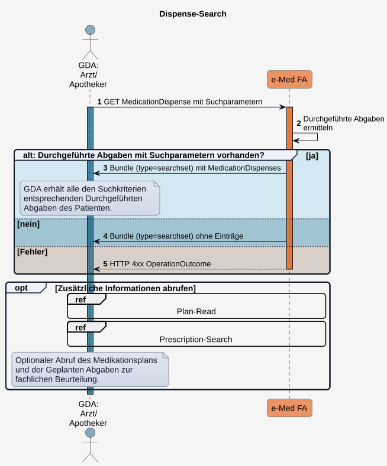

# HL7.AT.FHIR.ELGA.EMED.R4\​Technische Use Cases für Geplante und Durchgeführte Abgaben lesen (UC_eMed_03) - FHIR® v4.0.1

* [**Table of Contents**](toc.md)
* [**Overview Use Case**](overview_use_case.md)
* **​Technische Use Cases für Geplante und Durchgeführte Abgaben lesen (UC_eMed_03)**

## ​Technische Use Cases für Geplante und Durchgeführte Abgaben lesen (UC_eMed_03)

### Sub_UC_eMed_03_01 - Geplante Abgaben lesen (Prescription-Search)

Ein [berechtigter GDA](actors.md#rollen-und-berechtigungen) kann [Geplante Abgaben](StructureDefinition-at-elga-emed-medicationrequest-geplanteabgabe.md) eines ELGA-Teilnehmers abrufen, um verordnete (rezeptierte) Arzneimittel einzusehen.

ELGA-Teilnehmer können **Geplante Abgaben** über das Zugangsportal einsehen.

**Geplante Abgaben** bilden die Inhalte des e-Rezepts ab. Wurden mehrere Arzneimittel verordnet und sind demselben e-Rezept zugeordnet, sind die zugehörigen **Geplanten Abgaben** mit demselben **e-Med GroupIdentifier** versehen, den auch das e-Rezept mitführt (bildet damit die Rezept-Klammer).

Der **Standardzugriff** (**Prescription-Search**) erfolgt nach **Kontaktbestätigung** des ELGA-Teilnehmers (z.B. mittels e-card). Der GDA erhält dadurch lesenden Zugriff auf die e-Medikation inkl. aller **Geplanten Abgaben** und kann entsprechende Arzneimittelabgaben durchführen und dokumentieren (siehe [Sub_UC_eMed_05_01 - Durchgeführte Abgabe schreiben](Sub_UC_eMed_05.md#Sub_UC_eMed_05_01---durchgeführte-abgabe-schreiben)). Zusätzlich kann der GDA auf **Durchgeführte Abgaben** und den **Medikationsplan** zugreifen, um die **Geplanten Abgaben** im Kontext der gesamten Medikation zu beurteilen. 

Als **alternative Zugriffsart** zur Kontaktbestätigung steht der **Zugriff mittels **e-Med GroupIdentifier**** (z.B. über den DataMatrix-Code eines e-Rezepts) zur Verfügung (**Groupidentifier-Search**). Dieser ermöglicht ausschließlich einen eingeschränkten ELGA-Zugriff auf die dem e-Med GroupIdentifier zugeordneten **Geplanten Abgaben** und **Durchgeführten Abgaben** und wird in [Sub_UC_eMed_03 - Geplante und Durchgeführte Abgaben mit e-Med GroupIdentifier lesen](Sub_UC_eMed_03.md) beschrieben.

Bei **Prescription-Search** stellt die Fachanwendung alle **MedicationRequest**-Ressourcen mit der Kategorie **Geplante Abgabe** des ELGA-Teilnehmers bereit, die den angegebenen Suchkriterien entsprechen.

##### Ablauf

1. Der GDA führt ein**GET**auf**MedicationRequest**mit der Kategorie**Geplante Abgabe**aus.
Folgende Suchparameter werden unterstützt:
* Zeitraum der Erfassung der **Geplanten Abgabe**
* Medikation: PZN/Name bzw. Wirkstoff 
* Einnahmezeitraum der Medikation der **Geplanten Abgabe** (extension:effectiveDosePeriod)
*  

| | | | | |
| :--- | :--- | :--- | :--- | :--- |
| [status](ValueSet-GeplanteAbgabeStatusVS.md)der**Geplanten Abgabe**[active | completed | entered-in-error | stopped | cancelled ] |

 
* **Geplante Abgabe** zu einer **Durchgeführten Abgabe**
* **id** des Planeintrags, auf welchem die **Geplante Abgabe** basiert
* alle **Geplanten Abgaben** zu einem **e-Med groupIdentifier**

1. Die Fachanwendung ermittelt alle den Suchkriterien entsprechenden**Geplanten Abgaben**.
1. Die Fachanwendung liefert das Suchergebnis als**Bundle (type = searchset)**mit sämtlichen den Suchkriterien entsprechenden**MedicationRequest**-Ressourcen.
1. Werden keine passenden Ressourcen gefunden, wird ein**leeres Searchset-Bundle**zurückgegeben.
1. Kann die Anfrage nicht verarbeitet werden, antwortet die Fachanwendung mit einer geeigneten**HTTP-4xx**-Antwort und einem**OperationOutcome**.
1. Optional kann der GDA zusätzlich den**Medikationsplan**oder**Durchgeführte Abgaben**abrufen.

 Offene Frage:
 ad: *Geplante Abgabe* zu einer Durchgeführten Abgabe:
 - Reverse-Include erlaubt oder eigene Operation? 

 Offene Frage:
 ad: Suchparameter:
 - Gültigkeitszeitraum des Rezepts (validityPeriod)? 

##### Sequenzdiagramm

### Sub_UC_eMed_03_02 - Durchgeführte Abgaben lesen (Dispense-Search)

Ein [berechtigter GDA](actors.md#rollen-und-berechtigungen) kann **Durchgeführte Abgaben** eines ELGA-Teilnehmers abrufen, um bereits dokumentierte Arzneimittelabgaben einzusehen.

ELGA-Teilnehmer können **Durchgeführte Abgaben** über das Zugangsportal einsehen.

**Durchgeführten Abgaben** spiegeln den Status der Abgaben des e-Rezepts wider. Eine **Durchgeführte Abgabe**, die auf einer **Geplanten Abgabe** basiert, enthält den **e-Med GroupIdentifier** der zugehörigen **Geplanten Abgabe** enthalten. Dadurch können zusammengehörige **Geplante Abgaben** und **Durchgeführte Abgaben** über denselben **e-Med GroupIdentifier** identifiziert und gemeinsam abgerufen werden.

Der **Standardzugriff** (**Dispense-Search**) auf **Durchgeführte Abgaben** erfolgt nach **Kontaktbestätigung** des ELGA-Teilnehmers (z.B. mittels e-card). Dadurch erhält der GDA lesenden Zugriff auf alle **Durchgeführten Abgaben** des ELGA-Teilnehmers. Zusätzlich kann der GDA lesend auf **Geplante Abgaben** und den **Medikationsplan** zugreifen, um die **Durchgeführten Abgaben** im Kontext der gesamten Medikation zu beurteilen. 

Als **alternative Zugriffsart** zur Kontaktbestätigung steht der **Zugriff mittels **e-Med GroupIdentifier**** (z.B. über den DataMatrix-Code eines e-Rezepts) zur Verfügung (**Groupidentifier-Search**). Dieser ermöglicht ausschließlich einen eingeschränkten ELGA-Zugriff auf die dem e-Med GroupIdentifier zugeordneten **Geplanten Abgaben** und **Durchgeführten Abgaben** und wird in [Sub_UC_eMed_03 - Geplante und Durchgeführte Abgaben mit e-Med GroupIdentifier lesen](Sub_UC_eMed_03.md) beschrieben.

Bei **Dispense-Search** stellt die Fachanwendung alle **MedicationDispense**-Ressourcen des ELGA-Teilnehmers bereit, die den angegebenen Suchkriterien entsprechen.

##### Ablauf

1. Der GDA führt einen**GET**-Request auf**MedicationDispense**aus. Die Suche kann optional anhand von Suchparametern eingeschränkt werden.
Folgende Suchparameter werden unterstützt:
* Zeitraum der Erfassung der **Durchgeführten Abgabe**
* Medikation: PZN/Name bzw. Wirkstoff
*  

| | | |
| :--- | :--- | :--- |
| [status](ValueSet-DurchgefuehrteAbgabeStatusVS.md)der**Durchgeführten Abgabe**[completed | cancelled | entered-in-error] |

 
* [type](ValueSet-DurchgefuehrteAbgabeTypVS.md) (Abgabeart)
* **Durchgeführte Abgaben** zu einer **Geplanten Abgabe**
* **id** des Planeintrags, auf welchem die **Durchgeführte Abgabe** basiert
* alle **Durchgeführten Abgaben** zu einem **e-Med groupIdentifier**

1. Die Fachanwendung ermittelt alle den Suchkriterien entsprechenden**Durchgeführten Abgaben**des ELGA-Teilnehmers.
1. Die Fachanwendung liefert das Suchergebnis als**Bundle (type = searchset)**mit den entsprechenden**MedicationDispense**-Ressourcen.
1. Werden keine passenden Ressourcen gefunden, wird ein**leeres Searchset-Bundle**zurückgegeben.
1. Kann die Anfrage nicht verarbeitet werden, antwortet die Fachanwendung mit einer geeigneten**HTTP-4xx**-Antwort und einem**OperationOutcome**.
1. Optional kann der GDA zusätzlich den**Medikationsplan**oder**Geplante Abgaben**abrufen.

 Offene Punkte: 
 Suchparameter auf Vollständigkeit prüfen 

##### Sequenzdiagramm

### Sub_UC_eMed_03_03 - Geplante und Durchgeführte Abgaben mittels e-Med GroupIdentifier lesen (Groupidentifier-Search)

Erfolgt die Arzneimittelabgabe **ohne Kontaktbestätigung** des ELGA-Teilnehmers, sondern auf Basis eines **e-Med GroupIdentifier** (z.B. über den DataMatrix-Code eines e-Rezepts), erhält ein [berechtigter GDA](actors.md#rollen-und-berechtigungen) einen eingeschränkten ELGA-Zugriff.

Dieser umfasst ausschließlich den lesenden Zugriff auf die dem **e-Med GroupIdentifier** zugeordneten **Geplanten Abgaben** und **Durchgeführten Abgaben**. Der GDA kann anschließend **Durchgeführte Abgaben** ausschließlich für diesen **e-Med GroupIdentifier** dokumentieren (siehe **Sub_UC_eMed_05_01 - Durchgeführte Abgaben mittels e-Med GroupIdentifier schreiben**).

Ein lesender Zugriff auf weitere **Geplante Abgaben** oder **Durchgeführte Abgaben** sowie auf den Medikationsplan des ELGA-Teilnehmers ist nicht möglich. Ebenso können keine weiteren **Durchgeführten Abgaben** (z.B. OTC- oder Notabgaben) in der e-Medikation des ELGA-Teilnehmers dokumentiert werden.

##### Ablauf

1. Der GDA führt die Custom Operation**POST**[$groupidentifier-search](OperationDefinition-AtElgaEmed.GroupIdentifier.Search.md)aus und übermittelt einen**e-Med GroupIdentifier**.
1. Die Fachanwendung führt eine**Prüfung**des übermittelten**e-Med GroupIdentifier**durch.
1. Ist der**e-Med GroupIdentifier**gültig, ermittelt die Fachanwendung alle**MedicationRequest**-Ressourcen der Kategorie**Geplante Abgabe**, die dem übermittelten**e-Med GroupIdentifier**entsprechen.
1. Die Fachanwendung ermittelt zusätzlich alle**MedicationDispense**-Ressourcen, die dem übermittelten**e-Med GroupIdentifier**entsprechen.
1. Die Fachanwendung liefert die ermittelten**MedicationRequest**- und**MedicationDispense**-Ressourcen als**Bundle**vom Typ**searchset**zurück.
1. Ergibt die Suche keine passenden**Geplanten Abgaben**oder**Durchgeführten Abgaben**, liefert die Fachanwendung ein**leeres Bundle**vom Typ**searchset**zurück.
1. Ist der**e-Med GroupIdentifier**ungültig, lehnt die Fachanwendung die Operation ab und liefert einen entsprechenden**OperationOutcome**zurück.

##### Sequenzdiagramm

##### Custom Operations

 Offene Punkte: 
$groupidentifier-search: in Arbeit. 

