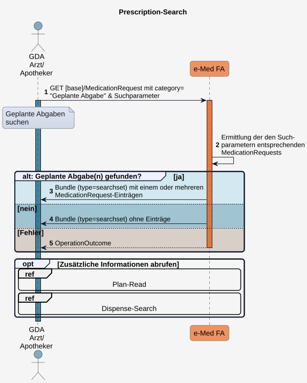
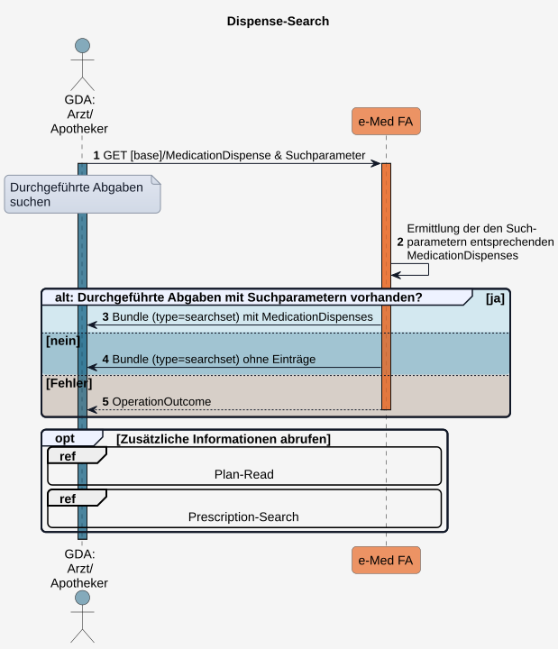
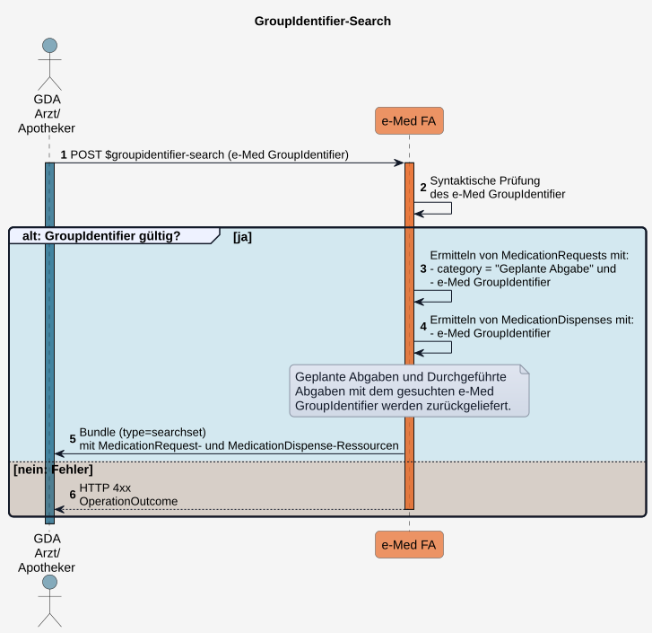

# HL7.AT.FHIR.ELGA.EMED.R4\​Technische Use Cases für Geplante und Durchgeführte Abgaben lesen (UC_eMed_03) - FHIR® v4.0.1

* [**Table of Contents**](toc.md)
* [**Overview Use Case**](overview_use_case.md)
* **​Technische Use Cases für Geplante und Durchgeführte Abgaben lesen (UC_eMed_03)**

## ​Technische Use Cases für Geplante und Durchgeführte Abgaben lesen (UC_eMed_03)

Dieser technische Use Case beschreibt den lesenden Zugriff [berechtigter Akteure](actors.md#rollen-und-berechtigungen) auf:

* [Geplante Abgaben](Sub_UC_eMed_03.md#sub_uc_emed_03_01---geplante-abgaben-lesen-prescription-search), um vorgesehene Arzneimittelabgaben einzusehen,
* [Durchgeführte Abgaben](Sub_UC_eMed_03.md#sub_uc_emed_03_02---durchgeführte-abgaben-lesen-dispense-search), um bereits erfolgte Arzneimittelabgaben einzusehen
* [Geplante und Durchgeführte Abgaben mit e-Med Groupidentifier](Sub_UC_eMed_03.md#sub_uc_emed_03_03---geplante-und-durchgeführte-abgaben-mittels-e-med-groupidentifier-lesen-groupidentifier-search), um die zu einem e-Rezept zugehörigen **Gepanten Abgaben** und **Durchgeführten Abgaben** abzurufen zu können.

Für ELGA-Teilnehmer und deren Vertretungen erfolgt der lesende Zugriff auf **Gepanten Abgaben** und **Durchgeführten Abgaben** über das ELGA-Zugangsportal.

Für die übrigen Akteure erfolgt der lesende Zugriff über die e-Medikations-Schnittstelle des jeweiligen GDA-Systems.

Dabei werden folgende **Zugriffsarten** unterschieden:

* **Zugriff mit Kontaktbestätigung**: Der Standardzugriff erfolgt nach nach **Kontaktbestätigung** des ELGA-Teilnehmers (z.B. mittels e-card). Dadurch erhält der GDA einen, seiner Rolle entsprechenden ELGA-Zugriff, inkl. lesenden Zugriff auf alle **Geplanten Abgaben** ([Prescription-Search](Sub_UC_eMed_03.md#sub_uc_emed_03_01---geplante-abgaben-lesen-prescription-search)) und auf alle **Durchgeführten Abgaben** ([Dispense-Search](Sub_UC_eMed_03.md#sub_uc_emed_03_02---durchgeführte-abgaben-lesen-dispense-search)) und kann entsprechende Arzneimittelabgaben durchführen und dokumentieren (siehe [Sub_UC_eMed_05_01 - Durchgeführte Abgabe schreiben](Sub_UC_eMed_05.md#Sub_UC_eMed_05_01---durchgeführte-abgabe-schreiben)). Weiters kann der Medikationsplan des ELGA-Teilnehmers abgerufen werden, um die die gesamte Medikation beurteilen zu können, oder OTC-Abgaben dokumentiert werden.
* **Zugriff mittels **e-Med GroupIdentifier****: Alternativ steht ohne Patientenkontakt der **Zugriff mittels **e-Med GroupIdentifier**** (z.B. über den DataMatrix-Code eines e-Rezepts) zur Verfügung ([GroupIdentifier-Search](Sub_UC_eMed_03.md#sub_uc_emed_03_03---geplante-und-durchgeführte-abgaben-mittels-e-med-groupidentifier-lesen-groupidentifier-search)). Dieser ermöglicht ausschließlich einen eingeschränkten ELGA-Zugriff auf die dem **e-Med GroupIdentifier** zugeordneten **Geplanten Abgaben** und **Durchgeführten Abgaben** und wird in [Sub_UC_eMed_03 - Geplante und Durchgeführte Abgaben mit e-Med GroupIdentifier lesen](Sub_UC_eMed_03.md) beschrieben.

ℹ️ Die fachlichen Anforderungen dieses Use Cases werden im
[UC_eMed_03 Geplante und durchgeführte Abgaben lesen](Sub_UC_eMed_03.md)beschrieben.

Es gelten die dort festgelegten Vorbedingungen. Alle Zugriffe werden protokolliert.

### Sub_UC_eMed_03_01 - Geplante Abgaben lesen (Prescription-Search)

**Prescription-Search** dient dem Suche nach [Geplante Abgaben](StructureDefinition-at-elga-emed-medicationrequest-geplanteabgabe.md) eines ELGA-Teilnehmers, um vorgesehene Arzneimittelabgaben einzusehen. Als **Geplante Abgabe** gilt eine **MedicationRequest**-Ressource mit **category = "Geplante Abgabe"**.

**Geplante Abgaben** bilden einige Inhalte des e-Rezepts ab. Wurden mehrere Arzneimittel verordnet und sind demselben e-Rezept zugeordnet, sind die zugehörigen **Geplanten Abgaben** mit demselben **e-Med GroupIdentifier** versehen, den auch das e-Rezept mitführt (bildet damit die Rezept-Klammer).

#### Suchparameter

Die Suche nach **Geplanten Abgaben** erfolgt mittels **GET** unter Angabe geeigneter Suchparameter:

* alle (ohne Einschränkung) 
* in einem bestimmten Zeitraum erfasste
* mit bestimmter Medikation: PZN/Name bzw. Wirkstoff (bei Wirkstoff werden auch Magistrale Zubereitungen durchsucht)
*  

| | | | | |
| :--- | :--- | :--- | :--- | :--- |
| mit einem bestimmten[status](ValueSet-GeplanteAbgabeStatusVS.md): [active | completed | entered-in-error | stopped | cancelled ] (z.B. alle offenen) |

 
* mit einem bestimmten **e-Med GroupIdentifier** 

Die gefundenen **Geplanten Abgaben** können als Ausgangspunkt für weitere Abfragen verwendet werden:

* zugehöriger Medikationsplaneintrag  / zugehörige Medikationsplanversion
* zugehörige **Durchgeführte Abgaben** (inkl. Status, auch Leerabgaben oder Substitutionen)

Von ELGA-Teilnehmer:innen gelöschte **Geplanten Abgaben** stehen nicht mehr zur Verfügung.

##### Ablauf

1. Der GDA führt ein**GET**auf den Prescription-Search-Endpunkt mit den gewünschten Suchparametern aus (**MedicationRequest**mit**category = "Geplante Abgabe"**)
1. Die Fachanwendung ermittelt die den Suchkriterien entsprechenden**Geplanten Abgaben**.
1. Die Fachanwendung liefert das Suchergebnis als als Bundle vom Typ**searchset**zurück.
1. Werden keine passenden Ressourcen gefunden, enthält das zurückgelieferte Searchset Bundle keine Einträge.
1. Im Fehlerfall wird ein entsprechender**OperationOutcome**zurückgegeben.
1. Optional kann der GDA den**Medikationsplan**oder**Durchgeführte Abgaben**zur fachlichen Beurteilung abrufen.

 Offene Frage:
 ad: Suchkritierien: 
 - Geplante Abgabe zu einer Durchgeführten Abgabe: Reverse-Include erlaubt oder eigene Operation? 
 - Gültigkeitszeitraum des Rezepts (validityPeriod)? 
 - Erstellender GDA?
 

##### Sequenzdiagramm

### Sub_UC_eMed_03_02 - Durchgeführte Abgaben lesen (Dispense-Search)

**Dispense-Search** dient dem Suche nach [Durchgeführten Abgaben](StructureDefinition-at-elga-emed-medicationdispense-durchgefuehrteabgabe.md) eines ELGA-Teilnehmers, um bereits dokumentierte Arzneimittelabgaben einzusehen.

**Durchgeführten Abgaben** spiegeln den Status der Abgaben des e-Rezepts wider. Eine **Durchgeführte Abgabe**, die auf einer **Geplanten Abgabe** basiert, enthält den **e-Med GroupIdentifier** der zugehörigen **Geplanten Abgabe**. Dadurch können zusammengehörige **Geplante Abgaben** und **Durchgeführte Abgaben** über denselben **e-Med GroupIdentifier** identifiziert und gemeinsam abgerufen werden.

Bei **Dispense-Search** stellt die Fachanwendung alle **MedicationDispense**-Ressourcen des ELGA-Teilnehmers bereit, die den angegebenen Suchkriterien entsprechen.

##### Ablauf

1. Der GDA führt einen**GET**-Request auf**MedicationDispense**aus. Die Suche kann optional anhand von Suchparametern eingeschränkt werden.
Folgende Suchparameter werden unterstützt:
* Zeitraum der Erfassung der **Durchgeführten Abgabe**
* Medikation: PZN/Name bzw. Wirkstoff
*  

| | | |
| :--- | :--- | :--- |
| [status](ValueSet-DurchgefuehrteAbgabeStatusVS.md)der**Durchgeführten Abgabe**[completed | cancelled | entered-in-error] |

 
* [type](ValueSet-DurchgefuehrteAbgabeTypVS.md) (Abgabeart)
* **Durchgeführte Abgaben** zu einer **Geplanten Abgabe**
* **id** des Planeintrags, auf welchem die **Durchgeführte Abgabe** basiert
* alle **Durchgeführten Abgaben** zu einem **e-Med groupIdentifier**

1. Die Fachanwendung ermittelt alle den Suchkriterien entsprechenden**Durchgeführten Abgaben**des ELGA-Teilnehmers.
1. Die Fachanwendung liefert das Suchergebnis als**Bundle (type = searchset)**mit den entsprechenden**MedicationDispense**-Ressourcen.
1. Werden keine passenden Ressourcen gefunden, wird ein**leeres Searchset-Bundle**zurückgegeben.
1. Kann die Anfrage nicht verarbeitet werden, antwortet die Fachanwendung mit einer geeigneten**HTTP-4xx**-Antwort und einem**OperationOutcome**.
1. Optional kann der GDA den**Medikationsplan**oder**Geplante Abgaben**zur fachlichen Beurteilung abrufen.

 Offene Punkte: 
 Suchparameter auf Vollständigkeit prüfen 

##### Sequenzdiagramm

### Sub_UC_eMed_03_03 - Geplante und Durchgeführte Abgaben mittels e-Med GroupIdentifier lesen (GroupIdentifier-Search)

Erfolgt die Arzneimittelabgabe **ohne Kontaktbestätigung** des ELGA-Teilnehmers, sondern auf Basis eines **e-Med GroupIdentifier** (z.B. über den DataMatrix-Code eines e-Rezepts), erhält ein [berechtigter GDA](actors.md#rollen-und-berechtigungen) einen eingeschränkten ELGA-Zugriff.

Dieser umfasst ausschließlich den lesenden Zugriff auf die dem **e-Med GroupIdentifier** zugeordneten **Geplanten Abgaben** und **Durchgeführten Abgaben**. Der GDA kann anschließend **Durchgeführte Abgaben** ausschließlich für diesen **e-Med GroupIdentifier** dokumentieren (siehe **Sub_UC_eMed_05_01 - Durchgeführte Abgaben mittels e-Med GroupIdentifier schreiben**).

Ein lesender Zugriff auf weitere **Geplante Abgaben** oder **Durchgeführte Abgaben** sowie auf den Medikationsplan des ELGA-Teilnehmers ist nicht möglich. Ebenso können keine weiteren **Durchgeführten Abgaben** (z.B. OTC- oder Notabgaben) in der e-Medikation des ELGA-Teilnehmers dokumentiert werden.

##### Ablauf

1. Der GDA führt die Custom Operation**POST**[$groupidentifier-search](OperationDefinition-AtElgaEmed.GroupIdentifier.Search.md)aus und übermittelt einen**e-Med GroupIdentifier**.
1. Die Fachanwendung führt eine**Prüfung**des übermittelten**e-Med GroupIdentifier**durch.
1. Ist der**e-Med GroupIdentifier**gültig, ermittelt die Fachanwendung alle**MedicationRequest**-Ressourcen der Kategorie**Geplante Abgabe**, die dem übermittelten**e-Med GroupIdentifier**entsprechen.
1. Die Fachanwendung ermittelt zusätzlich alle**MedicationDispense**-Ressourcen, die dem übermittelten**e-Med GroupIdentifier**entsprechen.
1. Die Fachanwendung liefert die ermittelten**MedicationRequest**- und**MedicationDispense**-Ressourcen als**Bundle**vom Typ**searchset**zurück.
1. Ergibt die Suche keine passenden**Geplanten Abgaben**oder**Durchgeführten Abgaben**, liefert die Fachanwendung ein**leeres Bundle**vom Typ**searchset**zurück.
1. Ist der**e-Med GroupIdentifier**ungültig, lehnt die Fachanwendung die Operation ab und liefert einen entsprechenden**OperationOutcome**zurück.

##### Sequenzdiagramm

##### Custom Operations

 Offene Punkte: 
$groupidentifier-search: in Arbeit. 

