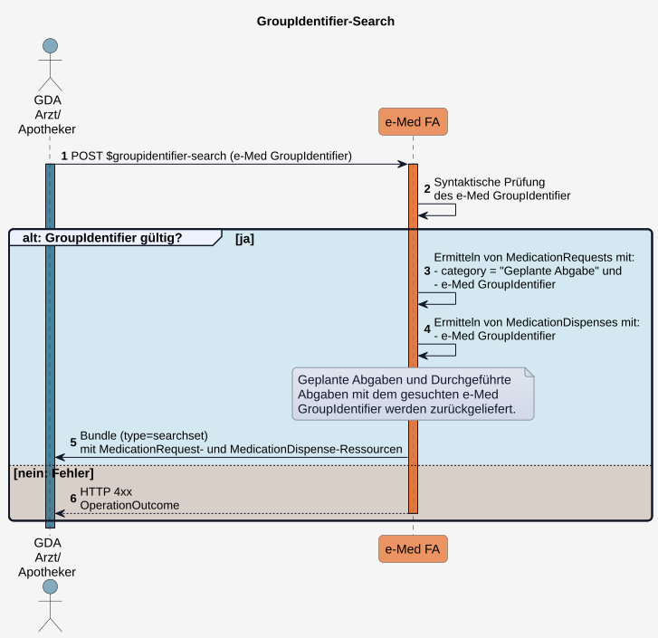

# HL7.AT.FHIR.ELGA.EMED.R4\​Technische Use Cases für Geplante und Durchgeführte Abgaben mittels e-Med GroupIdentifier lesen (UC_eMed_03) - FHIR® v4.0.1

* [**Table of Contents**](toc.md)
* [**Overview Use Case**](overview_use_case.md)
* **​Technische Use Cases für Geplante und Durchgeführte Abgaben mittels e-Med GroupIdentifier lesen (UC_eMed_03)**

## ​Technische Use Cases für Geplante und Durchgeführte Abgaben mittels e-Med GroupIdentifier lesen (UC_eMed_03)

### Sub_UC_eMed_03_03 - Geplante und Durchgeführte Abgaben mittels e-Med GroupIdentifier lesen (Groupidentifier-Search)

Erfolgt die Arzneimittelabgabe **ohne Kontaktbestätigung** des ELGA-Teilnehmers, sondern auf Basis eines **e-Med GroupIdentifier** (z.B. über den DataMatrix-Code eines e-Rezepts), erhält ein [berechtigter GDA](actors.md#rollen-und-berechtigungen) einen eingeschränkten ELGA-Zugriff.

Dieser umfasst ausschließlich den lesenden Zugriff auf die dem **e-Med GroupIdentifier** zugeordneten **Geplanten Abgaben** und **Durchgeführten Abgaben**. Der GDA kann anschließend **Durchgeführte Abgaben** ausschließlich für diesen **e-Med GroupIdentifier** dokumentieren (siehe **Sub_UC_eMed_05_01 - Durchgeführte Abgaben mittels e-Med GroupIdentifier schreiben**).

Ein lesender Zugriff auf weitere **Geplante Abgaben** oder **Durchgeführte Abgaben** sowie auf den Medikationsplan des ELGA-Teilnehmers ist nicht möglich. Ebenso können keine weiteren **Durchgeführten Abgaben** (z.B. OTC- oder Notabgaben) in der e-Medikation des ELGA-Teilnehmers dokumentiert werden.

##### Ablauf

1. Der GDA führt die Custom Operation**POST**[$groupidentifier-search](OperationDefinition-AtElgaEmed.GroupIdentifier.Search.md)aus und übermittelt einen**e-Med GroupIdentifier**.
1. Die Fachanwendung führt eine**Prüfung**des übermittelten**e-Med GroupIdentifier**durch.
1. Ist der**e-Med GroupIdentifier**gültig, ermittelt die Fachanwendung alle**MedicationRequest**-Ressourcen der Kategorie**Geplante Abgabe**, die dem übermittelten**e-Med GroupIdentifier**entsprechen.
1. Die Fachanwendung ermittelt zusätzlich alle**MedicationDispense**-Ressourcen, die dem übermittelten**e-Med GroupIdentifier**entsprechen.
1. Die Fachanwendung liefert die ermittelten**MedicationRequest**- und**MedicationDispense**-Ressourcen als**Bundle**vom Typ**searchset**zurück.
1. Ergibt die Suche keine passenden**Geplanten Abgaben**oder**Durchgeführten Abgaben**, liefert die Fachanwendung ein**leeres Bundle**vom Typ**searchset**zurück.
1. Ist der**e-Med GroupIdentifier**ungültig, lehnt die Fachanwendung die Operation ab und liefert einen entsprechenden**OperationOutcome**zurück.

##### Sequenzdiagramm

##### Custom Operations

 Offene Punkte: 
$groupidentifier-search: in Arbeit. 

