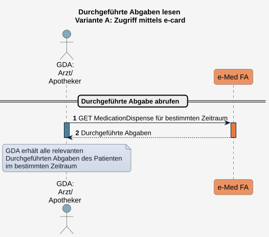

# HL7.AT.FHIR.ELGA.EMED.R4\​Technische Use Cases für Durchgeführte Abgaben lesen (UC_eMed_07) - FHIR® v4.0.1

* [**Table of Contents**](toc.md)
* [**Overview Use Case**](overview_use_case.md)
* **​Technische Use Cases für Durchgeführte Abgaben lesen (UC_eMed_07)**

## ​Technische Use Cases für Durchgeführte Abgaben lesen (UC_eMed_07)

Ein berechtigter GDA (siehe [Rollen und Berechtigungen](actors.md#rollen-und-berechtigungen)) kann **Durchgeführte Abgaben** eines ELGA-Teilnehmers abrufen, um bereits abgegebene Arzneimittel bzw. den Status der **Durchgeführten Abgaben** einzusehen.

ELGA-Teilnehmer können **Durchgeführte Abgaben** über das ELGA-Portal einsehen.

Sofern ein zugehöriges e-Rezept vorliegt, spiegeln **Durchgeführten Abgaben** den Status der Abgaben in der e-Rezept Anwendung wider.

Der Standard-Zugriff auf **Durchgeführte Abgaben** erfolgt mittels Kontaktbestätigung des ELGA-Teilnehmers (z.B. über die e-card). Dadurch erhält der GDA lesenden Zugriff auf alle **Durchgeführten Abgaben** und erhält Einblick auf bereits durchgeführte Arzneimittelabgaben. Zusätzlich kann der GDA (Arzt/Apothekter) lesend auf **Geplante Abgaben** und den **Medikationsplan** des ELGA-Teilnehmers zugreifen. 

Der Zugriff mittels **e-Med Groupidentifier** (z.B. bei Vorlage eines Papierrezepts) ermöglicht nur eingeschränkten ELGA-Zugriff und wird in [Sub_UC_eMed_07_03 - Geplante und Durchgeführte Abgaben mit e-Med GroupIdentifier lesen](Sub_UC_eMed_07_03.md) beschrieben.

### Sub_UC_eMed_07_02 - Durchgeführte Abgaben lesen (Dispense-Search)

Bei der Dispense-Search stellt die Fachanwendung alle MedicationDispenses des ELGA-Teilnehmers bereit. Status und Zeitraum können bei der Abfrage eingeschränkt werden.

##### Ablauf

In Arbeit.

##### Sequenzdiagramm

###### Suchparameter

In Arbeit.

