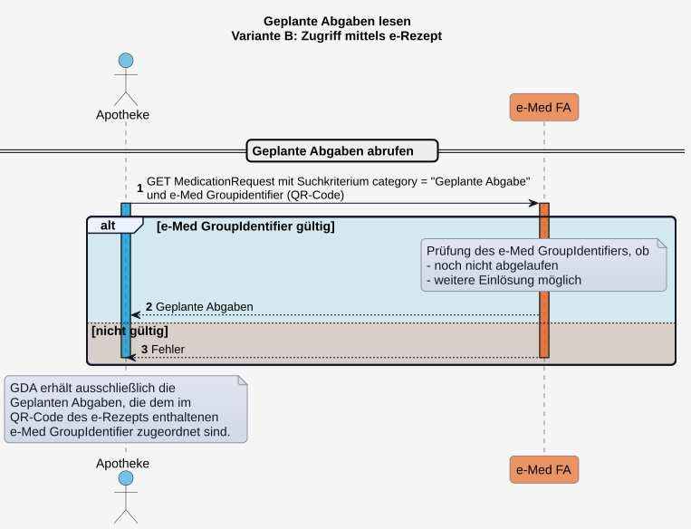
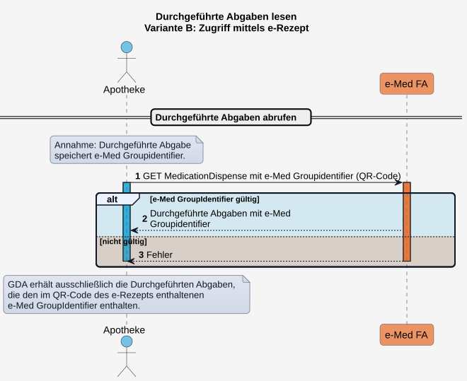

# HL7.AT.FHIR.ELGA.EMED.R4\​Technische Use Cases für Geplante und Durchgeführte Abgaben mit e-Med GroupIdentifier lesen (UC_eMed_07) - FHIR® v4.0.1

* [**Table of Contents**](toc.md)
* [**Overview Use Case**](overview_use_case.md)
* **​Technische Use Cases für Geplante und Durchgeführte Abgaben mit e-Med GroupIdentifier lesen (UC_eMed_07)**

## ​Technische Use Cases für Geplante und Durchgeführte Abgaben mit e-Med GroupIdentifier lesen (UC_eMed_07)

### Sub_UC_eMed_07_03 - Geplante und Durchgeführte Abgaben mit e-Med GroupIdentifier lesen

nur offene, mit gültigem GI (noch nicht eingelöst oder abgelaufen)

##### Variante B: Geplante Abgaben lesen mittels e-Med Groupidentifier

Erfolgt die Arzneimittelabgabe in der Apotheke auf Basis eines vorgelegten e‑Rezepts (papiergebunden oder digital), erhält der GDA ausschließlich lesenden Zugriff auf die zugehörigen **Geplanten Abgaben**. Diese werden über den im DataMatrix-Code enthaltenen gemeinsamen **e‑Med GroupIdentifier** in der e‑Medikation identifiziert und abgerufen, sofern sie den Status **active** aufweisen.

Der GDA erhält in diesem Fall keinen Zugriff auf andere offene **Geplante Abgaben**, kann den **Medikationsplan** des ELGA-Teilnehmers zwecks Wechselwirkungsprüfung nicht einsehen und kann auch keine weiteren **Durchgeführten Abgaben** (z.B. OTC oder Notabgaben) in der e-Medikation des ELGA-Teilnehmers speichern.

##### Variante B: Durchgeführte Abgaben lesen mittels e-Rezept

Erfolgt die Arzneimittelabgabe in der Apotheke auf Basis eines vorgelegten e-Rezepts (papiergebunden oder digital), erhält der GDA ausschließlich lesenden Zugriff auf die zugehörigen **Durchgeführten Abgaben**.

Diese werden über den im QR‑Code enthaltenen gemeinsamen **e‑Med GroupIdentifier** in der e‑Medikation identifiziert und abgerufen, sofern sie:

* einen relevanten Status aufweisen, 
* der **e‑Med GroupIdentifier** noch gültig ist (d.h. noch zugehörige offene **Geplante Abgaben** vorliegen). 

