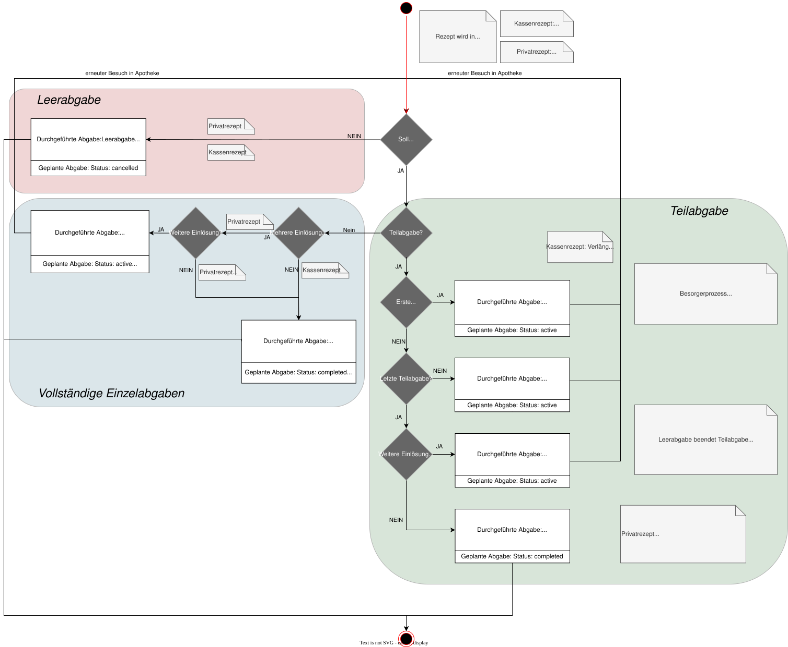

# HL7.AT.FHIR.ELGA.EMED.R4\​Technische Use Cases für Durchgeführte Abgabe schreiben (UC_eMed_09) - FHIR® v4.0.1

* [**Table of Contents**](toc.md)
* [**Overview Use Case**](overview_use_case.md)
* **​Technische Use Cases für Durchgeführte Abgabe schreiben (UC_eMed_09)**

## ​Technische Use Cases für Durchgeführte Abgabe schreiben (UC_eMed_09)

### Sub_UC_eMed_09_01 - Durchgeführte Abgabe erfassen

Der GDA (Apotheke bzw. Arzt mit Hausapotheke) dokumentiert die Abgabe eines Arzneimittels für einen ELGA-Teilnehmer in einer [Durchgeführten Abgabe](StructureDefinition-at-elga-emed-medicationdispense-durchgefuehrteabgabe.md):

* Wenn eine zugehörige [Geplante Abgabe](StructureDefinition-at-elga-emed-medicationrequest-geplanteabgabe.md) vorliegt, **MUSS** diese im Element **MedicationDispense.authorizingPrescription[geplanteAbgabe]** referenziert werden. Der zugehörige [Planeintrag](StructureDefinition-at-elga-emed-medicationrequest-planeintrag.md) **MUSS** über **MedicationDispense.authorizingPrescription[planeintrag]** referenziert werden.  
* Die maximale Anzahl an **Durchgeführten Abgaben** wird durch die Anzahl der zulässigen Einlösungen der zugehörigen **Geplanten Abgabe** bestimmt.
 
* Der Status einer **Durchgeführten Abgabe** wird durch **MedicationDispense.status** (siehe [Status des MedicationDispense in der Durchgeführten Abgabe](workflowmanagement.md#status-des-medicationdispense-in-der-durchgeführten-abgabe)) und **MedicationDispense.type** bestimmt und kann Auswirkungen auf den Status der zugehörigen **Geplanten Abgabe** haben (siehe [Abhängigkeiten der Geplanten Abgabe und der Durchgeführten Abgaben](workflowmanagement.md#abhängigkeiten-der-geplanten-abgabe-und-der-durchgeführten-abgaben)): 
* Über **MedicationDispense.type** werden Einzelabgabe, Teilabgaben, Besorgerprozess und Leerabgabe unterschieden (siehe [Durchgeführte Abgabe - Varianten der (Teil-)Abgabe](workflowmanagement.md#varianten-der-teil-abgabe)). Für Teilabgaben, Besorgerprozesse und Leerabgaben **MUSS** die jeweils vorgegebene Sequenz der zulässigen **MedicationDispense.type**-Werte eingehalten werden.
 
* Die tatsächlich abgegebene Packungsmenge **MUSS** in **MedicationDispense.quantity** angegeben werden. Die Fachanwendung prüft diese Menge jedoch nicht im Kontext einer gegebenenfalls zugrunde liegenden **Geplanten Abgabe**. Eine Einlösung gilt als vollständig, wenn für **MedicationDispense.type** den Wert **FFC (First Fill – Complete)** oder **PFC (Part Fill - Complete)** enthält. Die Anzahl der abgegebenen Packungen ist hierfür nicht maßgeblich.

#### Abgabearten

 

#### Sub_UC_eMed_09_01_01 - Vollständige Abgabe erfassen

Wenn die **Geplante Abgabe** nur eine **einmalige Einlösung** ermöglicht (z.B. Kassenrezept), **MUSS** bei einer vollständigen Abgabe die zugehörige **Durchgeführte Abgabe** mit:

* **MedicationDispense.type = FFC (First Fill – Complete)** und **MedicationDispense.status = completed** erstellt werden.

Die Fachanwendung erkennt anhand dieser Werte sowie **MedicationRequest.numberOfRepeatsAllowed** = 0 in der zugehörigen **Geplanten Abgabe**, dass keine weitere Einlösung zulässig ist und setzt den Status der **Geplanten Abgabe** auf **completed**.

Ermöglicht die **Geplante Abgabe** **mehrere Einlösungen** (**MedicationRequest.numberOfRepeatsAllowed** > 0), bleibt ihr Status solange **active**, bis die letztmögliche Einlösung erfolgt ist (siehe[Sub_UC_eMed_08_02 - Geplante Abgabe beenden (durch Fachanwendung)](Sub_UC_eMed_08.md#sub_uc_emed_08_02---geplante-abgabe-beenden-durch-fachanwendung)).

#### Relevante Elemente (MedicationDispense)

```
AtElgaEmedMedicationDispenseDurchgefuehrteAbgabe
    recorded: Datum der Erstellung der Durchgeführten Abgabe
    status: completed    
    medicationReference.reference: Tatsächlich abgegebenes Medikament // Contained Medication
    subject: Patient
    performer: veranwortlicher GDA (Apotheke) für die Durchgeführte Abgabe 
    authorizingPrescription[geplanteabgabe]: Verpflichtende Referenz auf zugehörige Geplante Abgabe
    authorizingPrescription[planeintrag]: Verpflichtende Referenz auf Planeintrag
    type: FFC (First Fill - Complete)  // Art der Abgabe
    quantity: Abgegebene Packungen      // Packungen je Einlösung
    whenHandedOver: Zeitpunkt der Arzneimittelaushändigung
    dosageInstruction: optional Dosierung + Einnahmezeitraum (ab sofort | in der Zukunft)  // angepasst an abgegebene Medikation

```

#### Sub_UC_eMed_09_01_02 - Teilabgaben erfassen

Eine Teilabgabe liegt vor, wenn die in der **Geplanten Abgabe** verordneten Arzneimenge nicht vollständig abgegeben wird, weil:

* nur ein Teil der verordneten Arzneimenge eingelöst werden soll oder
* ein Teil oder die Gesamtmenge im Rahmen des Besorgerprozesses erst später verfügbar ist (siehe [Sub_UC_eMed_09_01_02 Besorgerprozess](Sub_UC_eMed_09.md#sub_uc_emed_09_01_03-besorgerprozess))

Für jede Teilabgabe **MUSS** eine **Durchgeführte Abgabe** erstellt werden. Dabei gelten folgende Regeln:

* **MedicationDispense.type** **MUSS** 
* bei der ersten Teilabgabe den Wert **FFP (First Fill – Part Fill)**,
* bei jeder weiteren Teilabgabe den Wert **RFP (Refill Fill – Part Fill)** und
* bei der letzten Teilabgabe (**vollständige Teilabgabe**), d. h. sobald die in der **Geplanten Abgabe** verordnete Arzneimenge vollständig abgegeben wurde, den Wert **RFC (Refill – Complete)** enthalten.
 
* **MedicationDispense.status** **MUSS** den Wert **completed** besitzen.
* **MedicationDispense.quantity** **MUSS** die Anzahl der tatsächlich abgegebenen Packungen enthalten.

Die Gültigkeit einer **Geplanten Abgabe** verlängert sich im Zuge von Teilabgaben (siehe [Gültigkeit von Geplanten Abgaben basierend auf der Rezeptart](workflowmanagement.md#gültigkeit-von-geplanten-abgaben-basierend-auf-der-rezeptart)).

Sobald eine Teilabgabe durchgeführt wurde (**Part Fill**), ist die Einlösung einer weiteren Teilabgabe in einer anderen Apotheke nicht mehr möglich, d.h. die Apotheke **MUSS** die Teilabgaben mit einem **Complete** abschließen.

Vor dem Speichern einer neuen **Durchgeführten Abgabe** **MUSS** die Fachanwendung prüfen,

* ob ein zulässiger Wert für **MedicationDispense.typ** verwendet wird, und
* ob die Anzahl der **Durchgeführten Abgaben** mit **MedicationDispense.type = FFC (First Fill – Complete)** bzw. **MedicationDispense.type = RFC (Refill – Complete)** die gemäß **MedicationRequest.numberOfRepeatsAllowed** zulässige Anzahl zusätzlicher Einlösungen nicht überschreitet.

Der Status der **Geplanten Abgabe** bleibt **active**, solange weitere Einlösungen zulässig sind. Sind keine weiteren Einlösungen mehr möglich, setzt die Fachanwendung den Status der **Geplanten Abgabe** auf **completed**.

Um die durch **MedicationDispense.type** definierte Sequenz **FFP → RFP → RFC** konsistent zu halten, darf immer nur die zuletzt gespeicherte **Durchgeführte Abgabe** verworfen werden. Mehrere **Durchgeführte Abgaben** können nur sequenziell in umgekehrter Reihenfolge ihrer Erstellung verworfen werden.

#### Relevante Elemente (MedicationDispense)

```
AtElgaEmedMedicationDispenseDurchgefuehrteAbgabe
    recorded: Datum der Erstellung der Durchgeführten Abgabe
    status: completed    
    medicationReference.reference: Tatsächlich abgegebenes Medikament // Contained Medication
    subject: Patient
    performer: veranwortlicher GDA (Apotheke) für die Durchgeführte Abgabe 
    authorizingPrescription[geplanteabgabe]: Verpflichtende Referenz auf zugehörige Geplante Abgabe
    authorizingPrescription[planeintrag]: Verpflichtende Referenz auf Planeintrag
    type: FFC (First Fill - Complete) | (Refill - Part Fill) | RFC (Refill - Complete)  // 1. Teilabgabe, weitere Teilabgabe, letzte Teilabgabe
    quantity: Abgegebene Packungen  // je Teilabgabe       
    whenHandedOver: Der Zeitpunkt, zu dem das abgegebene Produkt ausgehändigt wurde
    dosageInstruction: optional Dosierung + Einnahmezeitraum (ab sofort | in der Zukunft)  // angepasst an abgegebene Medikation

```

#### Sub_UC_eMed_09_01_03 - Besorgerprozess

Ein Besorgerprozess liegt vor, wenn das in der **Geplanten Abgabe** verordnete Arzneimittel vollständig bestellt oder zubereitet werden muss.

Werden hingegen Arzneimittel teilweise bereits abgegeben (und nur ein Teil bestellt oder zubereitet), liegt eine Teilabgabe vor (siehe [Sub_UC_eMed_09_01_02 Teilabgaben](Sub_UC_eMed_09.md#sub_uc_emed_09_01_02-teilabgaben)).

Zu Beginn des Besorgerprozesses **MUSS**, entsprechend den Regeln für Teilabgaben, eine **Durchgeführte Abgabe** mit:

* **MedicationDispense.type = FFP (First Fill – Part Fill)**, **MedicationDispense.status = completed** erstellt werden.
* Die abgegebenen Packungen (**MedicationDispense.quantity**) werden mit 0 dokumentiert. Die **Geplanten Abgabe** kann daraufhin nicht mehr in einer anderen Apotheke eingelöst werden.

Wird das bestellte/zubereitete Arzneimittel ausgehändigt, wird eine weitere **Durchgeführte Abgabe** erstellt mit:

* **MedicationDispense.type = RFC (Refill - Complete)**, **MedicationDispense.status = completed**.
* **MedicationDispense.quantity** **MUSS** die Anzahl der tatsächlich abgegebenen Packungen enthalten.

Die zugehörige **Geplante Abgabe** bleibt so lange im Status **active**, bis eine Durchgeführte Abgabe mit einem **completed** Status gespeichert wird, danach setzt die Fachanwendung den Status der **Geplante Abgabe** ebenfalls auch **completed**. Der Besorgerprozess und die Abgabe ist damit abgeschlossen.

#### Sub_UC_eMed_09_01_05 Leerabgabe erfassen

In Arbeit.

#### Relevante Elemente (MedicationDispense)

```
AtElgaEmedMedicationDispenseDurchgefuehrteAbgabe
    recorded: Datum der Erstellung der Durchgeführten Abgabe
    status: cancelled     
    medicationReference.reference: Tatsächlich abgegebenes Medikament // Contained Medication
    performer: veranwortlicher GDA (Apotheke) für die Durchgeführte Abgabe 
    authorizingPrescription[geplanteabgabe]: Verpflichtende Referenz auf zugehörige Geplante Abgabe
    authorizingPrescription[planeintrag]: Verpflichtende Referenz auf Planeintrag
    type: FFC (First Fill - Complete) | (Refill - Part Fill) | RFC (Refill - Complete)  // Leerabgabe beendet Einzelabgabe | Leerabgabe beendet eine Teilabgabe | Leerabgabe beendet alle Teilabgaben
    quantity: 0     // Packungen
    //whenHandedOver: Der Zeitpunkt, zu dem das abgegebene Produkt ausgehändigt wurde 
    dosageInstruction: Dosierung + Einnahmezeitraum (ab sofort | in der Zukunft)  // angepasst an abgegebene Medikation 

```

#### Sub_UC_eMed_09_01_04 - Abgabe ohne Bezug zu einer Geplanten Abgabe erfassen (ohne Verordnung / OTC Abgabe)

In Arbeit. <!– In folgenden Fällen liegt bei der Erfassung einer **Durchgeführten Abgabe** keine zugehörige **Durchgeführte Abgabe** vor:

* OTC Abgabe (rezeptfrei): Ein rezeptfreies Medikament wurde abgegeben. 
* Für wechselwirkungsrelevante Medikamente (aus ASP-Liste) **SOLL** eine **Durchgeführte Abgabe** erstellt werden.
* Ein Planeintrag für Wechselwirkungsrelevante Medikatmente **KANN** nacherfasst werden. In der **Durchgeführten Abgabe** **KANN** im nachhinein der Planeintrag (in **MedicationDispense.authorizingPrescription[planeintrag]**) referenziert werden.
 
* Notabgabe: Ein rezeptpflichtiges Medikament wurde ohne zugrundeliegende geplante Abgabe abgegeben (z.B. die Dokumentation ist nur in e-Rezept erfolgt). 
* Für Notabgaben **MUSS** eine **Durchgeführte Abgabe** erstellt werden.
* Ein Planeintrag **KANN** nacherfasst werden. In der **Durchgeführten Abgabe** kann im nachhinein der Planeintrag (in **MedicationDispense.authorizingPrescription[planeintrag]**) referenziert werden.
 
* Rezept wird nachgebracht: Ein rezeptpflichtiges Medikament wurde ohne zugrundeliegende geplante Abgabe abgegeben (z.B. die Dokumentation ist nur in e-Rezept erfolgt).

Eine **Durchgeführte Abgabe** kann nacherfasst werden, wenn das Arzneimittel bereits abgegeben wurde, - aber eine Speicherung zum Zeitpunkt der Abgabe aus technischen Gründen nicht möglich war - der Arzneimittelbezug aus dem Ausland erfolgt ist (Element **recorded** abweichend von **whenHandedOver**) - wenn ein e-Rezept-Eintrag oder ein Papierrezept vorhanden ist und keine Geplante Abgabe in e-Medikation eingetragen wurden.

Medikament wurde abgegeben oder reserviert, das formale Rezept wird später nachgereicht. Planeintrag für Wechselwirkungsrelevante Medikatmente soll nacherfasst werden. –>

#### Sub_UC_eMed_09_01_07 Durchgeführte Abgabe mit Substitution eines Arzneimittels erfassen

Eine Substitution eines Arzneimittels ist nur implizit ersichtich, durch die Referenz auf die zugehörige Geplante Abgabe bzw. den Planeintrag.

### Sub_UC_eMed_09_02 - Durchgeführte Abgabe verwerfen

Ein GDA (Apotheke) kann von ihm erstellte [Durchgeführte Abgaben](design_choices.md#durchgeführte-abgabe-AtElgaEmedMedicationDispenseDurchgefuehrteAbgabe-medicationdispense), die sich im Status **completed** oder **cancelled** befinden, aufgrund eines Fehlers verwerfen.

Um eine **Durchgeführte Abgabe** zu verwerfen, ruft der GDA diese mittels GET MedicationDispense ab und bearbeitet diese wie folgt:

* Der Status wird auf **entered-in-error** gesetzt,
* der verantwortliche GDA (**requester**) und das Datum in **recorded** werden entsprechend aktualisiert.

Eine verworfene **Durchgeführte Abgabe** kann nicht mehr bearbeitet werden und ist nur noch aber über die Historie einsehbar. Wenn eine verworfene **Durchgeführte Abgabe** Teil eines e-Rezepts mit weiteren **Geplanten Abgaben** ist (gleicher **e-Med GroupIdentifier**), wirkt sich dies nicht auf den Status der anderen Geplanten Abgaben aus. 

### Sub_UC_eMed_09_03 - Durchgeführte Abgabe löschen (durch ELGA-Teilnehmer)

Der ELGA-Teilnehmer kann eine **Durchgeführte Abgabe** endgültig löschen.

Die Löschung der **Durchgeführten Abgabe** umfasst:

* die fachliche Entfernung der betreffenden **MedicationDispense-Ressource** sowie
* die Entfernung aller zugehörigen historischen Ressourcenversionen (**_history**).

Zum Löschen einer **Durchgeführte Abgabe** ruft der ELGA-Teilnehmer die betreffende **Durchgeführte Abgabe** im ELGA-Portal auf. Dieses führt zunächst eine Leseoperation auf die betreffende MedicationDispense-Ressource aus (GET MedicationDispense/[id]) und löscht anschließend die betreffende Geplante Abgabe mittels DELETE (DELETE [base]/MedicationDispense/[id]).

Die Ressource einschließlich aller historischen Versionen darf nach erfolgreicher Löschung weder über reguläre FHIR-Interaktionen noch über administrative Schnittstellen abrufbar sein. 

