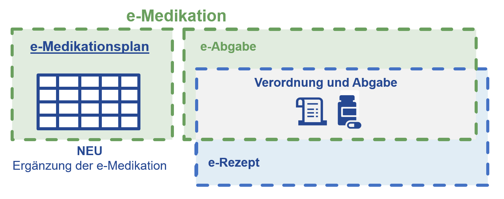

# HL7.AT.FHIR.ELGA.EMED.R4\Home - FHIR® v4.0.1

* [**Table of Contents**](toc.md)
* **Home**

## Home

# e-Medikation (v4)

Der vorliegende **FHIR Implementation Guide e‑Medikation Version 4** ersetzt die bestehende, auf CDA basierende Version 2 der e‑Medikation.

* Mit Version 4 wird die bestehende Umsetzung der e‑Medikation um die Funktionalität des e‑Medikationsplans ergänzt.
* Darüber hinaus sollen alle **Geplanten** und **Durchgeführten Abgaben** von Medikamenten in der e-Abgabe als Teil von e-Medikation abgebildet werden.

Der **e‑Medikationsplan** bietet Behandler:innen und Patient:innen eine vollständige, strukturierte Übersicht über die aktuelle sowie die historische Medikation. Zentrales Element ist die Verordnung, welche im jeweiligen e‑Medikationsplaneintrag mit sämtlichen relevanten Einnahmedetails digital abgebildet wird. Diese Verordnung bildet die Grundlage für die Folgeprozesse Weiterverordnung, Rezeptierung und Abgabe. Die Einsicht in **Geplante** und **Durchgeführte Abgaben** (mit und ohne Medikationsplanbezug) in **e-Abgabe** soll die Vollständigkeit der Information zur Medikation gewährleisten.

Die Einführung des E-Medikationsplans gewährleistet, dass alle für die Therapieentscheidung relevanten Informationen verfügbar sind, Doppelverordnungen vermieden werden und die Patient:innensicherheit erhöht wird. Darüber hinaus fungiert der e‑Medikationsplan als Datengrundlage für die automatisierte Übernahme relevanter Medikationsinformationen in die **ELGA Patient Summary**.



Die technische Umsetzung des E-Medikationsplans sowie der e-Abgabe erfolgt auf Basis des HL7® FHIR®-Standards, um eine nachhaltige, interoperable und kosteneffiziente Lösung zu gewährleisten. Die vorliegende Implementierung leistet einen Beitrag zur Weiterentwicklung sowohl der österreichischen eHealth-Strategie als auch der Anforderungen des European Health Data Space (EHDS).

Der Implementation Guide umfasst zudem die Definition der FHIR-APIs für die Integration der e-Medikation in die ELGA-Infrastruktur.


## Resource Content

```json
{
  "resourceType" : "ImplementationGuide",
  "id" : "hl7.at.fhir.elga.emed.r4",
  "url" : "https://fhir.hl7.at/elga/emed/r4/ImplementationGuide/hl7.at.fhir.elga.emed.r4",
  "version" : "0.1.1",
  "name" : "ELGAeMedikationR4",
  "title" : "ELGA e-Medikation (R4) DRAFT",
  "status" : "draft",
  "date" : "2026-09-03T18:40:45+00:00",
  "publisher" : "ELGA GmbH",
  "contact" : [{
    "name" : "ELGA GmbH",
    "telecom" : [{
      "system" : "url",
      "value" : "http://elga.gv.at"
    }]
  },
  {
    "name" : "ELGA GmbH",
    "telecom" : [{
      "system" : "url",
      "value" : "https://elga.gv.at",
      "use" : "work"
    }]
  }],
  "description" : "The FHIR® implementation guide ELGA e-Medikation (R4)",
  "packageId" : "hl7.at.fhir.elga.emed.r4",
  "license" : "CC0-1.0",
  "fhirVersion" : ["4.0.1"],
  "dependsOn" : [{
    "id" : "hl7tx",
    "extension" : [{
      "url" : "http://hl7.org/fhir/tools/StructureDefinition/implementationguide-dependency-comment",
      "valueMarkdown" : "Automatically added as a dependency - all IGs depend on HL7 Terminology"
    }],
    "uri" : "http://terminology.hl7.org/ImplementationGuide/hl7.terminology",
    "packageId" : "hl7.terminology.r4",
    "version" : "7.3.0"
  },
  {
    "id" : "hl7ext",
    "extension" : [{
      "url" : "http://hl7.org/fhir/tools/StructureDefinition/implementationguide-dependency-comment",
      "valueMarkdown" : "Automatically added as a dependency - all IGs depend on the HL7 Extension Pack"
    }],
    "uri" : "http://hl7.org/fhir/extensions/ImplementationGuide/hl7.fhir.uv.extensions",
    "packageId" : "hl7.fhir.uv.extensions.r4",
    "version" : "5.3.0"
  },
  {
    "id" : "hl7_fhir_eu_mpd",
    "uri" : "http://hl7.eu/fhir/mpd/ImplementationGuide/hl7.fhir.eu.mpd",
    "packageId" : "hl7.fhir.eu.mpd",
    "version" : "0.1.0-ballot"
  },
  {
    "id" : "hl7_at_fhir_core_r4",
    "uri" : "http://hl7.at/fhir/HL7ATCoreProfiles/4.0.1/ImplementationGuide/hl7.at.fhir.core.r4",
    "packageId" : "hl7.at.fhir.core.r4",
    "version" : "2.0.0"
  },
  {
    "id" : "hl7_fhir_uv_xver_r5_r4",
    "uri" : "http://hl7.org/fhir/uv/xver/ImplementationGuide/hl7.fhir.uv.xver-r5.r4",
    "packageId" : "hl7.fhir.uv.xver-r5.r4",
    "version" : "0.1.0"
  },
  {
    "id" : "ihe_pharm_mpd_r4",
    "uri" : "https://profiles.ihe.net/PHARM/MPD/ImplementationGuide/ihe.pharm.mpd",
    "packageId" : "ihe.pharm.mpd.r4",
    "version" : "1.0.0-comment-2"
  },
  {
    "id" : "hl7_at_fhir_elga_core_r4",
    "uri" : "https://fhir.hl7.at/elga/core/r4/ImplementationGuide/hl7.at.fhir.elga.core.r4",
    "packageId" : "hl7.at.fhir.elga.core.r4",
    "version" : "current"
  }],
  "definition" : {
    "extension" : [{
      "extension" : [{
        "url" : "code",
        "valueString" : "copyrightyear"
      },
      {
        "url" : "value",
        "valueString" : "2025+"
      }],
      "url" : "http://hl7.org/fhir/tools/StructureDefinition/ig-parameter"
    },
    {
      "extension" : [{
        "url" : "code",
        "valueString" : "releaselabel"
      },
      {
        "url" : "value",
        "valueString" : "ci-build"
      }],
      "url" : "http://hl7.org/fhir/tools/StructureDefinition/ig-parameter"
    },
    {
      "extension" : [{
        "url" : "code",
        "valueString" : "excludettl"
      },
      {
        "url" : "value",
        "valueString" : "true"
      }],
      "url" : "http://hl7.org/fhir/tools/StructureDefinition/ig-parameter"
    },
    {
      "extension" : [{
        "url" : "code",
        "valueString" : "no-ig-database"
      },
      {
        "url" : "value",
        "valueString" : "true"
      }],
      "url" : "http://hl7.org/fhir/tools/StructureDefinition/ig-parameter"
    },
    {
      "extension" : [{
        "url" : "code",
        "valueString" : "autoload-resources"
      },
      {
        "url" : "value",
        "valueString" : "true"
      }],
      "url" : "http://hl7.org/fhir/tools/StructureDefinition/ig-parameter"
    },
    {
      "extension" : [{
        "url" : "code",
        "valueString" : "path-liquid"
      },
      {
        "url" : "value",
        "valueString" : "template/liquid"
      }],
      "url" : "http://hl7.org/fhir/tools/StructureDefinition/ig-parameter"
    },
    {
      "extension" : [{
        "url" : "code",
        "valueString" : "path-liquid"
      },
      {
        "url" : "value",
        "valueString" : "input/liquid"
      }],
      "url" : "http://hl7.org/fhir/tools/StructureDefinition/ig-parameter"
    },
    {
      "extension" : [{
        "url" : "code",
        "valueString" : "path-qa"
      },
      {
        "url" : "value",
        "valueString" : "temp/qa"
      }],
      "url" : "http://hl7.org/fhir/tools/StructureDefinition/ig-parameter"
    },
    {
      "extension" : [{
        "url" : "code",
        "valueString" : "path-temp"
      },
      {
        "url" : "value",
        "valueString" : "temp/pages"
      }],
      "url" : "http://hl7.org/fhir/tools/StructureDefinition/ig-parameter"
    },
    {
      "extension" : [{
        "url" : "code",
        "valueString" : "path-output"
      },
      {
        "url" : "value",
        "valueString" : "output"
      }],
      "url" : "http://hl7.org/fhir/tools/StructureDefinition/ig-parameter"
    },
    {
      "extension" : [{
        "url" : "code",
        "valueString" : "path-suppressed-warnings"
      },
      {
        "url" : "value",
        "valueString" : "input/ignoreWarnings.txt"
      }],
      "url" : "http://hl7.org/fhir/tools/StructureDefinition/ig-parameter"
    },
    {
      "extension" : [{
        "url" : "code",
        "valueString" : "path-history"
      },
      {
        "url" : "value",
        "valueString" : "https://fhir.hl7.at/elga/emed/r4/history.html"
      }],
      "url" : "http://hl7.org/fhir/tools/StructureDefinition/ig-parameter"
    },
    {
      "extension" : [{
        "url" : "code",
        "valueString" : "template-html"
      },
      {
        "url" : "value",
        "valueString" : "template-page.html"
      }],
      "url" : "http://hl7.org/fhir/tools/StructureDefinition/ig-parameter"
    },
    {
      "extension" : [{
        "url" : "code",
        "valueString" : "template-md"
      },
      {
        "url" : "value",
        "valueString" : "template-page-md.html"
      }],
      "url" : "http://hl7.org/fhir/tools/StructureDefinition/ig-parameter"
    },
    {
      "extension" : [{
        "url" : "code",
        "valueString" : "apply-contact"
      },
      {
        "url" : "value",
        "valueString" : "true"
      }],
      "url" : "http://hl7.org/fhir/tools/StructureDefinition/ig-parameter"
    },
    {
      "extension" : [{
        "url" : "code",
        "valueString" : "apply-context"
      },
      {
        "url" : "value",
        "valueString" : "true"
      }],
      "url" : "http://hl7.org/fhir/tools/StructureDefinition/ig-parameter"
    },
    {
      "extension" : [{
        "url" : "code",
        "valueString" : "apply-copyright"
      },
      {
        "url" : "value",
        "valueString" : "true"
      }],
      "url" : "http://hl7.org/fhir/tools/StructureDefinition/ig-parameter"
    },
    {
      "extension" : [{
        "url" : "code",
        "valueString" : "apply-jurisdiction"
      },
      {
        "url" : "value",
        "valueString" : "true"
      }],
      "url" : "http://hl7.org/fhir/tools/StructureDefinition/ig-parameter"
    },
    {
      "extension" : [{
        "url" : "code",
        "valueString" : "apply-license"
      },
      {
        "url" : "value",
        "valueString" : "true"
      }],
      "url" : "http://hl7.org/fhir/tools/StructureDefinition/ig-parameter"
    },
    {
      "extension" : [{
        "url" : "code",
        "valueString" : "apply-publisher"
      },
      {
        "url" : "value",
        "valueString" : "true"
      }],
      "url" : "http://hl7.org/fhir/tools/StructureDefinition/ig-parameter"
    },
    {
      "extension" : [{
        "url" : "code",
        "valueString" : "apply-version"
      },
      {
        "url" : "value",
        "valueString" : "true"
      }],
      "url" : "http://hl7.org/fhir/tools/StructureDefinition/ig-parameter"
    },
    {
      "extension" : [{
        "url" : "code",
        "valueString" : "apply-wg"
      },
      {
        "url" : "value",
        "valueString" : "true"
      }],
      "url" : "http://hl7.org/fhir/tools/StructureDefinition/ig-parameter"
    },
    {
      "extension" : [{
        "url" : "code",
        "valueString" : "active-tables"
      },
      {
        "url" : "value",
        "valueString" : "true"
      }],
      "url" : "http://hl7.org/fhir/tools/StructureDefinition/ig-parameter"
    },
    {
      "extension" : [{
        "url" : "code",
        "valueString" : "fmm-definition"
      },
      {
        "url" : "value",
        "valueString" : "http://hl7.org/fhir/versions.html#maturity"
      }],
      "url" : "http://hl7.org/fhir/tools/StructureDefinition/ig-parameter"
    },
    {
      "extension" : [{
        "url" : "code",
        "valueString" : "propagate-status"
      },
      {
        "url" : "value",
        "valueString" : "true"
      }],
      "url" : "http://hl7.org/fhir/tools/StructureDefinition/ig-parameter"
    },
    {
      "extension" : [{
        "url" : "code",
        "valueString" : "excludelogbinaryformat"
      },
      {
        "url" : "value",
        "valueString" : "true"
      }],
      "url" : "http://hl7.org/fhir/tools/StructureDefinition/ig-parameter"
    },
    {
      "extension" : [{
        "url" : "code",
        "valueString" : "tabbed-snapshots"
      },
      {
        "url" : "value",
        "valueString" : "true"
      }],
      "url" : "http://hl7.org/fhir/tools/StructureDefinition/ig-parameter"
    },
    {
      "url" : "http://hl7.org/fhir/tools/StructureDefinition/ig-internal-dependency",
      "valueCode" : "hl7.fhir.uv.tools.r4#1.1.2"
    },
    {
      "extension" : [{
        "url" : "code",
        "valueCode" : "copyrightyear"
      },
      {
        "url" : "value",
        "valueString" : "2025+"
      }],
      "url" : "http://hl7.org/fhir/tools/StructureDefinition/ig-parameter"
    },
    {
      "extension" : [{
        "url" : "code",
        "valueCode" : "releaselabel"
      },
      {
        "url" : "value",
        "valueString" : "ci-build"
      }],
      "url" : "http://hl7.org/fhir/tools/StructureDefinition/ig-parameter"
    },
    {
      "extension" : [{
        "url" : "code",
        "valueCode" : "excludettl"
      },
      {
        "url" : "value",
        "valueString" : "true"
      }],
      "url" : "http://hl7.org/fhir/tools/StructureDefinition/ig-parameter"
    },
    {
      "extension" : [{
        "url" : "code",
        "valueCode" : "no-ig-database"
      },
      {
        "url" : "value",
        "valueString" : "true"
      }],
      "url" : "http://hl7.org/fhir/tools/StructureDefinition/ig-parameter"
    },
    {
      "extension" : [{
        "url" : "code",
        "valueCode" : "autoload-resources"
      },
      {
        "url" : "value",
        "valueString" : "true"
      }],
      "url" : "http://hl7.org/fhir/tools/StructureDefinition/ig-parameter"
    },
    {
      "extension" : [{
        "url" : "code",
        "valueCode" : "path-liquid"
      },
      {
        "url" : "value",
        "valueString" : "template/liquid"
      }],
      "url" : "http://hl7.org/fhir/tools/StructureDefinition/ig-parameter"
    },
    {
      "extension" : [{
        "url" : "code",
        "valueCode" : "path-liquid"
      },
      {
        "url" : "value",
        "valueString" : "input/liquid"
      }],
      "url" : "http://hl7.org/fhir/tools/StructureDefinition/ig-parameter"
    },
    {
      "extension" : [{
        "url" : "code",
        "valueCode" : "path-qa"
      },
      {
        "url" : "value",
        "valueString" : "temp/qa"
      }],
      "url" : "http://hl7.org/fhir/tools/StructureDefinition/ig-parameter"
    },
    {
      "extension" : [{
        "url" : "code",
        "valueCode" : "path-temp"
      },
      {
        "url" : "value",
        "valueString" : "temp/pages"
      }],
      "url" : "http://hl7.org/fhir/tools/StructureDefinition/ig-parameter"
    },
    {
      "extension" : [{
        "url" : "code",
        "valueCode" : "path-output"
      },
      {
        "url" : "value",
        "valueString" : "output"
      }],
      "url" : "http://hl7.org/fhir/tools/StructureDefinition/ig-parameter"
    },
    {
      "extension" : [{
        "url" : "code",
        "valueCode" : "path-suppressed-warnings"
      },
      {
        "url" : "value",
        "valueString" : "input/ignoreWarnings.txt"
      }],
      "url" : "http://hl7.org/fhir/tools/StructureDefinition/ig-parameter"
    },
    {
      "extension" : [{
        "url" : "code",
        "valueCode" : "path-history"
      },
      {
        "url" : "value",
        "valueString" : "https://fhir.hl7.at/elga/emed/r4/history.html"
      }],
      "url" : "http://hl7.org/fhir/tools/StructureDefinition/ig-parameter"
    },
    {
      "extension" : [{
        "url" : "code",
        "valueCode" : "template-html"
      },
      {
        "url" : "value",
        "valueString" : "template-page.html"
      }],
      "url" : "http://hl7.org/fhir/tools/StructureDefinition/ig-parameter"
    },
    {
      "extension" : [{
        "url" : "code",
        "valueCode" : "template-md"
      },
      {
        "url" : "value",
        "valueString" : "template-page-md.html"
      }],
      "url" : "http://hl7.org/fhir/tools/StructureDefinition/ig-parameter"
    },
    {
      "extension" : [{
        "url" : "code",
        "valueCode" : "apply-contact"
      },
      {
        "url" : "value",
        "valueString" : "true"
      }],
      "url" : "http://hl7.org/fhir/tools/StructureDefinition/ig-parameter"
    },
    {
      "extension" : [{
        "url" : "code",
        "valueCode" : "apply-context"
      },
      {
        "url" : "value",
        "valueString" : "true"
      }],
      "url" : "http://hl7.org/fhir/tools/StructureDefinition/ig-parameter"
    },
    {
      "extension" : [{
        "url" : "code",
        "valueCode" : "apply-copyright"
      },
      {
        "url" : "value",
        "valueString" : "true"
      }],
      "url" : "http://hl7.org/fhir/tools/StructureDefinition/ig-parameter"
    },
    {
      "extension" : [{
        "url" : "code",
        "valueCode" : "apply-jurisdiction"
      },
      {
        "url" : "value",
        "valueString" : "true"
      }],
      "url" : "http://hl7.org/fhir/tools/StructureDefinition/ig-parameter"
    },
    {
      "extension" : [{
        "url" : "code",
        "valueCode" : "apply-license"
      },
      {
        "url" : "value",
        "valueString" : "true"
      }],
      "url" : "http://hl7.org/fhir/tools/StructureDefinition/ig-parameter"
    },
    {
      "extension" : [{
        "url" : "code",
        "valueCode" : "apply-publisher"
      },
      {
        "url" : "value",
        "valueString" : "true"
      }],
      "url" : "http://hl7.org/fhir/tools/StructureDefinition/ig-parameter"
    },
    {
      "extension" : [{
        "url" : "code",
        "valueCode" : "apply-version"
      },
      {
        "url" : "value",
        "valueString" : "true"
      }],
      "url" : "http://hl7.org/fhir/tools/StructureDefinition/ig-parameter"
    },
    {
      "extension" : [{
        "url" : "code",
        "valueCode" : "apply-wg"
      },
      {
        "url" : "value",
        "valueString" : "true"
      }],
      "url" : "http://hl7.org/fhir/tools/StructureDefinition/ig-parameter"
    },
    {
      "extension" : [{
        "url" : "code",
        "valueCode" : "active-tables"
      },
      {
        "url" : "value",
        "valueString" : "true"
      }],
      "url" : "http://hl7.org/fhir/tools/StructureDefinition/ig-parameter"
    },
    {
      "extension" : [{
        "url" : "code",
        "valueCode" : "fmm-definition"
      },
      {
        "url" : "value",
        "valueString" : "http://hl7.org/fhir/versions.html#maturity"
      }],
      "url" : "http://hl7.org/fhir/tools/StructureDefinition/ig-parameter"
    },
    {
      "extension" : [{
        "url" : "code",
        "valueCode" : "propagate-status"
      },
      {
        "url" : "value",
        "valueString" : "true"
      }],
      "url" : "http://hl7.org/fhir/tools/StructureDefinition/ig-parameter"
    },
    {
      "extension" : [{
        "url" : "code",
        "valueCode" : "excludelogbinaryformat"
      },
      {
        "url" : "value",
        "valueString" : "true"
      }],
      "url" : "http://hl7.org/fhir/tools/StructureDefinition/ig-parameter"
    },
    {
      "extension" : [{
        "url" : "code",
        "valueCode" : "tabbed-snapshots"
      },
      {
        "url" : "value",
        "valueString" : "true"
      }],
      "url" : "http://hl7.org/fhir/tools/StructureDefinition/ig-parameter"
    }],
    "grouping" : [{
      "id" : "Medikationsplan",
      "name" : "Medikationsplan",
      "description" : "Medikationsplan"
    },
    {
      "id" : "GeplanteAbgabe",
      "name" : "Geplante Abgabe",
      "description" : "Geplante Abgabe"
    },
    {
      "id" : "DurchgefuehrteAbgabe",
      "name" : "Durchgeführte Abgabe",
      "description" : "Durchgeführte Abgabe"
    },
    {
      "id" : "Medikation",
      "name" : "Medikation",
      "description" : "Medikation"
    },
    {
      "id" : "Dosierungen",
      "name" : "Dosierungen",
      "description" : "Dosierungsvarianten"
    }],
    "resource" : [{
      "extension" : [{
        "url" : "http://hl7.org/fhir/tools/StructureDefinition/resource-information",
        "valueString" : "StructureDefinition:complex-type"
      },
      {
        "url" : "http://hl7.org/fhir/StructureDefinition/implementationguide-page",
        "valueUri" : "StructureDefinition-at-elga-emed-dosage-dosierung.html"
      }],
      "reference" : {
        "reference" : "StructureDefinition/at-elga-emed-dosage-dosierung"
      },
      "name" : "AT ELGA e-Medikation Dosage Dosierung",
      "description" : "AT ELGA e-Medikation Dosage Dosierung",
      "exampleBoolean" : false,
      "groupingId" : "Dosierungen"
    },
    {
      "extension" : [{
        "url" : "http://hl7.org/fhir/tools/StructureDefinition/resource-information",
        "valueString" : "StructureDefinition:extension"
      },
      {
        "url" : "http://hl7.org/fhir/StructureDefinition/implementationguide-page",
        "valueUri" : "StructureDefinition-at-elga-emed-extension-dosage-category.html"
      }],
      "reference" : {
        "reference" : "StructureDefinition/at-elga-emed-extension-dosage-category"
      },
      "name" : "AT ELGA e-Medikation Extension Dosierungskategorie",
      "description" : "AT ELGA e-Medikation Extension Dosierungskategorie",
      "exampleBoolean" : false
    },
    {
      "extension" : [{
        "url" : "http://hl7.org/fhir/tools/StructureDefinition/resource-information",
        "valueString" : "StructureDefinition:resource"
      },
      {
        "url" : "http://hl7.org/fhir/StructureDefinition/implementationguide-page",
        "valueUri" : "StructureDefinition-at-elga-emed-list-medikationsplan.html"
      }],
      "reference" : {
        "reference" : "StructureDefinition/at-elga-emed-list-medikationsplan"
      },
      "name" : "AT ELGA e-Medikation List Medikationsplan",
      "description" : "Der Medikationsplan eines ELGA-Teilnehmers bzw. einer ELGA-Teilnehmerin wird durch eine List-Ressource abgebildet. \nDiese enthält 0..* Einträge (List.entry), wobei jeder Entry genau eine Referenz auf einen Medikationsplaneintrag (MedicationRequest) in List.entry.item beinhaltet.\nDie Reihenfolge der Einträge kann durch den GDA festgelegt werden. Jeder Listeneintrag enthält im Element List.entry.flag den Änderungsstatus des jeweiligen Medikationsplaneintrags.",
      "exampleBoolean" : false,
      "groupingId" : "Medikationsplan"
    },
    {
      "extension" : [{
        "url" : "http://hl7.org/fhir/tools/StructureDefinition/resource-information",
        "valueString" : "StructureDefinition:resource"
      },
      {
        "url" : "http://hl7.org/fhir/StructureDefinition/implementationguide-page",
        "valueUri" : "StructureDefinition-at-elga-emed-medication-medikation.html"
      }],
      "reference" : {
        "reference" : "StructureDefinition/at-elga-emed-medication-medikation"
      },
      "name" : "AT ELGA e-Medikation Medication Medikation",
      "description" : "Bildet ein Arzneimittel in der \"Medication\"-Ressource ab. Wird grundsätzlich verwendet in Planeintrag, Geplanter Abgabe und Durchgeführter Abgabe.",
      "exampleBoolean" : false,
      "groupingId" : "Medikation"
    },
    {
      "extension" : [{
        "url" : "http://hl7.org/fhir/tools/StructureDefinition/resource-information",
        "valueString" : "StructureDefinition:resource"
      },
      {
        "url" : "http://hl7.org/fhir/StructureDefinition/implementationguide-page",
        "valueUri" : "StructureDefinition-at-elga-emed-medicationdispense-durchgefuehrteabgabe.html"
      }],
      "reference" : {
        "reference" : "StructureDefinition/at-elga-emed-medicationdispense-durchgefuehrteabgabe"
      },
      "name" : "AT ELGA e-Medikation MedicationDispense Durchgeführte Abgabe",
      "description" : "Dokumentiert eine \"Durchgeführte Abgabe\" eines Arzneimittels (\"MedicationDispense\"-Ressource). \nDie \"Durchgeführte Abgabe\" enthält die abgegebene Medikation und deren Dosierung und dient somit der Nachvollziehbarkeit der abgegebenen Arzneimittel in der e-Medikation. \nEs können Abweichungen zur \"Geplanten Abgabe\" hinsichtlich des Medikaments und dessen Dosierung dokumentiert werden.\nSofern eine zugehörige \"Geplanten Abgabe\" vorliegt, muss diese mit dem zugehörigen Planeintrag referenziert werden. Eine mögliche Substitution des Medikaments ist implizit, durch die Referenz auf die zugehörige \"Geplante Abgabe\", ersichtlich.\nDer aktuelle Status einer \"Durchgeführten Abgabe\" wird mittels \"status\"- und \"type\"-Element dokumentiert. Es werden R5-Backport-Extensions verwendet.",
      "exampleBoolean" : false,
      "groupingId" : "DurchgefuehrteAbgabe"
    },
    {
      "extension" : [{
        "url" : "http://hl7.org/fhir/tools/StructureDefinition/resource-information",
        "valueString" : "StructureDefinition:resource"
      },
      {
        "url" : "http://hl7.org/fhir/StructureDefinition/implementationguide-page",
        "valueUri" : "StructureDefinition-at-elga-emed-medicationrequest-base.html"
      }],
      "reference" : {
        "reference" : "StructureDefinition/at-elga-emed-medicationrequest-base"
      },
      "name" : "At ELGA e-Medikation MedicationRequest Base",
      "description" : "Die Basis für alle in eMed verwendeten MedicationRequests",
      "exampleBoolean" : false
    },
    {
      "extension" : [{
        "url" : "http://hl7.org/fhir/tools/StructureDefinition/resource-information",
        "valueString" : "StructureDefinition:resource"
      },
      {
        "url" : "http://hl7.org/fhir/StructureDefinition/implementationguide-page",
        "valueUri" : "StructureDefinition-at-elga-emed-medicationrequest-geplanteabgabe.html"
      }],
      "reference" : {
        "reference" : "StructureDefinition/at-elga-emed-medicationrequest-geplanteabgabe"
      },
      "name" : "At ELGA e-Medikation MedicationRequest Geplante Abgabe",
      "description" : "Bildet eine \"Geplante Abgabe\" eines Arzneimittels aus dem zugrundeliegenden Medikationsplaneintrag des ELGA-Teilnehmers ab (\"MedicationRequest\"-Ressource mit Kategorie \"Geplante Abgabe\"):\nSie enthält die verordnete Medikation und deren Dosierung und spielgelt die Inhalte des e-Rezepts wider. Geplante Abgaben dienen somit der Nachvollziehbarkeit der rezeptierten Arzneimittel in der e-Medikation. \nWerden mehrere Medikamente gleichzeitig verordnet und sollen demselben e-Rezept zugeordnet sein, wird für jedes Medikament eine \"Geplante Abgabe\" mit demselben \"e-Med GroupIdentifier\" erstellt (bildet 'Rezept-Klammer'). \nEs werden R5-Backport-Extensions verwendet.",
      "exampleBoolean" : false,
      "groupingId" : "GeplanteAbgabe"
    },
    {
      "extension" : [{
        "url" : "http://hl7.org/fhir/tools/StructureDefinition/resource-information",
        "valueString" : "StructureDefinition:resource"
      },
      {
        "url" : "http://hl7.org/fhir/StructureDefinition/implementationguide-page",
        "valueUri" : "StructureDefinition-at-elga-emed-medicationrequest-planeintrag.html"
      }],
      "reference" : {
        "reference" : "StructureDefinition/at-elga-emed-medicationrequest-planeintrag"
      },
      "name" : "At ELGA e-Medikation MedicationRequest Planeintrag",
      "description" : "Ein Medikationsplaneintrag im Medikationsplan eines ELGA-Teilnehmers bzw. einer ELGA-Teilnehmerin wird durch eine \"MedicationRequest\"-Ressource abgebildet.\nDie Ressource enthält genau ein Medikament mit der zugehörigen Dosierung, wobei das Medikament verpflichtend in einer contained Medication-Ressource (inline, d.h. innerhalb der Ressource), dokumentiert wird.\nDer Medikationsplaneintrag kann in weiterer Folge als Grundlage für die Erstellung einer \"Geplanten Abgabe\" dienen. Es werden R5-Backport-Extensions verwendet.",
      "exampleBoolean" : false,
      "groupingId" : "Medikationsplan"
    },
    {
      "extension" : [{
        "url" : "http://hl7.org/fhir/tools/StructureDefinition/resource-information",
        "valueString" : "StructureDefinition:resource"
      },
      {
        "url" : "http://hl7.org/fhir/StructureDefinition/implementationguide-page",
        "valueUri" : "StructureDefinition-at-elga-emed-bundle-medikationsplan.html"
      }],
      "reference" : {
        "reference" : "StructureDefinition/at-elga-emed-bundle-medikationsplan"
      },
      "name" : "AT ELGA e-Medikation Medikationsplan-Searchset-Bundle Medikationsplan",
      "description" : "Das Bundle vom Typ Collection bestehend aus: \n- 1..1 Medikationsplan (List): Liste mit Referenzen auf Medikationsplaneinträge und zur Abbildung von Reihenfolge und Änderungsstatus \n- 0..* Medikationsplaneinträge (MedicationRequests): Medikation und Dosierung",
      "exampleBoolean" : false,
      "groupingId" : "Medikationsplan"
    },
    {
      "extension" : [{
        "url" : "http://hl7.org/fhir/tools/StructureDefinition/resource-information",
        "valueString" : "StructureDefinition:resource"
      },
      {
        "url" : "http://hl7.org/fhir/StructureDefinition/implementationguide-page",
        "valueUri" : "StructureDefinition-at-elga-emed-substance-wirkstoff.html"
      }],
      "reference" : {
        "reference" : "StructureDefinition/at-elga-emed-substance-wirkstoff"
      },
      "name" : "At ELGA e-Medikation Substance Wirkstoff",
      "description" : "Dokumentation des Wirkstoffs eines Arzneimittels in der ELGA e-Medikation, sofern es nicht kodiert vorliegt.",
      "exampleBoolean" : false,
      "groupingId" : "Medikation"
    },
    {
      "extension" : [{
        "url" : "http://hl7.org/fhir/tools/StructureDefinition/resource-information",
        "valueString" : "StructureDefinition:complex-type"
      },
      {
        "url" : "http://hl7.org/fhir/StructureDefinition/implementationguide-page",
        "valueUri" : "StructureDefinition-at-elga-emed-timing.html"
      }],
      "reference" : {
        "reference" : "StructureDefinition/at-elga-emed-timing"
      },
      "name" : "AT ELGA e-Medikation Timing",
      "description" : "AT ELGA e-Medikation Timing",
      "exampleBoolean" : false
    },
    {
      "extension" : [{
        "url" : "http://hl7.org/fhir/tools/StructureDefinition/resource-information",
        "valueString" : "StructureDefinition:resource"
      },
      {
        "url" : "http://hl7.org/fhir/StructureDefinition/implementationguide-page",
        "valueUri" : "StructureDefinition-at-elga-emed-bundle-medikationsplantx.html"
      }],
      "reference" : {
        "reference" : "StructureDefinition/at-elga-emed-bundle-medikationsplantx"
      },
      "name" : "AT ELGA e-Medikation Transaction Bundle Medikationsplan",
      "description" : "Das Bundle vom Typ Transaction dient dem schreibenden Zugriff auf den ELGA Medikationsplan (Aktualisierung aller enthaltenen Ressourcen) und besteht aus: \n- 1..1 Medikationsplan (List): Liste mit Referenzen auf Medikationsplaneinträge und zur Abbildung von Reihenfolge und Änderungsstatus \n- 0..* Medikationsplaneinträge (MedicationRequests): Medikation und Dosierung\n\nAlle neuen bzw. geänderten und zu entfernenden Medikationsplaneinträge müssen inline im Bundle enthalten sein, alle unveränderten Ressourcen werden referenziert.",
      "exampleBoolean" : false,
      "groupingId" : "Medikationsplan"
    },
    {
      "extension" : [{
        "url" : "http://hl7.org/fhir/tools/StructureDefinition/resource-information",
        "valueString" : "StructureDefinition:complex-type"
      },
      {
        "url" : "http://hl7.org/fhir/StructureDefinition/implementationguide-page",
        "valueUri" : "StructureDefinition-at-elga-emed-dosage-freetext-administration.html"
      }],
      "reference" : {
        "reference" : "StructureDefinition/at-elga-emed-dosage-freetext-administration"
      },
      "name" : "AtElgaEmedDosageFreeTextAdministration",
      "exampleBoolean" : false,
      "groupingId" : "Dosierungen"
    },
    {
      "extension" : [{
        "url" : "http://hl7.org/fhir/tools/StructureDefinition/resource-information",
        "valueString" : "StructureDefinition:complex-type"
      },
      {
        "url" : "http://hl7.org/fhir/StructureDefinition/implementationguide-page",
        "valueUri" : "StructureDefinition-at-elga-emed-dosage-frequency-administration.html"
      }],
      "reference" : {
        "reference" : "StructureDefinition/at-elga-emed-dosage-frequency-administration"
      },
      "name" : "AtElgaEmedDosageFrequencyAdministration",
      "exampleBoolean" : false,
      "groupingId" : "Dosierungen"
    },
    {
      "extension" : [{
        "url" : "http://hl7.org/fhir/tools/StructureDefinition/resource-information",
        "valueString" : "StructureDefinition:complex-type"
      },
      {
        "url" : "http://hl7.org/fhir/StructureDefinition/implementationguide-page",
        "valueUri" : "StructureDefinition-at-elga-emed-dosage-other-administration.html"
      }],
      "reference" : {
        "reference" : "StructureDefinition/at-elga-emed-dosage-other-administration"
      },
      "name" : "AtElgaEmedDosageOtherAdministration",
      "exampleBoolean" : false
    },
    {
      "extension" : [{
        "url" : "http://hl7.org/fhir/tools/StructureDefinition/resource-information",
        "valueString" : "StructureDefinition:complex-type"
      },
      {
        "url" : "http://hl7.org/fhir/StructureDefinition/implementationguide-page",
        "valueUri" : "StructureDefinition-at-elga-emed-dosage-standard-administration.html"
      }],
      "reference" : {
        "reference" : "StructureDefinition/at-elga-emed-dosage-standard-administration"
      },
      "name" : "AtElgaEmedDosageStandardAdministration",
      "exampleBoolean" : false,
      "groupingId" : "Dosierungen"
    },
    {
      "extension" : [{
        "url" : "http://hl7.org/fhir/tools/StructureDefinition/resource-information",
        "valueString" : "StructureDefinition:complex-type"
      },
      {
        "url" : "http://hl7.org/fhir/StructureDefinition/implementationguide-page",
        "valueUri" : "StructureDefinition-at-elga-emed-dosage-timed-administration.html"
      }],
      "reference" : {
        "reference" : "StructureDefinition/at-elga-emed-dosage-timed-administration"
      },
      "name" : "AtElgaEmedDosageTimedAdministration",
      "exampleBoolean" : false,
      "groupingId" : "Dosierungen"
    },
    {
      "extension" : [{
        "url" : "http://hl7.org/fhir/tools/StructureDefinition/resource-information",
        "valueString" : "MedicationDispense"
      },
      {
        "url" : "http://hl7.org/fhir/StructureDefinition/implementationguide-page",
        "valueUri" : "MedicationDispense-At-Emed-Example-Durchgefuehrte-Abgabe-01.html"
      }],
      "reference" : {
        "reference" : "MedicationDispense/At-Emed-Example-Durchgefuehrte-Abgabe-01"
      },
      "name" : "Beispiel Durchgeführte Abgabe 1",
      "description" : "Beispiel Durchgeführte Abgabe 1",
      "exampleCanonical" : "https://fhir.hl7.at/elga/emed/r4/StructureDefinition/at-elga-emed-medicationdispense-durchgefuehrteabgabe"
    },
    {
      "extension" : [{
        "url" : "http://hl7.org/fhir/tools/StructureDefinition/resource-information",
        "valueString" : "MedicationRequest"
      },
      {
        "url" : "http://hl7.org/fhir/StructureDefinition/implementationguide-page",
        "valueUri" : "MedicationRequest-At-Emed-Example-Mr-Planeintrag.html"
      }],
      "reference" : {
        "reference" : "MedicationRequest/At-Emed-Example-Mr-Planeintrag"
      },
      "name" : "Beispiel Example Medikationsplaneintrag",
      "description" : "Bildet einen Medikationsplaneintrag mit dem Medikament EBETREXAT und zugehörigen Dosierungsanweisungen ab (MedicationRequest).",
      "exampleCanonical" : "https://fhir.hl7.at/elga/emed/r4/StructureDefinition/at-elga-emed-medicationrequest-planeintrag"
    },
    {
      "extension" : [{
        "url" : "http://hl7.org/fhir/tools/StructureDefinition/resource-information",
        "valueString" : "Substance"
      },
      {
        "url" : "http://hl7.org/fhir/StructureDefinition/implementationguide-page",
        "valueUri" : "Substance-At-Emed-Example-Substance-Clotrimazol.html"
      }],
      "reference" : {
        "reference" : "Substance/At-Emed-Example-Substance-Clotrimazol"
      },
      "name" : "Beispiel Example: Substance Clotrimazol",
      "description" : "Beispiel einer Substance Clotrimazol.",
      "exampleCanonical" : "https://fhir.hl7.at/elga/emed/r4/StructureDefinition/at-elga-emed-substance-wirkstoff"
    },
    {
      "extension" : [{
        "url" : "http://hl7.org/fhir/tools/StructureDefinition/resource-information",
        "valueString" : "Substance"
      },
      {
        "url" : "http://hl7.org/fhir/StructureDefinition/implementationguide-page",
        "valueUri" : "Substance-At-Emed-Example-Substance-Hydrocortison.html"
      }],
      "reference" : {
        "reference" : "Substance/At-Emed-Example-Substance-Hydrocortison"
      },
      "name" : "Beispiel Example: Substance Hydrocortison",
      "description" : "Beispiel einer Substance Hydrocortison.",
      "exampleCanonical" : "https://fhir.hl7.at/elga/emed/r4/StructureDefinition/at-elga-emed-substance-wirkstoff"
    },
    {
      "extension" : [{
        "url" : "http://hl7.org/fhir/tools/StructureDefinition/resource-information",
        "valueString" : "Device"
      },
      {
        "url" : "http://hl7.org/fhir/StructureDefinition/implementationguide-page",
        "valueUri" : "Device-At-Emed-Example-Device-01.html"
      }],
      "reference" : {
        "reference" : "Device/At-Emed-Example-Device-01"
      },
      "name" : "Beispiel Journey 01: e-Med Fachanwendung",
      "description" : "Beispiel der e-Med Fachanwendung, die den Mediaktionsplan initial erstellt.",
      "exampleBoolean" : true
    },
    {
      "extension" : [{
        "url" : "http://hl7.org/fhir/tools/StructureDefinition/resource-information",
        "valueString" : "List"
      },
      {
        "url" : "http://hl7.org/fhir/StructureDefinition/implementationguide-page",
        "valueUri" : "List-At-Emed-Journey-01-List-Medikationsplan.html"
      }],
      "reference" : {
        "reference" : "List/At-Emed-Journey-01-List-Medikationsplan"
      },
      "name" : "Beispiel Journey 01: Leerer Medikationsplan",
      "description" : "Beispiel eines leeren Mediaktionsplans (List-Ressource ohne Einträge)",
      "exampleCanonical" : "https://fhir.hl7.at/elga/emed/r4/StructureDefinition/at-elga-emed-list-medikationsplan"
    },
    {
      "extension" : [{
        "url" : "http://hl7.org/fhir/tools/StructureDefinition/resource-information",
        "valueString" : "Bundle"
      },
      {
        "url" : "http://hl7.org/fhir/StructureDefinition/implementationguide-page",
        "valueUri" : "Bundle-At-Emed-Journey-01-Bundle-Medikationsplan.html"
      }],
      "reference" : {
        "reference" : "Bundle/At-Emed-Journey-01-Bundle-Medikationsplan"
      },
      "name" : "Beispiel Journey 01: Medikationsplan-Searchset-Bundle",
      "description" : "Beispiel eines Medikationsplan-Searchset-Bundles, mit leerem Mediaktionsplan (referenziert List-Ressource ohne Einträge).",
      "exampleCanonical" : "https://fhir.hl7.at/elga/emed/r4/StructureDefinition/at-elga-emed-bundle-medikationsplan"
    },
    {
      "extension" : [{
        "url" : "http://hl7.org/fhir/tools/StructureDefinition/resource-information",
        "valueString" : "Bundle"
      },
      {
        "url" : "http://hl7.org/fhir/StructureDefinition/implementationguide-page",
        "valueUri" : "Bundle-At-Emed-Journey-01-Bundle-Tx-Medikationsplan.html"
      }],
      "reference" : {
        "reference" : "Bundle/At-Emed-Journey-01-Bundle-Tx-Medikationsplan"
      },
      "name" : "Beispiel Journey 01: Transaction Bundle",
      "description" : "Beispiel eines Transaction Bundles, mit leerem Mediaktionsplan (referenziert List-Ressource ohne Einträge).",
      "exampleCanonical" : "https://fhir.hl7.at/elga/emed/r4/StructureDefinition/at-elga-emed-bundle-medikationsplantx"
    },
    {
      "extension" : [{
        "url" : "http://hl7.org/fhir/tools/StructureDefinition/resource-information",
        "valueString" : "Medication"
      },
      {
        "url" : "http://hl7.org/fhir/StructureDefinition/implementationguide-page",
        "valueUri" : "Medication-At-Emed-Example-Medication-Magistral-01.html"
      }],
      "reference" : {
        "reference" : "Medication/At-Emed-Example-Medication-Magistral-01"
      },
      "name" : "Beispiel Journey 02: Magistrale Zubereitung",
      "description" : "Beispiel einer magistralen Zubereitung (Medication) - Salbe.",
      "exampleCanonical" : "https://fhir.hl7.at/elga/emed/r4/StructureDefinition/at-elga-emed-medication-medikation"
    },
    {
      "extension" : [{
        "url" : "http://hl7.org/fhir/tools/StructureDefinition/resource-information",
        "valueString" : "List"
      },
      {
        "url" : "http://hl7.org/fhir/StructureDefinition/implementationguide-page",
        "valueUri" : "List-At-Emed-Journey-02-List-Medikationsplan.html"
      }],
      "reference" : {
        "reference" : "List/At-Emed-Journey-02-List-Medikationsplan"
      },
      "name" : "Beispiel Journey 02: Medikationsplan",
      "description" : "Beispiel eines Medikationsplans (List), der 2 Planeinträge (MedicationRequests) referenziert und Informationen über Reihenfolge und Änderungsstatus speichert.",
      "exampleCanonical" : "https://fhir.hl7.at/elga/emed/r4/StructureDefinition/at-elga-emed-list-medikationsplan"
    },
    {
      "extension" : [{
        "url" : "http://hl7.org/fhir/tools/StructureDefinition/resource-information",
        "valueString" : "Bundle"
      },
      {
        "url" : "http://hl7.org/fhir/StructureDefinition/implementationguide-page",
        "valueUri" : "Bundle-At-Emed-Journey-02-Bundle-Medikationsplan.html"
      }],
      "reference" : {
        "reference" : "Bundle/At-Emed-Journey-02-Bundle-Medikationsplan"
      },
      "name" : "Beispiel Journey 02: Medikationsplan-Searchset-Bundle",
      "description" : "Beispiel eines Medikationsplan-Searchset-Bundles, das einen Mediaktionsplan (List) mit 2 Planeinträgen (MedicationRequests) referenziert.",
      "exampleCanonical" : "https://fhir.hl7.at/elga/emed/r4/StructureDefinition/at-elga-emed-bundle-medikationsplan"
    },
    {
      "extension" : [{
        "url" : "http://hl7.org/fhir/tools/StructureDefinition/resource-information",
        "valueString" : "MedicationRequest"
      },
      {
        "url" : "http://hl7.org/fhir/StructureDefinition/implementationguide-page",
        "valueUri" : "MedicationRequest-At-Emed-Journey-02-Mr-Planeintrag-01.html"
      }],
      "reference" : {
        "reference" : "MedicationRequest/At-Emed-Journey-02-Mr-Planeintrag-01"
      },
      "name" : "Beispiel Journey 02: Medikationsplaneintrag 1",
      "description" : "Bildet einen Medikationsplaneintrag mit dem Medikament EBETREXAT und zugehörigen Dosierungsanweisungen ab (MedicationRequest).",
      "exampleCanonical" : "https://fhir.hl7.at/elga/emed/r4/StructureDefinition/at-elga-emed-medicationrequest-planeintrag"
    },
    {
      "extension" : [{
        "url" : "http://hl7.org/fhir/tools/StructureDefinition/resource-information",
        "valueString" : "MedicationRequest"
      },
      {
        "url" : "http://hl7.org/fhir/StructureDefinition/implementationguide-page",
        "valueUri" : "MedicationRequest-At-Emed-Journey-02-Mr-Planeintrag-02.html"
      }],
      "reference" : {
        "reference" : "MedicationRequest/At-Emed-Journey-02-Mr-Planeintrag-02"
      },
      "name" : "Beispiel Journey 02: Medikationsplaneintrag 2",
      "description" : "Bildet einen Medikationsplaneintrag mit einer Referenz auf eine magistrale Zubereitung und zugehörigen Dosierungsanweisungen ab (MedicationRequest).",
      "exampleCanonical" : "https://fhir.hl7.at/elga/emed/r4/StructureDefinition/at-elga-emed-medicationrequest-planeintrag"
    },
    {
      "extension" : [{
        "url" : "http://hl7.org/fhir/tools/StructureDefinition/resource-information",
        "valueString" : "Bundle"
      },
      {
        "url" : "http://hl7.org/fhir/StructureDefinition/implementationguide-page",
        "valueUri" : "Bundle-At-Emed-Journey-02-Bundle-Tx-Medikationsplan.html"
      }],
      "reference" : {
        "reference" : "Bundle/At-Emed-Journey-02-Bundle-Tx-Medikationsplan"
      },
      "name" : "Beispiel Journey 02: Transaction Bundle",
      "description" : "Beispiel eines Transaction Bundles, das einen Mediaktionsplan (List) mit 2 Planeinträgen (MedicationRequests) beinhaltet.",
      "exampleCanonical" : "https://fhir.hl7.at/elga/emed/r4/StructureDefinition/at-elga-emed-bundle-medikationsplantx"
    },
    {
      "extension" : [{
        "url" : "http://hl7.org/fhir/tools/StructureDefinition/resource-information",
        "valueString" : "MedicationRequest"
      },
      {
        "url" : "http://hl7.org/fhir/StructureDefinition/implementationguide-page",
        "valueUri" : "MedicationRequest-At-Emed-Journey-03-Mr-Geplante-Abgabe.html"
      }],
      "reference" : {
        "reference" : "MedicationRequest/At-Emed-Journey-03-Mr-Geplante-Abgabe"
      },
      "name" : "Beispiel Journey 03: Geplante Abgabe",
      "description" : "Bildet eine Geplante Abgabe des Medikaments EBETREXAT und zugehörigen Dosierungsanweisungen ab (MedicationRequest).",
      "exampleCanonical" : "https://fhir.hl7.at/elga/emed/r4/StructureDefinition/at-elga-emed-medicationrequest-geplanteabgabe"
    },
    {
      "extension" : [{
        "url" : "http://hl7.org/fhir/tools/StructureDefinition/resource-information",
        "valueString" : "Bundle"
      },
      {
        "url" : "http://hl7.org/fhir/StructureDefinition/implementationguide-page",
        "valueUri" : "Bundle-At-Emed-Journey-05-a-Bundle-Medikationsplan.html"
      }],
      "reference" : {
        "reference" : "Bundle/At-Emed-Journey-05-a-Bundle-Medikationsplan"
      },
      "name" : "Beispiel Journey 05-a: Medikationsplan-Searchset-Bundle mit geänderter Reihenfolge der Planeinträge.",
      "description" : "Beispiel eines Medikationsplan-Searchset-Bundles, mit geänderter Reihenfolge der Medikationsplaneinträge.",
      "exampleCanonical" : "https://fhir.hl7.at/elga/emed/r4/StructureDefinition/at-elga-emed-bundle-medikationsplan"
    },
    {
      "extension" : [{
        "url" : "http://hl7.org/fhir/tools/StructureDefinition/resource-information",
        "valueString" : "List"
      },
      {
        "url" : "http://hl7.org/fhir/StructureDefinition/implementationguide-page",
        "valueUri" : "List-At-Emed-Journey-05-a-List-Reihenfolge.html"
      }],
      "reference" : {
        "reference" : "List/At-Emed-Journey-05-a-List-Reihenfolge"
      },
      "name" : "Beispiel Journey 05-a: Reihenfolge der Planeinträge ändern",
      "description" : "Beispiel Änderung der Reihenfolge der Medikationsplaneinträge (MedicationRequests) durch den Patienten.",
      "exampleCanonical" : "https://fhir.hl7.at/elga/emed/r4/StructureDefinition/at-elga-emed-list-medikationsplan"
    },
    {
      "extension" : [{
        "url" : "http://hl7.org/fhir/tools/StructureDefinition/resource-information",
        "valueString" : "Bundle"
      },
      {
        "url" : "http://hl7.org/fhir/StructureDefinition/implementationguide-page",
        "valueUri" : "Bundle-At-Emed-Journey-05-a-Bundle-Medikationsplan-Tx.html"
      }],
      "reference" : {
        "reference" : "Bundle/At-Emed-Journey-05-a-Bundle-Medikationsplan-Tx"
      },
      "name" : "Beispiel Journey 05-a: Transaction Bundle zur Änderung der Reihenfolge der Medikationsplaneinträge.",
      "description" : "Beispiel eines Transaction Bundles, zur Änderung der Reihenfolge der Medikationsplaneinträge.",
      "exampleCanonical" : "https://fhir.hl7.at/elga/emed/r4/StructureDefinition/at-elga-emed-bundle-medikationsplantx"
    },
    {
      "extension" : [{
        "url" : "http://hl7.org/fhir/tools/StructureDefinition/resource-information",
        "valueString" : "List"
      },
      {
        "url" : "http://hl7.org/fhir/StructureDefinition/implementationguide-page",
        "valueUri" : "List-At-Emed-Journey-05-b-List-Aenderung.html"
      }],
      "reference" : {
        "reference" : "List/At-Emed-Journey-05-b-List-Aenderung"
      },
      "name" : "Beispiel Journey 05-b: Mediationsplan ändern (Einträge absetzen und ändern).",
      "description" : "Beispiel: Mediationsplan ändern (Einträge absetzen und ändern).",
      "exampleCanonical" : "https://fhir.hl7.at/elga/emed/r4/StructureDefinition/at-elga-emed-list-medikationsplan"
    },
    {
      "extension" : [{
        "url" : "http://hl7.org/fhir/tools/StructureDefinition/resource-information",
        "valueString" : "Bundle"
      },
      {
        "url" : "http://hl7.org/fhir/StructureDefinition/implementationguide-page",
        "valueUri" : "Bundle-At-Emed-Journey-05-b-Bundle-Medikationsplan.html"
      }],
      "reference" : {
        "reference" : "Bundle/At-Emed-Journey-05-b-Bundle-Medikationsplan"
      },
      "name" : "Beispiel Journey 05-b: Medikationsplan-Searchset-Bundles mit geändertem und abgesetztem Medikationsplaneintrag",
      "description" : "Beispiel eines Medikationsplan-Searchset-Bundles mit geändertem und abgesetztem Medikationsplaneintrag.",
      "exampleCanonical" : "https://fhir.hl7.at/elga/emed/r4/StructureDefinition/at-elga-emed-bundle-medikationsplan"
    },
    {
      "extension" : [{
        "url" : "http://hl7.org/fhir/tools/StructureDefinition/resource-information",
        "valueString" : "Bundle"
      },
      {
        "url" : "http://hl7.org/fhir/StructureDefinition/implementationguide-page",
        "valueUri" : "Bundle-At-Emed-Journey-05-b-Bundle-Tx-Medikationsplan.html"
      }],
      "reference" : {
        "reference" : "Bundle/At-Emed-Journey-05-b-Bundle-Tx-Medikationsplan"
      },
      "name" : "Beispiel Journey 05-b: Transaction Bundle zur Änderung von bestehenden Medikationsplaneinträgen (absetzen und ändern).",
      "description" : "Beispiel eines Transaction Bundles, zur Änderung von bestehenden Medikationsplaneinträgen (absetzen und ändern).",
      "exampleCanonical" : "https://fhir.hl7.at/elga/emed/r4/StructureDefinition/at-elga-emed-bundle-medikationsplantx"
    },
    {
      "extension" : [{
        "url" : "http://hl7.org/fhir/tools/StructureDefinition/resource-information",
        "valueString" : "MedicationRequest"
      },
      {
        "url" : "http://hl7.org/fhir/StructureDefinition/implementationguide-page",
        "valueUri" : "MedicationRequest-At-Emed-Journey-05-b-Mr-Planeintrag-01.html"
      }],
      "reference" : {
        "reference" : "MedicationRequest/At-Emed-Journey-05-b-Mr-Planeintrag-01"
      },
      "name" : "Beispiel Journey 05-b: Änderung Dosierung des Medikationsplaneintrags",
      "description" : "Änderung der Dosierung eines Medikationsplaneintrags (EBETREXAT).",
      "exampleCanonical" : "https://fhir.hl7.at/elga/emed/r4/StructureDefinition/at-elga-emed-medicationrequest-planeintrag"
    },
    {
      "extension" : [{
        "url" : "http://hl7.org/fhir/tools/StructureDefinition/resource-information",
        "valueString" : "MedicationRequest"
      },
      {
        "url" : "http://hl7.org/fhir/StructureDefinition/implementationguide-page",
        "valueUri" : "MedicationRequest-AtEmedExampleDosageStandardAdministration1.html"
      }],
      "reference" : {
        "reference" : "MedicationRequest/AtEmedExampleDosageStandardAdministration1"
      },
      "name" : "Beispiel Medikationsplaneintrag mit Dosierung im Tageszeitenschema 1",
      "description" : "Medikationsplaneintrag mit Dosierung im Tageszeitenschema (morgens, mittags, abends, nachts): 1-0-1-0.",
      "exampleCanonical" : "https://fhir.hl7.at/elga/emed/r4/StructureDefinition/at-elga-emed-medicationrequest-planeintrag"
    },
    {
      "extension" : [{
        "url" : "http://hl7.org/fhir/tools/StructureDefinition/resource-information",
        "valueString" : "MedicationRequest"
      },
      {
        "url" : "http://hl7.org/fhir/StructureDefinition/implementationguide-page",
        "valueUri" : "MedicationRequest-AtEmedExampleDosageStandardAdministration2.html"
      }],
      "reference" : {
        "reference" : "MedicationRequest/AtEmedExampleDosageStandardAdministration2"
      },
      "name" : "Beispiel Medikationsplaneintrag mit Dosierung im Tageszeitenschema 2",
      "description" : "Medikationsplaneintrag mit Dosierung im Tageszeitenschema",
      "exampleCanonical" : "https://fhir.hl7.at/elga/emed/r4/StructureDefinition/at-elga-emed-medicationrequest-planeintrag"
    },
    {
      "extension" : [{
        "url" : "http://hl7.org/fhir/tools/StructureDefinition/resource-information",
        "valueString" : "MedicationRequest"
      },
      {
        "url" : "http://hl7.org/fhir/StructureDefinition/implementationguide-page",
        "valueUri" : "MedicationRequest-AtEmedExampleDosageStandardAdministration3.html"
      }],
      "reference" : {
        "reference" : "MedicationRequest/AtEmedExampleDosageStandardAdministration3"
      },
      "name" : "Beispiel Medikationsplaneintrag mit Dosierung im Tageszeitenschema 3",
      "description" : "Medikationsplaneintrag mit Dosierung im Tageszeitenschema",
      "exampleCanonical" : "https://fhir.hl7.at/elga/emed/r4/StructureDefinition/at-elga-emed-medicationrequest-planeintrag"
    },
    {
      "extension" : [{
        "url" : "http://hl7.org/fhir/tools/StructureDefinition/resource-information",
        "valueString" : "MedicationRequest"
      },
      {
        "url" : "http://hl7.org/fhir/StructureDefinition/implementationguide-page",
        "valueUri" : "MedicationRequest-At-Emed-Example-Mr-Dosierung-Timed.html"
      }],
      "reference" : {
        "reference" : "MedicationRequest/At-Emed-Example-Mr-Dosierung-Timed"
      },
      "name" : "Beispiel Medikationsplaneintrag mit Dosierung mit Timed Administration",
      "description" : "Medikationsplaneintrag mit Dosierung mit Timed Administration",
      "exampleCanonical" : "https://fhir.hl7.at/elga/emed/r4/StructureDefinition/at-elga-emed-medicationrequest-planeintrag"
    },
    {
      "extension" : [{
        "url" : "http://hl7.org/fhir/tools/StructureDefinition/resource-information",
        "valueString" : "Organization"
      },
      {
        "url" : "http://hl7.org/fhir/StructureDefinition/implementationguide-page",
        "valueUri" : "Organization-At-Emed-Example-Organization-Apo-01.html"
      }],
      "reference" : {
        "reference" : "Organization/At-Emed-Example-Organization-Apo-01"
      },
      "name" : "Beispiel Organisation Apotheke 01",
      "description" : "Beispiel einer Apotheke als Organisation.",
      "exampleBoolean" : true
    },
    {
      "extension" : [{
        "url" : "http://hl7.org/fhir/tools/StructureDefinition/resource-information",
        "valueString" : "Patient"
      },
      {
        "url" : "http://hl7.org/fhir/StructureDefinition/implementationguide-page",
        "valueUri" : "Patient-At-Emed-Example-Patient-01.html"
      }],
      "reference" : {
        "reference" : "Patient/At-Emed-Example-Patient-01"
      },
      "name" : "Beispiel Patient 01",
      "description" : "Beispiel eines Patienten.",
      "exampleBoolean" : true
    },
    {
      "extension" : [{
        "url" : "http://hl7.org/fhir/tools/StructureDefinition/resource-information",
        "valueString" : "Practitioner"
      },
      {
        "url" : "http://hl7.org/fhir/StructureDefinition/implementationguide-page",
        "valueUri" : "Practitioner-At-Emed-Example-Practitioner-01.html"
      }],
      "reference" : {
        "reference" : "Practitioner/At-Emed-Example-Practitioner-01"
      },
      "name" : "Beispiel Ärztin 01",
      "description" : "Beispiel einer behandelnden Ärztin.",
      "exampleBoolean" : true
    },
    {
      "extension" : [{
        "url" : "http://hl7.org/fhir/tools/StructureDefinition/resource-information",
        "valueString" : "Practitioner"
      },
      {
        "url" : "http://hl7.org/fhir/StructureDefinition/implementationguide-page",
        "valueUri" : "Practitioner-At-Emed-Example-Practitioner-02.html"
      }],
      "reference" : {
        "reference" : "Practitioner/At-Emed-Example-Practitioner-02"
      },
      "name" : "Beispiel Ärztin 02",
      "description" : "Beispiel einer ursprünglich eine Medikation verordnenden Ärztin (Fremdmedikation).",
      "exampleBoolean" : true
    },
    {
      "extension" : [{
        "url" : "http://hl7.org/fhir/tools/StructureDefinition/resource-information",
        "valueString" : "MedicationRequest"
      },
      {
        "url" : "http://hl7.org/fhir/StructureDefinition/implementationguide-page",
        "valueUri" : "MedicationRequest-At-Emed-Example-Mr-Geplante-Abgabe.html"
      }],
      "reference" : {
        "reference" : "MedicationRequest/At-Emed-Example-Mr-Geplante-Abgabe"
      },
      "name" : "Beispiel: Geplante Abgabe",
      "description" : "Bildet eine Geplante Abgabe des Medikaments EBETREXAT und zugehörigen Dosierungsanweisungen ab (MedicationRequest).",
      "exampleCanonical" : "https://fhir.hl7.at/elga/emed/r4/StructureDefinition/at-elga-emed-medicationrequest-geplanteabgabe"
    },
    {
      "extension" : [{
        "url" : "http://hl7.org/fhir/tools/StructureDefinition/resource-information",
        "valueString" : "OperationDefinition"
      },
      {
        "url" : "http://hl7.org/fhir/StructureDefinition/implementationguide-page",
        "valueUri" : "OperationDefinition-AtElgaEmed.List.PlanRead.html"
      }],
      "reference" : {
        "reference" : "OperationDefinition/AtElgaEmed.List.PlanRead"
      },
      "name" : "e-Med Operation für Plan-Read",
      "description" : "Die $plan-read Operation wird aufgerufen, wenn ein Medikationsplan mit der Intention zu schreiben gelesen wird.",
      "exampleBoolean" : false
    },
    {
      "extension" : [{
        "url" : "http://hl7.org/fhir/tools/StructureDefinition/resource-information",
        "valueString" : "OperationDefinition"
      },
      {
        "url" : "http://hl7.org/fhir/StructureDefinition/implementationguide-page",
        "valueUri" : "OperationDefinition-AtElgaEmed.List.PlanWrite.html"
      }],
      "reference" : {
        "reference" : "OperationDefinition/AtElgaEmed.List.PlanWrite"
      },
      "name" : "e-Med Operation für Plan-Write",
      "description" : "Die $plan-write Operation wird aufgerufen, wenn ein Medikationsplan geschrieben wird.",
      "exampleBoolean" : false
    },
    {
      "extension" : [{
        "url" : "http://hl7.org/fhir/tools/StructureDefinition/resource-information",
        "valueString" : "CodeSystem"
      },
      {
        "url" : "http://hl7.org/fhir/StructureDefinition/implementationguide-page",
        "valueUri" : "CodeSystem-AtElgaEmedCodeSystemDosageCategory.html"
      }],
      "reference" : {
        "reference" : "CodeSystem/AtElgaEmedCodeSystemDosageCategory"
      },
      "name" : "ELGA Dosage Category Status CodeSystem",
      "description" : "Zulässige Ausprägungen der Kategorie einer Dosierung in ELGA.",
      "exampleBoolean" : false
    },
    {
      "extension" : [{
        "url" : "http://hl7.org/fhir/tools/StructureDefinition/resource-information",
        "valueString" : "ValueSet"
      },
      {
        "url" : "http://hl7.org/fhir/StructureDefinition/implementationguide-page",
        "valueUri" : "ValueSet-AtElgaEmedValueSetDosageCategory.html"
      }],
      "reference" : {
        "reference" : "ValueSet/AtElgaEmedValueSetDosageCategory"
      },
      "name" : "ELGA Dosage Category Status ValueSet",
      "description" : "Zulässige Ausprägungen der Kategorie einer Dosierung in ELGA.",
      "exampleBoolean" : false
    },
    {
      "extension" : [{
        "url" : "http://hl7.org/fhir/tools/StructureDefinition/resource-information",
        "valueString" : "ValueSet"
      },
      {
        "url" : "http://hl7.org/fhir/StructureDefinition/implementationguide-page",
        "valueUri" : "ValueSet-ElgaTimingWhenStandardAdministrationVS.html"
      }],
      "reference" : {
        "reference" : "ValueSet/ElgaTimingWhenStandardAdministrationVS"
      },
      "name" : "ELGA Dosierung Timing When ValueSet für Tageszeitenschema",
      "description" : "ValueSet für zulässige Ausprägungen des Elements when eines Timings für eine Dosierung mit Tageszeitenschema.",
      "exampleBoolean" : false
    },
    {
      "extension" : [{
        "url" : "http://hl7.org/fhir/tools/StructureDefinition/resource-information",
        "valueString" : "ValueSet"
      },
      {
        "url" : "http://hl7.org/fhir/StructureDefinition/implementationguide-page",
        "valueUri" : "ValueSet-DurchgefuehrteAbgabeStatusVS.html"
      }],
      "reference" : {
        "reference" : "ValueSet/DurchgefuehrteAbgabeStatusVS"
      },
      "name" : "ELGA e-Med Durchgeführte Abgabe Status Value Set",
      "description" : "ValueSet für zulässige Ausprägungen eines Status einer Durchgeführten Abgabe (MedicationDispense).",
      "exampleBoolean" : false
    },
    {
      "extension" : [{
        "url" : "http://hl7.org/fhir/tools/StructureDefinition/resource-information",
        "valueString" : "ValueSet"
      },
      {
        "url" : "http://hl7.org/fhir/StructureDefinition/implementationguide-page",
        "valueUri" : "ValueSet-DurchgefuehrteAbgabeTypVS.html"
      }],
      "reference" : {
        "reference" : "ValueSet/DurchgefuehrteAbgabeTypVS"
      },
      "name" : "ELGA e-Med Durchgeführte Abgabe Typ Value Set",
      "description" : "ValueSet für zulässige Ausprägungen eines Typs einer Durchgeführten Abgabe (MedicationDispense).",
      "exampleBoolean" : false
    },
    {
      "extension" : [{
        "url" : "http://hl7.org/fhir/tools/StructureDefinition/resource-information",
        "valueString" : "ValueSet"
      },
      {
        "url" : "http://hl7.org/fhir/StructureDefinition/implementationguide-page",
        "valueUri" : "ValueSet-GeplanteAbgabeStatusVS.html"
      }],
      "reference" : {
        "reference" : "ValueSet/GeplanteAbgabeStatusVS"
      },
      "name" : "ELGA e-Med Geplante Abgabe Status ValueSet",
      "description" : "ValueSet für zulässige Ausprägungen eines Status einer geplanten Abgabe (MedicationRequest).",
      "exampleBoolean" : false
    },
    {
      "extension" : [{
        "url" : "http://hl7.org/fhir/tools/StructureDefinition/resource-information",
        "valueString" : "CodeSystem"
      },
      {
        "url" : "http://hl7.org/fhir/StructureDefinition/implementationguide-page",
        "valueUri" : "CodeSystem-MedicationRequestCategoryCS.html"
      }],
      "reference" : {
        "reference" : "CodeSystem/MedicationRequestCategoryCS"
      },
      "name" : "ELGA e-Med MedicationRequest Kategorie CodeSystem",
      "description" : "Codesystem für zulässige Ausprägungen der MedicationRequest Kategorie. Dient der Unterscheidung von geplanten Abgaben und Medikationsplaneinträgen.",
      "exampleBoolean" : false
    },
    {
      "extension" : [{
        "url" : "http://hl7.org/fhir/tools/StructureDefinition/resource-information",
        "valueString" : "ValueSet"
      },
      {
        "url" : "http://hl7.org/fhir/StructureDefinition/implementationguide-page",
        "valueUri" : "ValueSet-MedicationRequestCategoryVS.html"
      }],
      "reference" : {
        "reference" : "ValueSet/MedicationRequestCategoryVS"
      },
      "name" : "ELGA e-Med MedicationRequest Kategorie ValueSet",
      "description" : "ValueSet für zulässige Ausprägungen der MedicationRequest Kategorie. Dient der Unterscheidung von geplanten Abgaben und Medikationsplaneinträgen",
      "exampleBoolean" : false
    },
    {
      "extension" : [{
        "url" : "http://hl7.org/fhir/tools/StructureDefinition/resource-information",
        "valueString" : "ValueSet"
      },
      {
        "url" : "http://hl7.org/fhir/StructureDefinition/implementationguide-page",
        "valueUri" : "ValueSet-MedikationsplaneintragStatusVS.html"
      }],
      "reference" : {
        "reference" : "ValueSet/MedikationsplaneintragStatusVS"
      },
      "name" : "ELGA e-Med Medikationsplaneintrag Status Value Set",
      "description" : "ValueSet für zulässige Ausprägungen eines Status eines Medikationsplaneintrags (MedicationRequest).",
      "exampleBoolean" : false
    },
    {
      "extension" : [{
        "url" : "http://hl7.org/fhir/tools/StructureDefinition/resource-information",
        "valueString" : "ValueSet"
      },
      {
        "url" : "http://hl7.org/fhir/StructureDefinition/implementationguide-page",
        "valueUri" : "ValueSet-ElgaListEmptyReasonVS.html"
      }],
      "reference" : {
        "reference" : "ValueSet/ElgaListEmptyReasonVS"
      },
      "name" : "ELGA List Empty Reason Value Set",
      "description" : "ValueSet für zulässige Ausprägungen des Elements emptyReason einer Liste.",
      "exampleBoolean" : false
    },
    {
      "extension" : [{
        "url" : "http://hl7.org/fhir/tools/StructureDefinition/resource-information",
        "valueString" : "ValueSet"
      },
      {
        "url" : "http://hl7.org/fhir/StructureDefinition/implementationguide-page",
        "valueUri" : "ValueSet-ElgaListStatusVS.html"
      }],
      "reference" : {
        "reference" : "ValueSet/ElgaListStatusVS"
      },
      "name" : "ELGA List Status ValueSet",
      "description" : "Zulässige Ausprägungen des Status einer List-Ressource in ELGA.",
      "exampleBoolean" : false
    },
    {
      "extension" : [{
        "url" : "http://hl7.org/fhir/tools/StructureDefinition/resource-information",
        "valueString" : "CodeSystem"
      },
      {
        "url" : "http://hl7.org/fhir/StructureDefinition/implementationguide-page",
        "valueUri" : "CodeSystem-ElgaListEntryFlagCS.html"
      }],
      "reference" : {
        "reference" : "CodeSystem/ElgaListEntryFlagCS"
      },
      "name" : "ELGA List.entry.flag CodeSystem",
      "description" : "CodeSystem für zulässige Ausprägungen des Flags eines List.Entries in ELGA.",
      "exampleBoolean" : false
    },
    {
      "extension" : [{
        "url" : "http://hl7.org/fhir/tools/StructureDefinition/resource-information",
        "valueString" : "ValueSet"
      },
      {
        "url" : "http://hl7.org/fhir/StructureDefinition/implementationguide-page",
        "valueUri" : "ValueSet-ElgaListEntryFlagVS.html"
      }],
      "reference" : {
        "reference" : "ValueSet/ElgaListEntryFlagVS"
      },
      "name" : "ELGA List.entry.flag Value Set",
      "description" : "ValueSet für zulässige Ausprägungen Ausprägungen des Flags eines List.Entries in ELGA.",
      "exampleBoolean" : false
    },
    {
      "extension" : [{
        "url" : "http://hl7.org/fhir/tools/StructureDefinition/resource-information",
        "valueString" : "OperationDefinition"
      },
      {
        "url" : "http://hl7.org/fhir/StructureDefinition/implementationguide-page",
        "valueUri" : "OperationDefinition-at-emed-operation-groupidentifier-prescription-search.html"
      }],
      "reference" : {
        "reference" : "OperationDefinition/at-emed-operation-groupidentifier-prescription-search"
      },
      "name" : "eMed Operation für GroupIdentifier Prescription Search",
      "description" : "Die $groupidentifier-prescription-search Operation wird aufgerufen, wenn ein Zugriff auf geplante Abgaben mittels e-Med Groupidentifier erfolgen soll.",
      "exampleBoolean" : false
    },
    {
      "extension" : [{
        "url" : "http://hl7.org/fhir/tools/StructureDefinition/resource-information",
        "valueString" : "OperationDefinition"
      },
      {
        "url" : "http://hl7.org/fhir/StructureDefinition/implementationguide-page",
        "valueUri" : "OperationDefinition-at-emed-operation-groupidentifier-create.html"
      }],
      "reference" : {
        "reference" : "OperationDefinition/at-emed-operation-groupidentifier-create"
      },
      "name" : "eMed Operation für GroupIdentifier-Create",
      "description" : "Die $groupidentifier-create Operation wird aufgerufen, wenn ein neuer GroupIdentifer (ohne Patientenbezug) vom Server angefordert werden soll.",
      "exampleBoolean" : false
    }],
    "page" : {
      "extension" : [{
        "url" : "http://hl7.org/fhir/tools/StructureDefinition/ig-page-name",
        "valueUrl" : "toc.html"
      }],
      "nameUrl" : "toc.html",
      "title" : "Table of Contents",
      "generation" : "html",
      "page" : [{
        "extension" : [{
          "url" : "http://hl7.org/fhir/tools/StructureDefinition/ig-page-name",
          "valueUrl" : "index.html"
        }],
        "nameUrl" : "index.html",
        "title" : "Home",
        "generation" : "markdown"
      },
      {
        "extension" : [{
          "url" : "http://hl7.org/fhir/tools/StructureDefinition/ig-page-name",
          "valueUrl" : "scope_and_content.html"
        }],
        "nameUrl" : "scope_and_content.html",
        "title" : "Umfang und Inhalt",
        "generation" : "markdown"
      },
      {
        "extension" : [{
          "url" : "http://hl7.org/fhir/tools/StructureDefinition/ig-page-name",
          "valueUrl" : "background.html"
        }],
        "nameUrl" : "background.html",
        "title" : "Hintergrund",
        "generation" : "markdown"
      },
      {
        "extension" : [{
          "url" : "http://hl7.org/fhir/tools/StructureDefinition/ig-page-name",
          "valueUrl" : "challenges.html"
        }],
        "nameUrl" : "challenges.html",
        "title" : "Herausforderungen",
        "generation" : "markdown"
      },
      {
        "extension" : [{
          "url" : "http://hl7.org/fhir/tools/StructureDefinition/ig-page-name",
          "valueUrl" : "design_choices.html"
        }],
        "nameUrl" : "design_choices.html",
        "title" : "Designentscheidungen",
        "generation" : "markdown"
      },
      {
        "extension" : [{
          "url" : "http://hl7.org/fhir/tools/StructureDefinition/ig-page-name",
          "valueUrl" : "actors.html"
        }],
        "nameUrl" : "actors.html",
        "title" : "Akteure",
        "generation" : "markdown"
      },
      {
        "extension" : [{
          "url" : "http://hl7.org/fhir/tools/StructureDefinition/ig-page-name",
          "valueUrl" : "workflowmanagement.html"
        }],
        "nameUrl" : "workflowmanagement.html",
        "title" : "Workflowmanagement",
        "generation" : "markdown"
      },
      {
        "extension" : [{
          "url" : "http://hl7.org/fhir/tools/StructureDefinition/ig-page-name",
          "valueUrl" : "interactions.html"
        }],
        "nameUrl" : "interactions.html",
        "title" : "Transaktionen",
        "generation" : "markdown"
      },
      {
        "extension" : [{
          "url" : "http://hl7.org/fhir/tools/StructureDefinition/ig-page-name",
          "valueUrl" : "overview_use_case.html"
        }],
        "nameUrl" : "overview_use_case.html",
        "title" : "Overview Use Case",
        "generation" : "markdown",
        "page" : [{
          "extension" : [{
            "url" : "http://hl7.org/fhir/tools/StructureDefinition/ig-page-name",
            "valueUrl" : "patient_journey.html"
          }],
          "nameUrl" : "patient_journey.html",
          "title" : "Patient Journey",
          "generation" : "markdown"
        },
        {
          "extension" : [{
            "url" : "http://hl7.org/fhir/tools/StructureDefinition/ig-page-name",
            "valueUrl" : "overview_sub_use_case.html"
          }],
          "nameUrl" : "overview_sub_use_case.html",
          "title" : "Technische Use Cases",
          "generation" : "markdown"
        },
        {
          "extension" : [{
            "url" : "http://hl7.org/fhir/tools/StructureDefinition/ig-page-name",
            "valueUrl" : "Sub_UC_eMed_01.html"
          }],
          "nameUrl" : "Sub_UC_eMed_01.html",
          "title" : "​Technische Use Cases für Medikationsplan lesen (UC_eMed_01)",
          "generation" : "markdown"
        },
        {
          "extension" : [{
            "url" : "http://hl7.org/fhir/tools/StructureDefinition/ig-page-name",
            "valueUrl" : "Sub_UC_eMed_02.html"
          }],
          "nameUrl" : "Sub_UC_eMed_02.html",
          "title" : "​Technische Use Cases für Medikationsplan schreiben (UC_eMed_02)",
          "generation" : "markdown"
        },
        {
          "extension" : [{
            "url" : "http://hl7.org/fhir/tools/StructureDefinition/ig-page-name",
            "valueUrl" : "Sub_UC_eMed_03_01.html"
          }],
          "nameUrl" : "Sub_UC_eMed_03_01.html",
          "title" : "​Technische Use Cases für Geplante Abgaben lesen (UC_eMed_03)",
          "generation" : "markdown"
        },
        {
          "extension" : [{
            "url" : "http://hl7.org/fhir/tools/StructureDefinition/ig-page-name",
            "valueUrl" : "Sub_UC_eMed_03_02.html"
          }],
          "nameUrl" : "Sub_UC_eMed_03_02.html",
          "title" : "​Technische Use Cases für Durchgeführte Abgaben lesen (UC_eMed_03)",
          "generation" : "markdown"
        },
        {
          "extension" : [{
            "url" : "http://hl7.org/fhir/tools/StructureDefinition/ig-page-name",
            "valueUrl" : "Sub_UC_eMed_03_03.html"
          }],
          "nameUrl" : "Sub_UC_eMed_03_03.html",
          "title" : "​Technische Use Cases für Geplante und Durchgeführte Abgaben mittels e-Med GroupIdentifier lesen (UC_eMed_03)",
          "generation" : "markdown"
        },
        {
          "extension" : [{
            "url" : "http://hl7.org/fhir/tools/StructureDefinition/ig-page-name",
            "valueUrl" : "Sub_UC_eMed_04.html"
          }],
          "nameUrl" : "Sub_UC_eMed_04.html",
          "title" : "​Technische Use Cases für Geplante Abgabe schreiben (UC_eMed_04)",
          "generation" : "markdown"
        },
        {
          "extension" : [{
            "url" : "http://hl7.org/fhir/tools/StructureDefinition/ig-page-name",
            "valueUrl" : "Sub_UC_eMed_05.html"
          }],
          "nameUrl" : "Sub_UC_eMed_05.html",
          "title" : "​Technische Use Cases für Durchgeführte Abgabe schreiben (UC_eMed_05)",
          "generation" : "markdown"
        }]
      }]
    },
    "parameter" : [{
      "code" : "generate-turtle",
      "value" : "false"
    },
    {
      "code" : "path-resource",
      "value" : "input/capabilities"
    },
    {
      "code" : "path-resource",
      "value" : "input/examples"
    },
    {
      "code" : "path-resource",
      "value" : "input/extensions"
    },
    {
      "code" : "path-resource",
      "value" : "input/models"
    },
    {
      "code" : "path-resource",
      "value" : "input/operations"
    },
    {
      "code" : "path-resource",
      "value" : "input/profiles"
    },
    {
      "code" : "path-resource",
      "value" : "input/resources"
    },
    {
      "code" : "path-resource",
      "value" : "input/vocabulary"
    },
    {
      "code" : "path-resource",
      "value" : "input/maps"
    },
    {
      "code" : "path-resource",
      "value" : "input/testing"
    },
    {
      "code" : "path-resource",
      "value" : "input/history"
    },
    {
      "code" : "path-resource",
      "value" : "fsh-generated/resources"
    },
    {
      "code" : "path-pages",
      "value" : "template/config"
    },
    {
      "code" : "path-pages",
      "value" : "input/images"
    },
    {
      "code" : "path-tx-cache",
      "value" : "input-cache/txcache"
    }]
  }
}

```
