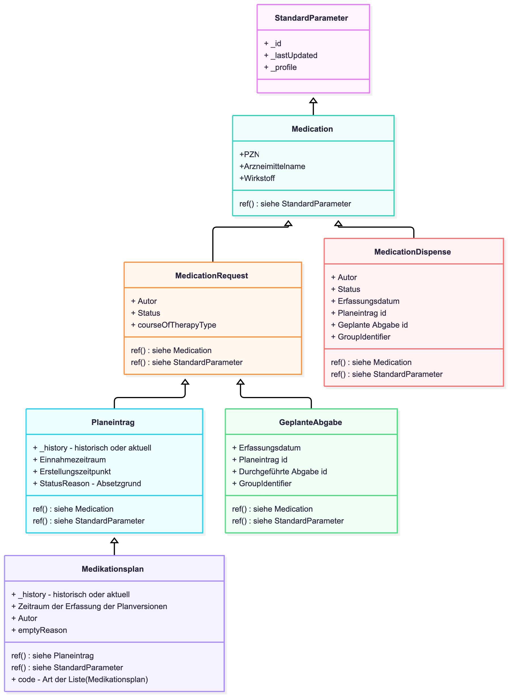

# HL7.AT.FHIR.ELGA.EMED.R4\Transaktionen - FHIR® v4.0.1

* [**Table of Contents**](toc.md)
* **Transaktionen**

## Transaktionen

Die Umsetzung des Patientenkontakts in den Transaktionen ist nicht Teil des Ballots. Der konkrete Zugriff wird in der Lösungsarchitektur beschrieben.

In diesem IG werden daher alle Requests ab dem `/[type]` dargestellt.

| | | | | |
| :--- | :--- | :--- | :--- | :--- |
| **POST** | `/` | `$groupidentifier-create` | Erzeugen eines neuen e-Med GroupIdentifiers für Geplante Abgaben | GDA |
| **POST** | `/` | `$groupidentifier-search` | Geplante und durchgeführte Abgaben mittels e-Med GroupIdentifier lesen | GDA |
| **POST** | `/List` | `$plan-read` | Aktuelle Medikationsplanversion lesen | GDA, PAT |
| **POST** | `/List` | `$plan-write` | Neue Version eines Medikationsplans schreiben | GDA |
| **POST** | `/List` | `$patient-plan-write` | Medikationsplaneinträge löschen | PAT |
| **POST** | `/List` | `$plan-delete` | Aktuelle oder historische Medikationsplanversion löschen | PAT |
| **GET** | `/List` | `plan-history-search` | Historische Medikationsplanversion(en) lesen(`_history?_include=*`bzw.`_include=*&item=MedicationRequest/[id]&subject=Patient/[id]&date=...`) | GDA, PAT |
| **GET** | `/List` | `plan-history-directory-search` | Verzeichnis historischer Medikationspläne abrufen(`_history`) | GDA, PAT |
| **POST** | `/MedicationRequest` | `$prescription-write` | Geplante Abgabe schreiben | GDA |
| **POST** | `/MedicationRequest` | `$prescription-discard` | Eigene geplante Abgabe verwerfen | GDA |
| **POST** | `/MedicationRequest` | `$plan-entry-delete` | Planeintrag löschen | GDA |
| **GET** | `/MedicationRequest` | `prescription-search` | Geplante Abgaben suchen (`?category=GeplAbgabe`) | GDA, PAT |
| **GET** | `/MedicationRequest` | `planentry-search` | Medikationsplaneinträge suchen (`?category=Planeintrag`) | GDA, PAT |
| **DELETE** | `/MedicationRequest` | `prescription-delete` | Geplante Abgabe löschen | PAT |
| **POST** | `/MedicationDispense` | `$dispense-write` | Durchgeführte Abgabe schreiben | GDA |
| **POST** | `/MedicationDispense` | `$dispense-discard` | Eigene durchgeführte Abgabe verwerfen | GDA |
| **POST** | `/MedicationDispense` | `$reference-plan` | Referenz auf Medikationsplan erstellen | GDA |
| **GET** | `/MedicationDispense` | `dispense-search` | Durchgeführte Abgaben suchen | GDA, PAT |
| **DELETE** | `/MedicationDispense` | `dispense-delete` | Durchgeführte Abgabe löschen | PAT |

#### Suchparameter Überblick

