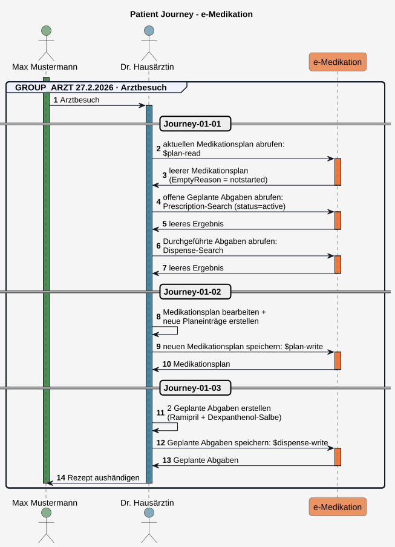
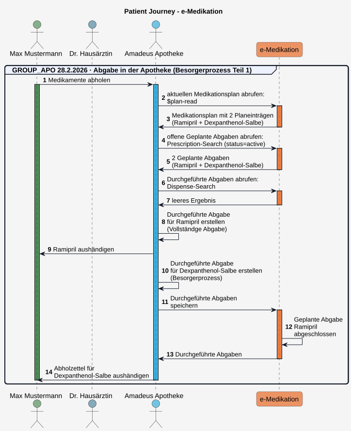
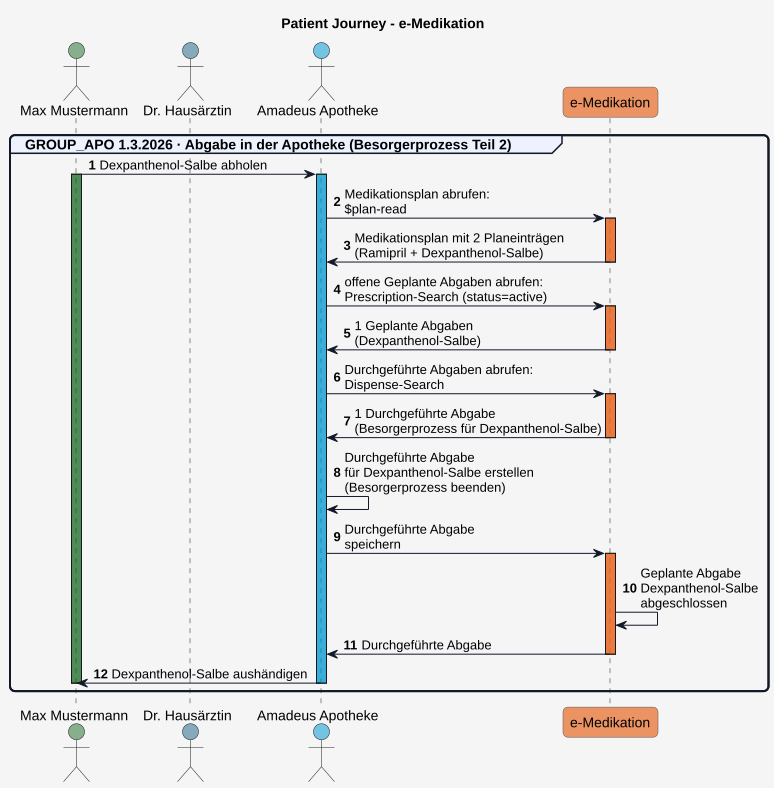
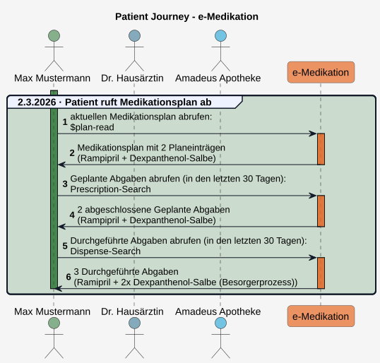
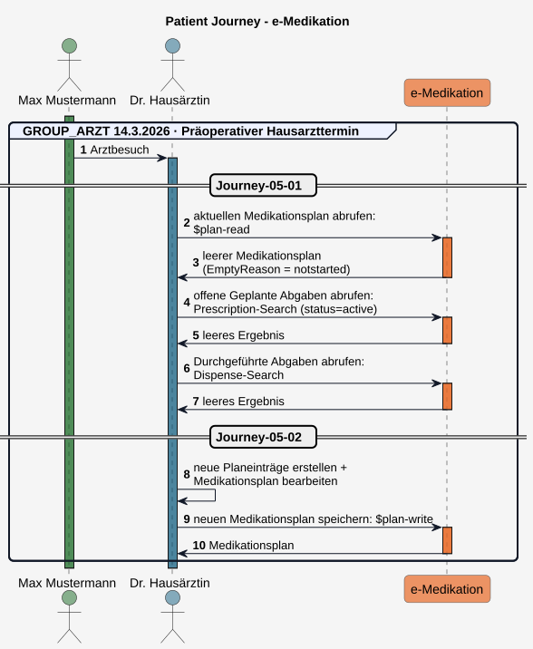
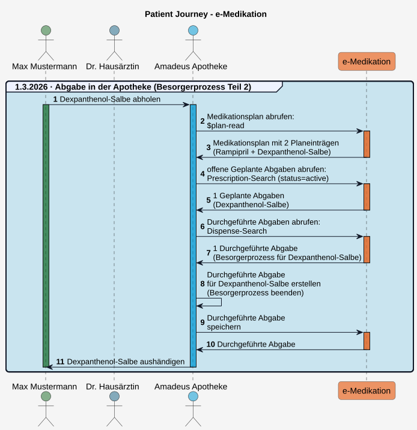
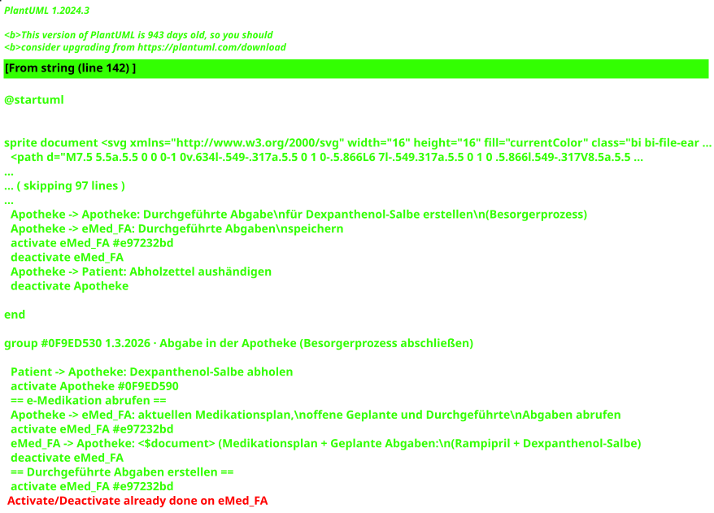

# HL7.AT.FHIR.ELGA.EMED.R4\Patient Journey - FHIR® v4.0.1

* [**Table of Contents**](toc.md)
* [**Overview Use Case**](overview_use_case.md)
* **Patient Journey**

## Patient Journey

Am Beispiel einer fiktiven Patient Journey wird veranschaulicht, wie sich der **Medikationsplan** eines Patienten mit den zugehörigen **Geplanten Abgaben** und den **Durchgeführten Abgaben** verändern kann.

Eine fachliche Übersicht mit reduziertem Detailgrad findet sich am Ende dieses Kapitels [Übersicht Patient Journey](patient_journey.md#übersicht-patient-journey).

### Journey-01: 27.2.2026 - Erster Arztbesuch

Herr Mustermann kommt wegen Kopfschmerzen und Schwindelgefühl zu seiner Hausärztin. Außerdem hat er einen leichten Hautausschlag bemerkt.

#### Journey-01-01:

Dr. Hausärztin stellt eine leichte arterielle Hypertonie fest und ruft die e-Medikation (den aktuellen **Medikationsplan**, **Geplante Abgaben** und **Durchgeführte Abgaben**) des Patienten ab, um einen Überblick über seine aktuelle Medikation zu erhalten.

Da für Herrn Mustermann noch nie ein Medikationsplan abgerufen wurde, erstellt die Fachanwendung automatisch einen leeren Medikationsplan. Darin enthalten sind die Informationen zum Patienten, die erstellende e-Medikation-Fachanwendung, das Datum der Erstellung und die Information, dass der Medikationsplan noch nicht gestartet wurde (**EmptyReason = notstarted**).

Beispiele

*  **Leerer Medikationsplan:**(EmptyReason = notstarted) 
*  [Medikationsplan-Bundle](Bundle-At-Emed-Journey-01-01-Bundle-Medikationsplan.md) 
*  [Patient](Patient-At-Emed-Example-Patient-01.md) 
*  [Device](Device-At-Emed-Example-Device-01.md) 
 

Use Cases

*  [Sub_UC_eMed_01_01 - Aktuellen Medikationsplan lesen (Plan-Read)](Sub_UC_eMed_01.md#sub_uc_emed_01_01---aktuellen-medikationsplan-lesen-plan-read) 
*  [Sub_UC_eMed_03_01 - Geplante Abgaben lesen (Prescription-Search)](Sub_UC_eMed_03.md#sub_uc_emed_07_01---geplante-abgaben-lesen-prescription-search) 
*  [Sub_UC_eMed_03_02 - Durchgeführte Abgaben lesen (Dispense-Search)](Sub_UC_eMed_03.md#sub_uc_emed_07_02---durchgeführte-abgaben-lesen-dispense-search) 
*  [Sub_UC_eMed_01_03 - Initial erstellter Medikationsplan](Sub_UC_eMed_01.md#sub_uc_emed_01_03---initial-erstellter-medikationsplan) 

##### Journey-01-01: Request 01 - Medikationsplan abrufen

Request

POST
`[base]/List/$plan-read`

**Headers:**
`Content-Type: application/fhir+json`

Request Body

Response Body

##### Journey-01-01: Request 02 - geplante Abgaben Abrufen

Request

GET
`[base]/MedicationRequest?category=https://fhir.hl7.at/elga/emed/r4/CodeSystem/MedicationRequestCategoryCS|2&status=active`

**Headers:**
`Content-Type: application/fhir+json`

Response Body

##### Journey-01-01: Request 03 - durchgeführte Abgaben Abrufen

Request

GET
`[base]/MedicationDispense?recorded=lt2025-01-01`

**Headers:**
`Content-Type: application/fhir+json`

Response Body

#### Journey-01-02

Dr. Hausärztin erstellt zwei Medikationsplaneinträge und klärt den Patienten über die Anwendung auf: gegen die arterielle Hypertonie **Ramipril 5 mg Tabletten**, 1 x täglich morgens (Dauermedikation) und gegen den Hautausschlag **Dexpanthenol-5-%-Salbe**, 2 × täglich für 3 Wochen, dünn aufzutragen.
 Sie speichert den neuen Medikationsplan.

Beispiele

*  **Planeinträge erstellen:** 
*  [Planeintrag 1: Ramipril 5 mg Tabletten, 1 x täglich morgens (Dauermedikation)](MedicationRequest-At-Emed-Journey-01-02-Mr-Planeintrag-01.md) 
*  [Planeintrag 2: Dexpanthenol-5-%-Salbe, 2 × täglich für 3 Wochen, dünn auftragen](MedicationRequest-At-Emed-Journey-01-02-Mr-Planeintrag-02.md) 
 
*  **Medikationsplan aktualisieren:** 
*  [Medikationsplan ergänzt mit 2 Planeinträgen](List-At-Emed-Journey-01-02-List-Medikationsplan.md) 
 
*  **Transaction Bundle:** 
*  [Transaction Bundle](Bundle-At-Emed-Journey-01-02-Bundle-Medikationsplan-Tx.md) 
*  [Dr. Hausärztin](Practitioner-At-Emed-Example-PractitionerRole-01.md) 
 

Use Cases

*  [Sub_UC_eMed_02_01 - Medikationsplan schreiben (Plan-Write)](Sub_UC_eMed_02.md#sub_uc_emed_02_01---medikationsplan-schreiben-plan-write) 
*  [Sub_UC_eMed_02_02 - Planeintrag in Medikationsplan hinzufügen](Sub_UC_eMed_02.md#sub_uc_emed_02_02---planeintrag-in-medikationsplan-hinzufügen) 

Im aktualisierten Medikationsplan sind die neuen Planeinträge sowie das Datum der Bearbeitung und als verantwortliche Ärztin Dr. Hausärztin ersichtlich.

#### Journey-01-03

Dr. Hausärztin erstellt für beide Medikamente ein Kassenrezept (Papier oder e-Rezept) und dokumentiert den Rezeptiervorgang in einer **Geplante Abgabe** in der e-Medikation. Herr Mustermann kann nun mit dem Rezept die Medikamente in der Apotheke abholen.

Beispiele

*  **Geplante Abgaben erstellen:** 
*  [Geplante Abgabe zu Planeintrag 1 (Ramipril)](MedicationRequest-At-Emed-Journey-01-03-Mr-Geplante-Abgabe-01.md) 
*  [Geplante Abgabe zu Planeintrag 2 (Dexpanthenol-Salbe)](MedicationRequest-At-Emed-Journey-01-03-Mr-Geplante-Abgabe-02.md) 
 
*  **Transaction Bundle:** 
*  [Transaction Bundle mit Geplante Abgaben](Bundle-At-Emed-Journey-01-03-Bundle-Geplante-Abgaben-Tx.md) 
 

Use Cases

*  [Sub_UC_eMed_04_01 - Geplante Abgabe erstellen (Prescription-Write)](Sub_UC_eMed_04.md#sub_uc_emed_04_01---geplante-abgabe-erstellen-prescription-write) 
*  [Sub_UC_eMed_04_02 - e-Med GroupIdentifier beziehen (Variante A)](Sub_UC_eMed_04.md#variante-a-vorab-ermittlung-des-e-med-groupidentifiers-groupidentifier-create) 

#### Journey-01: Ablauf - Erster Arztbesuch

  

### Journey-02: 28.2.2026 - Abgabe in der Apotheke (Teil 1)

Herr Mustermann sucht eine Apotheke auf, um die verordneten Medikamente abzuholen und legt dazu seine e-card vor, wodurch die Apotheke Zugriff auf seine ELGA e-Medikation erhält.

Die Apothekerin prüft das Rezept (Papierrezept oder ruft e-Rezept ab), ruft offenen **Geplante Abgaben**, sowie **Durchgeführte Abgaben** und den **Medikationsplan** ab und prüft die Medikation hinsichtlich Wechselwirkungen.

Sie händigt das Medikament Ramipril aus, erklärt die Einnahme und erstellt eine **Durchgeführte Abgabe** (**Vollständige Abgabe**).

Die Dexpanthenol-Salbe muss noch hergestellt werden. Die Apothekerin erstellt eine **Durchgeführte Abgabe** und dokumentiert darin den **Besorgerprozess** **type = First Fill – Part Fill** und abgegebene Menge **quantity = 0**.

Anschließend speichert sie die neuen **Durchgeführte Abgaben** in der e-Medikation. Da für Ramipril keine weitere Einlösung möglich ist (Kassenrezept), wird die zugehörige **Geplante Abgabe** automatisch abgeschlossen (**completed**).

Beispiele

*  **Durchgeführte Abgaben erstellen:** 
*  [Durchgeführte Abgabe (Ramipril)](MedicationDispense-At-Emed-Journey-02-01-Md-Durchgefuehrte-Abgabe-01.md) (Vollständige Einzelabgabe) 
*  [Durchgeführte Abgabe (Dexpanthenol-Salbe)](MedicationDispense-At-Emed-Journey-02-01-Md-Durchgefuehrte-Abgabe-02.md) (Besorgerprozess) 
 
*  **Transaction Bundle:** 
*  [Durchgeführte-Abgaben-Transaction-Bundle](Bundle-At-Emed-Journey-02-01-Bundle-Durchgefuehrte-Abgaben-Tx.md) 
*  [Apotheke (Organization)](Organization-At-Emed-Example-Organization-Apo-01.md) 
 

Use Cases

*  [Sub_UC_eMed_01_01 - Aktuellen Medikationsplan lesen (Plan-Read)](Sub_UC_eMed_01.md#sub_uc_emed_01_01---aktuellen-medikationsplan-lesen-plan-read) 
*  [Sub_UC_eMed_03_01 - Geplante Abgaben lesen (Prescription-Search)](Sub_UC_eMed_03.md#sub_uc_emed_07_01---geplante-abgaben-lesen-prescription-search) 
*  [Sub_UC_eMed_03_02 - Durchgeführte Abgaben lesen (Dispense-Search)](Sub_UC_eMed_03.md#sub_uc_emed_07_02---durchgeführte-abgaben-lesen-dispense-search) 
*  [Sub_UC_eMed_05_01 - Durchgeführte Abgabe schreiben (Dispense-Write)(Variante A: Zugriff mit Kontakt)](Sub_UC_eMed_05.md#zugriffsvariante-a-durchgeführte-abgabe-mit-kontakt-schreiben) 
*  [Sub_UC_eMed_05_01_01 - Vollständige Einzelabgabe erfassen](Sub_UC_eMed_05.md#sub_uc_emed_05_01_01---vollständige-einzelabgabe-erfassen) 
*  [Sub_UC_eMed_05_01_03 - Besorgerprozess](Sub_UC_eMed_05.md#sub_uc_emed_05_01_03---besorgerprozess) 

#### Journey-02: Ablauf - Abgabe in der Apotheke (Teil 1)

  

### Journey-03: 1.3.2026 - Abgabe in der Apotheke (Teil 2)

Herr Mustermann möchte in der Apotheke die Dexpanthenol-Salbe abholen und steckt dort seine e-card.

Die Apothekerin ruft die e-Medikation erneut ab. Sie erhält den **Medikationsplan**, die offene **Geplante Abgabe** für die Dexpanthenol-Salbe und die zugehörige **Durchgeführte Abgabe**, mit der der Besorgerprozess dokumentiert wurde. Sie übergibt dem Patienten die fertiggestellte Dexpanthenol-Salbe und schließt den Besorgerprozess ab, indem sie eine weitere **Durchgeführte Abgabe** erstellt. Sie dokumentiert darin die tatsächlich abgegebene Menge und kennzeichnet diese mit **MedicationDispense.type = RFC (Refill – Complete)**.

Anschließend speichert sie die neue **Durchgeführte Abgabe** in der e-Medikation. Da für die Dexpanthenol-Salbe keine weitere Einlösung möglich ist (Kassenrezept), wird die zugehörige **Geplante Abgabe** automatisch abgeschlossen (**completed**).

Beispiele

*  **Durchgeführte Abgaben erstellen:** 
*  [Durchgeführte Abgabe (Dexpanthenol-Salbe)](MedicationDispense-At-Emed-Journey-03-01-Md-Durchgefuehrte-Abgabe-02.md) (Besorgerprozess beenden) 
 
*  **Transaction Bundle:** 
*  [Transaction Bundle mit Durchgeführter Abgabe](Bundle-At-Emed-Journey-03-01-Bundle-Durchgefuehrte-Abgaben-Tx.md) 
 

Use Cases

*  [Sub_UC_eMed_01_01 - Aktuellen Medikationsplan lesen (Plan-Read)](Sub_UC_eMed_01.md#sub_uc_emed_01_01---aktuellen-medikationsplan-lesen-plan-read) 
*  [Sub_UC_eMed_03_01 - Geplante Abgaben lesen (Prescription-Search)](Sub_UC_eMed_03.md#sub_uc_emed_07_01---geplante-abgaben-lesen-prescription-search) 
*  [Sub_UC_eMed_03_02 - Durchgeführte Abgaben lesen (Dispense-Search)](Sub_UC_eMed_03.md#sub_uc_emed_07_02---durchgeführte-abgaben-lesen-dispense-search) 
*  [Sub_UC_eMed_05_01 - Durchgeführte Abgabe schreiben (Dispense-Write)(Variante A: Zugriff mit Kontakt)](Sub_UC_eMed_05.md#zugriffsvariante-a-durchgeführte-abgabe-mit-kontakt-schreiben) 
*  [Sub_UC_eMed_05_01_03 - Besorgerprozess](Sub_UC_eMed_05.md#sub_uc_emed_05_01_03---besorgerprozess) 

#### Journey-03: Ablauf - Abgabe in der Apotheke (Teil 2)

  

### Journey-04: 7.3.2026 - Patient ruft Medikationsplan ab

Herr Mustermann erinnert sich nicht, wie lange er die Dexpanthenol-Salbe anwenden soll. Er ruft im Zugangsportal seine e-Medikation auf und erhält Einsicht auf seinen aktuellen **Medikationsplan** mit den Planeinträgen zur Dauermedikation Ramipril und der Dexpanthenol-Salbe. Dem Planeintrag mit der Dexpanthenol-Salbe kann er entnehmen, dass die Salbe für 3 Wochen anzuwenden ist. Er kann auch sehen, dass er keine offenen **Geplanten Abgaben** hat und sieht in den **Durchgeführten Abgaben**, wann er die Arzneimittel abgeholt hat

Beispiele

*  **aktueller Medikationsplan:** 
* Bundle in Arbeit. 
 
*  **Geplante Abgaben:** 
* Bundle in Arbeit. 
 
*  **Durchgeführte Abgaben:** 
* Bundle in Arbeit. 
 

Use Cases

*  [Sub_UC_eMed_01_01 - Aktuellen Medikationsplan lesen (Plan-Read)](Sub_UC_eMed_01.md#sub_uc_emed_01_01---aktuellen-medikationsplan-lesen-plan-read) 
*  [Sub_UC_eMed_03_01 - Geplante Abgaben lesen (Prescription-Search)](Sub_UC_eMed_03.md#sub_uc_emed_07_01---geplante-abgaben-lesen-prescription-search) 
*  [Sub_UC_eMed_03_02 - Durchgeführte Abgaben lesen (Dispense-Search)](Sub_UC_eMed_03.md#sub_uc_emed_07_02---durchgeführte-abgaben-lesen-dispense-search) 

#### Journey-04: Ablauf - Patient ruft Medikationsplan ab

  

### Journey-05: 14.3.2026 - Präoperativer Arzttermin

Bei Herrn Mustermann steht am 24.3.2026 eine geplante Leistenbruchoperation an. Für die Operationsfreigabe geht er zu seiner Hausärztin. Diese überprüft dahingehend auch die bestehende Medikation und ruft seine aktuelle e-Medikation ab (für Abruf **Geplante Abgaben** und **Durchgeführte Abgaben**, siehe [Journey-04](patient_journey.md#journey-04-ablauf---patient-ruft-medikationsplan-ab)).

Dr. Hausärztin weist Herrn Mustermann an, Ramipril vor der Operation vorübergehend abzusetzen, um das Risiko einer intraoperativen Hypotonie zu reduzieren. Er pausiert den Planeintrag und dokumentiert als Begründung die geplante Operation (**statusReason = "surg"**).

 Offene Punkte:
 Möglichkeit prüfen, wie der Usecase: "Medikament soll in 2 Wochen für 1 Woche pausiert werden", umgesetzt werden kann. Ein zukünftiger, zeitgesteuerter Statuswechsel auf on-hold ist nicht möglich. 

#### Journey-05-01

Beispiele

*  **Planeintrag pausieren:** 
*  [Planeintrag 1: Ramipril (Dauermedikation) pausieren](MedicationRequest-At-Emed-Journey-05-01-Mr-Planeintrag-01.md) 
 
*  **Medikationsplan aktualisieren:** 
*  [Medikationsplan: 1 Planeintrag aktualisiert, 1 Planeintrag unverändert](List-At-Emed-Journey-05-01-List-Medikationsplan.md) 
 
*  **Transaction Bundle:** 
*  [Transaction Bundle](Bundle-At-Emed-Journey-05-01-Bundle-Medikationsplan-Tx.md) 
 

Use Cases

*  [Sub_UC_eMed_01_01 - Aktuellen Medikationsplan lesen (Plan-Read)](Sub_UC_eMed_01.md#sub_uc_emed_01_01---aktuellen-medikationsplan-lesen-plan-read) 
*  [Sub_UC_eMed_03_01 - Geplante Abgaben lesen (Prescription-Search)](Sub_UC_eMed_03.md#sub_uc_emed_07_01---geplante-abgaben-lesen-prescription-search) 
*  [Sub_UC_eMed_03_02 - Durchgeführte Abgaben lesen (Dispense-Search)](Sub_UC_eMed_03.md#sub_uc_emed_07_02---durchgeführte-abgaben-lesen-dispense-search) 
*  [Sub_UC_eMed_02_05 - Planeintrag pausieren oder reaktivieren](Sub_UC_eMed_02.md#sub_uc_emed_02_05---planeintrag-pausieren-oder-reaktivieren) 
*  [Sub_UC_eMed_02_04 - Planeintrag im Medikationsplan beibehalten](Sub_UC_eMed_02.md#sub_uc_emed_02_04---planeintrag-im-medikationsplan-beibehalten) 

#### Journey-05: Ablauf - Präoperativer Arzttermin

  

### Journey-06: 17.3.2026 bis 21.3.2026 - Stationärer Krankenhausaufenthalt

#### Journey-06-01: 17.3.2026 - Geplante Operation

Herr Mustermann erscheint zur geplanten Leistenbruchoperation. Im Krankenhaus wird bei der OP-Besprechung sein Medikationsplan abgerufen und nachgefragt, ob der Patient gemäß Medikationsplan die Einnahme von Ramipril vorübergehend pausiert hat. Dieser bejaht das.

Die Operation verläuft komplikationslos.

#### Journey-06-02: 19.3.2026 - Entlassung

Zwei Tage nach der Operation kann Herr Mustermann entlassen werden. Gegen die postoperativen Schmerzen soll er weiterhin den **Wirkstoff** Metamizol einnehmen. Dr. Krankenhaus dokumentiert dies in einem neuen Planeintrag: Metamizol 1.000 mg, 4x täglich oral, Abstand 6–8 Stunden.

Zusätzlich wird die pausierte Ramipril Medikation wieder aufgenommen, aber in der Dosis erhöht (auf 1-0-1-0).

#### Journey-06-02

Beispiele

*  **Planeintrag hinzufügen:** 
*  [Neuer Planeintrag 3: Wirstoff Metamizol](MedicationRequest-At-Emed-Journey-06-02-Mr-Planeintrag-03.md) 
 
*  **Planeintrag anpassen:** 
*  [Neuer Planeintrag 1: Ramipril aktivieren + Dosierung ändern](MedicationRequest-At-Emed-Journey-06-02-Mr-Planeintrag-03.md) 
 
*  **Medikationsplan aktualisieren:** 
*  [Medikationsplan: 1 Planeintrag neu hinzugefügt, 2 Planeinträge unverändert](List-At-Emed-Journey-06-02-List-Medikationsplan.md) 
 
*  **Transaction Bundle:** 
*  [Transaction Bundle](Bundle-At-Emed-Journey-06-02-Bundle-Medikationsplan-Tx.md) 
 

Use Cases

*  [Sub_UC_eMed_01_01 - Aktuellen Medikationsplan lesen (Plan-Read)](Sub_UC_eMed_01.md#sub_uc_emed_01_01---aktuellen-medikationsplan-lesen-plan-read) 
*  [Sub_UC_eMed_02.html#sub_uc_emed_02_02---planeintrag-in-medikationsplan-hinzufügen](Sub_UC_eMed_02_02 - Planeintrag in Medikationsplan hinzufügen) 
*  [Sub_UC_eMed_02.html#sub_uc_emed_02_03---planeintrag-im-medikationsplan-ändern](Sub_UC_eMed_02_03 - Planeintrag im Medikationsplan ändern) 
*  Referenz auf Wirkstoffangabe im Medikationsplan: in Arbeit.  
*  [Sub_UC_eMed_02_04 - Planeintrag im Medikationsplan beibehalten](Sub_UC_eMed_02.md#sub_uc_emed_02_04---planeintrag-im-medikationsplan-beibehalten) 

#### Journey-06: Ablauf - Stationärer Krankenhausaufenthalt

  

**7.3.2026: Teilabgabe in der Apotheke**

Herr Mustermann möchte in der Apotheke die Metamizol-Tropfen abholen und steckt seine e-card.

Es ist nur noch ein Fläschchen Metamizol verfügbar. Die Apothekerin händigt das Fläschchen aus und erstellt eine Durchgeführte Abgabe als Teilabgabe. Die Patienten wird angewiesen, das zweite Fläschchen in der Apotheke abzuholen, sobald es verfügbar ist.

* **Durchgeführte Abgaben erstellen (Teilabgabe):** in Arbeit.

**9.3.2026: Teilabgabe in der Apotheke abschließen**

Herr Mustermann wurde von der Apotheke informiert, dass die Metamizol-Tropfen nun verfügbar sind. Er steckt in der Apotheke seine e-card. Die Apothekerin ruft die e-Medikation erneut ab, schließt dann die Teilabgabe ab, indem sie eine weitere Durchgeführte Abgabe erstellt und übergibt dem Patienten die Metamizol-Tropfen.

* **Durchgeführte Abgaben erstellen (Teilabgabe abschließen):** in Arbeit.

**12.3.2026: Nachkontrolle bei der Urlaubsvertretung von Dr. Hausärztin**

Herr Mustermann hat die Medikamente in der Apotheke abgeholt und die Schmerzen sind deutlich zurückgegangen.

Eine Woche nach der Operation kommt er zur Nachkontrolle zur Urlaubsvertretung von Dr. Hausärztin.

Für die verbleibenden Schmerzen wird von Dr. Urlaubsvertretung die Metamizoldosis für einen begrenzten Zeitraum weiterverodnet, die Dosis aber reduziert. Metamizol-Tropfen: 2 × täglich 10 Tropfen, für 5 Tage.

Ramipril soll wieder eingenommen werden.

Im neu erstellten Medikationsplan sind die neuen Planeinträge sowie das Datum der Bearbeitung und die verantwortliche Ärztin (Dr. Urlaubsvertretung) ersichtlich.

**20.3.2026: Kontrolltermin bei Dr. Hausärztin**

Herr Mustermann erscheint zur Wundkontrolle bei Dr. Hausärztin.

Die postoperative Schmerztherapie ist nicht mehr erforderlich. Der Planeintrag für Metamizol wird daher beendet. Die Behandlung mit der Dexpanthenol-Salbe ist ebenfalls abgeschlossen. Ramipril wird als Dauermedikation fortgeführt.

* **Planeinträge beenden und Medikationsplan aktualisieren:** in Arbeit.

### Übersicht Patient Journey

  

