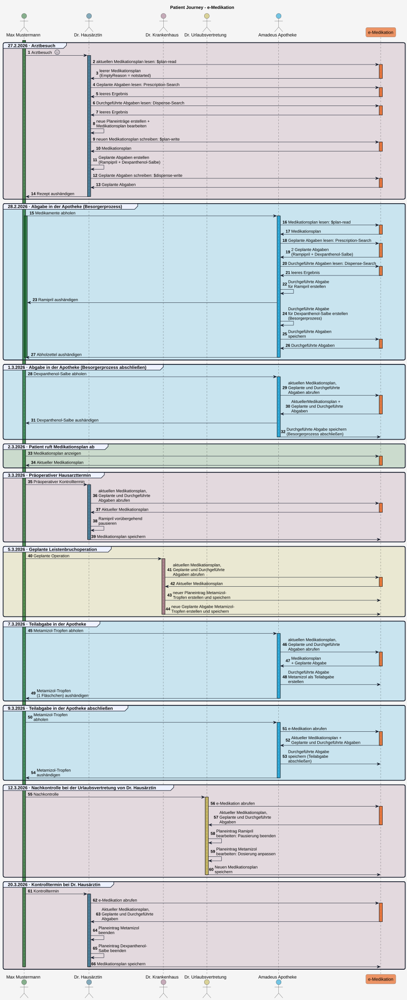

# HL7.AT.FHIR.ELGA.EMED.R4\Patient Journey - FHIR® v4.0.1

* [**Table of Contents**](toc.md)
* [**Overview Use Case**](overview_use_case.md)
* **Patient Journey**

## Patient Journey

Am Beispiel einer fiktiven Patient Journey wird veranschaulicht, wie sich der Medikationsplan eines Patienten mit den zugehörigen **Geplanten Abgaben** und den **Durchgeführten Abgaben** verändern kann.

**27.2.2026: Arztbesuch**

Herr Mustermann kommt wegen Kopfschmerzen und Schwindelgefühl zu seiner Hausärztin. Außerdem hat er einen leichten Hautausschlag bemerkt.

Dr. Hausärztin stellt eine leichte arterielle Hypertonie fest und ruft die e-Medikation (aktueller Medikationsplan, Geplante und Durchgeführte Abgaben) ab, um einen Überblick über seine aktuelle Medikation zu erhalten [1](#fn:1).

[Sub_UC_eMed_07_01 - Geplante Abgaben lesen (Prescription-Search)](Sub_UC_eMed_07_01.md#sub_uc_emed_07_01---geplante-abgaben-lesen-prescription-search) [Sub_UC_eMed_07_02 - Durchgeführte Abgaben lesen (Dispense-Search)](Sub_UC_eMed_07_02.md#sub_uc_emed_07_02---durchgeführte-abgaben-lesen-dispense-search)

Da für Herrn Mustermann noch nie ein Medikationsplan abgerufen wurde, erstellt die Fachanwendung automatisch einen leeren Medikationsplan. Darin enthalten sind die Informationen zum [Patienten](Patient-At-Emed-Example-Patient-01.md), die erstellende e-Medikation-Fachanwendung ([Device](Device-At-Emed-Example-Device-01.md)), das Datum der Erstellung und die Information, dass der Medikationsplan noch nicht gestartet wurde (**EmptyReason = notstarted**).

* **Leerer Medikationsplan:**

Dr. Hausärztin erstellt zwei Medikationsplaneinträge und klärt den Patienten über die Anwendung auf: gegen die arterielle Hypertonie **Ramipril 5 mg Tabletten**, 1 x täglich morgens (Dauermedikation) und gegen den Hautausschlag **Dexpanthenol-5-%-Salbe**, 2 × täglich für 1 Woche, dünn aufzutragen.

Sie speichert den neuen Medikationsplan.

* **Medikationsplan mit neuen Planeinträgen aktualisieren:** Beispiel in Arbeit.

Im neu erstellten Medikationsplan sind die neuen Planeinträge sowie das Datum der Bearbeitung und als verantwortliche Ärztin Dr. Hausärztin ([Practitioner 1](Practitioner-At-Emed-Example-Practitioner-01.md)) ersichtlich.

Dr. Hausärztin erstellt für beide Medikamente eine **Geplante Abgabe** (Rezeptierung), sodass Herr Mustermann die Medikamente in der Apotheke abholen kann.

* **Geplante Abgaben erstellen:**

**28.2.2026: Abgabe in der Apotheke (Besorgerprozess)**

Herr Mustermann sucht eine [Apotheke](Organization-At-Emed-Example-Organization-Apo-01.md) auf, um die verordneten Medikamente abzuholen und authentifiziert sich mit seiner e-card.

Die Apothekerin ruft **Geplante, Durchgeführte Abgaben** und den **Medikationsplan** ab, und prüft die Medikation hinsichtlich Wechselwirkungen.

Sie händigt das Medikament Ramipril aus, erklärt die Einnahme und erstellt eine **Durchgeführte Abgabe**.

Die Dexpanthenol-Salbe muss noch hergestellt werden. Die Apothekerin erstellt eine **Durchgeführte Abgabe** und kennzeichnet sie entsprechend dem Besorgerprozess mit **MedicationDispense.type = FFP (First Fill – Part Fill)** und **MedicationDispense.quantity = 0**.

Anschließend speichert sie die neuen **Durchgeführte Abgaben** in der e-Medikation.

* **Durchgeführte Abgaben erstellen (Vollständige Abgabe, Besorgerprozess):**

**1.3.2026: Abgabe in der Apotheke (Besorgerprozess abschließen)**

Herr Mustermann möchte in der Apotheke die Dexpanthenol-Salbe abholen und steckt seine e-card.

Die Apothekerin ruft die e-Medikation erneut. Sie übergibt dem Patienten die hergestellte Dexpanthenol-Salbe und schließt den Besorgerprozess ab, indem sie eine weitere **Durchgeführte Abgabe** erstellt. Sie dokumentiert darin die tatsächlich abgegebene Menge und kennzeichnet diese mit **MedicationDispense.type = RFC (Refill – Complete)**.

Anschließend speichert sie die neue **Durchgeführte Abgabe** in der e-Medikation.

* **Durchgeführte Abgaben erstellen (Besorgerprozess abschließen):** in Arbeit.

**2.3.2026: Patient ruft Medikationsplan ab**

Herr Mustermann erinnert sich nicht, welches Medikament er wie einnehmen soll und ruft im Zugangsportal seinen Medikationsplan auf.

* **Aktuellen Medikationsplan anzeigen:**

**3.3.2026: Präoperativer Hausarzttermin**

Bei Herrn Mustermann steht eine geplante Leistenbruchoperation an. Vor der Operation bespricht er die bestehende Medikation mit seiner Hausärztin.

Die geplante Leistenbruchoperation ist für den 5.3.2026 vorgesehen.

Dr. Hausärztin weist Herrn Mustermann an, Ramipril vor der Operation vorübergehend abzusetzen.

* **Medikationsplan mit pausiertem Planeintrag aktualisieren:** in Arbeit. 

**5.3.2026: Geplante Leistenbruchoperation**

Herr Mustermann erscheint zur geplanten Leistenbruchoperation. Ramipril wurde entsprechend der ärztlichen Anweisung vorübergehend pausiert.

Die Leistenbruchoperation verläuft komplikationslos. Nach der Operation erhält Herr Mustermann von Dr. Krankenhaus Metamizol-Tropfen gegen die postoperativen Schmerzen. Metamizol-Tropfen, 2 Fläschchen: 3 × täglich 30 Tropfen für wenige Tage (nach Bedarf)

* **Medikationsplan mit neuem Planeintrag aktualisieren:** in Arbeit.

**7.3.2026: Teilabgabe in der Apotheke**

Herr Mustermann möchte in der Apotheke die Metamizol-Tropfen abholen und steckt seine e-card.

Es ist nur noch ein Fläschchen Metamizol verfügbar. Die Apothekerin händigt das Fläschchen aus und erstellt eine Durchgeführte Abgabe als Teilabgabe. Die Patienten wird angewiesen, das zweite Fläschchen in der Apotheke abzuholen, sobald es verfügbar ist.

* **Durchgeführte Abgaben erstellen (Teilabgabe):** in Arbeit.

**9.3.2026: Teilabgabe in der Apotheke abschließen**

Herr Mustermann wurde von der Apotheke informiert, dass die Metamizol-Tropfen nun verfügbar sind. Er steckt in der Apotheke seine e-card. Die Apothekerin ruft die e-Medikation erneut ab, schließt dann die Teilabgabe ab, indem sie eine weitere Durchgeführte Abgabe erstellt und übergibt dem Patienten die Metamizol-Tropfen.

* **Durchgeführte Abgaben erstellen (Teilabgabe abschließen):** in Arbeit.

**12.3.2026: Nachkontrolle bei der Urlaubsvertretung von Dr. Hausärztin**

Herr Mustermann hat die Medikamente in der Apotheke abgeholt und die Schmerzen sind deutlich zurückgegangen.

Eine Woche nach der Operation kommt er zur Nachkontrolle zur Urlaubsvertretung von Dr. Hausärztin.

Für die verbleibenden Schmerzen wird von Dr. Urlaubsvertretung die Metamizoldosis für einen begrenzten Zeitraum weiterverodnet, die Dosis aber reduziert. Metamizol-Tropfen: 2 × täglich 10 Tropfen, für 5 Tage.

Ramipril soll wieder eingenommen werden.

Im neu erstellten Medikationsplan sind die neuen Planeinträge sowie das Datum der Bearbeitung und die verantwortliche Ärztin (Dr. Urlaubsvertretung) ersichtlich.

**20.3.2026: Kontrolltermin bei Dr. Hausärztin**

Herr Mustermann erscheint zur Wundkontrolle bei Dr. Hausärztin.

Die postoperative Schmerztherapie ist nicht mehr erforderlich. Der Planeintrag für Metamizol wird daher beendet. Die Behandlung mit der Dexpanthenol-Salbe ist ebenfalls abgeschlossen. Ramipril wird als Dauermedikation fortgeführt.

* **Planeinträge beenden und Medikationsplan aktualisieren:** in Arbeit.

  

1. [Sub_UC_eMed_01_01 - Aktuellen Medikationsplan lesen (Plan-Read)](Sub_UC_eMed_01.md#sub_uc_emed_01_01---aktuellen-medikationsplan-lesen-plan-read) [↩](#fnref:1)

