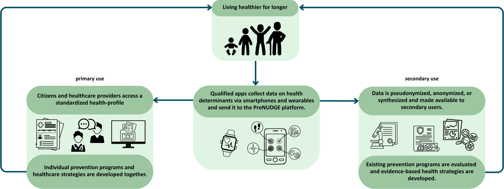
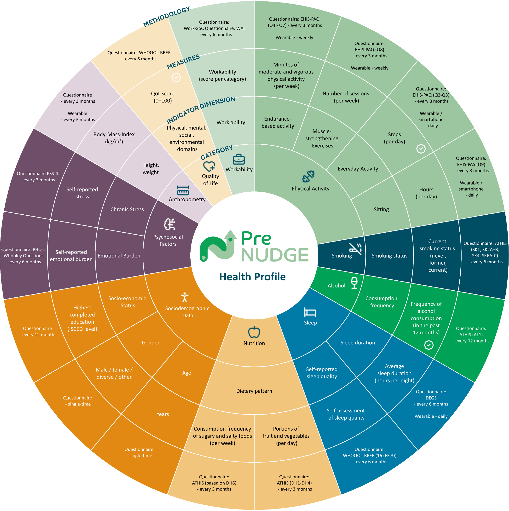

# HL7.AT.FHIR.PRENUDGE.APPDATA.R4\Background - FHIR® v4.0.1

* [**Table of Contents**](toc.md)
* **Background**

## Background

The PreNUDGE project is an Austrian FFG funded research initiative.

In german, **PräNUDGE** stands for:

**Prä**vention und Gesundheitsförderung durch intelligente
 **Nu**tzung von
 **D**aten und Innovationen zur Stärkung der
 **Ge**sundheitskompetenz

Translated to English, this means:

Prevention and Health Promotion through Intelligent
 Use of
 Data and Innovations to Strengthen
 Health Literacy

#### Why

We aim for Austria to **stay healthy longer**.

To achieve this, health indicators of the Austrian population should be **systematically collected** and **made available for evidence-based prevention**.

#### How

We collaborate by leveraging the knowledge and vision of **14 different companies**:

* AstraZeneca – Pharmaceutical expertise and access to millions of patients for evidence-based prevention data.
* APCA – Consulting competence for health policy and implementation of national prevention strategies.
* dccx – Technological platform solutions and digital infrastructure for data collection and management.
* Duervation – Specialization in data analysis and behavioral insights for prevention programs.
* Future Health Lab – Innovation and research in future-oriented health promotion and technology.
* Kurvenkratzer – das Magazin – Media reach and storytelling for communication and awareness of health projects.
* medicus.ai – Artificial intelligence and machine learning for health profiles and risk prediction.
* telbiomed – Biomedical and telemetric technologies for capturing health indicators.
* AIT Austrian Institute of Technology – Research competence and technological innovation in applied research.
* Joanneum Research – Extramural research and expertise in health systems and prevention research.
* Medizinische Universität Graz – Medical expertise and clinical validation of health indicators.
* Medizinische Universität Wien – Academic excellence and clinical expertise in preventive medicine.
* Universität Wien – Research competence in data science, public health, and behavioral economics.
* Wirtschaftsuniversität Wien – Expertise in economics, incentive design, and behavioral economics for nudging strategies.

#### What

We will **focus** on:

* Investigation of motivational factors and incentivization measures (nudging) for participation and adherence to prevention programs
* Definition of a standardized set of health indicators for prevention work and analyses for 4 disease entities (Diabetes mellitus Type 2, colon cancer, depression and COPD)
* Development of a platform for creating health profiles of Austrian citizens
* Establishment of an ecosystem of app providers for collecting health indicators: interface between citizens and platform
* Making the platform accessible for primary and secondary data use
* Ensuring sustainable utilization

The current standardized set of health indicators is as follows, the checkmark indicates that these indicators are already specified in this IG: 

For more, see [https://prenudge.at](https://prenudge.at).

IG © 2026+
[The PreNUDGE Consortium](https://prenudge.at). Package hl7.at.fhir.prenudge.appdata.r4#0.1.0 based on
[FHIR® 4.0.1](http://hl7.org/fhir/R4/). Generated
2026-08-05

Links:
[Table of Contents](toc.md)|
[QA Report](qa.md)