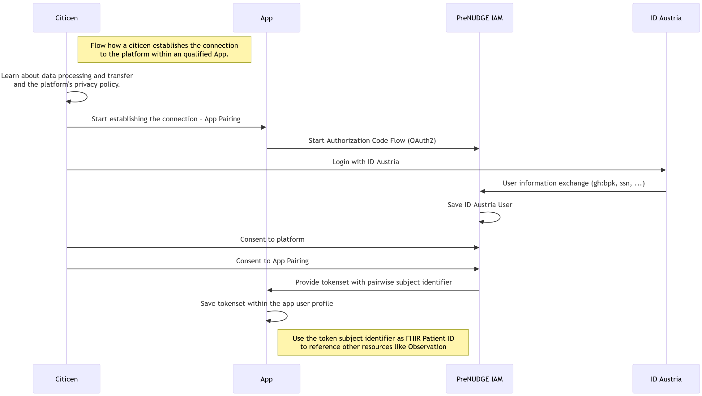
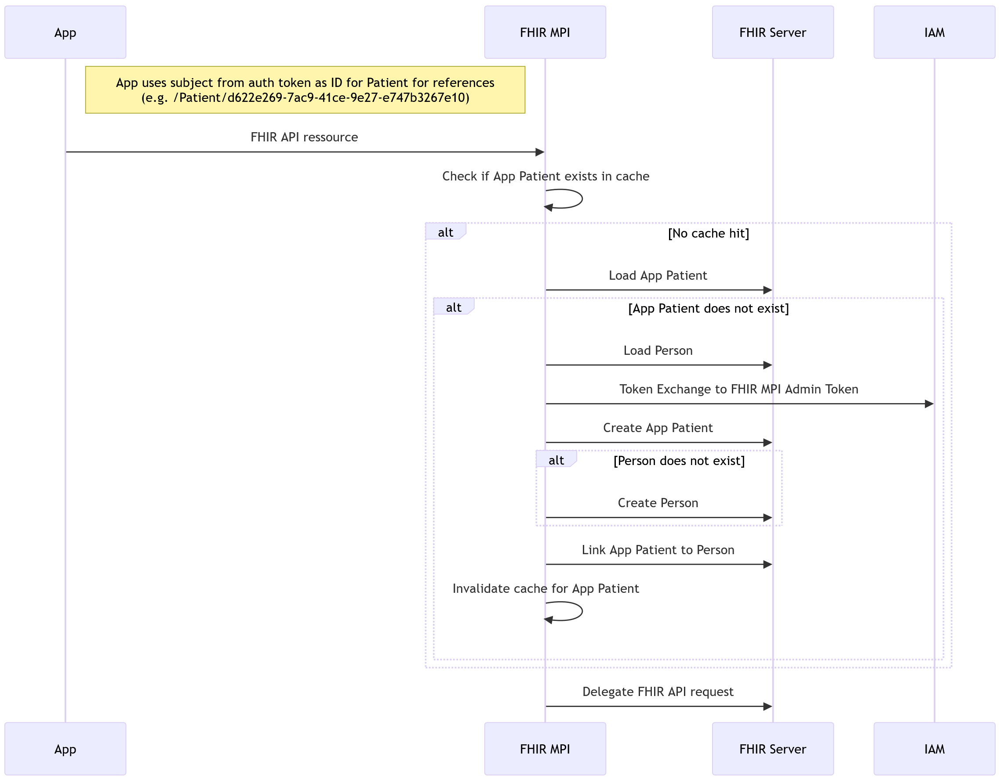

# HL7.AT.FHIR.PRENUDGE.APPDATA.R4\Workflow - FHIR® v4.0.1

* [**Table of Contents**](toc.md)
* **Workflow**

## Workflow

The transmission of health profile data from the qualified apps to the **PreNUDGE platform** is optional.

Health profile data will only be sent once citizens establish the connection within the app and give their **consent**. See [section App Pairing](#app-pairing) for more.

Before health profile data reaches PreNUDGE, the FHIR Master Patient Index (MPI) module (via Reverse Proxy) creates an App Patient from the token's Subject-ID, links it to a protected Person resource via Person.link, and shields sensitive identity data from apps. See [section Patient Identity Provisioning and MPI Resolution](#patient-identity-provisioning-and-mpi-resolution) for more.

After the app pairing and the patient identity provisioning is successfully completed, the mobile application can communicate with the **PreNUDGE platform** through standard **FHIR RESTful interactions** that must comply with this **Implementation Guide (IG)**. See [FHIR Communication](#fhir-communication) for more.

Additional there are current and planned requirements for data providers, see [Dataprovider Qualification Matrix](https://prenudge.at/qualificationmatrix/) for more.

### App Pairing

This sequence describes the process of a citizen connecting their mobile application to the **PreNUDGE platform** using **ID-Austria** for identity verification and authorization.

1. **Privacy Information**: The citizen reviews the data processing terms, transfer protocols, and the platform's privacy policy.
1. **Initiation**: The citizen starts the "App Pairing" process within the app.
1. **Authorization Request**: The app initiates an**OAuth2 Authorization Code Flow**by redirecting to the**PreNUDGE IAM**.
1. **Authentication**: The citizen authenticates via**ID-Austria**.
1. **Identity Exchange**: ID-Austria provides verified user information to the PreNUDGE IAM, which then persists the user identity.
1. **Consent Management**: The citizen provides explicit consent for both the platform usage and the specific app pairing.
1. **Token Issuance**: Upon successful consent, the PreNUDGE IAM issues a**token set**to the app, containing a**pairwise subject identifier**.
1. **Profile Integration**: The app stores the token set within the local user profile. The**pairwise subject identifier**is used as the**FHIR Patient ID**to reference all subsequent clinical resources (e.g.,`Observation`,`QuestionnaireResponse`, etc.).

### Patient Identity Provisioning and MPI Resolution

Before health profile data can be sent to the PreNUDGE platform, a dedicated App Patient must be created. The Subject-ID from the token set is used as the FHIR Resource ID for the Patient. Additionally, a Person resource is created with the citizen's identification details, and the relationship between Person and Patient is established via Person.link. This logic is implemented in the PreNUDGE FHIR MPI module. The FHIR MPI module is integrated into the request flow via the Reverse Proxy configuration. For better readability, the Reverse Proxy is not shown in the flow diagram. To ensure maximum confidentiality of sensitive identity data, the Person resource is protected before access by applications.

This sequence describes how the **FHIR MPI** (Master Patient Index) ensures that a patient identity exists and is correctly linked to a person record before processing clinical resource requests.

1. **Context**: The App uses the**pairwise subject identifier**(from the OIDC token) as the logical**FHIR Patient ID**(e.g.,`Patient/d622...`) for all resource references.
1. **Request Initiation**: The App sends a FHIR API request to the FHIR MPI.
1. **Cache Validation**: The FHIR MPI checks its internal cache to verify if the requesting App Patient identity is already known and active.
1. **Identity Resolution (Cache Miss)**:
* If no cache hit occurs, the MPI attempts to load the **App Patient** from the FHIR Server.
* **Provisioning Logic**, if the App Patient does not exist: 
* The MPI attempts to locate the underlying **Person** resource.
* The MPI performs a **Token Exchange** with the IAM to obtain an administrative token for backend operations.
* The MPI creates the **App Patient** resource.
* If no corresponding **Person** resource is found, the MPI creates a new Person record.
* The MPI establishes a link between the App Patient and the Person resource.
 

1. **Cache Invalidation**: After creating or updating the identities, the MPI invalidates the local cache for that patient to ensure future requests are consistent.
1. **Delegation**: Once the identity context is established, the FHIR MPI delegates the original API request to the underlying FHIR Server.

### FHIR Communication

Using the obtained access token, the app can perform authorized operations such as:

* **GET** requests to retrieve patient-related resources (e.g., `GET /Patient/{id}`, `GET /Observation?patient={id}`)
* **POST** requests to submit new data like observations or questionnaire responses
* **PUT** requests to update existing resources

All interactions **MUST** conform to the specifications, resource profiles, and security guidelines defined in this **Implementation Guide (IG)** to ensure compliance, interoperability, and data integrity.
 These interactions follow the [HL7® FHIR R4 REST API](https://hl7.org/fhir/R4/http.html) principles, ensuring full interoperability and secure data exchange between the citizen's app and the platform.

IG © 2026+
[The PreNUDGE Consortium](https://prenudge.at). Package hl7.at.fhir.prenudge.appdata.r4#0.1.0 based on
[FHIR® 4.0.1](http://hl7.org/fhir/R4/). Generated
2026-07-22

Links:
[Table of Contents](toc.md)|
[QA Report](qa.md)