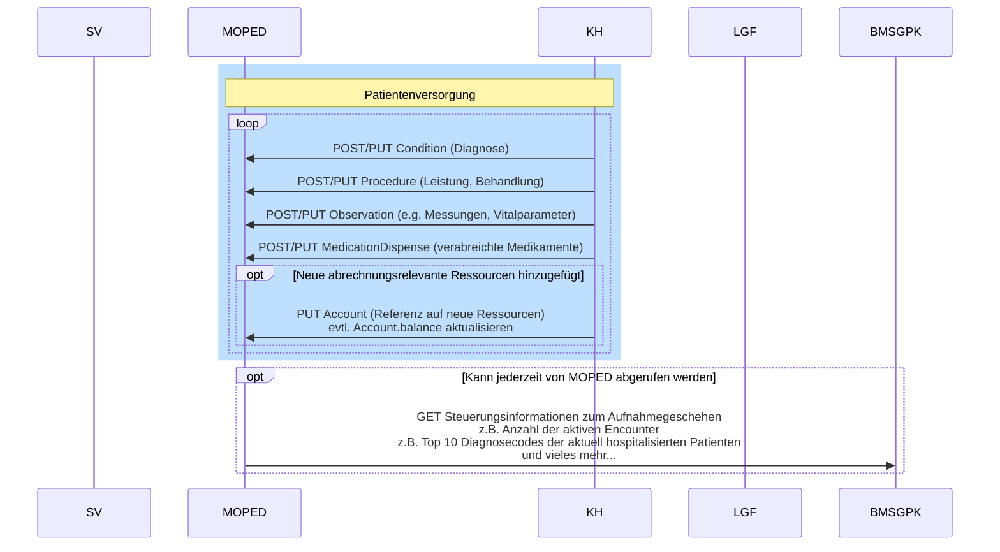

```mermaid
sequenceDiagram
    
    
    participant SV
    participant M as MOPED
    participant KH
    participant L as LGF
    participant B as BMSGPK
    rect rgb(191, 223, 255)
    Note over KH,M: Patientenversorgung
    loop
    KH->>M: POST/PUT Condition (Diagnose)
    KH->>M: POST/PUT Procedure (Leistung, Behandlung)
    KH->>M: POST/PUT Observation (e.g. Messungen, Vitalparameter)
    KH->>M: POST/PUT MedicationDispense (verabreichte Medikamente)
    opt Neue abrechnungsrelevante Ressourcen hinzugefügt
    KH->>M: PUT Account (Referenz auf neue Ressourcen)<br/> evtl. Account.balance aktualisieren
    end
    end
    end
    
    opt Kann jederzeit von MOPED abgerufen werden
    M ->>B: GET Steuerungsinformationen zum Aufnahmegeschehen <br/>z.B. Anzahl der aktiven Encounter<br/>z.B. Top 10 Diagnosecodes der aktuell hospitalisierten Patienten<br/>und vieles mehr...
    end
    
```