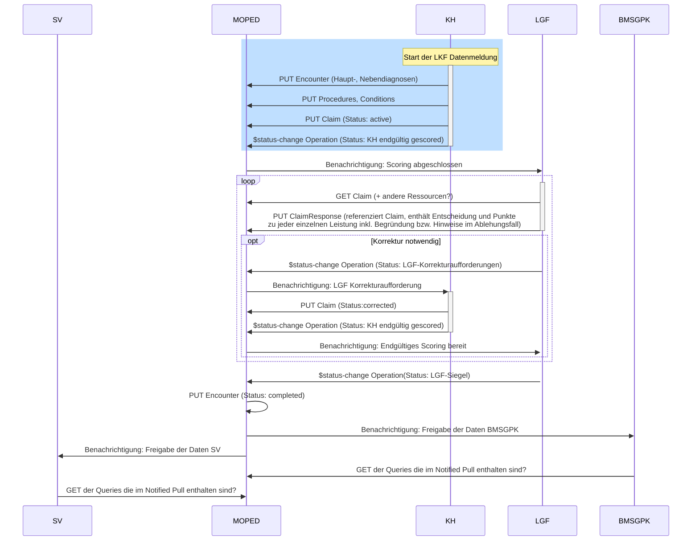

```mermaid
sequenceDiagram
    participant SV
    participant M as MOPED
    participant KH
    participant L as LGF
    participant B as BMSGPK
    
    
    rect rgb(191, 223, 255)
        Note over KH: Start der LKF Datenmeldung
        activate KH
        KH->>M: PUT Encounter (Haupt-, Nebendiagnosen)
        KH->>M: PUT Procedures, Conditions
        KH->>M: PUT Claim (Status: active)
        KH->>M: $status-change Operation (Status: KH endgültig gescored)
        deactivate KH
   end
    M->>L: Benachrichtigung: Scoring abgeschlossen 
    %%<br/>(Subscription/Notified PUll?)<br/>Notified Pull enthält queries für alle relevanten Ressourcen zum jeweiligen Fall
    
    loop 
    activate L
    L->>M: GET Claim (+ andere Ressourcen?)
    L->>M: PUT ClaimResponse (referenziert Claim, enthält Entscheidung und Punkte <br/>zu jeder einzelnen Leistung inkl. Begründung bzw. Hinweise im Ablehungsfall)    
    deactivate L
    %%wo gehört Schritt 8 hin?
    opt Korrektur notwendig
        L->>M: $status-change Operation (Status: LGF-Korrekturaufforderungen)
    
        M->>+KH: Benachrichtigung: LGF Korrekturaufforderung
        KH->>M: PUT Claim (Status:corrected)
        KH->>M: $status-change Operation (Status: KH endgültig gescored)
        deactivate KH
        M->>+L: Benachrichtigung: Endgültiges Scoring bereit
    end
    end
        L->>M: $status-change Operation(Status: LGF-Siegel)
        M->>M: PUT Encounter (Status: completed)
    M->>B: Benachrichtigung: Freigabe der Daten BMSGPK 
    M->>SV: Benachrichtigung: Freigabe der Daten SV 
    B->>M: GET der Queries die im Notified Pull enthalten sind?
    SV->>M: GET der Queries die im Notified Pull enthalten sind?

    
     
    
```