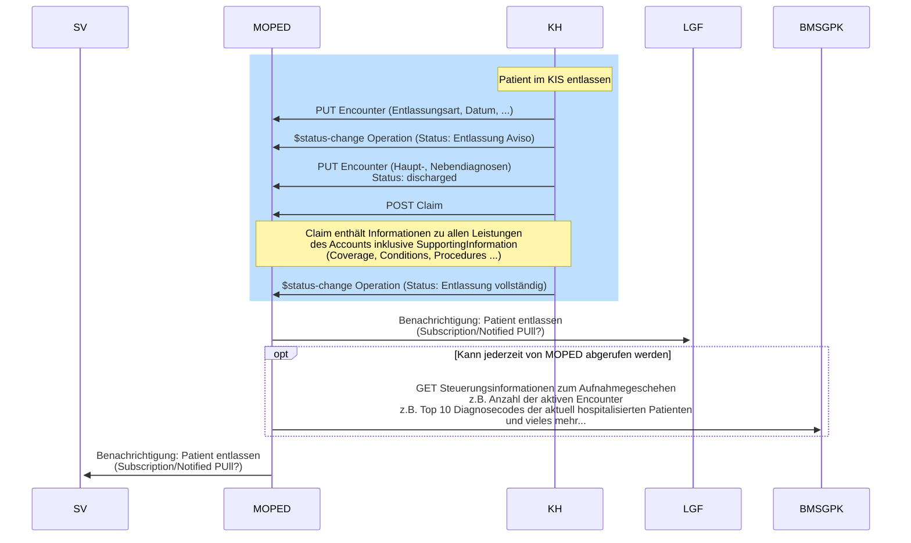

```mermaid
sequenceDiagram
    
    
    participant SV
    participant M as MOPED
    participant KH
    participant L as LGF
    participant B as BMSGPK
    
    
    rect rgb(191, 223, 255)
    Note over KH: Patient im KIS entlassen
    KH->>M: PUT Encounter (Entlassungsart, Datum, ...)
    KH->>M: $status-change Operation (Status: Entlassung Aviso)
    KH->>M: PUT Encounter (Haupt-, Nebendiagnosen) <br/>Status: discharged
    KH->>M: POST Claim 
    Note over KH,M: Claim enthält Informationen zu allen Leistungen<br/> des Accounts inklusive SupportingInformation<br/> (Coverage, Conditions, Procedures ...)
    KH->>M: $status-change Operation (Status: Entlassung vollständig)
    end
    M->>+L: Benachrichtigung: Patient entlassen <br/>(Subscription/Notified PUll?)
    opt Kann jederzeit von MOPED abgerufen werden
    M ->>B: GET Steuerungsinformationen zum Aufnahmegeschehen <br/>z.B. Anzahl der aktiven Encounter<br/>z.B. Top 10 Diagnosecodes der aktuell hospitalisierten Patienten<br/>und vieles mehr...
    end
    M->>+SV: Benachrichtigung: Patient entlassen <br/>(Subscription/Notified PUll?)


    
    
    
    
```