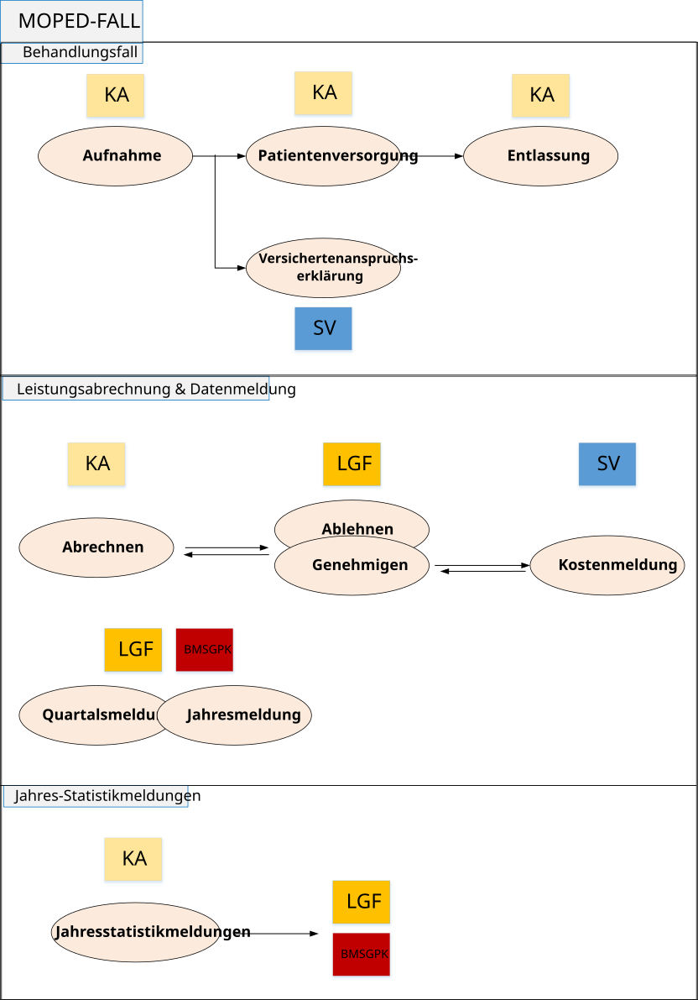

# ELGA.MOPED\Moped Fall - Überblick - FHIR® v5.0.0

* [**Table of Contents**](toc.md)
* **Moped Fall - Überblick**

## Moped Fall - Überblick

Diese Seite beschreibt die technische Umsetzung der in MOPED abgebildeten Prozesse rund um die Abwicklung eines MOPED-Falls – von der Aufnahme über die Versorgung bis hin zu Abrechnung und Meldung. Ziel ist es, die Abläufe transparent und nachvollziehbar darzustellen sowie aufzuzeigen, wie einzelne Teilprozesse modular zusammengesetzt werden können, um unterschiedliche Szenarien des MOPED-Falls abzubilden.

Die Übersichtsgrafik unten veranschaulicht den generellen Ablauf eines MOPED-Falls. Darauf aufbauend werden die spezifischen Prozesse im stationären, ambulanten und selbstzahlenden Bereich im Standardablauf erläutert. Jeder dieser Standardabläufe wird in weiterer Folge in klar definierte Teilprozesse zerlegt, die mit ihren jeweiligen Vor- und Nachbedingungen beschrieben sind.

Dieses Vorgehen erlaubt eine flexible Modellierung realer Prozessvarianten: Die Teilprozesse können – je nach Fallkonstellation – „puzzleartig“ miteinander kombiniert werden. So wird ersichtlich, an welchen Stellen innerhalb des Gesamtprozesses bestimmte Abläufe greifen und welche Abhängigkeiten zwischen ihnen bestehen.

Die folgenden Prozesse in ihrem Standardablauf werden im Detail beschrieben:

* [Moped Fall Stationär](AF_moped_fall_ueberblick.md#standardablauf-moped-fall-stationär)
* [Moped Fall Ambulant](AF_moped_fall_ueberblick.md#standardablauf-moped-fall-ambulant)
* [Moped Fall Selbstzahler](AF_moped_fall_ueberblick.md#standardablauf-moped-fall-selbstzahler)

Die einzelnen Schritte dieser Standardabläufe sowie mögliche Abweichungen werden als „puzzleartig“ zusammensetzbare Teilprozesse beschrieben – jeweils mit ihren jeweiligen Vor- und Nachbedingungen. Dadurch wird nachvollziehbar, an welchen Stellen innerhalb des Gesamtprozesses die einzelnen Teilprozesse zur Anwendung kommen können.

Eine Übersicht aller Teilprozesse findet sich [hier](#liste-der-teilprozesse).

### Standardablauf Moped-Fall stationär

#### Betroffene Akteure

| | |
| :--- | :--- |
| KA (Krankenhaus) | ✅ |
| LGF (Landesgesundheitsfonds) | ✅ |
| SV (Sozialversicherung) | ✅ |
| Bund | ✅ |

#### Betroffene Behandlungsarten

| | |
| :--- | :--- |
| Ambulant | ❌ |
| Stationär | ✅ |

#### Beschreibung: Susi Sonnenschein

Die Patientin Susi Sonnenschein wird stationär aufgenommen. Im Verlauf ihres Aufenthalts wird sie verlegt, der zuständige Versicherer wird festgelegt und angefragt und Diagnosen sowie Leistungen werden dokumentiert. Nach Entlassung erfolgt die Abrechnung und Freigabe des Moped-Falls zur Einsicht durch den Bund sowie die Meldung der Kosteninformation an die SV.

#### Beispiel

#### Vorbedingung

Es existiert kein Fall mit der selben Schlüsselkombination.

#### Ablauf

#### 1: Aufnehmen

Aufnehmen Operation ausführen und alle bereits vorhandenen Informationen zu Coverage, Aufnahmediagnose, Patient,... mitgeben.

Request

POST
`[base]/$aufnehmen`

**Headers:**
`Content-Type: application/fhir+json`

Request Body
TBD mit der tatsächlichen Beispielressource ersetzen

#### 2: VAE Anfrage stellen

VAE Anfrage an die SV stellen mit $anfragen

Request

POST
`[base]/Composition/{id}/_history/{version}/$anfragen`

**Headers:**
`Content-Type: application/fhir+json`

Request Body
TBD mit der tatsächlichen Beispielressource ersetzen

#### 3a: Offene VAEs abrufen

offene VAEs vom Server abrufen

Request

GET
`[base]/Claim?status=active&use=preauthorization&_has:ClaimResponse:request:status:not=active`

**Headers:**
`Accept: application/fhir+json`

Response Body
TBD mit der tatsächlichen Beispielressource ersetzen

#### 3b: VAE beantworten

VAE mit positiver Antwort einbringen

Request

POST
`[base]/Composition/{id}/_history/{version}/$antworten`

**Headers:**
`Content-Type: application/fhir+json`

Request Body
TBD mit der tatsächlichen Beispielressource ersetzen

#### 4a: Aktuellen Fall abrufen

Krankenanstalt ruft die aktuellen Falldaten ab (inklusive der neuen VAE Antwort)

Request

GET
`[base]/Composition/{id}`

**Headers:**
`Accept: application/fhir+json`

Response Body
TBD mit der tatsächlichen Beispielressource ersetzen

#### 4b: Fall aktualisieren

Verlegung auf Abteilung Innere Medizin einbringen

Request

POST
`[base]/Composition/{id}/_history/{version}/$update`

**Headers:**
`Content-Type: application/fhir+json`

Request Body
TBD mit der tatsächlichen Beispielressource ersetzen

#### 5: Diagnose und Leistung erfassen

Diagnosen und Leistungen zum Fall ergänzen

Request

POST
`[base]/Composition/{id}/_history/{version}/$update`

**Headers:**
`Content-Type: application/fhir+json`

Request Body
TBD mit der tatsächlichen Beispielressource ersetzen

#### 6: Entlassung

Susi Sonnenschein entlassen

Request

POST
`[base]/Composition/{id}/_history/{version}/$entlassen`

**Headers:**
`Content-Type: application/fhir+json`

Request Body
TBD mit der tatsächlichen Beispielressource ersetzen

#### 7: Abrechnung einbringen

Die Daten zur Abrechnung werden eingebracht und dem LGF als vorläufige Abrechnung zur Verfügung gestellt.

Request

POST
`[base]/Composition/{id}/_history/{version}/$abrechnen`

**Headers:**
`Content-Type: application/fhir+json`

Request Body
TBD mit der tatsächlichen Beispielressource ersetzen

#### 8a: Unbeantwortete Abrechnungen abrufen

unbeantwortete Abrechnungen abfragen, für welche noch keine Antwort (Genehmigung/Ablehnung) eingebracht wurde

Request

GET
`[base]/Claim?status=active&use=claim&_has:ClaimResponse:request:status:not=active`

**Headers:**
`Accept: application/fhir+json`

Response Body
TBD mit der tatsächlichen Beispielressource ersetzen Hier würden typischerweise sehr viele Ergebnisse zurückgeliefert werden (alle derzeit für den LGF verfügbaren Abrechnungen, die noch keine Antwort erhalten haben).

#### 8b: Vorläufig genehmigen

vorläufige Genehmigung (inkl. Bestätigung der Punkte einbringen)

Request

POST
`[base]/Composition/{id}/_history/{version}/$genehmigen`

**Headers:**
`Content-Type: application/fhir+json`

Request Body
TBD mit der tatsächlichen Beispielressource ersetzen

#### 9a: Fall erneut abrufen

Krankenanstalt ruft die aktuellen Falldaten ab (inklusive der neuen bestätigten Punkte)

Request

GET
`[base]/Composition/{id}`

**Headers:**
`Accept: application/fhir+json`

Response Body
TBD mit der tatsächlichen Beispielressource ersetzen

#### 9b: Endgültig abrechnen

Die endgültige Abrechnung wird eingebracht und dem LGF zur Verfügung gestellt.

Request

POST
`[base]/Composition/{id}/_history/{version}/$abrechnen`

**Headers:**
`Content-Type: application/fhir+json`

Request Body
TBD mit der tatsächlichen Beispielressource ersetzen

#### 10a: Endgültige unbeantwortete Abrechnungen abrufen

Die offenen endgültige Abrechnungen abfragen, für welche noch keine Antwort (Genehmigung/Ablehnung) eingebracht wurde.

Request

GET
`[base]/Claim?status=active&use=claim&endgueltig=true&_has:ClaimResponse:request:status:not=active`

**Headers:**
`Accept: application/fhir+json`

Response Body
TBD mit der tatsächlichen Beispielressource ersetzen

#### 10b: Endgültig genehmigen

Die endgültige Genehmigung (inkl. Bestätigung der Punkte einbringen) einbringen.

Request

POST
`[base]/Composition/{id}/_history/{version}/$genehmigen`

**Headers:**
`Content-Type: application/fhir+json`

Request Body
TBD mit der tatsächlichen Beispielressource ersetzen

#### 11: Kosteninformation abrufen

Alle verfügbaren Kosteninformationen werden von der SV abgerufen

Request

GET
`[base]/ClaimResponse?status=active&use=claim&endgueltig=true`

**Headers:**
`Accept: application/fhir+json`

Response Body
TBD mit der tatsächlichen Beispielressource ersetzen

#### 12: Finale Composition abrufen

Die vollständig befüllten und vom LGF genehmigten Fälle werden vom Bund abgerufen.

Request

GET
`[base]/Composition?status=final`

**Headers:**
`Accept: application/fhir+json`

Response Body
TBD mit der tatsächlichen Beispielressource ersetzen

#### Technische Hinweise

#### Relevante Profile

* [$aufnahme Bundle](StructureDefinition-MopedUpdateBundleKA.md)
* [$update Bundle](StructureDefinition-MopedUpdateBundleKA.md)
* TBD

#### Relevante Invarianten

#### Mögliche Notifications

##### SubscriptionTopic: neue VAE wurde angefragt

Die SV möchte benachrichtigt werden, wenn ein neuer VAERequest für sie bereitgestellt wurde. Das zugehörige SubscriptionTopic wurde in [diesem Beispiel](SubscriptionTopic-neueVAE.md) definiert.

##### SubscriptionTopic: VAE wurde abgelehnt

Die KAmöchte benachrichtigt werden, wenn ein VAERequest abgelehnt wurde. Das zugehörige SubscriptionTopic wurde in [diesem Beispiel](SubscriptionTopic-VAEabgelehnt.json.md) definiert.

##### Tabellarische Übersicht

* Titel: neue VAE wurde angefragt
  * Beschreibung: Die SV möchte benachrichtigt werden, wenn ein neuer VAERequest für sie bereitgestellt wurde.
  * Trigger Ressource: VAERequest
  * Interaktion: create
  * Auslöser: KA
  * Empfänger: SV
  * Beschreibung zusätzlicher Bedingungen: /
  * Relevantes Feld: /
  * Bedingung: /
* Titel: VAE wurde abgelehnt
  * Beschreibung: Die KAmöchte benachrichtigt werden, wenn ein VAERequest abgelehnt wurde.
  * Trigger Ressource: VAEResponse
  * Interaktion: create
  * Auslöser: SV
  * Empfänger: KA
  * Beschreibung zusätzlicher Bedingungen: Negative VAE
  * Relevantes Feld: VAEResponse.decision
  * Bedingung: != #00 AND != #19

### Standardablauf Moped-Fall ambulant

#### Betroffene Akteure

| | |
| :--- | :--- |
| KA (Krankenhaus) | ✅ |
| LGF (Landesgesundheitsfonds) | ✅ |
| SV (Sozialversicherung) | ✅ |
| Bund | ✅ |

#### Betroffene Behandlungsarten

| | |
| :--- | :--- |
| Ambulant | ✅ |
| Stationär | ❌ |

#### Beschreibung

Ein Patient kommt in die Ambulanz und wird behandelt. Ambulanter Besuch (LKF Behandlungsart Ambulant) wird analog der stationären Aufnahme administriert. Es wird aber keine Entlassung erstellt. Da es die Möglichkeit einer Mehrfachversicherung gibt, kann es im ambulanten Bereich zu einem Versicherungsträgerwechsel kommen. Die Vergabe der Aufnahmezahl im ambulanten Bereich dient der Administration im KA und beschreibt nicht zwingend einen medizinischen Fall. Ein medizinischer Fall kann daher mehrere Aufnahmezahlen beinhalten und umgekehrt.

#### Beispiel

Ein Patient kommt mit einem gebrochenen Arm in die KA, wird dort behandelt (Röntgen, Gips, etc.) und kann nach ein paar Stunden wieder nach Hause gehen.

#### Vorbedingung

Es existiert kein Fall mit der selben Schlüsselkombination.

#### Ablauf

#### 1: Aufnehmen

Aufnehmen Operation ausführen und alle bereits vorhandenen Informationen zu Coverage, Aufnahmediagnose, Patient,... mitgeben.

Request

POST
`[base]/$aufnehmen`

**Headers:**
`Content-Type: application/fhir+json`

Request Body
TBD mit der tatsächlichen Beispielressource ersetzen

#### 2: VAE Anfrage stellen

VAE Anfrage an die SV stellen mit $anfragen

Request

POST
`[base]/Composition/{id}/_history/{version}/$anfragen`

**Headers:**
`Content-Type: application/fhir+json`

Request Body
TBD mit der tatsächlichen Beispielressource ersetzen

#### 3a: Offene VAEs abrufen

offene VAEs vom Server abrufen

Request

GET
`[base]/Claim?status=active&use=preauthorization&_has:ClaimResponse:request:status:not=active`

**Headers:**
`Accept: application/fhir+json`

Response Body
TBD mit der tatsächlichen Beispielressource ersetzen

#### 3b: VAE beantworten

VAE mit positiver Antwort einbringen

Request

POST
`[base]/Composition/{id}/_history/{version}/$antworten`

**Headers:**
`Content-Type: application/fhir+json`

Request Body
TBD mit der tatsächlichen Beispielressource ersetzen

#### 4a: Aktuellen Fall abrufen

Krankenanstalt ruft die aktuellen Falldaten ab (inklusive der neuen VAE Antwort)

Request

GET
`[base]/Composition/{id}`

**Headers:**
`Accept: application/fhir+json`

Response Body
TBD mit der tatsächlichen Beispielressource ersetzen

#### 4b: Fall aktualisieren

Daten zum Kontakt mit der Abteilung für Radiologie ergänzen

Request

POST
`[base]/Composition/{id}/_history/{version}/$update`

**Headers:**
`Content-Type: application/fhir+json`

Request Body
TBD mit der tatsächlichen Beispielressource ersetzen

#### 5: Diagnose und Leistung erfassen

Diagnosen und Leistungen zum Fall ergänzen

Request

POST
`[base]/Composition/{id}/_history/{version}/$update`

**Headers:**
`Content-Type: application/fhir+json`

Request Body
TBD mit der tatsächlichen Beispielressource ersetzen

#### 6: Falldaten ergänzen

Restliche Falldaten für Amanda Ambulant ergänzen

Request

POST
`[base]/Composition/{id}/_history/{version}/$update`

**Headers:**
`Content-Type: application/fhir+json`

Request Body
TBD mit der tatsächlichen Beispielressource ersetzen

#### 7: Abrechnung einbringen

Die Daten zur Abrechnung werden eingebracht und dem LGF als vorläufige Abrechnung zur Verfügung gestellt.

Request

POST
`[base]/Composition/{id}/_history/{version}/$abrechnen`

**Headers:**
`Content-Type: application/fhir+json`

Request Body
TBD mit der tatsächlichen Beispielressource ersetzen

#### 8a: Unbeantwortete Abrechnungen abrufen

Unbeantwortete Abrechnungen abfragen, für welche noch keine Antwort (Genehmigung/Ablehnung) eingebracht wurde

Request

GET
`[base]/Claim?status=active&use=claim&_has:ClaimResponse:request:status:not=active`

**Headers:**
`Accept: application/fhir+json`

Response Body
TBD mit der tatsächlichen Beispielressource ersetzen Hier würden typischerweise sehr viele Ergebnisse zurückgeliefert werden (alle derzeit für den LGF verfügbaren Abrechnungen, die noch keine Antwort erhalten haben).

#### 8b: Vorläufig genehmigen

vorläufige Genehmigung (inkl. Bestätigung der Punkte einbringen)

Request

POST
`[base]/Composition/{id}/_history/{version}/$genehmigen`

**Headers:**
`Content-Type: application/fhir+json`

Request Body
TBD mit der tatsächlichen Beispielressource ersetzen

#### 9a: Fall erneut abrufen

Krankenanstalt ruft die aktuellen Falldaten ab (inklusive der neuen bestätigten Punkte)

Request

GET
`[base]/Composition/{id}`

**Headers:**
`Accept: application/fhir+json`

Response Body
TBD mit der tatsächlichen Beispielressource ersetzen

#### 9b: Endgültig abrechnen

Die endgültige Abrechnung wird eingebracht und dem LGF zur Verfügung gestellt.

Request

POST
`[base]/Composition/{id}/_history/{version}/$abrechnen`

**Headers:**
`Content-Type: application/fhir+json`

Request Body
TBD mit der tatsächlichen Beispielressource ersetzen

#### 10a: Endgültige unbeantwortete Abrechnung abrufen

Die offenen endgültige Abrechnungen abfragen, für welche noch keine Antwort (Genehmigung/Ablehnung) eingebracht wurde.

Request

GET
`[base]/Claim?status=active&use=claim&endgueltig=true&_has:ClaimResponse:request:status:not=active`

**Headers:**
`Accept: application/fhir+json`

Response Body
TBD mit der tatsächlichen Beispielressource ersetzen

#### 10b: Endgültig genehmigen

Die endgültige Genehmigung (inkl. Bestätigung der Punkte einbringen) einbringen.

Request

POST
`[base]/Composition/{id}/_history/{version}/$genehmigen`

**Headers:**
`Content-Type: application/fhir+json`

Request Body
TBD mit der tatsächlichen Beispielressource ersetzen

#### 11: Kosteninformation abrufen

Alle verfügbaren Kosteninformationen werden von der SV abgerufen

Request

GET
`[base]/ClaimResponse?status=active&use=claim&endgueltig=true`

**Headers:**
`Accept: application/fhir+json`

Response Body
TBD mit der tatsächlichen Beispielressource ersetzen

#### 12: Finale Composition abrufen

Die vollständig befüllten und vom LGF genehmigten Fälle werden vom Bund abgerufen.

Request

GET
`[base]/Composition?status=final`

**Headers:**
`Accept: application/fhir+json`

Response Body
TBD mit der tatsächlichen Beispielressource ersetzen

#### Technische Hinweise

##### Tagesklammer vs. Aufteilung:

Ob die Tagesklammer verwendet wird oder nicht liegt im Ermessen des jeweiligen KA und muss auf Seite des KIS geregelt werden. In Moped werden dann entweder ein Datensatz mit allen Leistungen und Diagnosen des jeweiligen Tages oder mehrere Datensätze mit den aufgeteilten Leistungen und Diagnosen eingemeldet. Dabei ist zu beachten:

* Bei der Nutzung der Tagesklammer gibt es in den meisten Fällen in Moped pro Tag nur eine Composition und eine zugehörige VAE -> $aufnehmen wird nur ein mal ausgeführt.
* Wird die Tagesklammer nicht genutzt so ist es möglich mehrere gültige Compositions für den gleichen Tag und Patienten in Moped zu haben. Hierbei wird $aufnehmen mehrmals ausgeführt (Für jede X01 ein mal). Pro Composition gibt es dann jeweils eine VAE.
* Pro Composition gibt es zukünftig eine VAE. Bei Nutzung der Tagesklammer muss das KIS intern die VAE auf mehrere Aufnahmezahlen aufteilen.
* Die Tagesklammer impliziert immer mehrere Aufnahmezahlen pro Patient, Tag und KA.
* Die Anzahl der Ausführungen von $aufnehmen entspricht der Anzahl der Anzahl der erstellten Compositions (und soll mit der Anzahl der X01 Datensätze übereinstimmen). Unterschiedliche Compositions müssen sich in zumindest einem der folgenden Datenfelder unterscheiden: 
* Aufnahmezahl
* Aufnahme-/Kontaktdatum
* KA-Nummer
 

##### Transferencounter Stationär vs. Ambulant

Der Transferencounter entspricht nicht wie beim stationären Fall der Verlegung/Aufnahme auf eine andere Station sondern einem Kontakt oder einer Bewegung (entspricht einer Behandlungen auf unterschiedlichen Funktionscodes).

#### Relevante Profile

* [$aufnehmen Bundle](StructureDefinition-MopedAufnehmenBundleKA.md)
* [$update Bundle](StructureDefinition-MopedUpdateBundleKA.md)
* [$anfragen Bundle](StructureDefinition-MopedAnfragenBundleKA.md)
* [$antworten Bundle](StructureDefinition-MopedAntwortenBundleSV.md)
* [$abrechnen Bundle](StructureDefinition-MopedAbrechnenBundleKA.md)
* [$entscheiden Bundle](StructureDefinition-MopedEntscheidenLGFBundle.md)
* [Ambulanter Encounter](StructureDefinition-MopedEncounterA.md)
* [Ambulanter Transferencounter](StructureDefinition-MopedTransferEncounterA.md)

#### Relevante Invarianten

#### Mögliche Notifications

##### SubscriptionTopic: X

##### Tabellarische Übersicht

* Titel: 
  * Beschreibung: 
  * Trigger Ressource: 
  * Interaktion: 
  * Auslöser: 
  * Empfänger: 
  * Beschreibung zusätzlicher Bedingungen: 
  * Relevantes Feld: 
  * Bedingung: 

### Standardablauf Moped-Fall Selbstzahler

#### Betroffene Akteure

| | |
| :--- | :--- |
| KA (Krankenhaus) | ✅ |
| LGF (Landesgesundheitsfonds) | ✅ |
| SV (Sozialversicherung) | ❌ |
| Bund | ✅ |

#### Betroffene Behandlungsarten

| | |
| :--- | :--- |
| Ambulant | ✅ |
| Stationär | ✅ |

#### Beschreibung: Selbstzahler

Vorgehensweise für Patienten, die nicht über die Sozialversicherungsschiene gemeldet werden, da sie Selbstzahler sind, jedoch im LKF aufscheinen.

#### Beispiel

Nicht-EU Ausländer (z.B. US -Bürger), Patienten die über die Sozialhilfe oder Justizanstalten abgerechnet werden 

#### Vorbedingung

Es existiert kein Fall mit der selben Schlüsselkombination.

#### Ablauf

#### 1: Aufnehmen

Aufnehmen Operation ausführen und alle bereits vorhandenen Informationen zu Selbstzahler-Coverage, Aufnahmediagnose, Patient,... mitgeben.

Request

POST
`[base]/$aufnehmen`

**Headers:**
`Content-Type: application/fhir+json`

Request Body
TBD mit der tatsächlichen Beispielressource ersetzen

#### 2: Fall aktualisieren

Verlegung auf Abteilung Innere Medizin einbringen

Request

POST
`[base]/Composition/{id}/_history/{version}/$update`

**Headers:**
`Content-Type: application/fhir+json`

Request Body
TBD mit der tatsächlichen Beispielressource ersetzen

#### 3: Diagnose und Leistung erfassen

Diagnosen und Leistungen zum Fall ergänzen

Request

POST
`[base]/Composition/{id}/_history/{version}/$update`

**Headers:**
`Content-Type: application/fhir+json`

Request Body
TBD mit der tatsächlichen Beispielressource ersetzen

#### 4: Entlassung

Susi Sonnenschein entlassen

Request

POST
`[base]/Composition/{id}/_history/{version}/$entlassen`

**Headers:**
`Content-Type: application/fhir+json`

Request Body
TBD mit der tatsächlichen Beispielressource ersetzen

#### 5: Abrechnung einbringen

Die Daten zur Abrechnung werden eingebracht und dem LGF als vorläufige Abrechnung zur Verfügung gestellt.

Request

POST
`[base]/Composition/{id}/_history/{version}/$abrechnen`

**Headers:**
`Content-Type: application/fhir+json`

Request Body
TBD mit der tatsächlichen Beispielressource ersetzen

#### 6a: Unbeantwortete Abrechnungen abrufen

unbeantwortete Abrechnungen abfragen, für welche noch keine Antwort (Genehmigung/Ablehnung) eingebracht wurde

Request

GET
`[base]/Claim?status=active&use=claim&_has:ClaimResponse:request:status:not=active`

**Headers:**
`Accept: application/fhir+json`

Response Body
TBD mit der tatsächlichen Beispielressource ersetzen Hier würden typischerweise sehr viele Ergebnisse zurückgeliefert werden (alle derzeit für den LGF verfügbaren Abrechnungen, die noch keine Antwort erhalten haben).

#### 6b: Vorläufig genehmigen

vorläufige Genehmigung (inkl. Bestätigung der Punkte einbringen)

Request

POST
`[base]/Composition/{id}/_history/{version}/$genehmigen`

**Headers:**
`Content-Type: application/fhir+json`

Request Body
TBD mit der tatsächlichen Beispielressource ersetzen

#### 7a: Fall erneut abrufen

Krankenanstalt ruft die aktuellen Falldaten ab (inklusive der neuen bestätigten Punkte)

Request

GET
`[base]/Composition/{id}`

**Headers:**
`Accept: application/fhir+json`

Response Body
TBD mit der tatsächlichen Beispielressource ersetzen

#### 7b: Endgültig abrechnen

Die endgültige Abrechnung wird eingebracht und dem LGF zur Verfügung gestellt.

Request

POST
`[base]/Composition/{id}/_history/{version}/$abrechnen`

**Headers:**
`Content-Type: application/fhir+json`

Request Body
TBD mit der tatsächlichen Beispielressource ersetzen

#### 8a: Endgültige unbeantwortete Abrechnungen abrufen

Die endgültige Abrechnungen abfragen, für welche noch keine Antwort (Genehmigung/Ablehnung) eingebracht wurde.

Request

GET
`[base]/Claim?status=active&use=claim&endgueltig=true&_has:ClaimResponse:request:status:not=active`

**Headers:**
`Accept: application/fhir+json`

Response Body
TBD mit der tatsächlichen Beispielressource ersetzen

#### 8b: Endgültig genehmigen

Die endgültige Genehmigung (inkl. Bestätigung der Punkte einbringen) einbringen.

Request

POST
`[base]/Composition/{id}/_history/{version}/$genehmigen`

**Headers:**
`Content-Type: application/fhir+json`

Request Body
TBD mit der tatsächlichen Beispielressource ersetzen

#### 9: Finale Composition abrufen

Die vollständig befüllten und vom LGF genehmigten Fälle werden vom Bund abgerufen.

Request

GET
`[base]/Composition?status=final`

**Headers:**
`Accept: application/fhir+json`

Response Body
TBD mit der tatsächlichen Beispielressource ersetzen

#### Technische Hinweise

Die Composition Section zustaendigeSV bleibt in diesem Fall leer, was Auswirkungen auf die Berechtigungen und den weiteren Ablauf hat. Die Operation $melden ist z.B. in diesem Fall nicht erlaubt und würde fehlschlagen.

#### Relevante Profile

* Selbstzahler Coverage (TBD Link)

### Liste der Teilprozesse:

#### Moped Fall - Aufnahme:

* [ANWF 1 - Planaufnahme 🔄](AF_moped_fall_aufnahme.md#anwendungsfall-1-planaufnahme)
* [ANWF 2 - Stationäre Aufnahme ✅](AF_moped_fall_aufnahme.md#anwendungsfall-2-stationäre-aufnahme)
* [ANWF 18 - Transfer 🔄](AF_moped_fall_aufnahme.md#anwendungsfall-18-transfer)

#### Moped Fall - Administration:

TBD

#### Moped Fall - Patientversorgung:

* [ANWF 7 - Behandlungsabbruch 🔄](AF_moped_fall_patientenversorgung.md#anwendungsfall-7-behandlungsabbruch-vor-erbrachter-leistung)
* [ANWF 17 - Zwischenbetriebliche Leistungserbringung ✅](AF_moped_fall_patientenversorgung.md#anwendungsfall-17-zwischenbetriebliche-leistungserbringung)
* [ANWF 19 - Interne Verlegung ✅](AF_moped_fall_patientenversorgung.md#anwendungsfall-19-interne-verlegung)
* [ANWF 20 - Urlaub ✅](AF_moped_fall_patientenversorgung.md#anwendungsfall-20-beurlaubung)
* [ANWF 21 - gesundes Neugeborenes 🔄](AF_moped_fall_patientenversorgung.md#anwendungsfall-21-gesundes-neugeborenes)
* [ANWF 22 - krankes Neugeborenes 🔄](AF_moped_fall_patientenversorgung.md#anwendungsfall-22-krankes-neugeborenes)
* [ANWF 26 - Überlieger 🔄](AF_moped_fall_patientenversorgung.md#anwendungsfall-26-überlieger)
* [ANWF 53 - Intensivaufenthalt 🔄](AF_moped_fall_patientenversorgung.md#anwendungsfall-53-intensivaufenthalt-mit-intensivdaten)

#### Moped Fall - Entlassung:

* [ANWF 23-25 - Entlassung & Hauptdiagnose ✅](AF_moped_fall_entlassung.md#anwendungsfall-23-entlassung-mit-hauptdiagnose)
* [ANWF 50 - Urgenz 🔄](AF_moped_fall_entlassung.md#anwendungsfall-50-urgenz)

#### Moped Fall - Versichertenanspruchserklärung:

* [ANWF 10 - Klassenwechsel ✅](AF_moped_fall_vae.md#anwendungsfall-10-klassenwechsel)
* [ANWF 11 - Versicherungswechsel 🔄](AF_moped_fall_vae.md#anwendungsfall-11-versicherungswechsel)
* [ANWF 28-32 - SV Kostenübernahmevariationen 🔄](AF_moped_fall_vae.md#anwendungsfall-28-positive-vae-inkl-verlängerung)

#### Moped Fall - Abrechnung:

* [ANWF 27 - Leistungen ohne Abrechnungsrelevanz ✅](AF_moped_fall_abrechnung.md#anwendungsfall-27-leistung-ohne-abrechnungsrelevanz)
* [ANWF 38 - Laufende Generierung der LKF-Daten](AF_moped_fall_abrechnung.md#anwendungsfall-38-laufende-generierung-der-lkf-daten)

#### Moped Fall - Ablehnung/Genehmigung:

* [ANWF 39-41 - medizinische und qualitative Rückmeldungen](AF_moped_fall_ablehnung_genehmigung.md#anwendungsfall-39-qualitative-anmerkung-der-lkf-daten)
* [ANWF 43 - Freigabe der LKF-Daten](AF_moped_fall_ablehnung_genehmigung.md#anwendungsfall-43-freigabe-der-lkf-daten)

#### Moped Fall - Kostenmeldung:

* [ANWF 12,13,15,35-37 - Ausländerverrechnung und Regress 🔄](AF_moped_fall_kostenmeldung.md#anwendungsfall-12-dauerbetreute)
* [ANWF 33-34 - Kostenmeldungen? 🔄](AF_moped_fall_kostenmeldung.md#anwendungsfall-33-kostenmeldung---korrekte-zuordnung)

#### Moped Fall - Jahres-/Quartalsmeldung:

* [ANWF 42 - Quartalsmeldung 🔄](AF_moped_fall_jahres_quartals_meldung.md#anwendungsfall-42-quartalsmäßige-bereitstellung-der-lkf-daten)
* [ANWF 44 - Jahresmeldung 🔄](AF_moped_fall_jahres_quartals_meldung.md#anwendungsfall-42-jährliche-bereitstellung-der-lkf-daten)

#### Moped Fall - Kommunikation:

TBD

#### Moped Fall - Prozessübergreifend:

* [ANWF 4,5 - Fallartwechsel 🔄](AF_moped_fall_prozessuebergreifend.md#anwendungsfall-4-fallartwechsel-ambulant---stationär)
* [ANWF 6 - Mehrmalige Aufnahme an einem Tag 🔄](AF_moped_fall_prozessuebergreifend.md#anwendungsfall-6-abgeschlossene-ambulante-behandlung-und-stationäre-aufnahme-am-gleichen-tag-innerhalb-eines-khs)
* [ANWF 8,9,47 - Stammdatenabgleich 🔄](AF_moped_fall_prozessuebergreifend.md#anwendungsfall-8-patientenverwechslung-vor-leistungserbringung)
* [ANWF 48 - Mehrere aktive Fälle in MOPED 🔄](AF_moped_fall_prozessuebergreifend.md#anwendungsfall-48-mehrere-aktive-fälle-in-moped)
* [ANWF 49 - Aufrollung nach Speicherfrist 🔄](AF_moped_fall_prozessuebergreifend.md#anwendungsfall-49-aufrollung-nach-speicherfrist)
* [ANWF 54 - Stammdatenänderung 🔄](AF_moped_fall_prozessuebergreifend.md#anwendungsfall-54-stammdatenänderung)

#### Noch zuzuordnen:

* [ANWF 51-52 - Asylierung 🔄](TBD)

