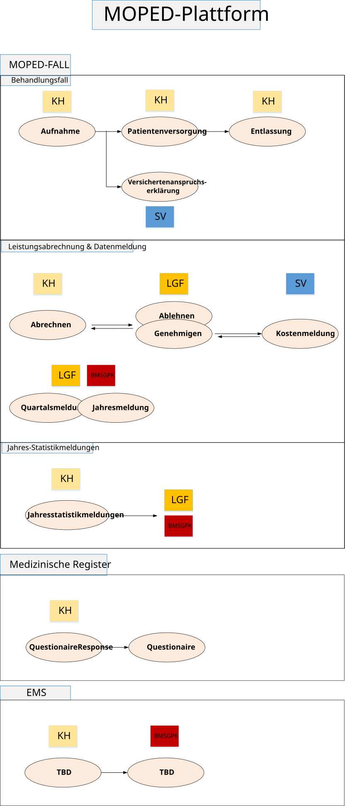

# ELGA.MOPED\Moped Plattform - Überblick - FHIR® v5.0.0

* [**Table of Contents**](toc.md)
* **Moped Plattform - Überblick**

## Moped Plattform - Überblick

In diesem Abschnitt werden typische und exemplarische Abläufe im Rahmen des MOPED-Prozesses beschrieben. Die Anwendungsszenarien dienen der Veranschaulichung konkreter Anwendungsfälle auf Basis der in diesem Leitfaden definierten Rollen, Profile und Operationen. Die Szenarien zeigen sowohl durchgängige End-to-End-Prozesse als auch fokussierte Teilprozesse. Jedes Beispiel illustriert, wie die in MOPED definierten Schnittstellen in realen Fällen eingesetzt werden können. Dabei wird besonderer Wert auf die fachliche Nachvollziehbarkeit sowie die technische Umsetzung (Ressourcen, Statusübergänge, Operations) gelegt.

Ziel dieser Szenarien ist es ein gemeinsames Verständnis über typische Abläufe und deren Abbildung im FHIR-Moped-Kontext zu vermitteln.

### Überblick der Moped Plattform Datenströme

Die Moped Plattform umfasst unterschiedliche Datenströme und Akteure:

* Moped Fall
* Jahres Statistikmeldung
* Medizinische Register
* EMS

#### Moped Fall

* Relevante Akteure: KH, SV, LGF, Bund
* Use Cases: siehe - [Moped Fall Überblick](AF_moped_fall_ueberblick.md)

#### Jahres Statistikmeldung

* Relevante Akteure: KH, LGF, Bund
* Use Cases: siehe - [Jahresstatistikmeldung](AF_lkf_jahresstatistikmeldung.md)

#### Medizinische Register

z.B. Stroke-Unit, Krebsregister

* Relevante Akteure: KH, GÖG, Statistik Austria
* Use Cases: siehe - [Medizinische Register](AF_medizinische_register.md)

#### EMS

TBD

* Relevante Akteure:
* Use Cases:

