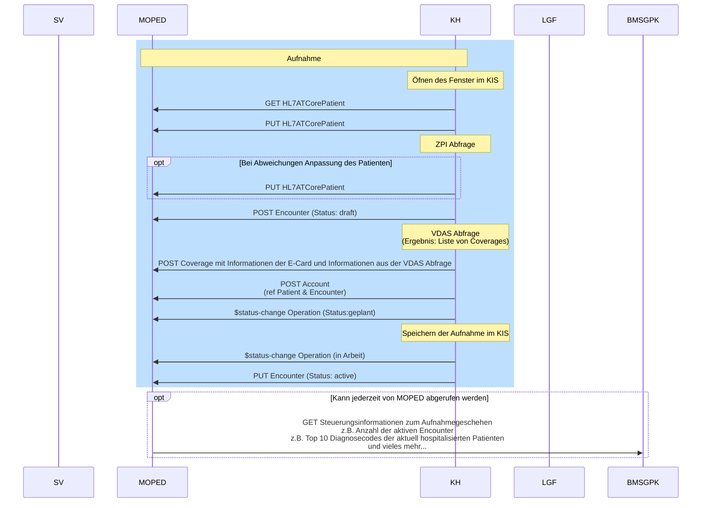

```mermaid
sequenceDiagram
    participant SV
    participant M as MOPED
    participant KH
    participant L as LGF
    participant B as BMSGPK
    
    
    rect rgb(191, 223, 255)
    Note over M,KH: Aufnahme
    Note over KH: Öfnen des Fenster im KIS
    KH->>M: GET HL7ATCorePatient
    KH->>M: PUT HL7ATCorePatient
    Note over KH: ZPI Abfrage
    opt Bei Abweichungen Anpassung des Patienten
    KH->>M: PUT HL7ATCorePatient
    end
    KH->>M: POST Encounter (Status: draft)
    Note over KH: VDAS Abfrage <br/>(Ergebnis: Liste von Coverages)
    %%Ergebnis der VDAS Abfrage teil des CoverageEligibilityRequest? -> Request dann nur relevant für Übernahme der Kosten???
    KH->>M: POST Coverage mit Informationen der E-Card und Informationen aus der VDAS Abfrage
    KH->>M: POST Account <br/>(ref Patient & Encounter)
    KH->>M: $status-change Operation (Status:geplant)
    Note over KH: Speichern der Aufnahme im KIS

    KH->>M: $status-change Operation (in Arbeit)
    KH->>M: PUT Encounter (Status: active)
    end
    opt Kann jederzeit von MOPED abgerufen werden
    M ->>B: GET Steuerungsinformationen zum Aufnahmegeschehen <br/>z.B. Anzahl der aktiven Encounter<br/>z.B. Top 10 Diagnosecodes der aktuell hospitalisierten Patienten<br/>und vieles mehr...
    end
   
    
    
    
```