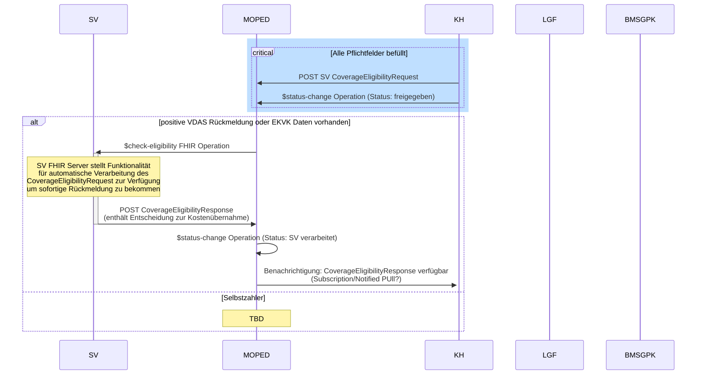

```mermaid
sequenceDiagram
    
    
    participant SV
    participant M as MOPED
    participant KH
    participant L as LGF
    participant B as BMSGPK
    
    
    rect rgb(191, 223, 255)
    critical Alle Pflichtfelder befüllt
    %%Plifchtfelder definieren? - über mehrere Ressourcen verteilt
    KH ->> M: POST SV CoverageEligibilityRequest 
    KH->>M: $status-change Operation (Status: freigegeben)
    end
    end
    alt positive VDAS Rückmeldung oder EKVK Daten vorhanden

    activate SV
    M->>+SV: $check-eligibility FHIR Operation
    Note over SV: SV FHIR Server stellt Funktionalität<br/> für automatische Verarbeitung des <br/>CoverageEligibilityRequest zur Verfügung<br/>um sofortige Rückmeldung zu bekommen
    SV->>M: POST CoverageEligibilityResponse <br/>(enthält Entscheidung zur Kostenübernahme)
    deactivate SV
    M->>M: $status-change Operation (Status: SV verarbeitet)
    M->>+KH: Benachrichtigung: CoverageEligibilityResponse verfügbar <br/>(Subscription/Notified PUll?)
    else Selbstzahler
    Note over M: TBD 
    end
    
    
    
    
```