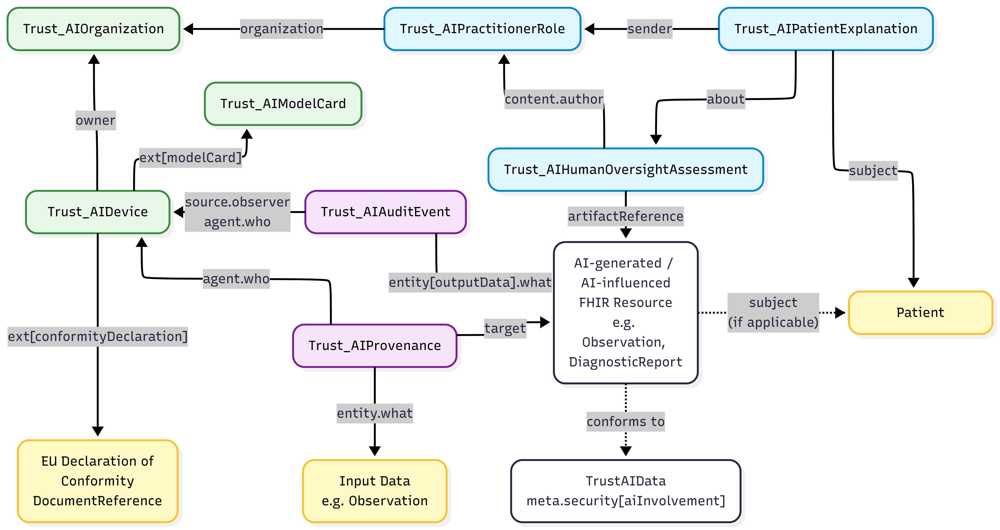

# Introduction - v0.1.0

* [**Table of Contents**](toc.md)
* **Introduction**

## Introduction

# Introduction

## Overview

This Implementation Guide (IG) defines a custom FHIR R5 framework for representing selected AI-related transparency, traceability, legal-context, and human-oversight metadata in healthcare.

The IG focuses on how documentation requirements and transparency-relevant concepts from the EU AI Act, the GDPR, and the European Health Data Space (EHDS) can be represented using machine-readable FHIR artifacts. It provides profiles, extensions, terminology, and examples for documenting AI-supported processing in clinical contexts.

The IG does not claim to provide complete legal compliance or regulatory certification. Instead, it supports structured documentation, traceability, and interoperability for selected AI-related metadata.

## Out of Scope

The requirements of [Article 15 of the EU AI Act](https://artificialintelligenceact.eu/article/15/) concerning the accuracy, robustness, and cybersecurity of high-risk AI systems are not represented as computable artifacts, profiles, extensions, or conformance requirements within this Implementation Guide. However, these requirements remain highly relevant for the design, development, deployment, and governance of AI-enabled solutions and should be taken into account when planning and structuring implementation projects. In particular, project teams should consider the need to document and manage performance metrics, system robustness, error handling, resilience measures, and cybersecurity controls in accordance with applicable regulatory obligations. Article 15 applies throughout the lifecycle of high-risk AI systems and requires appropriate levels of accuracy, robustness, and cybersecurity, including protection against AI-specific security threats.

## Regulatory Foundations

The profiles in this IG are derived from a structured [requirement analysis](requirements.md) of the **EU AI Act**, the **GDPR**, and the **European Health Data Space (EHDS)**. The analysis identifies 38 high-level documentation requirements in six categories:

| | | |
| :--- | :--- | :--- |
| System | `SYS` | System name and version, EU Declaration of Conformity, CE marking, EU database registration, audit trail |
| Purpose | `USE` | Intended purpose, limitations and contraindications, case-specific indication |
| Performance | `QUAL` | Performance metrics, training data information, EHDS data category and permit, data quality |
| Risks | `RISK` | Health, safety, and fundamental-rights risks |
| Oversight | `HL` | Responsible human reviewer, qualification, type of intervention, oversight instructions |
| Legal | `LAW` | GDPR legal basis, automated decision flag, primary/secondary use, third-country transfer, right to explanation, log integrity |

The requirements are refined into three logical data models, one per architectural layer, with 57 logical attributes and their multiplicities:

| | | |
| :--- | :--- | :--- |
| Static System Context | 36 | [Trust_AIDevice](StructureDefinition-trust-ai-device.md),[Trust_AIOrganization](StructureDefinition-trust-ai-organization.md),[Trust_AIModelCard](StructureDefinition-trust-ai-model-card.md) |
| AI Output Context | 12 | [Trust_AIObservation](StructureDefinition-trust-ai-observation.md),[Trust_AIProvenance](StructureDefinition-trust-ai-provenance.md),[Trust_AIAuditEvent](StructureDefinition-trust-ai-machine-execution-audit-event.md) |
| Clinical Decision Context | 9 | [Trust_AIHumanOversightAssessment](StructureDefinition-trust-ai-human-oversight.md),[Trust_AIPractitionerRole](StructureDefinition-trust-ai-practitionerrole.md),[Trust_AIPatientExplanation](StructureDefinition-trust-ai-patient-explanation.md) |

46 of the 57 attributes are fully covered by a dedicated profile element and 10 are partially covered. One, the patient opt-out flag (LAW-05), is not yet modelled.

The complete requirements matrix, the logical data models, the element-level mapping, and the open points are on the **[Requirements Traceability](requirements.md)** page. Each profile page also lists the requirements it implements.

## Architecture

The Implementation Guide is organized into three architectural layers:

* **Static System Context**: the AI system, the responsible organizations, and the model card
* **AI Output Context**: the AI-generated output, its provenance and legal processing context, and the execution audit trail
* **Clinical Decision Context**: human oversight of the output, the reviewer's role and qualification, and the patient-facing explanation

Detailed descriptions of all profiles are available on the **[Profiles](profiles.md)** page.

FHIR-based traceability model linking AI system, clinical output, human oversight, and patient communication. Green elements represent the Static System Context, purple elements denote the AI output context, and blue elements indicate the clinical decision context. Yellow elements are included as supporting resources required for the representation of the workflow, but are not implemented as dedicated profiles in this IG. White elements represent the AI output itself, which can be any FHIR resource that is marked as AI-generated according to the [TrustAIData](StructureDefinition-trust-ai-data.md) profile.

